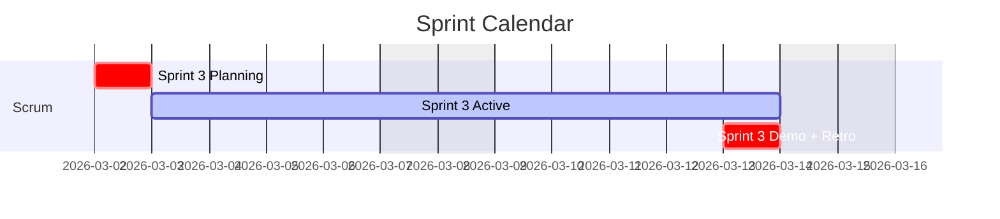

<objective>
Turn the hand-hardcoded "Current Sprint Overview" Mermaid gantt in `docs/index.md`
(frozen at "Sprint 3" / March 2026) into an `AUTO:current-sprint` block rendered by
`scripts/auto_blocks.py` on every aggregator run.

Purpose: the dashboard's landing page currently lies about where the project is.
`docs/_data/calendar.yml` already declares the cadence (`start_date: 2026-05-04`,
`sprint_length_weeks: 2`) and `aggregator.py` already knows how to compute the current
sprint — the index page is just not wired to either.

Output: shared sprint math in `scripts/utils.py`, a new `current-sprint` renderer, and
`docs/index.md` converted to an augmented page whose gantt regenerates itself.
</objective>

<execution_context>
@$HOME/.claude/get-shit-done/workflows/execute-plan.md
@$HOME/.claude/get-shit-done/templates/summary.md
</execution_context>

<context>
@CLAUDE.md
@.planning/STATE.md

@scripts/auto_blocks.py
@scripts/utils.py
@docs/index.md
@docs/_data/calendar.yml
@docs/migration-gantt.md
@scripts/validate_auto_blocks.py

<interfaces>
<!-- Contracts the executor needs. Already verified in the codebase — no exploration required. -->

Existing sprint math to relocate — `scripts/aggregator.py` lines 150-169:

```python
def _sprint_bounds(cal: dict, idx: int):
    """(start, end) dates of sprint `idx` (1-based) from the calendar cadence."""
    start0 = iso_date(str(cal.get("start_date", "")))
    if start0 is None or idx < 1:
        return None, None
    weeks = int(cal.get("sprint_length_weeks", 2) or 2)
    start = start0 + timedelta(weeks=(idx - 1) * weeks)
    end = start + timedelta(days=weeks * 7 - 3)  # Mon week1 -> Fri last week
    return start, end


def _current_sprint_idx(cal: dict, today=None) -> int:
    """1-based index of the sprint containing `today` on the shared cadence."""
    start0 = iso_date(str(cal.get("start_date", "")))
    if start0 is None:
        return 1
    if today is None:
        today = datetime.now().date()
    weeks = int(cal.get("sprint_length_weeks", 2) or 2)
    return max(((today - start0).days // 7) // weeks + 1, 1)
```

Call sites of those two helpers inside `aggregator.py` (the ONLY ones):
- line 287: `cur = _current_sprint_idx(cal, today)`  (in `_gantt_sprint_views`)
- line 292: `w_start, w_end = _sprint_bounds(cal, idx)`  (in `_gantt_sprint_views`)
`_load_calendar()` (line 139) stays in aggregator.py — auto_blocks gets calendar from `context`.

Already available in `scripts/utils.py` (stdlib + yaml imports only — no project imports,
so `utils` is import-safe from both `aggregator` and `auto_blocks`; no cycle):

```python
def iso_date(value) -> Optional[date]                      # None on unparseable/placeholder
def working_days_between(start_iso, end_iso) -> int        # inclusive Mon-Fri count, min 1
```
Note `working_days_between` accepts ISO strings; pass `.isoformat()` of date objects.

Renderer contract in `scripts/auto_blocks.py`:

```python
AUTO_BLOCK_RENDERERS: dict[str, Callable[[dict], str]]     # name -> renderer(context) -> str
def known_block_names() -> Iterable[str]                   # used by validate_auto_blocks.py
```
`context` is `load_context(DATA_DIR)`: every `docs/_data/*.yml` keyed by file stem, i.e.
`context["calendar"]["start_date"]`, `context["calendar"]["sprint_length_weeks"]`.

`render_migration_gantt` (line 143) shows the sanctioned function-level-import pattern:
`from utils import mermaid_gantt_label, rag_modifier, working_days_between`.

Aggregator's injection pass — `scripts/aggregator.py` lines 1109-1113:
```python
context = load_context(DATA_DIR)
for md_path in sorted(DOCS_DIR.rglob("*.md")):
    ...
    if process_page(md_path, context):
```
So `docs/index.md` is picked up automatically once its frontmatter declares `auto_blocks`.

Injection contract (`inject_auto_blocks`, line 303): markers are preserved, the interior is
replaced and wrapped in blank lines — `new_body[:oe] + "\n\n" + rendered.strip("\n") + "\n\n" + new_body[cs:]`.
Renderers therefore should NOT try to manage their own surrounding blank lines beyond the
existing convention (see `render_calendar`, which returns a leading/trailing `""` line).

Hardcoded block being replaced — `docs/index.md` lines 56-68:
```
## Current Sprint Overview


```

CI gate ordering in `.github/workflows/aggregate.yml`:
`validate_auto_blocks.py` (line 62) → `aggregator.py` (65) → `validate_mermaid.py` (68) →
"Commit unified docs" (`git add docs/`). Generated docs are committed back to master, so a
locally regenerated `docs/index.md` is the expected committed state.

`validate_mermaid.py` gantt rule: task/section titles (text before `:`) must contain no
`"`, `[`, `]`, or stray `:`. `Sprint S9 Demo + Retro` is safe; do not introduce brackets.
</interfaces>
</context>

<tasks>

<task type="auto" tdd="true">
  <name>Task 1: Lift sprint cadence math into utils.py and delegate from aggregator.py</name>
  <files>scripts/utils.py, scripts/aggregator.py</files>
  <behavior>
    - `utils.current_sprint_idx({"start_date": "2026-05-04", "sprint_length_weeks": 2}, date(2026,9,3))` == 9
    - `utils.sprint_bounds({"start_date": "2026-05-04", "sprint_length_weeks": 2}, 9)` == (date(2026,8,24), date(2026,9,4))
    - `utils.current_sprint_idx({}, ...)` == 1 (missing start_date -> safe floor, unchanged behavior)
    - `utils.sprint_bounds({"start_date": "2026-05-04"}, 0)` == (None, None) (idx < 1 -> unchanged behavior)
    - Importing `aggregator` and `auto_blocks` in either order raises no ImportError (no cycle)
  </behavior>
  <action>
    Move the bodies of `_sprint_bounds` and `_current_sprint_idx` from `scripts/aggregator.py`
    (lines 150-169) into `scripts/utils.py` as public `sprint_bounds(cal, idx)` and
    `current_sprint_idx(cal, today=None)`, placed next to `iso_date`/`working_days_between`
    in the date-helpers area. Keep the logic byte-for-byte identical — this is a relocation,
    not a rewrite. `utils.py` already imports `datetime`, `timedelta` and defines `iso_date`,
    so no new imports are needed.

    In `aggregator.py`, delete the two function bodies and instead import the shared helpers
    from `utils` (add `sprint_bounds` and `current_sprint_idx` to the existing
    `from utils import (...)` block at line 21). Update the two call sites in
    `_gantt_sprint_views` (lines 287 and 292) to call the imported names directly and remove
    the now-dead private aliases — do NOT leave `_sprint_bounds = sprint_bounds` shims behind.
    Leave `_load_calendar()` (line 139) where it is.

    Rationale for `utils.py` rather than importing aggregator from auto_blocks: `aggregator.py`
    already does `from auto_blocks import load_context, process_page` (line 19), so the reverse
    import would be a cycle — forbidden by CLAUDE.md's "No circular imports" constraint.
    `utils.py` imports only stdlib + yaml, so both sides can depend on it safely.
  </action>
  <verify>
    <automated>cd /Users/machina/Dev/kf-cpto && python -c "
import sys, datetime; sys.path.insert(0, 'scripts')
import aggregator, auto_blocks
from utils import sprint_bounds, current_sprint_idx
cal = {'start_date': '2026-05-04', 'sprint_length_weeks': 2}
assert current_sprint_idx(cal, datetime.date(2026,9,3)) == 9
assert sprint_bounds(cal, 9) == (datetime.date(2026,8,24), datetime.date(2026,9,4))
assert current_sprint_idx({}, datetime.date(2026,9,3)) == 1
assert sprint_bounds({'start_date':'2026-05-04'}, 0) == (None, None)
print('OK')" && grep -c 'def _current_sprint_idx\|def _sprint_bounds' scripts/aggregator.py | grep -qx 0 && echo "no duplicate math in aggregator"</automated>
  </verify>
  <done>`sprint_bounds`/`current_sprint_idx` live only in `scripts/utils.py`; `aggregator.py` imports and calls them; both modules import cleanly in the same process; assertion script prints OK.</done>
</task>

<task type="auto" tdd="true">
  <name>Task 2: Add the current-sprint renderer and convert docs/index.md into an augmented page</name>
  <files>scripts/auto_blocks.py, docs/index.md</files>
  <behavior>
    Given `context = {"calendar": {"start_date": "2026-05-04", "sprint_length_weeks": 2}}`
    and today == 2026-09-03, `render_current_sprint(context)` returns a fenced mermaid gantt
    containing exactly these bar lines (sprint index 9, window 2026-08-24 → 2026-09-04):
    - `    Sprint S9 Planning        :crit, 2026-08-24, 1d`
    - `    Sprint S9 Active          :active, 2026-08-25, 9d`
    - `    Sprint S9 Demo + Retro    :crit, 2026-09-04, 1d`
    plus the header lines `gantt`, `    title Sprint Calendar`, `    dateFormat YYYY-MM-DD`,
    `    excludes weekends`, and `    section Scrum`.
    Given `context = {"calendar": {}}` it returns an italic `_(auto-data: ...)_` fallback
    string and raises nothing.
  </behavior>
  <action>
    In `scripts/auto_blocks.py`:

    1. Add `render_current_sprint(context: dict) -> str` after `render_meta_header`.
       Use a function-level `from utils import current_sprint_idx, sprint_bounds, working_days_between`
       (same pattern as `render_migration_gantt`, keeps module import graph flat).
       Read `cal = context.get("calendar") or {}`. If `cal.get("start_date")` is missing or
       `sprint_bounds` returns `(None, None)`, return
       `"_(auto-data: calendar.start_date not configured in docs/_data/calendar.yml)_"` —
       mirror the existing fallback wording in `render_calendar`, and return plain italic text
       (never a half-formed mermaid fence) so `validate_mermaid.py` has nothing to choke on.
       Otherwise compute `idx = current_sprint_idx(cal)` and `start, end = sprint_bounds(cal, idx)`,
       then emit the fenced block matching the existing hand-written style:
       `gantt` / `    title Sprint Calendar` / `    dateFormat YYYY-MM-DD` / `    excludes weekends`
       / blank / `    section Scrum` / three bars.
       Bars: Planning `:crit, {start}, 1d`; Active starts `start + timedelta(days=1)` with
       duration `working_days_between((start+1day).isoformat(), end.isoformat())` suffixed `d`;
       Demo + Retro `:crit, {end}, 1d`. Labels are `Sprint S{idx} Planning`,
       `Sprint S{idx} Active`, `Sprint S{idx} Demo + Retro`, left-padded to the same column
       as the original block. No brackets, quotes or extra colons in labels — `validate_mermaid.py`
       rejects those in gantt task titles. Return with a leading and trailing `""` line like
       `render_calendar` does; `inject_auto_blocks` adds the surrounding blank lines.

    2. Register it: `"current-sprint": render_current_sprint,` in `AUTO_BLOCK_RENDERERS`.

    3. Amend the module docstring's determinism note (lines 22-24): this renderer is
       deterministic for a given (context, calendar date) but intentionally advances with the
       calendar — that is the feature, not a timestamp leak. Do not embed a run timestamp.

    In `docs/index.md`:

    4. Add `auto_blocks: [current-sprint]` to the frontmatter (after `layout: default`).
    5. Replace the hardcoded fenced gantt under `## Current Sprint Overview` (lines 58-68)
       with `<!-- AUTO:current-sprint -->` / `<!-- /AUTO:current-sprint -->` markers wrapping
       a placeholder line; leave the `## Current Sprint Overview` heading and the surrounding
       `---` rules untouched. Do not touch the Liquid blocks or the pie chart lower on the page.

    Do not add a second sprint-index calculation here — all date math comes from `utils`.
  </action>
  <verify>
    <automated>cd /Users/machina/Dev/kf-cpto && python -c "
import sys; sys.path.insert(0, 'scripts')
from auto_blocks import AUTO_BLOCK_RENDERERS, render_current_sprint, known_block_names
assert 'current-sprint' in known_block_names()
out = render_current_sprint({'calendar': {'start_date': '2026-05-04', 'sprint_length_weeks': 2}})
for frag in ['\`\`\`mermaid', 'title Sprint Calendar', 'section Scrum', 'Sprint S9 Planning', ':crit, 2026-08-24, 1d', ':active, 2026-08-25, 9d', 'Sprint S9 Demo + Retro', ':crit, 2026-09-04, 1d']:
    assert frag in out, frag
assert 'Sprint 3' not in out
bad = render_current_sprint({'calendar': {}})
assert bad.startswith('_(auto-data:') and 'mermaid' not in bad
print('OK')" && python scripts/validate_auto_blocks.py</automated>
  </verify>
  <done>`current-sprint` is a registered renderer producing the S9/2026-08-24 window for the real calendar.yml cadence; `docs/index.md` declares `auto_blocks: [current-sprint]` with a matching marker pair; `validate_auto_blocks.py` exits 0.</done>
</task>

<task type="auto">
  <name>Task 3: Run the injection path end to end and confirm index.md self-updates</name>
  <files>docs/index.md</files>
  <action>
    Run the exact injection path the aggregator uses (`load_context(DATA_DIR)` +
    `process_page(docs/index.md, context)`, aggregator.py lines 1109-1113) rather than the full
    `aggregator.py`, which additionally needs runtime `repos/` shallow clones that are not
    present locally. If `repos/` happens to be populated, also run `python scripts/aggregator.py`
    as a bonus check — but the injection-path run is the gate.

    Confirm three things: (a) the rendered block shows the sprint window containing today, with
    no trace of `Sprint 3` or `2026-03-`; (b) a second consecutive run reports no further change
    (idempotent — `process_page` returns False); (c) both CI gates still pass
    (`validate_auto_blocks.py`, `validate_mermaid.py`).

    Inspect the resulting `## Current Sprint Overview` section in `docs/index.md` and leave it
    committed in its regenerated form — CI commits `docs/` back to master, so the regenerated
    file is the expected tracked state. Do not hand-edit the block interior afterwards.
  </action>
  <verify>
    <automated>cd /Users/machina/Dev/kf-cpto && python -c "
import sys; sys.path.insert(0, 'scripts')
from pathlib import Path
from auto_blocks import load_context, process_page
from utils import DATA_DIR
ctx = load_context(DATA_DIR)
p = Path('docs/index.md')
first = process_page(p, ctx)
second = process_page(p, ctx)
assert second is False, 'injection is not idempotent — second run changed the file'
body = p.read_text()
assert '<!-- AUTO:current-sprint -->' in body and '<!-- /AUTO:current-sprint -->' in body
assert 'Sprint 3 Planning' not in body and '2026-03-' not in body
assert 'title Sprint Calendar' in body and 'section Scrum' in body
import re
bars = re.findall(r'Sprint S(\d+) (Planning|Active|Demo \+ Retro)', body)
assert len(bars) == 3 and len({b[0] for b in bars}) == 1, bars
print('changed_on_first_run=%s current_sprint=S%s' % (first, bars[0][0]))" && python scripts/validate_auto_blocks.py && python scripts/validate_mermaid.py</automated>
    <human-check>Open the regenerated `## Current Sprint Overview` section in `docs/index.md` and confirm the three bars name the sprint you are actually in and the dates bracket today.</human-check>
  </verify>
  <done>`docs/index.md` contains an auto-rendered gantt for the current sprint window (not Sprint 3 / March 2026), re-injection is a no-op, and both `validate_auto_blocks.py` and `validate_mermaid.py` exit 0.</done>
</task>

</tasks>

<threat_model>
## Trust Boundaries

| Boundary | Description |
|----------|-------------|
| `docs/_data/calendar.yml` → renderer | Repo-local, PR-reviewed YAML; parsed with `yaml.safe_load` by the existing `load_context`. No untrusted input crosses into this change. |
| Rendered markdown → GitHub Pages | Generated gantt text is committed and published; it is derived solely from repo-controlled dates. |

## STRIDE Threat Register

| Threat ID | Category | Component | Disposition | Mitigation Plan |
|-----------|----------|-----------|-------------|-----------------|
| T-JL9-01 | Tampering | `render_current_sprint` output injected into `docs/index.md` | mitigate | Renderer emits only `S{int}` labels and ISO dates derived from `calendar.yml` — no free-form user strings interpolated; `validate_mermaid.py` gate blocks quote/bracket/colon hazards. |
| T-JL9-02 | Denial of Service | Aggregator run | mitigate | Missing/invalid `start_date` returns the italic fallback string instead of raising, so `process_page` cannot abort the docs build; `aggregator.py` already catches per-page `ValueError`. |
| T-JL9-03 | Information disclosure | Public repo (`kf-cpto` is public) | accept | Only sprint indices and calendar dates already published in `calendar.yml` and `migration-gantt.md` are emitted. |
| T-JL9-SC | Tampering | npm/pip/cargo installs | n/a | No new dependencies — stdlib `datetime` and existing `utils` helpers only. |
</threat_model>

<verification>
1. `python scripts/validate_auto_blocks.py` → exit 0, reports `docs/index.md` among augmented pages.
2. `python scripts/validate_mermaid.py` → exit 0.
3. Injection path run twice → second run reports no change (idempotent).
4. `grep -n "Sprint 3\|2026-03-" docs/index.md` → no matches.
5. `grep -rn "def _sprint_bounds\|def _current_sprint_idx" scripts/` → no matches (math lives only in `utils.py`).
</verification>

<success_criteria>
- `docs/index.md` "Current Sprint Overview" renders the sprint window containing today, sourced from `docs/_data/calendar.yml`, and regenerates on every aggregator run.
- Sprint index/bounds arithmetic exists in exactly one place (`scripts/utils.py`), consumed by both `aggregator.py` and `auto_blocks.py`, with no circular import.
- The new block matches the previous hand-written style: `title Sprint Calendar`, `section Scrum`, three bars (Planning 1d at sprint start, Active spanning the sprint, Demo + Retro 1d at sprint end), labeled with the real sprint number.
- Both CI gates (`validate_auto_blocks.py`, `validate_mermaid.py`) pass.
</success_criteria>

<output>
Create `.planning/quick/260903-jl9-wire-docs-index-md-current-sprint-overvi/260903-jl9-SUMMARY.md` when done.
</output>
