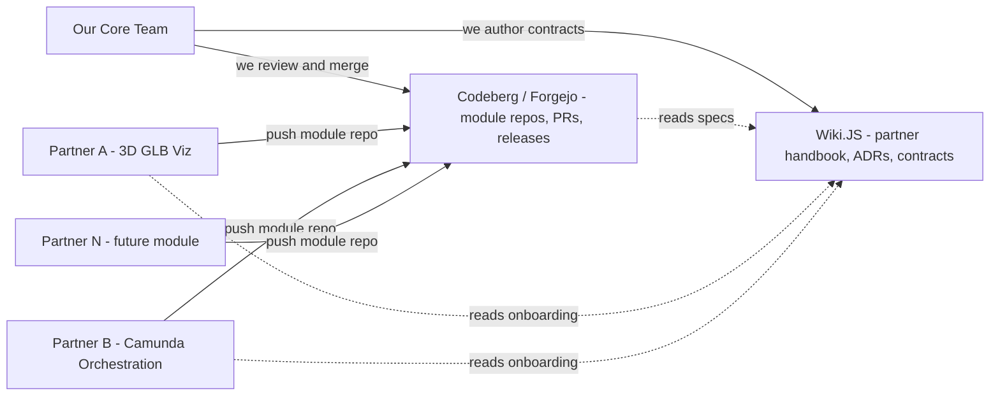
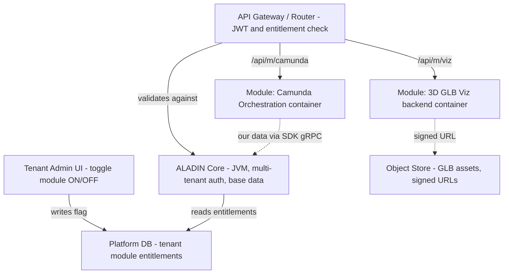
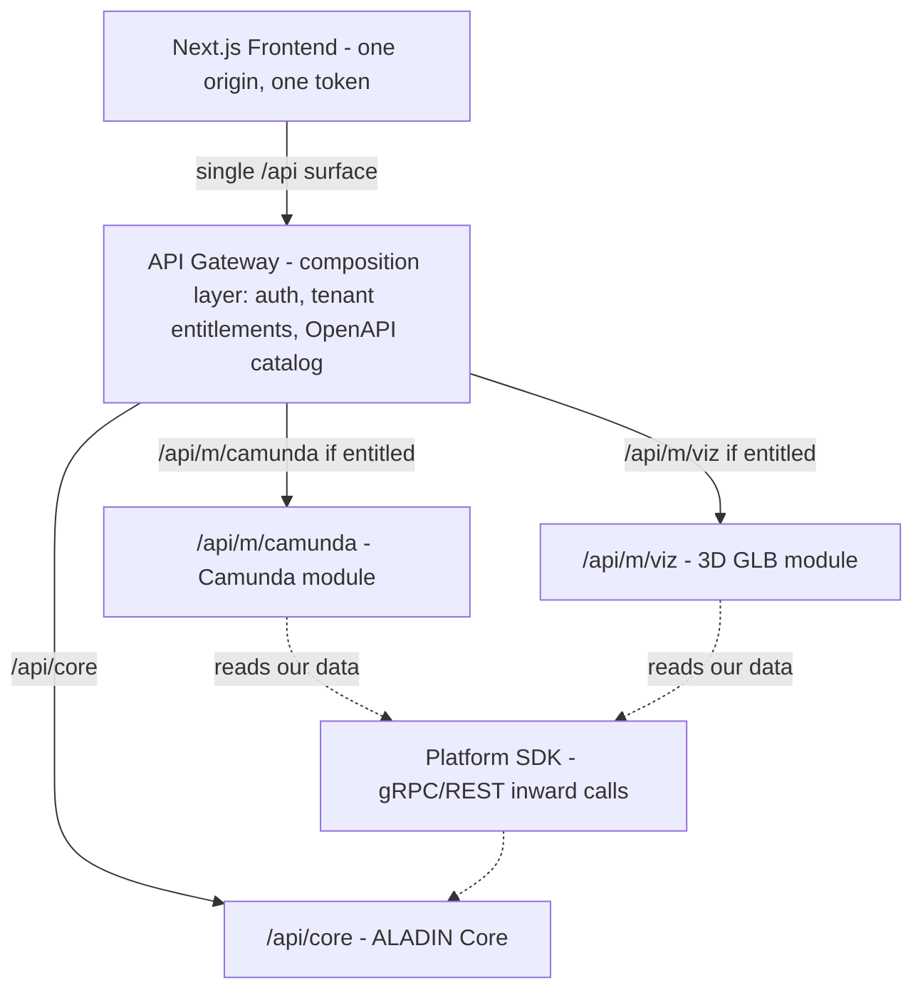

# ALADIN Governance

> **Scope —** This is how we run ALADIN: how we collaborate, how we let partners plug modules into our platform without ever putting our core at risk.
> **Status —** This is our governance contract. We build to it; the implementation phases follow it. Nothing here is wired yet.

We tag this page with **pills** instead of icons. Every pill is defined in the [Glossary](#7-glossary).

---

## 1. Purpose

Allow ALADIN partners who create software modules.

1. NEW **How we collaborate** — we run source on Codeberg and our knowledge base on Wiki.JS, so we meet partners on neutral, EU-hosted ground and keep them out of our internal GitHub org.
2. **How partners extend us** — modules plug in at the network and UI level, never inside our core JVM. That one decision is what lets us keep Spring Boot today and still pave a safe road to Quarkus / Micronaut (or Go) tomorrow.

Our rule throughout: **we isolate at the boundary, not in our memory space.** A bad module can crash its own box — never ours.

---

## 2. Collaboration Model — Codeberg + Wiki.JS

We split our collaboration across 3 tools:

| Tool | What we run on it | Why we chose it |
|---|---|---|
| **Codeberg** (Forgejo) | Source, issues, PRs, releases for partner-facing module repos | EU-hosted, sovereign, open-source forge; neutral ground for partners without giving them our internal GitHub org |
| **Wiki.JS** | Our knowledge base — partner handbook, contracts, ADRs, onboarding | Versioned, structured docs our POs and partners can read; decoupled from any single repo |
| **Escalidraw** | MIRO like interactive wallboards | Enable collaboration in real time |

### 2.1 Topology

### 2.2 How we manage third-party partner repos RULE

- **One repo per module.** We name them `aladin-mod-{module}` (e.g. `aladin-mod-glb-viewer`, `aladin-mod-camunda`). Each repo is self-contained: backend, frontend bundle, migrations, its own `docker-compose`.
- **Partners own their repo. We own the contracts.** We give partners write access to *their* repo only. Our SDK, OpenAPI contracts, and Partner Kit live in our `aladin-platform-sdk` repo, which partners consume read-only.
- **We keep it trunk-based.** `main` is always releasable; partners cut tagged releases (`vMAJOR.MINOR.PATCH`); we pin a **specific tag** in our registry, never a moving branch.
- **Docs live in Wiki.JS, not the repo.** We give each module a Wiki.JS space — integration notes, runbook, support contacts — and point the repo `README` at it.
- MOAT **No partner touches our core repos or our database.** They integrate only through the contracts in §3.

---

## 3. Module Registry — Scalable Plug-and-Play

### 3.1 Our core decision MOAT

We do **not** load partner JARs into our core process. Modern JVM frameworks (Quarkus, Micronaut) move dependency injection to compile time and forbid runtime reflection — runtime class-loading breaks GraalVM native images, leaks memory, and lets a bad plugin take down our whole platform.

Instead, we **virtualise the "Install" button**: flipping it sets a routing + UI flag, and the partner module runs as its own isolated service. We call this our **Strangler Fig** approach.

> **Why this scales for us —** we decouple modules over HTTP/gRPC. Our core can be Quarkus, a Camunda module can be Spring Boot, a 3D telemetry feed can be Go — and they all meet at the browser and the gateway. WARN We deliberately reject the monolithic JAR-loading model; it's an uphill fight against the entire modern Java ecosystem.

### 3.2 Architecture

### 3.3 The three contracts we hold partners to

We make a module "compatible" by holding it to three contracts. We hand these over; behind them, partners build however they like.

#### UI UI Contract — Next.js dynamic import / Web Components

- Partners ship a **standalone production JS bundle** (React/Vue/Angular compiled to a Web Component, or an npm/CDN package).
- We mount it **on demand by tenant config** using `next/dynamic`. When a tenant enables the module, we lazy-load the bundle and pass context props (`tenantId`, `authToken`, `theme`, asset URLs) down.
- We get **blast-radius isolation**: if a partner UI crashes, only that viewport box breaks — our layout stays up.

#### API API Contract — OpenAPI + gateway reverse proxy

- Partners submit an **OpenAPI (Swagger)** spec for their backend.
- We require every endpoint to accept an `X-Tenant-ID` header and an `Authorization` bearer token **we** issue.
- Our gateway intercepts `/api/m/{module}/*`, **validates the JWT, confirms the tenant owns the module**, then proxies to the partner. No entitlement → `403`. How these routes **compose into one surface** is §3.4.

#### DATA Data Contract — isolated Postgres schema + SDK

- Partner migrations (Flyway/Liquibase) target a **dedicated schema** `schema_partner_{module}`; we scope their DB user to that schema only — never our `public` schema.
- For our core data (user profiles, tenant details), partners call our **Platform SDK** (secure REST/gRPC), never the DB directly.
- GLB models stream from an **object store via signed URLs**; we keep only metadata (path, version, tenant) in Postgres.

### 3.4 API Composition — one surface, many modules API

The three contracts let each partner build in isolation. **API composition is how we make those isolated backends look like one platform.** The gateway is our composition layer — we never expose a partner backend directly.

- **One front door.** Everything answers under a single origin: `/api/core/*` is us, `/api/m/{module}/*` is each module. One auth model, one CORS policy, no module host ever leaks to the browser.
- **Composed per tenant.** On every request we resolve the tenant's enabled modules and compose **only** those routes for them. A tenant without the Camunda module has no `/api/m/camunda/*` surface at all — it returns `403`, not a broken `404`.
- **One catalog, versioned.** We aggregate every partner's submitted OpenAPI spec into a **single platform API catalog**, keyed to the module's pinned release tag. That catalog is our contract of record and what we publish to Wiki.JS.
- **Server-side aggregation (BFF) where a view needs it.** When a screen needs our core data **plus** a module's data, we compose the response at the gateway rather than make the browser fan out to several backends.
- **Composition runs both ways.** Outward, we compose module APIs into our public surface. Inward, modules compose with us through the **Platform SDK** (gRPC/REST) — never our database.

### 3.5 The Partner Kit we ship NEW

To get a partner productive on day one, we ship from our `aladin-platform-sdk` repo:

| What we give them | What it is |
|---|---|
| **Component stub** | A dummy Web Component / React component showing exactly which props (`tenantId`, `authToken`, `theme`) we hand down |
| **Auth helper library** | A tiny Java + Node library that validates our OAuth2/OIDC tokens, so partners don't reimplement security |
| **Local harness** | A `docker-compose` with a **stub of our core API**, so partners boot their module locally and prove it integrates before submission |
| **OpenAPI template** | A skeleton spec with our `X-Tenant-ID` / bearer conventions pre-wired |

---

## 4. The rules we hand partners RULE

We give partners this before they write a line of code:

- RULE **Multi-tenancy** — every request you get from us carries `X-Tenant-ID`. Isolate your logic and data strictly by it.
- RULE **Authentication** — validate the bearer token we issue against our OAuth2/OIDC endpoint. Use the auth helper we provide.
- RULE **Independent lifecycle** — your module runs standalone in Docker. You own your migrations (into `schema_partner_*`) and your dependencies (e.g. the Camunda engine).
- RULE **UI as a Web Component** — ship one production JS bundle; we mount it. No code lives in our repos.
- RULE **Core data via SDK only** — never connect to our DB. Go through our Platform SDK over REST/gRPC.
- RULE **Pin a tagged release** — we reference a specific version tag, not a branch.

---

## 5. What this page is not

- This is **governance, not code** — we don't implement the gateway, registry, or migration here.
- ALADIN stays a platform-wide initiative, not a tracked repo; we keep this governance under **Views**, not under a single project page.
- No runtime JAR-loading, no dynamic container spawning yet — our modules are always-on, fixed deployments; "Install" is just a routing/UI switch we flip.

---

## 6. Glossary

| Pill / Term | Meaning |
|---|---|
| NEW | New capability with no current KF equivalent |
| RULE | A hard requirement we hold partners to |
| MOAT | A security/isolation boundary we enforce |
| UI | Concerns the UI contract (frontend) |
| API | Concerns the API contract (gateway/backend) |
| DATA | Concerns the data contract (DB/SDK) |
| WARN | Caution — an option we reject or a risk we watch |
| OK | Our recommended position |
| **API composition** | Presenting many independent module backends as one platform API surface — namespaced, tenant-aware, catalogued — through our gateway |
| **BFF** | Backend-for-Frontend — server-side aggregation that composes core + module data into one response so the browser doesn't fan out |
| **Module Federation** | Webpack technique to load independently-built JS bundles at runtime (one way to ship partner UIs) |
| **Sidecar** | A module deployed as its own process/container alongside our core rather than inside it |
| **Reverse proxy** | Our gateway forwarding `/api/m/{module}/*` traffic to the right partner container after auth checks |
| **gRPC** | High-speed binary RPC over HTTP/2 — our SDK transport for module-to-core calls |
| **Multi-tenancy** | One platform instance serving many isolated tenants, keyed by `X-Tenant-ID` |
| **GLB** | GL Transmission Format Binary — self-contained 3D model files rendered client-side (Three.js / model-viewer) |

---

> Our governance contract for ALADIN. We edit it via PR; it's hand-authored and the aggregator never regenerates it.
