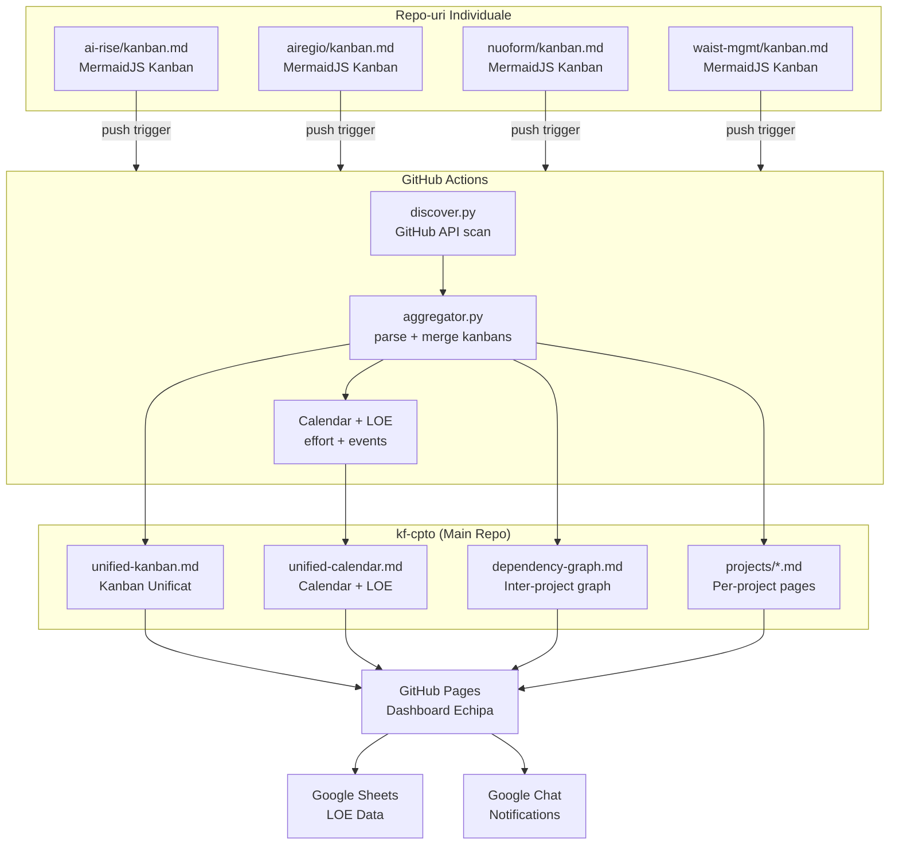

# KF-CPTO — Git-Native Project Management Dashboard

> **Single Pane of Glass** for KF Team projects — zero-config aggregation of Kanban boards, calendars, LOE tracking, and dependency graphs across all repositories.

## Overview

KF-CPTO is a centralized dashboard that **automatically discovers** and aggregates project management data from KF Team repositories. Any repo in the `katty-fashion` org with a `kanban.md` file is automatically included — no manual configuration required.

- **Unified Kanban Board** — All project tasks in one view
- **Sprint Calendar** — Visual timeline with Gantt charts
- **LOE (Level of Effort) Reports** — Effort tracking by project and assignee
- **Dependency Graph** — Obsidian-style directed graph showing inter-project dependencies
- **Google Sheets Integration** — Automatic LOE sync for reporting
- **GitHub Pages Deployment** — Live at `https://katty-fashion.github.io/kf-cpto/`

## How It Works



### Data Flow

1. **A developer updates `kanban.md`** in their project repo and pushes
2. **`notify-kf-cpto.yml`** triggers a `repository_dispatch` event to kf-cpto
3. **`discover.py`** scans the GitHub org via API to find all repos with `kanban.md`
4. **`aggregate.yml`** clones discovered repos and runs the aggregation pipeline
5. **`aggregator.py`** parses all kanbans and generates unified views + dependency graph
6. **`sheets_sync.py`** pushes LOE data to Google Sheets
7. **GitHub Pages** deploys the dashboard
8. **Google Chat** receives a notification

## Zero-Config Repo Registration

**No manual configuration needed.** To add a project to the dashboard:

1. Add a `kanban.md` file to your repo root (see format below)
2. Add the `.github/workflows/notify-kf-cpto.yml` workflow
3. Push — the dashboard discovers and includes your project automatically

### Quick Start with Templates

**Option A: Use GitHub Template Repo (Recommended)**

Create new project from template: [katty-fashion/project-template](https://github.com/katty-fashion/project-template) → **Use this template**

> **Important:** Always use **"Use this template"**, never **"Fork"**. Forks inherit the parent's visibility and cannot be made private independently. Templates create standalone repos with full control over visibility and settings.

New repos automatically include:
- `kanban.md` with correct format
- `.github/workflows/notify-kf-cpto.yml` for auto-sync
- `README.md` with architecture documentation

After creating, update `kanban.md` frontmatter: set `project:` to your repo name and fill in the other fields.

**Option B: Manual Setup**

```bash
# From your project repo root
curl -sL https://raw.githubusercontent.com/katty-fashion/kf-cpto/master/templates/kanban.md -o kanban.md
curl -sL https://raw.githubusercontent.com/katty-fashion/kf-cpto/master/templates/REPO_README.md -o README.md
mkdir -p .github/workflows
curl -sL https://raw.githubusercontent.com/katty-fashion/kf-cpto/master/templates/.github/workflows/notify-kf-cpto.yml -o .github/workflows/notify-kf-cpto.yml
```

## Kanban Format

Each project's `kanban.md` is the **single source of truth** — it seeds the dashboard with all project data.

```yaml
---
project: your-project-name
description: "Short project description"
type: saas                # saas | eu-project | internal
po: "@product-owner"
lead: "@tech-lead"
sprint: S3
sprint_start: 2026-03-02
sprint_end: 2026-03-13
depends_on: [nuoform]     # other project names this depends on
tags: [frontend, mvp]     # free-form tags
---

# Project Kanban

| Task | Assignee | Effort | Status |
| :--- | :--- | :--- | :--- |
| Implement feature X | @developer | 3d | In Progress |
| Code review for Y | @reviewer | 1d | Review |
| Deploy to staging | @devops | 2d | Todo |
```

### Frontmatter Fields

| Field | Required | Description |
| :--- | :---: | :--- |
| `project` | Yes | Repo name (must match GitHub repo) |
| `description` | No | Short description shown on dashboard cards |
| `type` | No | `saas`, `eu-project`, or `internal` (default) |
| `po` | No | Product owner contact |
| `lead` | No | Technical lead contact |
| `sprint` | Yes | Sprint identifier (S1, S2...) |
| `sprint_start` | Yes | Sprint start date (YYYY-MM-DD) |
| `sprint_end` | Yes | Sprint end date (YYYY-MM-DD) |
| `depends_on` | No | List of project names this depends on (powers the dependency graph) |
| `tags` | No | Free-form tags for categorization |

### Task Table

| Column | Format | Valid Values |
| :--- | :--- | :--- |
| Task | Free text | Task description |
| Assignee | `@username` | GitHub username with @ prefix |
| Effort | `Nd` | Number + 'd' for days (e.g., `3d`, `0.5d`) |
| Status | Exact match | `Todo`, `In Progress`, `Review`, `Done` |

### Status Color Indicators

The aggregator automatically adds colored left borders to kanban cards based on task status:

| Status | Color | MermaidJS Priority |
| :--- | :--- | :--- |
| In Progress | Red | `Very High` |
| Review | Orange | `High` |
| Todo | Blue | `Low` |
| Done | Default | — |

Assignees are also shown on each card via the `assigned` metadata.

## Automation Workflows

### Primary: Unified Sync (`aggregate.yml`)

| Trigger | When |
| :--- | :--- |
| Push to master | Immediate |
| Repository dispatch | When any project updates its kanban |
| Schedule | Monday 04:00 UTC |
| Manual | workflow_dispatch |

**Pipeline steps:**
1. `discover.py` — Scan GitHub org for repos with `kanban.md`
2. Clone all discovered repos
3. `aggregator.py` — Generate unified-kanban, calendar, LOE report, dependency graph, project pages
4. `sheets_sync.py` — Sync LOE data to Google Sheets
5. Commit and push updated docs
6. Deploy to GitHub Pages
7. Notify Google Chat

### Secondary: Sheets Sync (`sync_to_sheets.yml`)

| Trigger | When |
| :--- | :--- |
| Schedule | Weekdays 09:00 UTC |
| Manual | workflow_dispatch |

Lightweight — discovers repos, syncs LOE data to Google Sheets only.

### Per-Repo: Notify (`notify-kf-cpto.yml`)

Installed in each project repo. Triggers on push to `kanban.md` and sends a `repository_dispatch` event to kf-cpto.

## Configuration

### Required GitHub Secrets

| Secret | Level | Purpose |
| :--- | :--- | :--- |
| `KF_PAT` | **Org** | Cross-repo dispatch + cloning (needed by kf-cpto and every project repo) |
| `GOOGLE_CHAT_WEBHOOK` | **Org** | Dashboard update notifications |
| `GSHEET_ID` | **Repo** (kf-cpto) | Google Sheet ID for LOE sync |
| `GSHEET_CLIENT_EMAIL` | **Repo** (kf-cpto) | Service account email |
| `GSHEET_PRIVATE_KEY` | **Repo** (kf-cpto) | Service account private key |
| `GITHUB_TOKEN` | **Auto** | Provided by GitHub Actions |

### Setting Up GitHub PAT (Organization Secret)

1. **GitHub → Settings → Developer Settings → Personal Access Tokens → Fine-grained tokens**
2. **Name:** `kf-cpto-sync`, **Expiration:** 90 days
3. **Repository access:** All repositories (or select katty-fashion repos)
4. **Permissions:** Contents (Read-only), Metadata (Read-only)
5. **Add as Org Secret:** `github.com/katty-fashion → Settings → Secrets → Actions → New organization secret`

### Setting Up Google Sheets

1. Enable **Google Sheets API** in [Google Cloud Console](https://console.cloud.google.com)
2. Create **Service Account** → Download JSON key
3. Create Google Sheet → Share with service account email (Editor) → Create **LOE** tab
4. Add secrets: `GSHEET_ID`, `GSHEET_CLIENT_EMAIL`, `GSHEET_PRIVATE_KEY`

### Setting Up Google Chat

1. Open Chat space → **Manage webhooks** → Create webhook
2. Add `GOOGLE_CHAT_WEBHOOK` as org secret

## Local Development

```bash
# Clone
git clone https://github.com/katty-fashion/kf-cpto.git
cd kf-cpto

# Discover and clone project repos
export KF_PAT=your-token
uv run --with pyyaml --with requests scripts/discover.py
while read repo; do
  git clone --depth=1 https://github.com/katty-fashion/${repo}.git repos/${repo}
done < repos/discovered.txt

# Run aggregator
uv run --with pyyaml scripts/aggregator.py

# Run sheets sync (dry-run without credentials)
uv run --with pyyaml scripts/sheets_sync.py

# Serve docs locally
cd docs && bundle exec jekyll serve
```

## File Structure

```
kf-cpto/
├── .github/workflows/
│   ├── aggregate.yml          # Primary workflow — full sync pipeline
│   └── sync_to_sheets.yml    # Secondary workflow — LOE sync only
├── docs/
│   ├── _config.yml            # Jekyll configuration
│   ├── _layouts/default.html  # Layout with Pico CSS + MermaidJS
│   ├── _includes/
│   │   ├── sidebar.html       # Dynamic navigation (from projects collection)
│   │   └── card.html          # Card component
│   ├── index.md               # Dashboard homepage (dynamic project cards)
│   ├── unified-kanban.md      # Aggregated kanban (auto-generated)
│   ├── unified-calendar.md    # Sprint calendar (auto-generated)
│   ├── loe-report.md          # LOE report (auto-generated)
│   ├── dependency-graph.md    # Inter-project graph (auto-generated)
│   └── _projects/             # Per-project pages (Jekyll collection, auto-generated)
├── scripts/
│   ├── discover.py            # GitHub API repo discovery
│   ├── aggregator.py          # Main aggregation + generation
│   ├── sheets_sync.py         # Google Sheets LOE sync
│   └── utils.py               # Shared utilities
├── templates/                 # Starter templates for new project repos
│   ├── kanban.md              # Kanban template with full frontmatter
│   ├── REPO_README.md         # README template with architecture docs
│   └── .github/workflows/
│       └── notify-kf-cpto.yml # Auto-sync dispatch workflow
└── README.md
```

## Troubleshooting

| Issue | Solution |
| :--- | :--- |
| Project not appearing on dashboard | Ensure `kanban.md` exists at repo root (not in a subdirectory) |
| Tasks not parsing | Use exact status values: `Todo`, `In Progress`, `Review`, `Done` |
| Effort not calculated | Format: `Nd` (e.g., `3d`, `1.5d`, `0.5d`) |
| Dispatch not triggering | Verify event type is `kanban-updated` in notify workflow |
| Sheets empty | Check `GSHEET_ID`, `GSHEET_CLIENT_EMAIL`, `GSHEET_PRIVATE_KEY` secrets are set |
| Discovery finds no repos | Ensure `KF_PAT` has read access to org repos |

## Tools Under Evaluation

| Tool | Purpose | Link |
| :--- | :--- | :--- |
| **Dockwatch** | Docker container management — Web UI for per-container update scheduling, cron-based updates, multi-platform notifications (Slack, Discord, email). Potential to greatly simplify container update workflows vs manual `docker pull`/`compose up` cycles. | [Wiki](https://dockwatch.wiki/) · [GitHub](https://github.com/Notifiarr/dockwatch) |

---

*KF Team — Git-Native Project Management*
``