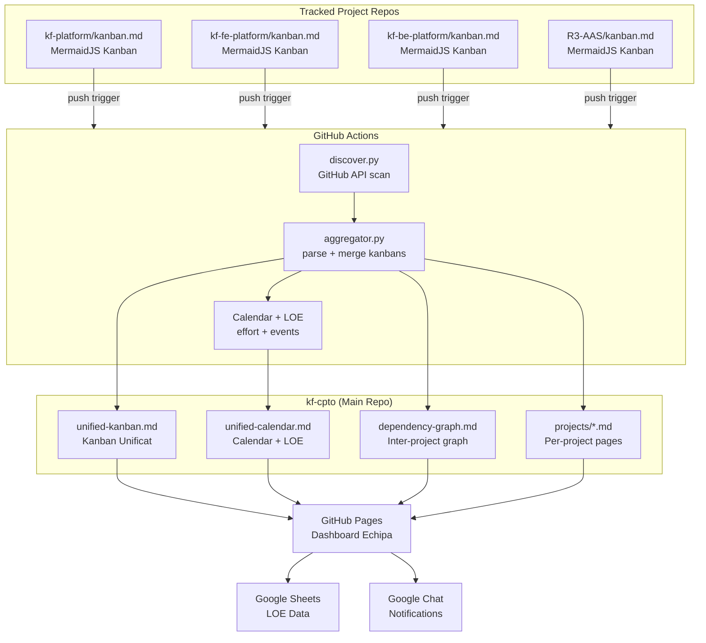

# KF-CPTO — Git-Native Project Management Dashboard

> **Single Pane of Glass** for KF Team projects — zero-config aggregation of Kanban boards, calendars, LOE tracking, and dependency graphs across all repositories.

## Overview

KF-CPTO is a centralized dashboard that **automatically discovers** and aggregates project management data from KF Team repositories. Any repo in the `katty-fashion` org with a `kanban.md` file is automatically included — no manual configuration required.

- **Unified Kanban Board** — All project tasks in one view
- **Sprint Calendar & Migration Gantt** — Visual timelines with Mermaid Gantt charts
- **LOE (Level of Effort) Reports** — Effort tracking by project and assignee
- **Dependency Graph** — Obsidian-style directed graph showing inter-project dependencies
- **Google Sheets Integration** — Automatic LOE sync for reporting
- **GitHub Pages Deployment** — Live at `https://katty-fashion.github.io/kf-cpto/`
- **Kanban Generator** — A local script that splits the migration plan-of-record into distinct per-repo `kanban.md` files by discipline (see [Generate Per-Repo Kanbans](#generate-per-repo-kanbans-from-the-migration-plan))
- **Activity Sync Skill** — A local Claude skill that reconciles each repo's `kanban.md` against *real* git activity (merged PRs, active branches) and writes the corrections back (see below)

## Activity Sync — Keep the Board Honest

`activity-sync` is a **local Claude Code skill** (in `.claude/skills/activity-sync/`) that turns the dashboard from hand-maintained into **activity-driven**: it reads what actually happened in each tracked repo, proposes status corrections, and writes them back so the dashboard reflects reality. It runs **on your machine**, never in CI — the CI pipeline stays self-contained and just renders whatever `kanban.md` files say.

### Setup (once)

```bash
export KF_PAT=your-token          # needs Contents: Read AND Write (write-back pushes)
pip install -r requirements.txt   # installs pyyaml, ruamel.yaml, requests
```

Tracked repos live under a gitignored `repos-local/` directory beside the scripts.

### The 3 steps

```bash
# 1. ENUMERATE — clone/refresh tracked repos and read their kanban.md
python .claude/skills/activity-sync/bootstrap.py      # first run only: clone + seed markers
python .claude/skills/activity-sync/repo_enum.py      # fetch + parse every tracked repo

# 2. PREVIEW — dry-run reconciliation: show what WOULD change, write nothing
python .claude/skills/activity-sync/reconcile.py --dry-run

# 3. WRITE BACK — apply the changes, one batch confirm, then push (triggers the dashboard)
python .claude/skills/activity-sync/writeback.py      # add --dry-run to preview the write plan
```

**What each step does:**

| Step | Script | What happens |
| :--- | :--- | :--- |
| 1. Enumerate | `repo_enum.py` | `git fetch` each tracked repo, parse `kanban.md` (read-only) |
| 2. Reconcile | `reconcile.py` | Match git signals to tasks — merged PR/closed issue → `Done`, active branch → `In Progress`; reverted merges and commit-message keywords are ignored. Prints a change list; writes nothing |
| 3. Write back | `writeback.py` | Sanitizes Mermaid-breaking characters, applies the status changes, asks for **one** confirmation, then commits & pushes to each repo's default branch — which fires the dashboard rebuild |

**Good to know:**
- **Dry-run first.** Always safe — `reconcile.py --dry-run` and `writeback.py --dry-run` change nothing.
- **One confirmation.** Write-back shows a single summary for all repos and asks once — no per-repo prompts.
- **Conflicts are skipped, not forced.** If a repo's local copy is behind its remote, that repo is logged `[CONFLICT]` and skipped; the others still go through.
- **Idempotent.** Re-running on an already-correct repo produces zero changes.
- **Recovery manifest.** Every run writes a JSON record of what succeeded/failed to `.claude/skills/activity-sync/manifests/` (gitignored).

> Full reference (output formats, conflict recovery, env vars): [`.claude/skills/activity-sync/SKILL.md`](.claude/skills/activity-sync/SKILL.md)

## Generate Per-Repo Kanbans from the Migration Plan

The three platform repos — `kf-platform`, `kf-be-platform`, `kf-fe-platform` — share **one** migration plan. Rather than hand-maintaining three boards, `scripts/generate_kanban.py` keeps a single **plan-of-record** and splits it into distinct per-repo `kanban.md` files by discipline:

| Discipline (Assignee) | Owning repo |
| :--- | :--- |
| FE-only (`@<frontend>`) | `kf-fe-platform` |
| BE-only (`@<backend>`) | `kf-be-platform` |
| FE + BE (`@<frontend> + @<backend>`) | `kf-platform` (cross-stack umbrella) |

Every task lands in **exactly one** repo, so the LOE export sums cleanly with **no double-counting**.

### The plan-of-record

`docs/_data/migration_plan.yml` is the editable source of truth (seeded once from `kf-platform`'s curated board). **Edit this file** to change tasks, effort, dates, or assignees — then regenerate. Effort is true **person-days** (`Nd`), not calendar span.

### Workflow

```bash
# 1. Edit the plan
$EDITOR docs/_data/migration_plan.yml

# 2. Preview the split — writes nothing
python scripts/generate_kanban.py

# 3. Apply — sync each clone to origin, regenerate, one batch confirm, commit + push
python scripts/generate_kanban.py --apply --no-push   # commit locally, push via your SSH
python scripts/generate_kanban.py --apply             # commit + push (needs KF_PAT)
```

The push fires each repo's `notify-kf-cpto.yml` dispatch → the dashboard + Sheet rebuild automatically.

**Guarantees:**
- **Only `kanban.md` is committed** — never unrelated files.
- **Mindful of others.** Before regenerating, each clone is fast-forwarded to origin so our commit lands *on top* of everyone's work — never a force-push, never discarding others' commits. A repo whose `kanban.md` diverged on origin is logged `[CONFLICT]` and skipped.
- **Status merge.** A repo's own valid status wins over the plan's, so regenerating never reverts statuses set by Activity Sync.
- **Idempotent.** Re-running with no plan change writes nothing.
- **First run only:** if `migration_plan.yml` is missing it is seeded from `kf-platform`; use `--reseed` to rebuild it from a full-plan `kf-platform` board.

> Full reference: the `[GENERATE]` section of [`.claude/skills/activity-sync/SKILL.md`](.claude/skills/activity-sync/SKILL.md)

## How It Works


```mermaid
graph TD
    subgraph repos["Tracked Project Repos"]
        A["kf-platform/kanban.md<br/>MermaidJS Kanban"]
        B["kf-fe-platform/kanban.md<br/>MermaidJS Kanban"]
        C["kf-be-platform/kanban.md<br/>MermaidJS Kanban"]
        D["R3-AAS/kanban.md<br/>MermaidJS Kanban"]
    end

    A -->|push trigger| GHA
    B -->|push trigger| GHA
    C -->|push trigger| GHA
    D -->|push trigger| GHA

    subgraph GHA["GitHub Actions"]
        DISC["discover.py<br/>GitHub API scan"]
        AGG["aggregator.py<br/>parse + merge kanbans"]
        CAL["Calendar + LOE<br/>effort + events"]
        DISC --> AGG
        AGG --> CAL
    end

    subgraph kfcpto["kf-cpto (Main Repo)"]
        UK["unified-kanban.md<br/>Kanban Unificat"]
        UC["unified-calendar.md<br/>Calendar + LOE"]
        DG["dependency-graph.md<br/>Inter-project graph"]
        PP["projects/*.md<br/>Per-project pages"]
    end

    AGG --> UK
    AGG --> DG
    AGG --> PP
    CAL --> UC

    UK --> PAGES
    UC --> PAGES
    DG --> PAGES
    PP --> PAGES

    PAGES["GitHub Pages<br/>Dashboard Echipa"]
    PAGES --> GS["Google Sheets<br/>LOE Data"]
    PAGES --> GC["Google Chat<br/>Notifications"]
```

### Data Flow

1. **A developer updates `kanban.md`** in their project repo and pushes
2. **`notify-kf-cpto.yml`** triggers a `repository_dispatch` event to kf-cpto
3. **`discover.py`** scans the GitHub org via API to find all repos with `kanban.md`
4. **`aggregate.yml`** clones discovered repos and runs the aggregation pipeline
5. **`aggregator.py`** parses all kanbans and generates unified views + dependency graph
6. **`sheets_sync.py`** pushes LOE data to Google Sheets
7. **GitHub Pages** deploys the dashboard
8. **Google Chat** receives a notification

## Zero-Config Repo Registration

**No manual configuration needed.** To add a project to the dashboard:

1. Add a `kanban.md` file to your repo root (see format below)
2. Add the `.github/workflows/notify-kf-cpto.yml` workflow
3. Push — the dashboard discovers and includes your project automatically

### Quick Start with Templates

**Option A: Use GitHub Template Repo (Recommended)**

Create new project from template: [katty-fashion/project-template](https://github.com/katty-fashion/project-template) → **Use this template**

> **Important:** Always use **"Use this template"**, never **"Fork"**. Forks inherit the parent's visibility and cannot be made private independently. Templates create standalone repos with full control over visibility and settings.

New repos automatically include:
- `kanban.md` with correct format
- `.github/workflows/notify-kf-cpto.yml` for auto-sync
- `README.md` with architecture documentation

After creating, update `kanban.md` frontmatter: set `project:` to your repo name and fill in the other fields.

**Option B: Manual Setup**

```bash
# From your project repo root
curl -sL https://raw.githubusercontent.com/katty-fashion/kf-cpto/master/templates/kanban.md -o kanban.md
curl -sL https://raw.githubusercontent.com/katty-fashion/kf-cpto/master/templates/REPO_README.md -o README.md
mkdir -p .github/workflows
curl -sL https://raw.githubusercontent.com/katty-fashion/kf-cpto/master/templates/.github/workflows/notify-kf-cpto.yml -o .github/workflows/notify-kf-cpto.yml
```

## Kanban Format

Each project's `kanban.md` is the **single source of truth** — it seeds the dashboard with all project data.

```yaml
---
project: your-project-name
description: "Short project description"
type: saas                # saas | eu-project | internal
po: "@product-owner"
lead: "@tech-lead"
sprint: S3
sprint_start: 2026-03-02
sprint_end: 2026-03-13
depends_on: [nuoform]     # other project names this depends on
tags: [frontend, mvp]     # free-form tags
team:                     # optional — used by the kanban generator for assignee mapping
  frontend: dev.fe@katty-fashion.ro
  backend:  dev.be@katty-fashion.ro
---

# Project Kanban

| Task | Assignee | Effort | Start | End | Status |
| :--- | :--- | :--- | :--- | :--- | :--- |
| Implement feature X | @developer | 3d | 2026-03-02 | 2026-03-04 | In Progress |
| Code review for Y | @reviewer | 1d | 2026-03-05 | 2026-03-05 | Review |
| Deploy to staging | @devops | 2d | | | Todo |
```

The **6-column** form (with `Start`/`End`) is recommended — the dates drive the per-project Gantt. The legacy **4-column** form (`| Task | Assignee | Effort | Status |`) is still supported.

### Frontmatter Fields

| Field | Required | Description |
| :--- | :---: | :--- |
| `project` | Yes | Repo name (must match GitHub repo) |
| `description` | No | Short description shown on dashboard cards |
| `type` | No | `saas`, `eu-project`, or `internal` (default) |
| `po` | No | Product owner contact |
| `lead` | No | Technical lead contact |
| `sprint` | Yes | Sprint identifier (S1, S2...) |
| `sprint_start` | Yes | Sprint start date (YYYY-MM-DD) |
| `sprint_end` | Yes | Sprint end date (YYYY-MM-DD) |
| `depends_on` | No | List of project names this depends on (powers the dependency graph) |
| `tags` | No | Free-form tags for categorization |
| `team` | No | `frontend` / `backend` / `tech_lead` emails — used by the kanban generator to derive assignees |

### Task Table

| Column | Format | Valid Values |
| :--- | :--- | :--- |
| Task | Free text | Task description |
| Assignee | `@username` | One or more `@handles` (e.g. `@fe + @be`) |
| Effort | `Nd` | Number + 'd' for **person-days** (e.g., `3d`, `0.5d`) |
| Start | `YYYY-MM-DD` | Optional — start date (drives the Gantt) |
| End | `YYYY-MM-DD` | Optional — end date (drives the Gantt) |
| Status | Canonical | `Todo`, `In Progress`, `Review`, `Done` |

**Parsing is forgiving.** The parser maps columns by **header name**, so an `Owner` column is read as Assignee and a `Deadline` column as End; tables without a `Task` column (e.g. summary tables) are skipped. Statuses are **canonicalized** — `In progress`, emoji-prefixed (`🔄 In Progress`), and common synonyms are normalized to the four canonical values; anything unrecognized is left as-is with a warning.

### Status Color Indicators

The aggregator automatically adds colored left borders to kanban cards based on task status:

| Status | Color | MermaidJS Priority |
| :--- | :--- | :--- |
| In Progress | Red | `Very High` |
| Review | Orange | `High` |
| Todo | Blue | `Low` |
| Done | Default | — |

Assignees are also shown on each card via the `assigned` metadata.

## Automation Workflows

### Primary: Unified Sync (`aggregate.yml`)

| Trigger | When |
| :--- | :--- |
| Push to master | Immediate |
| Repository dispatch | When any project updates its kanban |
| Schedule | Monday 04:00 UTC |
| Manual | workflow_dispatch |

**Pipeline steps:**
1. `discover.py` — Scan GitHub org for repos with `kanban.md`
2. Clone all discovered repos
3. `aggregator.py` — Generate unified-kanban, calendar, LOE report, dependency graph, project pages
4. `sheets_sync.py` — Sync LOE data to Google Sheets
5. Commit and push updated docs
6. Deploy to GitHub Pages
7. Notify Google Chat

### Secondary: Sheets Sync (`sync_to_sheets.yml`)

| Trigger | When |
| :--- | :--- |
| Schedule | Weekdays 09:00 UTC |
| Manual | workflow_dispatch |

Lightweight — discovers repos, syncs LOE data to Google Sheets only.

### Per-Repo: Notify (`notify-kf-cpto.yml`)

Installed in each project repo. Triggers on push to `kanban.md` and sends a `repository_dispatch` event to kf-cpto.

## Configuration

### Required GitHub Secrets

| Secret | Level | Purpose |
| :--- | :--- | :--- |
| `KF_PAT` | **Org** | Cross-repo dispatch + cloning (needed by kf-cpto and every project repo) |
| `GOOGLE_CHAT_WEBHOOK` | **Org** | Dashboard update notifications |
| `GSHEET_ID` | **Repo** (kf-cpto) | Google Sheet ID for LOE sync |
| `GSHEET_SUMMARY_ID` | **Repo** (kf-cpto) | SEPARATE R3Group spreadsheet for the cross-project Summary tab; defaults to the R3Group sheet id when unset. The sheet must be shared (Editor) with `GSHEET_CLIENT_EMAIL`. |
| `GSHEET_CLIENT_EMAIL` | **Repo** (kf-cpto) | Service account email |
| `GSHEET_PRIVATE_KEY` | **Repo** (kf-cpto) | Service account private key |
| `GITHUB_TOKEN` | **Auto** | Provided by GitHub Actions |

### Setting Up GitHub PAT (Organization Secret)

1. **GitHub → Settings → Developer Settings → Personal Access Tokens → Fine-grained tokens**
2. **Name:** `kf-cpto-sync`, **Expiration:** 90 days
3. **Repository access:** All repositories (or select katty-fashion repos)
4. **Permissions:** Contents (Read-only), Metadata (Read-only) — for CI discovery/cloning. **Note:** the local `activity-sync` write-back step needs **Contents: Read and Write** (plus Pull requests: Read to mine merged PRs); use a token with write access when running `writeback.py`.
5. **Add as Org Secret:** `github.com/katty-fashion → Settings → Secrets → Actions → New organization secret`

### Setting Up Google Sheets

1. Enable **Google Sheets API** in [Google Cloud Console](https://console.cloud.google.com)
2. Create **Service Account** → Download JSON key
3. Create Google Sheet → Share with service account email (Editor) → Create **LOE** tab
4. Add secrets: `GSHEET_ID`, `GSHEET_CLIENT_EMAIL`, `GSHEET_PRIVATE_KEY`

### Setting Up Google Chat

1. Open Chat space → **Manage webhooks** → Create webhook
2. Add `GOOGLE_CHAT_WEBHOOK` as org secret

## Local Development

```bash
# Clone
git clone https://github.com/katty-fashion/kf-cpto.git
cd kf-cpto

# Discover and clone project repos
export KF_PAT=your-token
uv run --with pyyaml --with requests scripts/discover.py
while read repo; do
  git clone --depth=1 https://github.com/katty-fashion/${repo}.git repos/${repo}
done < repos/discovered.txt

# Run aggregator
uv run --with pyyaml scripts/aggregator.py

# Run sheets sync (dry-run without credentials)
uv run --with pyyaml scripts/sheets_sync.py

# Serve docs locally
cd docs && bundle exec jekyll serve
```

## File Structure

```
kf-cpto/
├── .claude/skills/activity-sync/  # Local Claude skill — activity-driven reconciliation
│   ├── SKILL.md               # Skill reference (commands, output, recovery)
│   ├── bootstrap.py           # First-run: clone tracked repos + seed markers
│   ├── repo_enum.py           # Enumerate + fetch + parse tracked repos (read-only)
│   ├── reconcile.py           # Mine git activity → propose status changes (dry-run)
│   ├── writeback.py           # Sanitize + write + push corrected kanban.md
│   └── sanitize.py            # Mermaid-breaking-character sanitization
├── .github/workflows/
│   ├── aggregate.yml          # Primary workflow — full sync pipeline
│   └── sync_to_sheets.yml    # Secondary workflow — LOE sync only
├── docs/
│   ├── _config.yml            # Jekyll configuration
│   ├── _layouts/default.html  # Layout with Pico CSS + MermaidJS
│   ├── _includes/
│   │   ├── sidebar.html       # Dynamic navigation (from projects collection)
│   │   └── card.html          # Card component
│   ├── _data/
│   │   ├── calendar.yml        # Migration calendar config (hand-edited)
│   │   ├── migration_plan.yml  # Migration plan-of-record (source for the generator)
│   │   ├── gantt.yml           # Gantt rows parsed from migration-gantt.md (auto)
│   │   ├── loe.yml             # Canonical LOE intermediate (auto)
│   │   └── sync_status.yml     # Aggregator + Sheets health (auto)
│   ├── index.md               # Dashboard homepage (dynamic project cards)
│   ├── unified-kanban.md      # Aggregated kanban (auto-generated)
│   ├── unified-calendar.md    # Sprint calendar (auto-generated)
│   ├── migration-gantt.md     # Migration Gantt (prose + AUTO blocks)
│   ├── loe-report.md          # LOE report (auto-generated)
│   ├── dependency-graph.md    # Inter-project graph (auto-generated)
│   └── _projects/             # Per-project pages (Jekyll collection, auto-generated)
├── scripts/
│   ├── discover.py            # GitHub API repo discovery
│   ├── aggregator.py          # Main aggregation + generation
│   ├── generate_kanban.py     # Split the migration plan-of-record into per-repo kanbans
│   ├── auto_blocks.py         # Render idempotent AUTO:* blocks in augmented pages
│   ├── validate_auto_blocks.py # CI lint for AUTO markers
│   ├── sheets_sync.py         # Google Sheets LOE sync
│   ├── utils.py               # Shared utilities (canonical kanban parser)
│   └── test_generate_kanban.py # Unit tests (parser, canonicalization, generator)
├── templates/                 # Starter templates for new project repos
│   ├── kanban.md              # Kanban template with full frontmatter
│   ├── REPO_README.md         # README template with architecture docs
│   └── .github/workflows/
│       └── notify-kf-cpto.yml # Auto-sync dispatch workflow
└── README.md
```

## Troubleshooting

| Issue | Solution |
| :--- | :--- |
| Project not appearing on dashboard | Ensure `kanban.md` exists at repo root (not in a subdirectory) |
| Task shows an odd status | Statuses are canonicalized; an unrecognized value is left as-is with a `Warning:` in the aggregator log — fix it to one of `Todo`, `In Progress`, `Review`, `Done` |
| Effort not calculated | Format: `Nd` (e.g., `3d`, `1.5d`, `0.5d`) |
| Generator logs `[CONFLICT]` for a repo | The local clone diverged or its `kanban.md` changed on origin — `git -C repos-local/<repo> status` and resolve, then re-run |
| Dispatch not triggering | Verify event type is `kanban-updated` in notify workflow |
| Sheets empty | Check `GSHEET_ID`, `GSHEET_CLIENT_EMAIL`, `GSHEET_PRIVATE_KEY` secrets are set |
| Discovery finds no repos | Ensure `KF_PAT` has read access to org repos |
| `aggregate.yml` run fails on "Commit unified docs" | Harmless push race when several repos dispatch at once — the next run commits the docs. (No `concurrency:` guard yet.) |

## Tools Under Evaluation

| Tool | Purpose | Link |
| :--- | :--- | :--- |
| **Dockwatch** | Docker container management — Web UI for per-container update scheduling, cron-based updates, multi-platform notifications (Slack, Discord, email). Potential to greatly simplify container update workflows vs manual `docker pull`/`compose up` cycles. | [Wiki](https://dockwatch.wiki/) · [GitHub](https://github.com/Notifiarr/dockwatch) |

---

*KF Team — Git-Native Project Management*
``