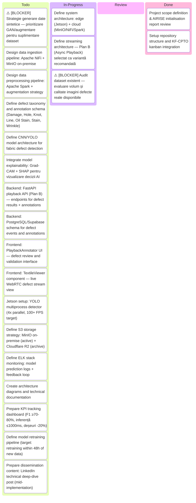
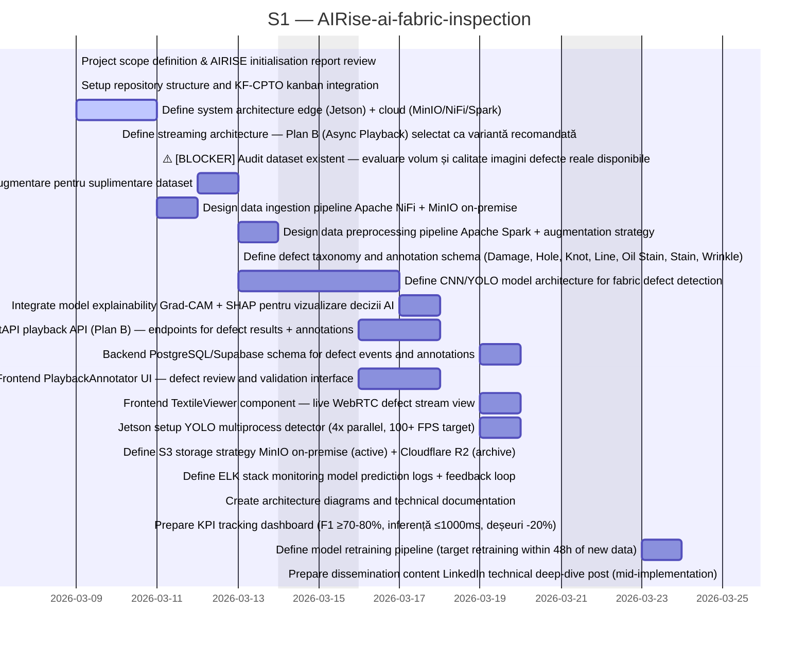
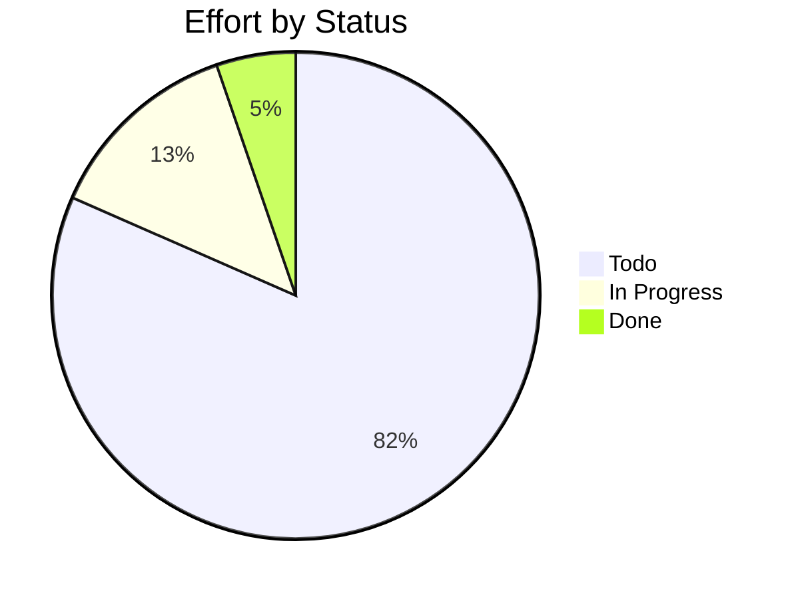

# AIRise-ai-fabric-inspection

> AIFR-AI – AI-powered fabric defect detection system for Katty Fashion. CNN/YOLO-based real-time quality inspection on Jetson edge devices, integrated with MinIO/NiFi/Spark infrastructure. EU Horizon Europe – AIRISE Open Call 1.

## Status

| Metric | Value |
| :--- | :--- |
| Status | Active |
| Type | EU Project |
| PO | @ps.tech |
| Lead | @el.tech |
| Current Sprint | S1 |
| Sprint Period | 2026-03-09 to 2026-03-20 |
| Tags | eu-project, ai, computer-vision, yolo, cnn, textile, defect-detection, jetson, edge-ai, minio, fastapi, nextjs, synthetic-data, grad-cam, shap |
| Dependencies | None |

## Current Sprint Kanban &nbsp; [Edit Kanban](https://github.com/katty-fashion/AIRise-ai-fabric-inspection/edit/main/kanban.md)

Todo
In Progress
Review
Done

## Task Summary

| Task | Assignee | Effort | Start | End | Status |
| :--- | :--- | :--- | :--- | :--- | :--- |
| Project scope definition & AIRISE initialisation report review | @ps.tech | 1d | 2026-03-09 | 2026-03-09 | Done |
| Setup repository structure and KF-CPTO kanban integration | @alexandru.bejenari | 1d | 2026-03-09 | 2026-03-09 | Done |
| Define system architecture: edge (Jetson) + cloud (MinIO/NiFi/Spark) | @el.tech | 3d | 2026-03-09 | 2026-03-11 | In Progress |
| Define streaming architecture — Plan B (Async Playback) selectat ca variantă recomandată | @el.tech | 1d | 2026-03-10 | 2026-03-10 | In Progress |
| ⚠️ [BLOCKER] Audit dataset existent — evaluare volum și calitate imagini defecte reale disponibile | @ps.tech | 1d | 2026-03-11 | 2026-03-11 | In Progress |
| ⚠️ [BLOCKER] Strategie generare date sintetice — prioritizare GAN/augmentare pentru suplimentare dataset | @el.tech | 2d | 2026-03-12 | 2026-03-13 | Todo |
| Design data ingestion pipeline: Apache NiFi + MinIO on-premise | @razvan.boita | 2d | 2026-03-11 | 2026-03-12 | Todo |
| Design data preprocessing pipeline: Apache Spark + augmentation strategy | @razvan.boita | 2d | 2026-03-13 | 2026-03-14 | Todo |
| Define defect taxonomy and annotation schema (Damage, Hole, Knot, Line, Oil Stain, Stain, Wrinkle) | @ps.tech | 1d | 2026-03-13 | 2026-03-13 | Todo |
| Define CNN/YOLO model architecture for fabric defect detection | @el.tech | 3d | 2026-03-13 | 2026-03-17 | Todo |
| Integrate model explainability: Grad-CAM + SHAP pentru vizualizare decizii AI | @el.tech | 2d | 2026-03-17 | 2026-03-18 | Todo |
| Backend: FastAPI playback API (Plan B) — endpoints for defect results + annotations | @razvan.boita | 3d | 2026-03-16 | 2026-03-18 | Todo |
| Backend: PostgreSQL/Supabase schema for defect events and annotations | @razvan.boita | 2d | 2026-03-19 | 2026-03-20 | Todo |
| Frontend: PlaybackAnnotator UI — defect review and validation interface | @alexandru.bejenari | 3d | 2026-03-16 | 2026-03-18 | Todo |
| Frontend: TextileViewer component — live WebRTC defect stream view | @alexandru.bejenari | 2d | 2026-03-19 | 2026-03-20 | Todo |
| Jetson setup: YOLO multiprocess detector (4x parallel, 100+ FPS target) | @el.tech | 2d | 2026-03-19 | 2026-03-20 | Todo |
| Define S3 storage strategy: MinIO on-premise (active) + Cloudflare R2 (archive) | @razvan.boita | 1d | 2026-03-20 | 2026-03-20 | Todo |
| Define ELK stack monitoring: model prediction logs + feedback loop | @el.tech | 1d | 2026-03-20 | 2026-03-20 | Todo |
| Create architecture diagrams and technical documentation | @alexandru.bejenari | 1d | 2026-03-20 | 2026-03-20 | Todo |
| Prepare KPI tracking dashboard (F1 ≥70-80%, inferență ≤1000ms, deșeuri -20%) | @ps.tech | 1d | 2026-03-21 | 2026-03-21 | Todo |
| Define model retraining pipeline (target: retraining within 48h of new data) | @el.tech | 2d | 2026-03-23 | 2026-03-24 | Todo |
| Prepare dissemination content: LinkedIn technical deep-dive post (mid-implementation) | @ps.tech | 1d | 2026-03-25 | 2026-03-25 | Todo |

## LOE Summary

| Metric | Value |
| :--- | :--- |
| Total Effort | 38.0d |
| In Progress | 5.0d |
| Completed | 2.0d |
| Remaining | 36.0d |

## Sprint Timeline

## Effort Distribution

## Links

- [Edit Kanban](https://github.com/katty-fashion/AIRise-ai-fabric-inspection/edit/main/kanban.md)
- [Repository](https://github.com/katty-fashion/AIRise-ai-fabric-inspection)
- [Kanban Board](https://github.com/katty-fashion/AIRise-ai-fabric-inspection/blob/main/kanban.md)

---

*Auto-generated by KF Aggregator*