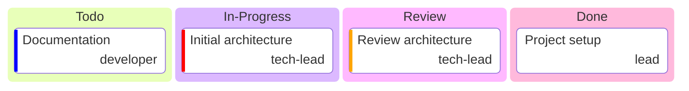
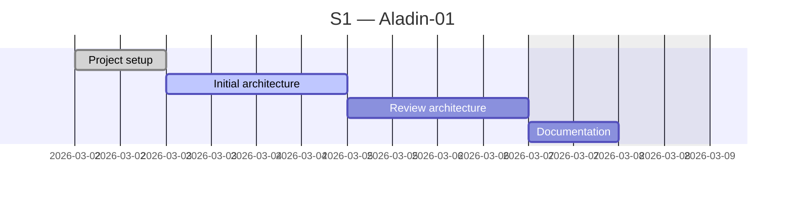
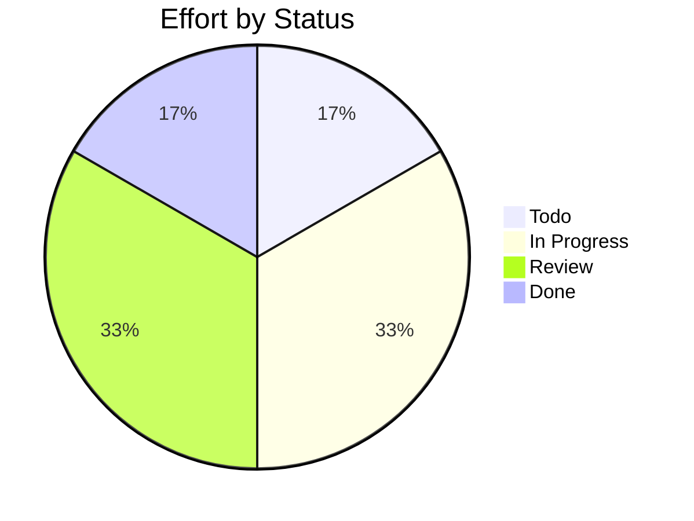

# Aladin-01

> Aladin-01 Team project template

## Status

| Metric | Value |
| :--- | :--- |
| Status | Active |
| Type | Internal |
| PO | @cpto |
| Lead | @tech-lead |
| Current Sprint | S1 |
| Sprint Period | 2026-03-02 to 2026-03-13 |
| Tags | template |
| Dependencies | [project-template]({{ '/projects/project-template/' | relative_url }}) |

## Current Sprint Kanban &nbsp; [Edit Kanban](https://github.com/katty-fashion/Aladin-01/edit/master/kanban.md)

Todo
In Progress
Review
Done

## Task Summary

| Task | Assignee | Effort | Status |
| :--- | :--- | :--- | :--- |
| Project setup | @lead | 1d | Done |
| Initial architecture | @tech-lead | 2d | In Progress |
| Review architecture | @tech-lead | 2d | Review |
| Documentation | @developer | 1d | Todo |

## LOE Summary

| Metric | Value |
| :--- | :--- |
| Total Effort | 6.0d |
| In Progress | 2.0d |
| Completed | 1.0d |
| Remaining | 5.0d |

## Sprint Timeline

## Effort Distribution

## Links

- [Edit Kanban](https://github.com/katty-fashion/Aladin-01/edit/master/kanban.md)
- [Repository](https://github.com/katty-fashion/Aladin-01)
- [Kanban Board](https://github.com/katty-fashion/Aladin-01/blob/master/kanban.md)

---

*Auto-generated by KF Aggregator*