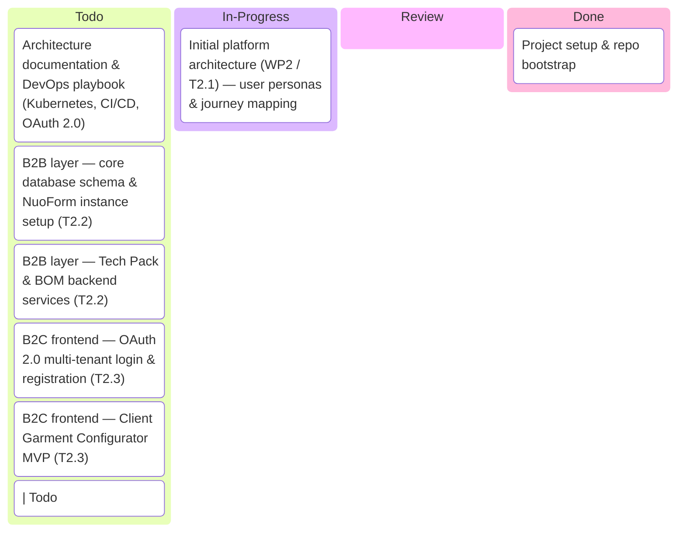
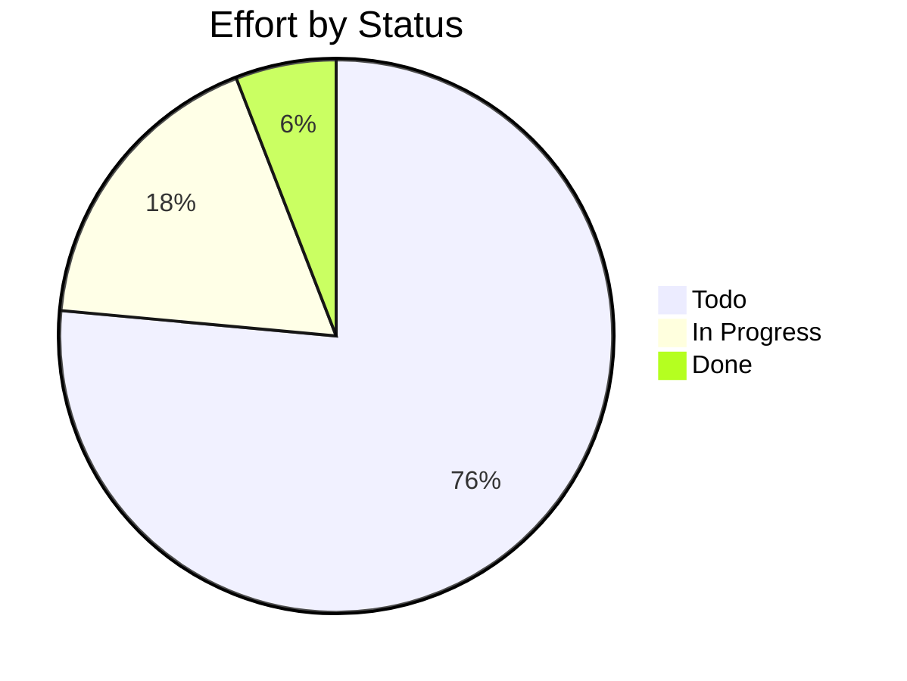

# Aladin-01

> Advanced LocAl and Digital Innovation Network for Circular Garments — Digital Platform (NuoForm) development for B2B/B2B2C textile orchestration

## Status

| Metric | Value |
| :--- | :--- |
| Status | Active |
| Type | eu-research |
| PO | ps.tech@katty-fashion.ro |
| Lead | el.tech@katty-fashion.ro |
| Current Sprint | S1 |
| Sprint Period | 2026-03-03 to 2026-03-14 |
| Tags | horizon-europe, nuoform, digital-platform, circular-textiles, wp2, wp3 |
| Dependencies | None |

## Current Sprint Kanban &nbsp; [Edit Kanban](https://github.com/katty-fashion/Aladin-01/edit/main/kanban.md)

<div class="status-legend"><span class="status-pill status-pill--todo">Todo</span>
<span class="status-pill status-pill--in-progress">In Progress</span>
<span class="status-pill status-pill--review">Review</span>
<span class="status-pill status-pill--done">Done</span></div>



## Task Summary

| Task | Assignee | Effort | Start | End | Status |
| :--- | :--- | :--- | :--- | :--- | :--- |
| Project setup & repo bootstrap | el.tech@katty-fashion.ro | 1d | 2026-03-03 | 2026-03-03 | Done |
| Initial platform architecture (WP2 / T2.1) — user personas & journey mapping | el.tech@katty-fashion.ro | 3d | 2026-03-04 | 2026-03-06 | In Progress |
| Architecture documentation & DevOps playbook (Kubernetes, CI/CD, OAuth 2.0) | el.tech@katty-fashion.ro | 2d | 2026-03-09 | 2026-03-10 | Todo |
| B2B layer — core database schema & NuoForm instance setup (T2.2) | razvan.boita@katty-fashion.ro | 3d | 2026-03-09 | 2026-03-11 | Todo |
| B2B layer — Tech Pack & BOM backend services (T2.2) | razvan.boita@katty-fashion.ro | 3d | 2026-03-11 | 2026-03-13 | Todo |
| B2C frontend — OAuth 2.0 multi-tenant login & registration (T2.3) | alexandru.bejenari@katty-fashion.ro | 2d | 2026-03-09 | 2026-03-10 | Todo |
| B2C frontend — Client Garment Configurator MVP (T2.3) | alexandru.bejenari@katty-fashion.ro | 3d | 2026-03-11 | 2026-03-13 | Todo |
| Notification service — backend & UI (order status, design approval) (T2.3) | razvan.boita@katty-fashion.ro | 1d | | | Todo | | DPP module — UI/UX wireframes & backend architecture (T2.4) |
| 2d | | | Todo | | Orchestration module — functional requirements & data format spec (T2.5) | el.tech@katty-fashion.ro | 2d |
| | Todo | | LLM integration — base pipeline for Tech Pack sustainability suggestions (T2.2) | razvan.boita@katty-fashion.ro | 3d | | | Todo |
| Internal alpha demo & usability testing with ALADIN partners (T2.2) | el.tech@katty-fashion.ro | 1d | | | Todo | | README & technical documentation |

## LOE Summary

| Metric | Value |
| :--- | :--- |
| Total Effort | 19.0d |
| In Progress | 3.0d |
| Completed | 1.0d |
| Remaining | 18.0d |

## Sprint Timeline

```mermaid
gantt
    title S1 — Aladin-01
    dateFormat YYYY-MM-DD
    excludes weekends

    Project setup & repo bootstrap :done, 2026-03-03, 2026-03-03
    Initial platform architecture (WP2 / T2.1) — user personas & journey mapping :active, 2026-03-04, 2026-03-06
    Architecture documentation & DevOps playbook (Kubernetes, CI/CD, OAuth 2.0) :2026-03-09, 2026-03-10
    B2B layer — core database schema & NuoForm instance setup (T2.2) :2026-03-09, 2026-03-11
    B2B layer — Tech Pack & BOM backend services (T2.2) :2026-03-11, 2026-03-13
    B2C frontend — OAuth 2.0 multi-tenant login & registration (T2.3) :2026-03-09, 2026-03-10
    B2C frontend — Client Garment Configurator MVP (T2.3) :2026-03-11, 2026-03-13
    | Todo :3d, |
    Notification service — backend & UI (order status, design approval) (T2.3) :|, Todo
    2d :| Orchestration module — functional requirements & data format spec (T2.5), el.tech@katty-fashion.ro
    Internal alpha demo & usability testing with ALADIN partners (T2.2) :|, Todo
```

## Effort Distribution



## Links

- [Edit Kanban](https://github.com/katty-fashion/Aladin-01/edit/main/kanban.md)
- [Repository](https://github.com/katty-fashion/Aladin-01)
- [Kanban Board](https://github.com/katty-fashion/Aladin-01/blob/main/kanban.md)

---

*Auto-generated by KF Aggregator*