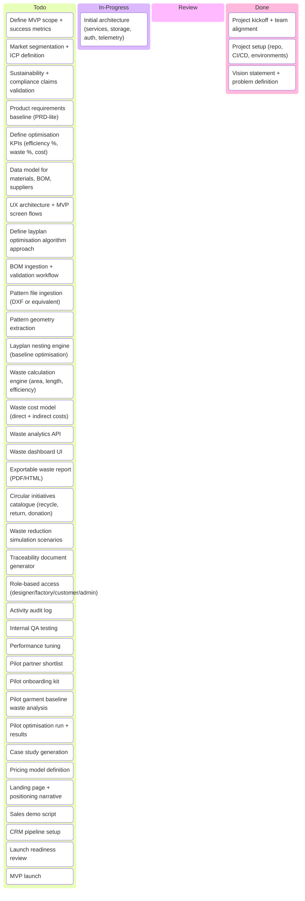
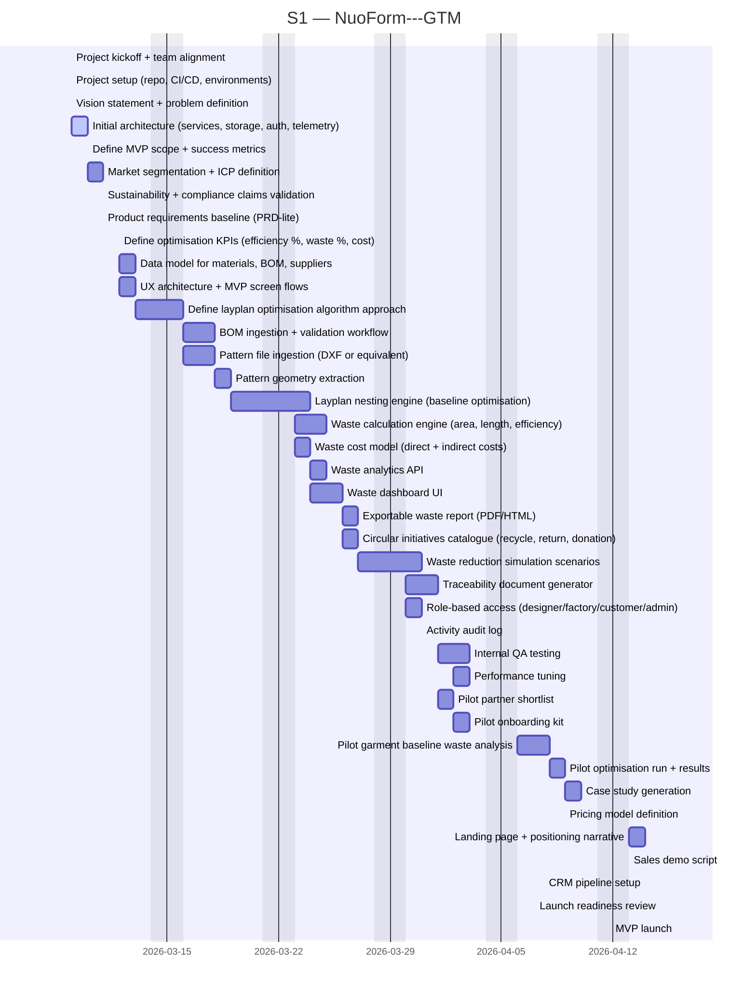
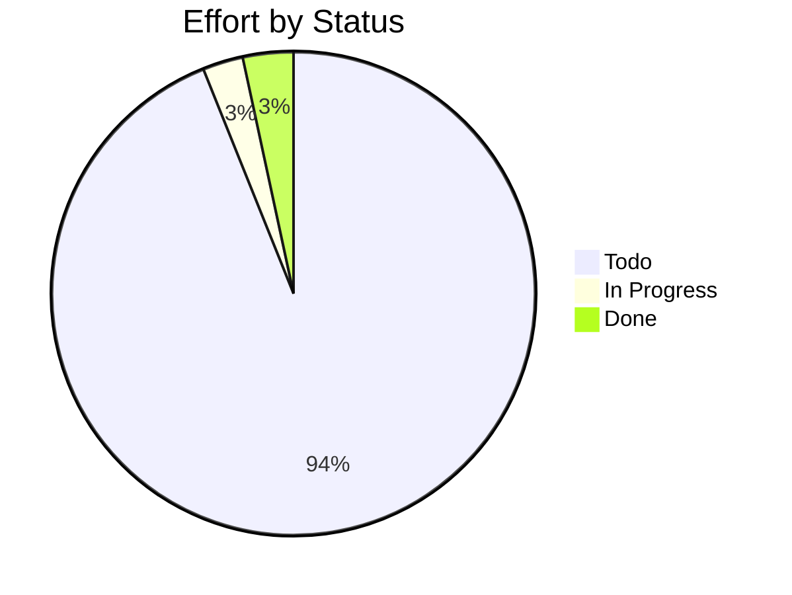

# NuoForm---GTM

> NuoForm GoToMarket plan

## Status

| Metric | Value |
| :--- | :--- |
| Status | Active |
| Type | Internal |
| PO | @cpto |
| Lead | @tech-lead |
| Current Sprint | S1 |
| Sprint Period | 2026-03-02 to 2026-03-13 |
| Tags | GTM, Nuo, SaaS, DO |
| Dependencies | [Waist-Management]({{ '/projects/Waist-Management/' | relative_url }}) |

## Current Sprint Kanban &nbsp; [Edit Kanban](https://github.com/katty-fashion/NuoForm---GTM/edit/main/kanban.md)

Todo
In Progress
Review
Done

## Task Summary

| Task | Assignee | Effort | Start | End | Status |
| :--- | :--- | :--- | :--- | :--- | :--- |
| Project kickoff + team alignment | @proj | 0.5d | 2026-03-09 | 2026-03-09 | Done |
| Project setup (repo, CI/CD, environments) | @cpto | 1d | 2026-03-09 | 2026-03-09 | Done |
| Initial architecture (services, storage, auth, telemetry) | @cpto | 2d | 2026-03-09 | 2026-03-10 | In Progress |
| Vision statement + problem definition | @pm | 1d | 2026-03-09 | 2026-03-09 | Done |
| Define MVP scope + success metrics | @pm | 1d | 2026-03-10 | 2026-03-10 | Todo |
| Market segmentation + ICP definition | @mkt | 2d | 2026-03-10 | 2026-03-11 | Todo |
| Sustainability + compliance claims validation | @sme | 1d | 2026-03-11 | 2026-03-11 | Todo |
| Product requirements baseline (PRD-lite) | @pm | 1d | 2026-03-11 | 2026-03-11 | Todo |
| Define optimisation KPIs (efficiency %, waste %, cost) | @sme | 1d | 2026-03-12 | 2026-03-12 | Todo |
| Data model for materials, BOM, suppliers | @be | 2d | 2026-03-12 | 2026-03-13 | Todo |
| UX architecture + MVP screen flows | @fe | 2d | 2026-03-12 | 2026-03-13 | Todo |
| Define layplan optimisation algorithm approach | @cpto | 2d | 2026-03-13 | 2026-03-16 | Todo |
| BOM ingestion + validation workflow | @be | 3d | 2026-03-16 | 2026-03-18 | Todo |
| Pattern file ingestion (DXF or equivalent) | @be | 3d | 2026-03-16 | 2026-03-18 | Todo |
| Pattern geometry extraction | @be | 2d | 2026-03-18 | 2026-03-19 | Todo |
| Layplan nesting engine (baseline optimisation) | @cpto | 4d | 2026-03-19 | 2026-03-24 | Todo |
| Waste calculation engine (area, length, efficiency) | @be | 3d | 2026-03-23 | 2026-03-25 | Todo |
| Waste cost model (direct + indirect costs) | @sme | 2d | 2026-03-23 | 2026-03-24 | Todo |
| Waste analytics API | @be | 2d | 2026-03-24 | 2026-03-25 | Todo |
| Waste dashboard UI | @fe | 3d | 2026-03-24 | 2026-03-26 | Todo |
| Exportable waste report (PDF/HTML) | @fe | 2d | 2026-03-26 | 2026-03-27 | Todo |
| Circular initiatives catalogue (recycle, return, donation) | @sme | 2d | 2026-03-26 | 2026-03-27 | Todo |
| Waste reduction simulation scenarios | @be | 3d | 2026-03-27 | 2026-03-31 | Todo |
| Traceability document generator | @be | 3d | 2026-03-30 | 2026-04-01 | Todo |
| Role-based access (designer/factory/customer/admin) | @cpto | 2d | 2026-03-30 | 2026-03-31 | Todo |
| Activity audit log | @be | 1d | 2026-03-31 | 2026-03-31 | Todo |
| Internal QA testing | @proj | 3d | 2026-04-01 | 2026-04-03 | Todo |
| Performance tuning | @cpto | 2d | 2026-04-02 | 2026-04-03 | Todo |
| Pilot partner shortlist | @mkt | 2d | 2026-04-01 | 2026-04-02 | Todo |
| Pilot onboarding kit | @pm | 2d | 2026-04-02 | 2026-04-03 | Todo |
| Pilot garment baseline waste analysis | @sme | 3d | 2026-04-06 | 2026-04-08 | Todo |
| Pilot optimisation run + results | @cpto | 2d | 2026-04-08 | 2026-04-09 | Todo |
| Case study generation | @mkt | 2d | 2026-04-09 | 2026-04-10 | Todo |
| Pricing model definition | @pm | 1d | 2026-04-09 | 2026-04-09 | Todo |
| Landing page + positioning narrative | @mkt | 2d | 2026-04-13 | 2026-04-14 | Todo |
| Sales demo script | @pm | 1d | 2026-04-13 | 2026-04-13 | Todo |
| CRM pipeline setup | @mkt | 1d | 2026-04-14 | 2026-04-14 | Todo |
| Launch readiness review | @proj | 1d | 2026-04-15 | 2026-04-15 | Todo |
| MVP launch | @proj | 0.5d | 2026-04-16 | 2026-04-16 | Todo |

## LOE Summary

| Metric | Value |
| :--- | :--- |
| Total Effort | 74.0d |
| In Progress | 2.0d |
| Completed | 2.5d |
| Remaining | 71.5d |

## Sprint Timeline

## Effort Distribution

## Links

- [Edit Kanban](https://github.com/katty-fashion/NuoForm---GTM/edit/main/kanban.md)
- [Repository](https://github.com/katty-fashion/NuoForm---GTM)
- [Kanban Board](https://github.com/katty-fashion/NuoForm---GTM/blob/main/kanban.md)

---

*Auto-generated by KF Aggregator*