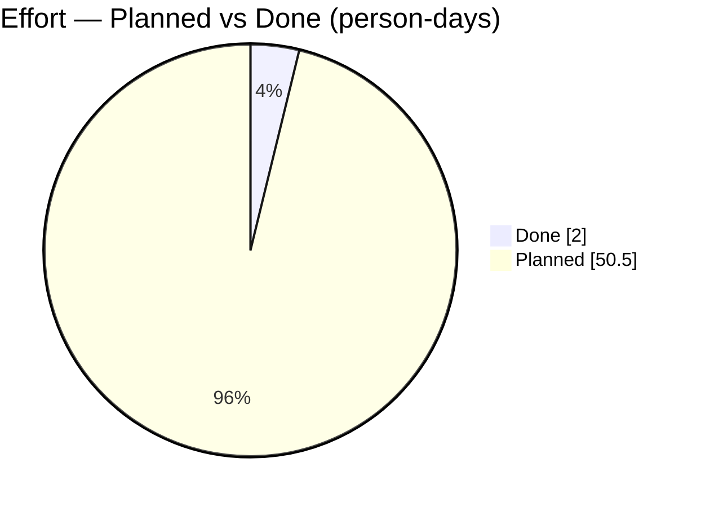
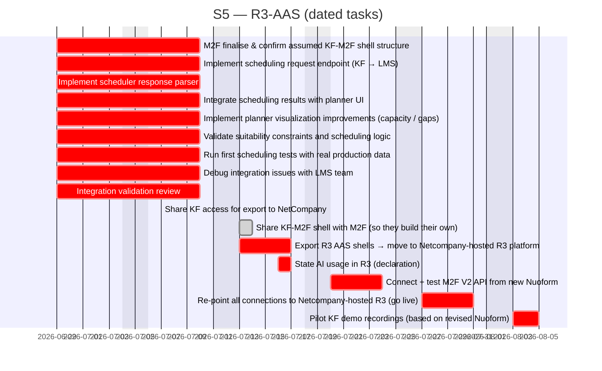

# R3-AAS

> R3GROUP Katty Fashion pilot – digital tools for co-creation, digital twins and technician capacity planning

## Status

| Metric | Value |
| :--- | :--- |
| Status | Active |
| Type | EU Project |
| PO | @el.tech |
| Lead | @el.tech |
| Current Sprint | S5 |
| Sprint Period | 2026-06-29 to 2026-07-10 |
| Tags | r3group, digital-twin, capacity-planner, manufacturing, aas |
| Dependencies | [ai-rise-options]({{ '/projects/ai-rise-options/' | relative_url }}) |

## Current Sprint Kanban &nbsp; [Edit Kanban]({{ '/kanban-builder/' | relative_url }}?project=R3-AAS) ·&nbsp;[raw](https://github.com/katty-fashion/R3-AAS/edit/main/kanban.md)

  

    
Todo 3

    
Re-point all connections to Netcompany-hosted R3 (go live)

    
Pilot KF demo recordings (based on revised Nuoform)

    
State AI usage in R3 (declaration)

  

  

    
In Progress 4

    
T2.3 — Supply Chain Digital Twin: risk modelling

    
M2F: finalise &amp; confirm assumed KF-M2F shell structure

    
Export R3 AAS shells → move to Netcompany-hosted R3 platform

    
Connect + test M2F V2 API from new Nuoform

  

  

    
Review 12

    
WP1 — AAS platform integration (digital infrastructure)

    
T2.4 — Capacity Planner: KF Planner UI

    
T2.4 — Capacity Planner: KF ↔ LMS Integration

    
T3.3 — IoT Monitoring: sensors deployment

    
Implement scheduling request endpoint (KF → LMS)

    
Implement scheduler response parser

    
Integrate scheduling results with planner UI

    
Implement planner visualization improvements (capacity / gaps)

    
Validate suitability constraints and scheduling logic

    
Run first scheduling tests with real production data

    
Debug integration issues with LMS team

    
Integration validation review

  

  

    
Done 1

    
Share KF access for export to NetCompany

  

## Task Summary

### Status General M36 — Program Deliverables

| Task | Assignee | Effort | Start | End | Status |
| :--- | :--- | :--- | :--- | :--- | :--- |
| WP1 — AAS platform integration (digital infrastructure) | Mihai A. | — |  |  | Review |
| T2.1 — Co-creation platform (Nuoform) | Alexandru Bejenari | — |  |  | Done |
| T3.2 — Product Digital Twin (AAS model) | Eduard L | — |  |  | Done |
| T3.2 — Process Digital Twin (Tecnomatix simulation) | Eduard L | — |  |  | Done |
| T2.4 — Capacity Planner: LMS Scheduler Backend | LMS | — |  |  | Done |
| T2.4 — Capacity Planner: KF Planner UI | Alexandru Bejenari | 5d |  |  | Review |
| T2.4 — Capacity Planner: KF ↔ LMS Integration | Alexandru Bejenari | 10d |  |  | Review |
| T3.3 — IoT Monitoring: sensors deployment | Eduard Lazar | 5d |  |  | Review |
| T2.3 — Supply Chain Digital Twin: risk modelling | Eduard Lazar | — |  |  | In Progress |
| AAS import/export tooling (aas_export.py, import-demo.sh) | Eduard L | — |  |  | Done |
| Order_3_Aas shell (8 submodels, cost + schedule) | Eduard L | — |  |  | Done |
| Demo UI R3Group (Next 16: Design → Simulation → Shopfloor → Impact; LMS re-optimise) | Alexandru Bejenari | — |  |  | Done |
| OAuth2 auth-server public + per-client provisioning | Răzvan Boița | — |  |  | Done |
| ALADIN WP2 RunSheet service (nginx + Traefik routing) | Răzvan Boița | — |  |  | Done |

### Tasks — Sprint S2 (16 March → 03 April 2026)

| Task | Assignee | Effort | Start | End | Status |
| :--- | :--- | :--- | :--- | :--- | :--- |
| Implement scheduling request endpoint (KF → LMS) | @backend | 2d | 2026-06-29 | 2026-07-10 | Review |
| Implement scheduler response parser | @backend | 2d | 2026-06-29 | 2026-07-10 | Review |
| Integrate scheduling results with planner UI | @frontend | 3d | 2026-06-29 | 2026-07-10 | Review |
| Implement planner visualization improvements (capacity / gaps) | @frontend | 2d | 2026-06-29 | 2026-07-10 | Review |
| Validate suitability constraints and scheduling logic | @backend | 2d | 2026-06-29 | 2026-07-10 | Review |
| Run first scheduling tests with real production data | @tech-lead | 1d | 2026-06-29 | 2026-07-10 | Review |
| Debug integration issues with LMS team | @tech-lead | 1d | 2026-06-29 | 2026-07-10 | Review |
| Integration validation review | @tech-lead | 0.5d | 2026-06-29 | 2026-07-10 | Review |

### 10. Outstanding — R3 Handover, M2F &amp; Pilot

| Task | Assignee | Effort | Start | End | Status |
| :--- | :--- | :--- | :--- | :--- | :--- |
| M2F: finalise &amp; confirm assumed KF-M2F shell structure | Eduard Lazăr / M2F | 2d | 2026-06-29 | 2026-07-10 | In Progress |
| Export R3 AAS shells → move to Netcompany-hosted R3 platform | Eduard Lazăr / Netcompany | 3d | 2026-07-13 | 2026-07-17 | In Progress |
| Share KF access for export to NetCompany | Eduard Lazăr | 1d | 2026-07-07 | 2026-07-07 | Done |
| Share KF-M2F shell with M2F (so they build their own) | Eduard Lazăr | 1d | 2026-07-13 | 2026-07-14 | Done |
| Connect + test M2F V2 API from new Nuoform | Alexandru Bejenari | 5d | 2026-07-20 | 2026-07-24 | In Progress |
| Re-point all connections to Netcompany-hosted R3 (go live) | Mihai A. | 3d | 2026-07-27 | 2026-07-31 | Todo |
| Pilot KF demo recordings (based on revised Nuoform) | Eduard Lazăr | 3d | 2026-08-03 | 2026-08-05 | Todo |
| State AI usage in R3 (declaration) | Eduard Lazăr | 1d | 2026-07-16 | 2026-07-17 | Todo |

## LOE Summary

| Metric | Value |
| :--- | :--- |
| Total Effort | 52.5d |
| In Progress | 10.0d |
| Completed | 2.0d |
| Remaining | 50.5d |

## Effort — Planned vs Done

## Sprint Timeline

PlannedIn workLate / At riskDone

> 5 open task(s) have no start/end dates and are not charted — add dates in kanban.md to plot them.

## Links

- [Edit Kanban]({{ '/kanban-builder/' | relative_url }}?project=R3-AAS) ·&nbsp;[raw](https://github.com/katty-fashion/R3-AAS/edit/main/kanban.md)
- [Repository](https://github.com/katty-fashion/R3-AAS)
- [Kanban Board](https://github.com/katty-fashion/R3-AAS/blob/main/kanban.md)

---

*Auto-generated by KF Aggregator*