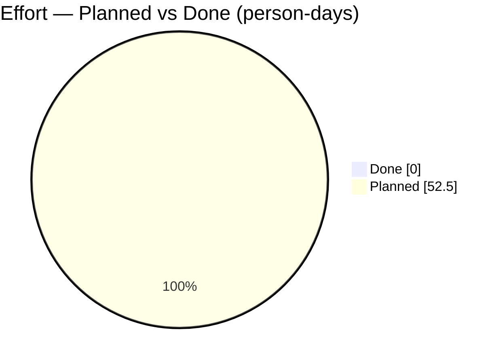
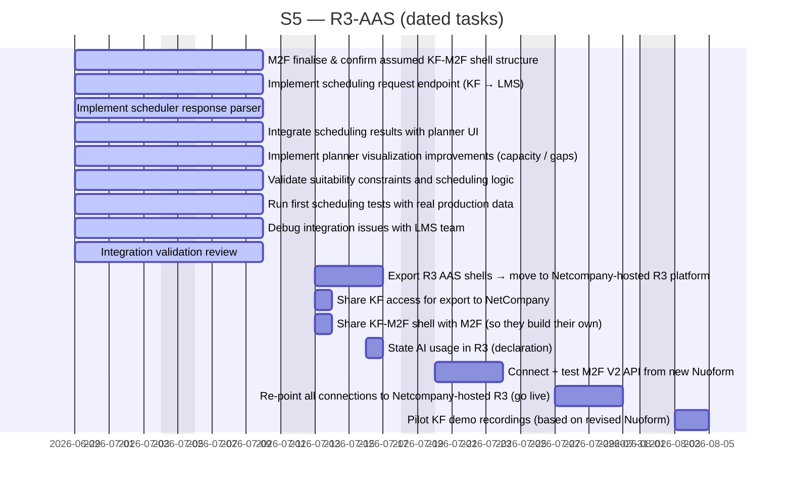

# R3-AAS

> R3GROUP Katty Fashion pilot – digital tools for co-creation, digital twins and technician capacity planning

## Status

| Metric | Value |
| :--- | :--- |
| Status | Active |
| Type | EU Project |
| PO | @el.tech |
| Lead | @el.tech |
| Current Sprint | S5 |
| Sprint Period | 2026-06-29 to 2026-07-10 |
| Tags | r3group, digital-twin, capacity-planner, manufacturing, aas |
| Dependencies | [ai-rise]({{ '/projects/ai-rise/' | relative_url }}) |

## Current Sprint Kanban &nbsp; [Edit Kanban]({{ '/kanban-builder/' | relative_url }}?project=R3-AAS) ·&nbsp;[raw](https://github.com/katty-fashion/R3-AAS/edit/main/kanban.md)

  

    
Todo 27

    
Feature set pentru lansare (MVP)

    
Ce este „Done&quot; vs „Ready&quot; pentru release

    
Decizie Made2Flow (demo vs integrare reală)

    
Pregătire feature flags (ascundere features incomplete)

    
Clarificare value proposition (perspectivă tehnică)

    
Backend alignment (după modificări Răzvan)

    
Bug-uri identificate în sistem

    
Instalare senzor 3 (poziție cutie/flux materiale) — T3.3

    
Naming convention pentru task-uri (namespace per proiect)

    
Evitarea dublării task-urilor între tools

    
Feature flags

    
Telemetrie (monitorizare)

    
Code quality / stability înainte de release

    
Suport tehnic post-launch

    
Conectivitate sisteme externe

    
Sprint plan (tranziție către GTM)

    
Rapoarte săptămânale (nu daily)

    
Landing page (claritate produs)

    
Definire tehnică monetizare (SaaS readiness)

    
Input pentru CRM / pipeline (structură tehnică)

    
Export R3 AAS shells → move to Netcompany-hosted R3 platform

    
Share KF access for export to NetCompany

    
Share KF-M2F shell with M2F (so they build their own)

    
Connect + test M2F V2 API from new Nuoform

    
Re-point all connections to Netcompany-hosted R3 (go live)

    
Pilot KF demo recordings (based on revised Nuoform)

    
State AI usage in R3 (declaration)

  

  

    
In Progress 6

    
T2.3 — Supply Chain Digital Twin: risk modelling

    
Sesiune demo produse (intern)

    
Acces corect la organizații (login flow issues)

    
Testare demo produse (clienți + testeri interni)

    
Demo / prezentare produs

    
M2F: finalise &amp; confirm assumed KF-M2F shell structure

  

  

    
Review 15

    
WP1 — AAS platform integration (digital infrastructure)

    
T2.4 — Capacity Planner: KF Planner UI

    
T2.4 — Capacity Planner: KF ↔ LMS Integration

    
T3.3 — IoT Monitoring: sensors deployment

    
Integrare între sisteme (Katty / LMS)

    
Integrare LMS (AAS extern)

    
UI flow (parțial complet)

    
Implement scheduling request endpoint (KF → LMS)

    
Implement scheduler response parser

    
Integrate scheduling results with planner UI

    
Implement planner visualization improvements (capacity / gaps)

    
Validate suitability constraints and scheduling logic

    
Run first scheduling tests with real production data

    
Debug integration issues with LMS team

    
Integration validation review

  

  

    
Done 34

    
T2.1 — Co-creation platform (Nuoform)

    
T3.2 — Product Digital Twin (AAS model)

    
T3.2 — Process Digital Twin (Tecnomatix simulation)

    
T2.4 — Capacity Planner: LMS Scheduler Backend

    
AAS import/export tooling (aas_export.py, import-demo.sh)

    
Order_3_Aas shell (8 submodels, cost + schedule)

    
Demo UI R3Group (Next 16: Design → Simulation → Shopfloor → Impact; LMS re-optimise)

    
OAuth2 auth-server public + per-client provisioning

    
ALADIN WP2 RunSheet service (nginx + Traefik routing)

    
Clarificare acces server R3 (Vangelis)

    
Clarificare format date platforma R3

    
Review arhitectură

    
Identificare gaps / incomplete features

    
Validare integrare end-to-end (expunere API Nuoform)

    
Arhitectură multi-tenant (in place)

    
Separare date per client (in place)

    
Flow sistem (UI → AAS → backend)

    
Multiple tipuri AAS → standardizare

    
Layout simplificat pilot (stații + flux + senzori)

    
Sketch → JSON → sistem

    
LMS specs + credentials

    
Vizualizare date / UI

    
Deploy AAS în Cloud (hosting)

    
Clarificare format date pentru platforma R3

    
Board central Kanban – single source of truth

    
Task-uri ↔ Work Packages (WP mapping)

    
Reprezentare Gantt (timeline / corelare temporală)

    
GitHub Actions pentru sync task-uri

    
Generare automată status / reports

    
Pipeline CI/CD (necesar pentru GTM)

    
Acces VPN + onboarding corect

    
Corelare Sprint tasks ↔ Work Packages

    
Task-uri cu timeline (start/end)

    
Gantt / timeline pentru progres

  

## Task Summary

### Status General M36 — Program Deliverables

| Task | Assignee | Effort | Start | End | Status |
| :--- | :--- | :--- | :--- | :--- | :--- |
| WP1 — AAS platform integration (digital infrastructure) | Mihai A. | — |  |  | Review |
| T2.1 — Co-creation platform (Nuoform) | Alexandru Bejenari | — |  |  | Done |
| T3.2 — Product Digital Twin (AAS model) | Răzvan Boița | — |  |  | Done |
| T3.2 — Process Digital Twin (Tecnomatix simulation) | Eduard Modreanu | — |  |  | Done |
| T2.4 — Capacity Planner: LMS Scheduler Backend | LMS | — |  |  | Done |
| T2.4 — Capacity Planner: KF Planner UI | Alexandru Bejenari | 5d |  |  | Review |
| T2.4 — Capacity Planner: KF ↔ LMS Integration | Alexandru Bejenari | 10d |  |  | Review |
| T3.3 — IoT Monitoring: sensors deployment | Eduard Modreanu | 5d |  |  | Review |
| T2.3 — Supply Chain Digital Twin: risk modelling | Eduard Lazăr | — |  |  | In Progress |
| AAS import/export tooling (aas_export.py, import-demo.sh) | Răzvan Boița | — |  |  | Done |
| Order_3_Aas shell (8 submodels, cost + schedule) | Răzvan Boița | — |  |  | Done |
| Demo UI R3Group (Next 16: Design → Simulation → Shopfloor → Impact; LMS re-optimise) | Alexandru Bejenari | — |  |  | Done |
| OAuth2 auth-server public + per-client provisioning | Răzvan Boița | — |  |  | Done |
| ALADIN WP2 RunSheet service (nginx + Traefik routing) | Răzvan Boița | — |  |  | Done |

### BLOCKERE ACTIVE

| Task | Assignee | Effort | Start | End | Status |
| :--- | :--- | :--- | :--- | :--- | :--- |
| Clarificare acces server R3 (Vangelis) | Paul Stanciuc |  |  |  | Done |
| Clarificare format date platforma R3 | Alexandru Bejenari |  |  |  | Done |

### Definire

| Task | Assignee | Effort | Start | End | Status |
| :--- | :--- | :--- | :--- | :--- | :--- |
| Feature set pentru lansare (MVP) | Eduard Lazăr |  |  |  | Todo |
| Ce este „Done" vs „Ready" pentru release | Eduard Lazăr |  |  |  | Todo |
| Decizie Made2Flow (demo vs integrare reală) | Eduard Lazăr |  |  |  | Todo |
| Arhitectură multi-tenant (in place) | Eduard Modreanu |  |  |  | Done |
| Separare date per client (in place) | Eduard Modreanu |  |  |  | Done |
| Pipeline CI/CD (necesar pentru GTM) | Răzvan Boița |  |  |  | Done |

### Evaluare produse existente

| Task | Assignee | Effort | Start | End | Status |
| :--- | :--- | :--- | :--- | :--- | :--- |
| Review arhitectură | Răzvan Boița |  |  |  | Done |
| Identificare gaps / incomplete features | Alexandru Bejenari |  |  |  | Done |

### Organizare

| Task | Assignee | Effort | Start | End | Status |
| :--- | :--- | :--- | :--- | :--- | :--- |
| Sesiune demo produse (intern) | Eduard Lazăr |  |  |  | In Progress |

### Implementare

| Task | Assignee | Effort | Start | End | Status |
| :--- | :--- | :--- | :--- | :--- | :--- |
| Pregătire feature flags (ascundere features incomplete) | Mihai A. |  |  |  | Todo |
| Reprezentare Gantt (timeline / corelare temporală) | Paul Stanciuc |  |  |  | Done |
| Feature flags | Mihai A. |  |  |  | Todo |

### Suport GTM

| Task | Assignee | Effort | Start | End | Status |
| :--- | :--- | :--- | :--- | :--- | :--- |
| Clarificare value proposition (perspectivă tehnică) | Eduard Lazăr |  |  |  | Todo |
| Validare integrare end-to-end (expunere API Nuoform) | Răzvan Boița |  |  |  | Done |

### Clarificare

| Task | Assignee | Effort | Start | End | Status |
| :--- | :--- | :--- | :--- | :--- | :--- |
| Flow sistem (UI → AAS → backend) | Răzvan Boița |  |  |  | Done |
| Clarificare format date pentru platforma R3 | Alexandru Bejenari |  |  |  | Done |
| Instalare senzor 3 (poziție cutie/flux materiale) — T3.3 | Eduard Lazăr / Julia |  |  |  | Todo |

### Validare

| Task | Assignee | Effort | Start | End | Status |
| :--- | :--- | :--- | :--- | :--- | :--- |
| Integrare între sisteme (Katty / LMS) | Alexandru Bejenari |  |  |  | Review |
| Code quality / stability înainte de release | Mihai A. |  |  |  | Todo |

### Analiză

| Task | Assignee | Effort | Start | End | Status |
| :--- | :--- | :--- | :--- | :--- | :--- |
| Multiple tipuri AAS → standardizare | Răzvan Boița |  |  |  | Done |

### Creare

| Task | Assignee | Effort | Start | End | Status |
| :--- | :--- | :--- | :--- | :--- | :--- |
| Layout simplificat pilot (stații + flux + senzori) | Eduard Lazăr / Paul Stanciuc |  |  |  | Done |

### Integrare

| Task | Assignee | Effort | Start | End | Status |
| :--- | :--- | :--- | :--- | :--- | :--- |
| Integrare LMS (AAS extern) | Alexandru Bejenari |  |  | ~1 lună | Review |
| Sketch → JSON → sistem | Alexandru Bejenari |  |  | — | Done |

### Verificare

| Task | Assignee | Effort | Start | End | Status |
| :--- | :--- | :--- | :--- | :--- | :--- |
| LMS specs + credentials | Alexandru Bejenari |  |  |  | Done |

### Finalizare

| Task | Assignee | Effort | Start | End | Status |
| :--- | :--- | :--- | :--- | :--- | :--- |
| UI flow (parțial complet) | Alexandru Bejenari |  |  |  | Review |

### Continuare

| Task | Assignee | Effort | Start | End | Status |
| :--- | :--- | :--- | :--- | :--- | :--- |
| Backend alignment (după modificări Răzvan) | Alexandru Bejenari |  |  |  | Todo |

### Fixuri

| Task | Assignee | Effort | Start | End | Status |
| :--- | :--- | :--- | :--- | :--- | :--- |
| Bug-uri identificate în sistem | Alexandru Bejenari |  |  |  | Todo |

### Îmbunătățiri

| Task | Assignee | Effort | Start | End | Status |
| :--- | :--- | :--- | :--- | :--- | :--- |
| Vizualizare date / UI | Alexandru Bejenari |  |  |  | Done |

### Deploy

| Task | Assignee | Effort | Start | End | Status |
| :--- | :--- | :--- | :--- | :--- | :--- |
| Deploy AAS în Cloud (hosting) | Răzvan Boița / Eduard Lazăr |  |  |  | Done |

### Setup

| Task | Assignee | Effort | Start | End | Status |
| :--- | :--- | :--- | :--- | :--- | :--- |
| Board central Kanban – single source of truth | Paul Stanciuc |  |  |  | Done |

### Aliniere

| Task | Assignee | Effort | Start | End | Status |
| :--- | :--- | :--- | :--- | :--- | :--- |
| Task-uri ↔ Work Packages (WP mapping) | Paul Stanciuc |  |  |  | Done |

### Organizare &amp; Standardizare

| Task | Assignee | Effort | Start | End | Status |
| :--- | :--- | :--- | :--- | :--- | :--- |
| Naming convention pentru task-uri (namespace per proiect) | Eduard Lazăr |  |  |  | Todo |
| Evitarea dublării task-urilor între tools | Eduard Lazăr |  |  |  | Todo |

### Automatizare

| Task | Assignee | Effort | Start | End | Status |
| :--- | :--- | :--- | :--- | :--- | :--- |
| GitHub Actions pentru sync task-uri | Paul Stanciuc |  |  |  | Done |
| Generare automată status / reports | Paul Stanciuc |  |  |  | Done |

### Adăugare

| Task | Assignee | Effort | Start | End | Status |
| :--- | :--- | :--- | :--- | :--- | :--- |
| Telemetrie (monitorizare) | Mihai A. |  |  |  | Todo |

### Pregătire

| Task | Assignee | Effort | Start | End | Status |
| :--- | :--- | :--- | :--- | :--- | :--- |
| Suport tehnic post-launch | Eduard Lazăr |  |  |  | Todo |

### 6. Testing &amp; Access

| Task | Assignee | Effort | Start | End | Status |
| :--- | :--- | :--- | :--- | :--- | :--- |
| Acces VPN + onboarding corect | Eduard Lazăr |  |  |  | Done |
| Acces corect la organizații (login flow issues) | Eduard Modreanu |  |  |  | In Progress |
| Conectivitate sisteme externe | Alexandru Bejenari |  |  |  | Todo |
| Testare demo produse (clienți + testeri interni) | Eduard Lazăr |  |  |  | In Progress |

### 8. Reporting &amp; Planning

| Task | Assignee | Effort | Start | End | Status |
| :--- | :--- | :--- | :--- | :--- | :--- |
| Sprint plan (tranziție către GTM) | Eduard Lazăr |  |  |  | Todo |
| Corelare Sprint tasks ↔ Work Packages | Paul Stanciuc |  |  |  | Done |
| Task-uri cu timeline (start/end) | Paul Stanciuc |  |  |  | Done |
| Rapoarte săptămânale (nu daily) | Eduard Lazăr |  |  |  | Todo |
| Gantt / timeline pentru progres | Paul Stanciuc |  |  |  | Done |

### 9. Product Support

| Task | Assignee | Effort | Start | End | Status |
| :--- | :--- | :--- | :--- | :--- | :--- |
| Landing page (claritate produs) | Alexandru Bejenari |  |  |  | Todo |
| Demo / prezentare produs | Eduard Lazăr |  |  |  | In Progress |
| Definire tehnică monetizare (SaaS readiness) | Mihai A. |  |  |  | Todo |
| Input pentru CRM / pipeline (structură tehnică) | Eduard Lazăr |  |  |  | Todo |

### Tasks — Sprint S2 (16 March → 03 April 2026)

| Task | Assignee | Effort | Start | End | Status |
| :--- | :--- | :--- | :--- | :--- | :--- |
| Implement scheduling request endpoint (KF → LMS) | @backend | 2d | 2026-06-29 | 2026-07-10 | Review |
| Implement scheduler response parser | @backend | 2d | 2026-06-29 | 2026-07-10 | Review |
| Integrate scheduling results with planner UI | @frontend | 3d | 2026-06-29 | 2026-07-10 | Review |
| Implement planner visualization improvements (capacity / gaps) | @frontend | 2d | 2026-06-29 | 2026-07-10 | Review |
| Validate suitability constraints and scheduling logic | @backend | 2d | 2026-06-29 | 2026-07-10 | Review |
| Run first scheduling tests with real production data | @tech-lead | 1d | 2026-06-29 | 2026-07-10 | Review |
| Debug integration issues with LMS team | @tech-lead | 1d | 2026-06-29 | 2026-07-10 | Review |
| Integration validation review | @tech-lead | 0.5d | 2026-06-29 | 2026-07-10 | Review |

### 10. Outstanding — R3 Handover, M2F &amp; Pilot

| Task | Assignee | Effort | Start | End | Status |
| :--- | :--- | :--- | :--- | :--- | :--- |
| M2F: finalise &amp; confirm assumed KF-M2F shell structure | Eduard Lazăr / M2F | 2d | 2026-06-29 | 2026-07-10 | In Progress |
| Export R3 AAS shells → move to Netcompany-hosted R3 platform | Mihai A. | 3d | 2026-07-13 | 2026-07-17 | Todo |
| Share KF access for export to NetCompany | Eduard Lazăr | 1d | 2026-07-13 | 2026-07-14 | Todo |
| Share KF-M2F shell with M2F (so they build their own) | Mihai A. | 1d | 2026-07-13 | 2026-07-14 | Todo |
| Connect + test M2F V2 API from new Nuoform | Alexandru Bejenari | 5d | 2026-07-20 | 2026-07-24 | Todo |
| Re-point all connections to Netcompany-hosted R3 (go live) | Mihai A. | 3d | 2026-07-27 | 2026-07-31 | Todo |
| Pilot KF demo recordings (based on revised Nuoform) | Eduard Lazăr | 3d | 2026-08-03 | 2026-08-05 | Todo |
| State AI usage in R3 (declaration) | Eduard Lazăr | 1d | 2026-07-16 | 2026-07-17 | Todo |

## LOE Summary

| Metric | Value |
| :--- | :--- |
| Total Effort | 52.5d |
| In Progress | 2.0d |
| Completed | 0.0d |
| Remaining | 52.5d |

## Effort — Planned vs Done

## Sprint Timeline

PlannedIn workLate / At riskDone

> 32 open task(s) have no start/end dates and are not charted — add dates in kanban.md to plot them.

## Links

- [Edit Kanban]({{ '/kanban-builder/' | relative_url }}?project=R3-AAS) ·&nbsp;[raw](https://github.com/katty-fashion/R3-AAS/edit/main/kanban.md)
- [Repository](https://github.com/katty-fashion/R3-AAS)
- [Kanban Board](https://github.com/katty-fashion/R3-AAS/blob/main/kanban.md)

---

*Auto-generated by KF Aggregator*