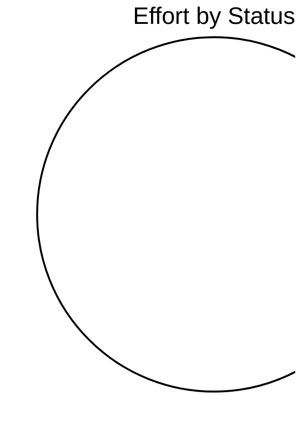

# R3GROUP

> R3GROUP Katty Fashion pilot – digital tools for co-creation, digital twins and technician capacity planning

## Status

| Metric | Value |
| :--- | :--- |
| Status | Active |
| Type | EU Project |
| PO | - |
| Lead | - |
| Current Sprint | S2 |
| Sprint Period | 2026-03-16 to 2026-04-03 |
| Tags | r3group, digital-twin, capacity-planner, manufacturing |
| Dependencies | [ai-rise]({{ '/projects/ai-rise/' | relative_url }}) |

## Current Sprint Kanban &nbsp; [Edit Kanban](https://github.com/katty-fashion/R3GROUP/edit/main/kanban.md)

<div class="status-legend"><span class="status-pill status-pill--todo">Todo</span>
<span class="status-pill status-pill--in-progress">In Progress</span>
<span class="status-pill status-pill--review">Review</span>
<span class="status-pill status-pill--done">Done</span></div>


## Task Summary

| Task | Assignee | Effort | Status |
| :--- | :--- | :--- | :--- |
| Pillar | Component | Status | |--- |
| --- | | WP1 — Digital Infrastructure | AAS platform integration | 90% |
| T2.1 — Co-creation platform | Nuoform platform | ✅ Completed | | T3.2 — Product Digital Twin |
| ✅ Completed | | T3.2 — Process Digital Twin | Tecnomatix simulation | ✅ Implemented & validated |
| T2.4 — Capacity Planner | LMS Scheduler Backend | ✅ Completed | | T2.4 — Capacity Planner |
| 🔄 Near completion | | T2.4 — Capacity Planner | KF ↔ LMS Integration | 🔄 In progress |
| T3.3 — IoT Monitoring | Sensors deployment | 🧪 Testing | | T2.3 — Supply Chain Digital Twin |
| KPI | Target | |--- | --- |
| Scrap reduction | −20% | | Reconfiguration time reduction | −35% |
| Production lead time reduction | −50% | | Pre-production waste reduction | −95% |
| # | Task | Blocker | Owner |
| |--- | --- | --- | --- |
| | B1 | Deploy AAS în Cloud (hosting) | ⚠️ Lipsă cont plătit Cloud; Eduard Lazăr deblochează | Răzvan Boița / Eduard Lazăr |
| | B2 | Clarificare acces server R3 (Vangelis) | ⚠️ Solicitare trimisă din 06.03; fără răspuns de la Vangelis | Paul Stanciuc |
| | B3 | Clarificare format date platforma R3 | ⚠️ Vangelis/LMS nu au specificat formatul exact | Alexandru Bejenari |
| | B4 | Decizie Made2Flow (demo vs integrare reală) | ⚠️ Funcționează cu fake data; decizie de business în pending | Eduard Lazăr / Paul Stanciuc |
| |--- | --- | --- | --- |
| | Feature set pentru lansare (MVP) | Eduard Lazăr / Paul Stanciuc | 🔴 P1 | 📋 Todo |
| | Ce este „Done" vs „Ready" pentru release | Eduard Lazăr / Paul Stanciuc | 🔴 P1 | 📋 Todo |
| | Decizie Made2Flow (demo vs integrare reală) | Eduard Lazăr / Paul Stanciuc | 🔴 P1 | ⚠️ Decizie pending |
| ### Evaluare produse existente | Task | Owner | Prioritate |
| Note | |--- | --- | --- |
| --- | | Review arhitectură | Răzvan Boița | 🔴 P4 |
| — | | Identificare gaps / incomplete features | Alexandru Bejenari | — |
| Gap Analysis trimis la Eduard pentru review | ### Organizare | Task | Owner |
| Status | Note | |--- | --- |
| --- | --- | | Sesiune demo produse (intern) | Paul Stanciuc |
| ⏭️ Next | Planificată | ### Implementare | Task |
| Prioritate | Status | Note | |--- |
| --- | --- | --- | | Pregătire feature flags (ascundere features incomplete) |
| — | 📋 Todo | Neînceput | ### Suport GTM |
| Owner | Prioritate | Status | Note |
| --- | --- | --- | --- |
| | Clarificare value proposition (perspectivă tehnică) | Paul Stanciuc | 🔴 P1 | 📋 Todo |
| | Validare integrare end-to-end (expunere API Nuoform) | Răzvan Boița | — | ✅ Done |
| |--- | --- | --- | --- |
| | Arhitectură multi-tenant (in place) | Eduard Modreanu | 🔴 P5 | ✅ Done |
| | Separare date per client (in place) | Eduard Modreanu | 🔴 P5 | ✅ Done |
| ### Clarificare | Task | Owner | Prioritate |
| Note | |--- | --- | --- |
| --- | | Flow sistem (UI → AAS → backend) | Răzvan Boița | — |
| Necesită clarificare | | Clarificare acces server R3 (Vangelis) | Paul Stanciuc | — |
| Solicitare trimisă 06.03; fără răspuns de la Vangelis | ### Validare | Task | Owner |
| Status | Note | |--- | --- |
| --- | --- | | Integrare între sisteme (Katty / LMS) | Alexandru Bejenari |
| 🔄 In Progress | Blocat acces server R3 | ### Analiză | Task |
| Prioritate | Status | Note | |--- |
| --- | --- | --- | | Multiple tipuri AAS → standardizare |
| — | 🔄 In Progress | Analiză în curs | ### Creare |
| Owner | Prioritate | Status | Note |
| --- | --- | --- | --- |
| | Layout simplificat pilot (stații + flux + senzori) | Eduard Lazăr / Paul Stanciuc | — | ⏭️ Next |
| Note | |--- | --- | --- |
| --- | --- | | Integrare LMS (AAS extern) | Alexandru Bejenari |
| 🔄 In Progress | ~1 lună | Credențiale primite 19.03; în testare; deadline ~1 lună | | Sketch → JSON → sistem |
| 🔴 P2 | ✅ Done | — | Există în Co-creation |
| |--- | --- | --- | --- |
| | LMS specs + credentials | Alexandru Bejenari | 🔴 P2 | 🔄 In Review |
| ### Finalizare | Task | Owner | Prioritate |
| Note | |--- | --- | --- |
| --- | | UI flow (parțial complet) | Alexandru Bejenari | — |
| DOD de revizuit | ### Continuare | Task | Owner |
| Status | Note | |--- | --- |
| --- | --- | | Backend alignment (după modificări Răzvan) | Alexandru Bejenari |
| ⏭️ Next | Continuare după modificările lui Răzvan | ### Fixuri | Task |
| Prioritate | Status | Note | |--- |
| --- | --- | --- | | Bug-uri identificate în sistem |
| — | 📋 Todo | TDD de revizuit; unit/integration/regression tests necesare pe API-uri | ### Îmbunătățiri |
| Owner | Prioritate | Status | Note |
| --- | --- | --- | --- |
| | Vizualizare date / UI | Alexandru Bejenari | — | 🔄 In Review |
| ### Deploy | Task | Owner | Prioritate |
| Note | |--- | --- | --- |
| --- | | Deploy AAS în Cloud (hosting) | Răzvan Boița / Eduard Lazăr | 🔴 P2 |
| Blocat de lipsă cont plătit Cloud; Eduard Lazăr deblochează; planificat vineri/luni | ### Clarificare | Task | Owner |
| Status | Note | |--- | --- |
| --- | --- | | Clarificare format date pentru platforma R3 | Alexandru Bejenari |
| ⚠️ Blocat de parteneri | Vangelis/LMS nu au specificat formatul exact de date așteptat | | Instalare senzor 3 (poziție cutie/flux materiale) — T3.3 | Eduard Lazăr / Julia |
| |--- | --- | --- | --- |
| | Board central Kanban – single source of truth | Paul Stanciuc | 🔴 P3 | 🔄 In Setup |
| ### Aliniere | Task | Owner | Prioritate |
| Note | |--- | --- | --- |
| --- | | Task-uri ↔ Work Packages (WP mapping) | Paul Stanciuc | 🔴 P3 |
| De aliniat | ### Organizare & Standardizare | Task | Owner |
| Status | Note | |--- | --- |
| --- | --- | | Naming convention pentru task-uri (namespace per proiect) | Paul Stanciuc |
| 📋 Todo | De standardizat | | Evitarea dublării task-urilor între tools | Paul Stanciuc |
| 📋 Todo | De standardizat | ### Implementare | Task |
| Prioritate | Status | Note | |--- |
| --- | --- | --- | | Reprezentare Gantt (timeline / corelare temporală) |
| — | 📋 Todo | De implementat | ### Automatizare |
| Owner | Prioritate | Status | Note |
| --- | --- | --- | --- |
| | GitHub Actions pentru sync task-uri | Paul Stanciuc | — | 🔄 In Review |
| | Generare automată status / reports | Paul Stanciuc | — | 🔄 In Review |
| |--- | --- | --- | --- |
| | Pipeline CI/CD (necesar pentru GTM) | Răzvan Boița | 🔴 P7 | 🔄 In Review |
| ### Implementare | Task | Owner | Prioritate |
| Note | |--- | --- | --- |
| --- | | Feature flags | Răzvan Boița | 🔴 P7 |
| Inexistente momentan; de verificat și implementat | ### Adăugare | Task | Owner |
| Status | Note | |--- | --- |
| --- | --- | | Telemetrie (monitorizare) | Răzvan Boița |
| 📋 Todo | Opțiuni: container logs / Grafana+Loki; necesar logs + tracing pe API calls | ### Validare | Task |
| Prioritate | Status | Note | |--- |
| --- | --- | --- | | Code quality / stability înainte de release |
| 🔴 P7 | 📋 Todo | De validat | ### Pregătire |
| Owner | Prioritate | Status | Note |
| --- | --- | --- | --- |
| | Suport tehnic post-launch | Paul Stanciuc | — | 📋 Todo |
| |--- | --- | --- | --- |
| | Acces VPN + onboarding corect | Eduard Lazăr | — | ✅ Done |
| | Acces corect la organizații (login flow issues) | Eduard Modreanu | — | 🔄 In Progress |
| | Conectivitate sisteme externe | Alexandru Bejenari | — | 📋 Todo |
| | Testare demo produse (clienți + testeri interni) | Paul Stanciuc | — | ⏭️ Next |
| |--- | --- | --- | --- |
| | Interviuri tehnice full-stack | Eduard Lazăr | 🔴 P6 | ⏭️ Next |
| | Evaluare competențe React + Node | Eduard Lazăr | 🔴 P6 | ⏭️ Next |
| | Evaluare team fit (non-toxic, colaborativ) | Eduard Lazăr | 🔴 P6 | ⏭️ Next |
| | Selectare profil echilibrat (nu doar tech heavy) | Eduard Lazăr | 🔴 P6 | ⏭️ Next |
| |--- | --- | --- | --- |
| | Sprint plan (tranziție către GTM) | Paul Stanciuc | — | 📋 Todo |
| | Corelare Sprint tasks ↔ Work Packages | Paul Stanciuc | — | 📋 Todo |
| | Task-uri cu timeline (start/end) | Paul Stanciuc | — | 📋 Todo |
| | Rapoarte săptămânale (nu daily) | Paul Stanciuc | — | 📋 Todo |
| | Gantt / timeline pentru progres | Paul Stanciuc | — | 📋 Todo |
| |--- | --- | --- | --- |
| | Landing page (claritate produs) | Alexandru Bejenari | — | 📋 Todo |
| | Demo / prezentare produs | Eduard Lazăr / Paul Stanciuc | — | 📋 Todo |
| | Definire tehnică monetizare (SaaS readiness) | Răzvan Boița | — | 📋 Todo |
| | Input pentru CRM / pipeline (structură tehnică) | Eduard Lazăr / Paul Stanciuc | — | 📋 Todo |
| Status | Note Stand-up | |--- | --- |
| --- | --- | --- | --- |
| Review LMS API endpoints and AAS structure | @tech-lead | 1d | 2026-03-16 |
| ✅ Done | — | | Technical architecture alignment for Planner integration | @tech-lead |
| 2026-03-17 | 2026-03-17 | ✅ Done | — |
| Define integration pipeline (KF UI → LMS Scheduler → KF UI) | @tech-lead | 1d | 2026-03-18 |
| ✅ Done | — | | Implement automatic AAS JSON export from KF platform | @backend |
| 2026-03-16 | 2026-03-18 | ✅ Done | — |
| Implement scheduling request endpoint (KF → LMS) | @backend | 2d | 2026-03-19 |
| 🔄 In Progress | Blocat acces server R3 | | Implement scheduler response parser | @backend |
| 2026-03-22 | 2026-03-24 | ⏭️ Next | — |
| Integrate scheduling results with planner UI | @frontend | 3d | 2026-03-19 |
| 🔄 In Progress | Credențiale LMS primite; în testare | | Implement planner visualization improvements (capacity / gaps) | @frontend |
| 2026-03-25 | 2026-03-27 | 🔄 In Progress | In review: analytics + data export |
| Validate suitability constraints and scheduling logic | @backend | 2d | 2026-03-26 |
| ⏭️ Next | — | | Run first scheduling tests with real production data | @tech-lead |
| 2026-03-28 | 2026-03-28 | ⏭️ Next | Blocat de integrare incompletă |
| Debug integration issues with LMS team | @tech-lead | 1d | 2026-03-31 |
| ⏭️ Next | — | | Integration validation review | @tech-lead |
| 2026-04-03 | 2026-04-03 | ⏭️ Next | — |
| Taskuri active | Status | |--- | --- |
| Arhitectură multi-tenant | ✅ Done | | Separare date per client | ✅ Done |
| Integrare între sisteme (Katty/LMS) — supervizare | 🔄 In Progress | | Validare acces organizații (login flow) | 🔄 In Progress |
| Taskuri active | Status | |--- | --- |
| Review arhitectură | 🔄 In Progress | | Validare integrare end-to-end / API Nuoform | ✅ Done |
| Standardizare AAS (multiple tipuri) | 🔄 In Progress | | Flow sistem UI → AAS → backend | 📋 Todo |
| Deploy AAS în Cloud | ⚠️ Blocat (lipsă cont plătit) | | Pipeline CI/CD | 🔄 In Review |
| Feature flags | 📋 Todo | | Code quality înainte de release | 📋 Todo |
| Taskuri active | Status | |--- | --- |
| Gap analysis produs | 🔄 In Progress (la Eduard pentru review) | | Integrare LMS (AAS extern) | 🔄 In Progress (~1 lună deadline) |
| LMS specs + credentials | 🔄 In Review | | UI flow planner | 🔄 In Progress (DOD de revizuit) |
| Vizualizare date / analytics | 🔄 In Review | | Backend alignment (după Răzvan) | ⏭️ Next |
| Bug-uri + TDD | 📋 Todo | | Conectivitate sisteme externe | 📋 Todo |
| Landing page | 📋 Todo | | Format date platforma R3 | ⚠️ Blocat de parteneri |
| Prioritate | Acțiune | Responsabil | Status |
| --- | --- | --- | --- |
| 🔴 High | Deblocare cont Cloud pentru Deploy AAS | Eduard Lazăr | ⚠️ Blocat |
| 🔴 High | Răspuns Vangelis — acces server R3 + format date | Paul Stanciuc (urmărire) | ⚠️ Blocat extern |
| 🔴 High | Finalizare integrare KF ↔ LMS scheduler | Backend + Frontend | 🔄 In Progress |
| 🔴 High | Validare algoritm scheduling cu date reale | Tech Lead | ⏭️ Next |
| 🔴 High | Interviuri tehnice full-stack (luni) | Eduard Lazăr | ⏭️ Next |
| 🔴 High | Decizie Made2Flow (demo vs integrare reală) | Eduard Lazăr / Paul Stanciuc | ⚠️ Pending |
| 🟡 Medium | Integrare date senzori cu digital twins | Backend | ⏭️ Next |
| 🟡 Medium | Extindere Process Digital Twin (schimb date) | Tech Lead | 📋 Todo |
| 🟡 Medium | Workshop lansare (feature set + value prop) | Eduard / Paul | 📋 Todo (~1 săpt.) |
| 🟢 Low | Pregătire demonstrație TRL7 | Tech Lead | 📋 Todo |
| Milestone | Data | Status | |--- |
| --- | | Integration testing start | Martie 2026 | 🔄 In Progress |
| Capacity planner integration | Iunie 2026 (M42) | ⏭️ On Track | | Pilot validation |
| 📋 Planificat | | Project completion | Sfârșitul lui 2026 | 📋 Planificat |

## LOE Summary

| Metric | Value |
| :--- | :--- |
| Total Effort | 10.0d |
| In Progress | 0d |
| Completed | 0d |
| Remaining | 10.0d |

## Sprint Timeline

```mermaid
gantt
    title S2 — R3GROUP
    dateFormat YYYY-MM-DD
    excludes weekends

    Pillar :2026-03-16, 1d
    --- :2026-03-17, 1d
    T2.1 — Co-creation platform :2026-03-18, 1d
    ✅ Completed :2026-03-19, 1d
    T2.4 — Capacity Planner :2026-03-20, 1d
    🔄 Near completion :2026-03-21, 1d
    T3.3 — IoT Monitoring :2026-03-22, 1d
    KPI :2026-03-23, 1d
    Scrap reduction :2026-03-24, 1d
    Production lead time reduction :2026-03-25, 1d
    # :2026-03-26, 1d
    |--- :2026-03-27, 1d
    | B1 :2026-03-28, 1d
    | B2 :2026-03-29, 1d
    | B3 :2026-03-30, 1d
    | B4 :2026-03-31, 1d
    |--- :2026-04-01, 1d
    | Feature set pentru lansare (MVP) :2026-04-02, 1d
    | Ce este „Done" vs „Ready" pentru release :2026-04-03, 1d
    | Decizie Made2Flow (demo vs integrare reală) :2026-04-04, 1d
    ### Evaluare produse existente :2026-04-05, 1d
    Note :2026-04-06, 1d
    --- :2026-04-07, 1d
    — :2026-04-08, 1d
    Gap Analysis trimis la Eduard pentru review :2026-04-09, 1d
    Status :2026-04-10, 1d
    --- :2026-04-11, 1d
    ⏭️ Next :2026-04-12, 1d
    Prioritate :2026-04-13, 1d
    --- :2026-04-14, 1d
    — :2026-04-15, 1d
    Owner :2026-04-16, 1d
    --- :2026-04-17, 1d
    | Clarificare value proposition (perspectivă tehnică) :2026-04-18, 1d
    | Validare integrare end-to-end (expunere API Nuoform) :2026-04-19, 1d
    |--- :2026-04-20, 1d
    | Arhitectură multi-tenant (in place) :2026-04-21, 1d
    | Separare date per client (in place) :2026-04-22, 1d
    ### Clarificare :2026-04-23, 1d
    Note :2026-04-24, 1d
    --- :2026-04-25, 1d
    Necesită clarificare :2026-04-26, 1d
    Solicitare trimisă 06.03; fără răspuns de la Vangelis :2026-04-27, 1d
    Status :2026-04-28, 1d
    --- :2026-04-29, 1d
    🔄 In Progress :2026-04-30, 1d
    Prioritate :2026-05-01, 1d
    --- :2026-05-02, 1d
    — :2026-05-03, 1d
    Owner :2026-05-04, 1d
    --- :2026-05-05, 1d
    | Layout simplificat pilot (stații + flux + senzori) :2026-05-06, 1d
    Note :2026-05-07, 1d
    --- :2026-05-08, 1d
    🔄 In Progress :2026-05-09, 1d
    🔴 P2 :2026-05-10, 1d
    |--- :2026-05-11, 1d
    | LMS specs + credentials :2026-05-12, 1d
    ### Finalizare :2026-05-13, 1d
    Note :2026-05-14, 1d
    --- :2026-05-15, 1d
    DOD de revizuit :2026-05-16, 1d
    Status :2026-05-17, 1d
    --- :2026-05-18, 1d
    ⏭️ Next :2026-05-19, 1d
    Prioritate :2026-05-20, 1d
    --- :2026-05-21, 1d
    — :2026-05-22, 1d
    Owner :2026-05-23, 1d
    --- :2026-05-24, 1d
    | Vizualizare date / UI :2026-05-25, 1d
    ### Deploy :2026-05-26, 1d
    Note :2026-05-27, 1d
    --- :2026-05-28, 1d
    Blocat de lipsă cont plătit Cloud; Eduard Lazăr deblochează; planificat vineri/luni :2026-05-29, 1d
    Status :2026-05-30, 1d
    --- :2026-05-31, 1d
    ⚠️ Blocat de parteneri :2026-06-01, 1d
    |--- :2026-06-02, 1d
    | Board central Kanban – single source of truth :2026-06-03, 1d
    ### Aliniere :2026-06-04, 1d
    Note :2026-06-05, 1d
    --- :2026-06-06, 1d
    De aliniat :2026-06-07, 1d
    Status :2026-06-08, 1d
    --- :2026-06-09, 1d
    📋 Todo :2026-06-10, 1d
    📋 Todo :2026-06-11, 1d
    Prioritate :2026-06-12, 1d
    --- :2026-06-13, 1d
    — :2026-06-14, 1d
    Owner :2026-06-15, 1d
    --- :2026-06-16, 1d
    | GitHub Actions pentru sync task-uri :2026-06-17, 1d
    | Generare automată status / reports :2026-06-18, 1d
    |--- :2026-06-19, 1d
    | Pipeline CI/CD (necesar pentru GTM) :2026-06-20, 1d
    ### Implementare :2026-06-21, 1d
    Note :2026-06-22, 1d
    --- :2026-06-23, 1d
    Inexistente momentan; de verificat și implementat :2026-06-24, 1d
    Status :2026-06-25, 1d
    --- :2026-06-26, 1d
    📋 Todo :2026-06-27, 1d
    Prioritate :2026-06-28, 1d
    --- :2026-06-29, 1d
    🔴 P7 :2026-06-30, 1d
    Owner :2026-07-01, 1d
    --- :2026-07-02, 1d
    | Suport tehnic post-launch :2026-07-03, 1d
    |--- :2026-07-04, 1d
    | Acces VPN + onboarding corect :2026-07-05, 1d
    | Acces corect la organizații (login flow issues) :2026-07-06, 1d
    | Conectivitate sisteme externe :2026-07-07, 1d
    | Testare demo produse (clienți + testeri interni) :2026-07-08, 1d
    |--- :2026-07-09, 1d
    | Interviuri tehnice full-stack :2026-07-10, 1d
    | Evaluare competențe React + Node :2026-07-11, 1d
    | Evaluare team fit (non-toxic, colaborativ) :2026-07-12, 1d
    | Selectare profil echilibrat (nu doar tech heavy) :2026-07-13, 1d
    |--- :2026-07-14, 1d
    | Sprint plan (tranziție către GTM) :2026-07-15, 1d
    | Corelare Sprint tasks ↔ Work Packages :2026-07-16, 1d
    | Task-uri cu timeline (start/end) :2026-07-17, 1d
    | Rapoarte săptămânale (nu daily) :2026-07-18, 1d
    | Gantt / timeline pentru progres :2026-07-19, 1d
    |--- :2026-07-20, 1d
    | Landing page (claritate produs) :2026-07-21, 1d
    | Demo / prezentare produs :2026-07-22, 1d
    | Definire tehnică monetizare (SaaS readiness) :2026-07-23, 1d
    | Input pentru CRM / pipeline (structură tehnică) :2026-07-24, 1d
    Status :2026-07-25, 1d
    --- :2026-07-26, 1d
    Review LMS API endpoints and AAS structure :2026-07-27, 1d
    ✅ Done :2026-07-28, 1d
    2026-03-17 :2026-07-29, 1d
    Define integration pipeline (KF UI → LMS Scheduler → KF UI) :2026-07-30, 1d
    ✅ Done :2026-07-31, 1d
    2026-03-16 :2026-08-01, 1d
    Implement scheduling request endpoint (KF → LMS) :2026-08-02, 2d
    🔄 In Progress :2026-08-04, 1d
    2026-03-22 :2026-08-05, 1d
    Integrate scheduling results with planner UI :2026-08-06, 3d
    🔄 In Progress :2026-08-09, 1d
    2026-03-25 :2026-08-10, 1d
    Validate suitability constraints and scheduling logic :2026-08-11, 2d
    ⏭️ Next :2026-08-13, 1d
    2026-03-28 :2026-08-14, 1d
    Debug integration issues with LMS team :2026-08-15, 1d
    ⏭️ Next :2026-08-16, 1d
    2026-04-03 :2026-08-17, 1d
    Taskuri active :2026-08-18, 1d
    Arhitectură multi-tenant :2026-08-19, 1d
    Integrare între sisteme (Katty/LMS) — supervizare :2026-08-20, 1d
    Taskuri active :2026-08-21, 1d
    Review arhitectură :2026-08-22, 1d
    Standardizare AAS (multiple tipuri) :2026-08-23, 1d
    Deploy AAS în Cloud :2026-08-24, 1d
    Feature flags :2026-08-25, 1d
    Taskuri active :2026-08-26, 1d
    Gap analysis produs :2026-08-27, 1d
    LMS specs + credentials :2026-08-28, 1d
    Vizualizare date / analytics :2026-08-29, 1d
    Bug-uri + TDD :2026-08-30, 1d
    Landing page :2026-08-31, 1d
    Prioritate :2026-09-01, 1d
    --- :2026-09-02, 1d
    🔴 High :2026-09-03, 1d
    🔴 High :2026-09-04, 1d
    🔴 High :2026-09-05, 1d
    🔴 High :2026-09-06, 1d
    🔴 High :2026-09-07, 1d
    🔴 High :2026-09-08, 1d
    🟡 Medium :2026-09-09, 1d
    🟡 Medium :2026-09-10, 1d
    🟡 Medium :2026-09-11, 1d
    🟢 Low :2026-09-12, 1d
    Milestone :2026-09-13, 1d
    --- :2026-09-14, 1d
    Capacity planner integration :2026-09-15, 1d
    📋 Planificat :2026-09-16, 1d
```

## Effort Distribution



## Links

- [Edit Kanban](https://github.com/katty-fashion/R3GROUP/edit/main/kanban.md)
- [Repository](https://github.com/katty-fashion/R3GROUP)
- [Kanban Board](https://github.com/katty-fashion/R3GROUP/blob/main/kanban.md)

---

*Auto-generated by KF Aggregator*