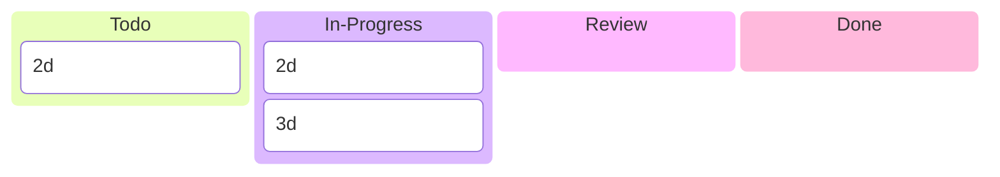
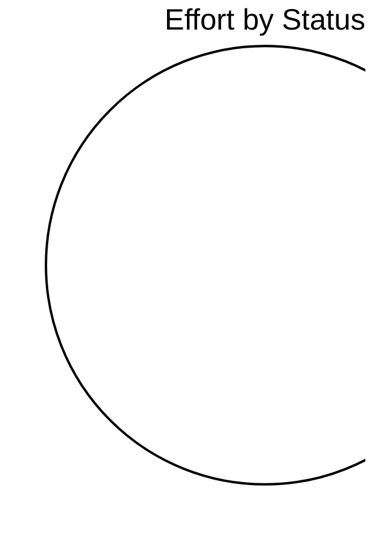

# R3GROUP

> R3GROUP Katty Fashion pilot – digital tools for co-creation, digital twins and technician capacity planning

## Status

| Metric | Value |
| :--- | :--- |
| Status | Active |
| Type | EU Project |
| PO | - |
| Lead | - |
| Current Sprint | S1 |
| Sprint Period | 2026-03-02 to 2026-03-13 |
| Tags | r3group, digital-twin, capacity-planner, manufacturing |
| Dependencies | [ai-rise]({{ '/projects/ai-rise/' | relative_url }}) |

## Current Sprint Kanban &nbsp; [Edit Kanban](https://github.com/katty-fashion/R3GROUP/edit/main/kanban.md)

<div class="status-legend"><span class="status-pill status-pill--todo">Todo</span>
<span class="status-pill status-pill--in-progress">In Progress</span>
<span class="status-pill status-pill--review">Review</span>
<span class="status-pill status-pill--done">Done</span></div>



## Task Summary

| Task | Assignee | Effort | Status |
| :--- | :--- | :--- | :--- |
| Pilon | Componentă | Status M36 | | :--- |
| WP1 — Infrastructură Digitală | Structură Product Digital Twin | ✅ Finalizat & integrat | | T2.1 — Co-creare Nuoform |
| ✅ Implementat & testat (2 clienți pilot) | | T3.2 — Digital Twins | Product DT | ✅ Finalizat |
| T3.2 — Digital Twins | Process DT (Tecnomatix) | ✅ Implementat & validat cu date istorice | | T2.4 — Capacity Planner |
| ✅ 100% finalizat | | T2.4 — Capacity Planner | KF Frontend UI | 🔄 Aproape finalizat |
| T2.4 — Capacity Planner | Integrare UI ↔ LMS | 🔄 În curs | | T3.3 — IoT Monitoring |
| 🧪 În testare | **KPI-uri țintă:** | Indicator | Țintă |
| Reducere timp reconfigurare | −35% | | Reducere lead time | −50% |
| Status | | :--- | :--- | :--- |
| 2026-03-02 | 2026-03-02 | Done | | Define system architecture (planner + digital twins) |
| 2d | 2026-03-03 | 2026-03-04 | In Progress |
| Setup project documentation (R3GROUP context) | @tech-lead | 1d | 2026-03-04 |
| In Progress | | Define technician task model and scheduling logic | @backend | 2d |
| 2026-03-06 | Done | | Implement backend service for technician capacity planner | @backend |
| 2026-03-06 | 2026-03-10 | Done | | Implement planner UI dashboard (calendar + workload view) |
| 3d | 2026-03-06 | 2026-03-10 | In Progress |
| Integrate planner with order and task data model | @backend | 2d | 2026-03-10 |
| In Progress | | Connect UI with backend API (LMS integration) | @frontend | 1.5d |
| 2026-03-12 | Todo | | Finalize AAS firmware integration (BLE box tracking) | @backend |
| 2026-03-11 | 2026-03-12 | Todo | | Connect IoT sensors to AAS platform |
| 2d | 2026-03-12 | 2026-03-13 | Todo |
| Sprint review and technical validation | @tech-lead | 0.5d | 2026-03-13 |
| Prioritate | Acțiune | Responsabil | | :--- |
| 🔴 High | Finalizare integrare firmware AAS (cutii producție BLE) | @backend | | 🟡 Med |
| @backend | | 🟢 Low | Trecere la demonstrație la scară largă TRL7 (M40, coordonat IPC) | @tech-lead |

## LOE Summary

| Metric | Value |
| :--- | :--- |
| Total Effort | 3.5d |
| In Progress | 0.0d |
| Completed | 0d |
| Remaining | 3.5d |

## Sprint Timeline

```mermaid
gantt
    title S1 — R3GROUP
    dateFormat YYYY-MM-DD
    excludes weekends

    2d :active, 2026-03-02, 1d
    3d :active, 2026-03-03, 1d
    2d :2026-03-04, 1d
    Pilon :2026-03-05, 1d
    WP1 — Infrastructură Digitală :2026-03-06, 1d
    ✅ Implementat & testat (2 clienți pilot) :2026-03-07, 1d
    T3.2 — Digital Twins :2026-03-08, 1d
    ✅ 100% finalizat :2026-03-09, 1d
    T2.4 — Capacity Planner :2026-03-10, 1d
    🧪 În testare :2026-03-11, 1d
    Reducere timp reconfigurare :2026-03-12, 1d
    Status :2026-03-13, 1d
    2026-03-02 :2026-03-14, 1d
    Setup project documentation (R3GROUP context) :2026-03-15, 1d
    In Progress :2026-03-16, 1d
    2026-03-06 :2026-03-17, 1d
    2026-03-06 :2026-03-18, 1d
    Integrate planner with order and task data model :2026-03-19, 2d
    In Progress :2026-03-21, 1d
    2026-03-12 :2026-03-22, 1d
    2026-03-11 :2026-03-23, 1d
    Sprint review and technical validation :2026-03-24, 0d
    Prioritate :2026-03-24, 1d
    🔴 High :2026-03-25, 1d
    @backend :2026-03-26, 1d
```

## Effort Distribution



## Links

- [Edit Kanban](https://github.com/katty-fashion/R3GROUP/edit/main/kanban.md)
- [Repository](https://github.com/katty-fashion/R3GROUP)
- [Kanban Board](https://github.com/katty-fashion/R3GROUP/blob/main/kanban.md)

---

*Auto-generated by KF Aggregator*