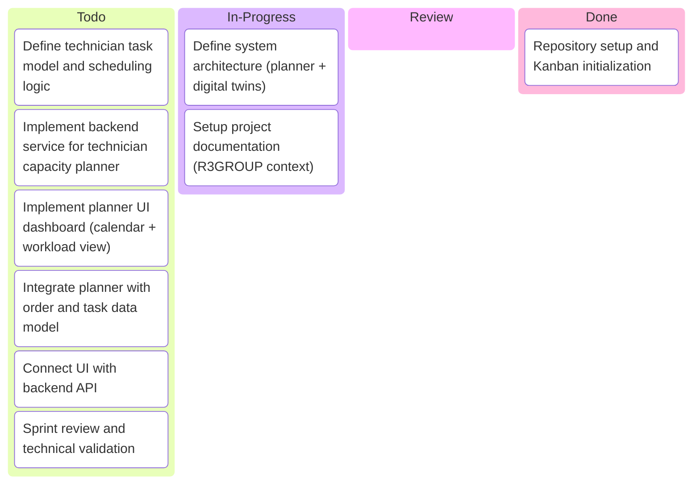
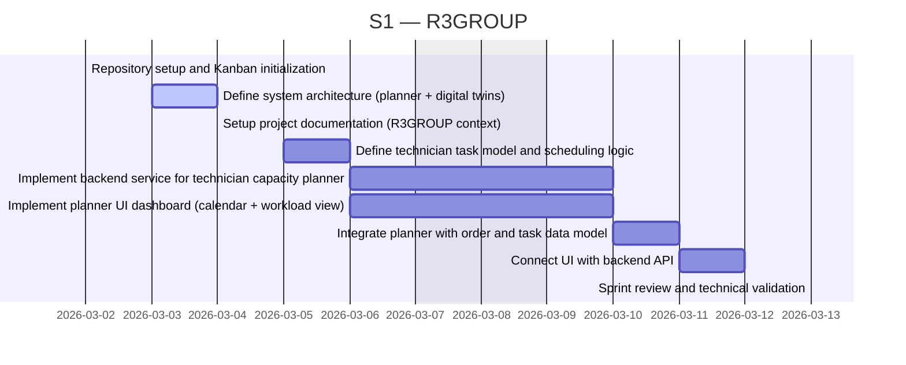
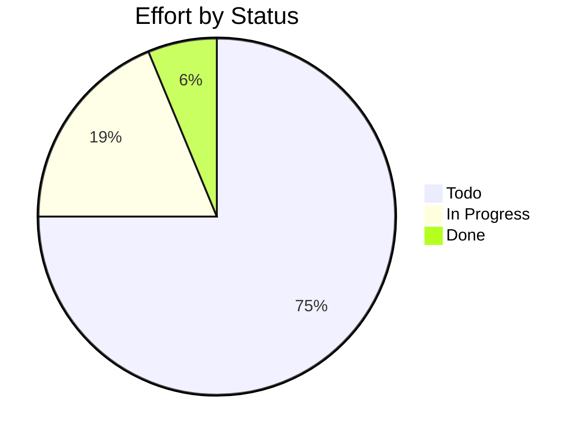

# R3GROUP

> R3GROUP Katty Fashion pilot – digital tools for co-creation, digital twins and technician capacity planning

## Status

| Metric | Value |
| :--- | :--- |
| Status | Active |
| Type | EU Project |
| PO | - |
| Lead | - |
| Current Sprint | S1 |
| Sprint Period | 2026-03-02 to 2026-03-13 |
| Tags | r3group, digital-twin, capacity-planner, manufacturing |
| Dependencies | [ai-rise]({{ '/projects/ai-rise/' | relative_url }}) |

## Current Sprint Kanban &nbsp; [Edit Kanban](https://github.com/katty-fashion/R3GROUP/edit/main/kanban.md)

Todo
In Progress
Review
Done

## Task Summary

| Task | Assignee | Effort | Start | End | Status |
| :--- | :--- | :--- | :--- | :--- | :--- |
| Repository setup and Kanban initialization | @tech-lead | 1d | 2026-03-02 | 2026-03-02 | Done |
| Define system architecture (planner + digital twins) | @tech-lead | 2d | 2026-03-03 | 2026-03-04 | In Progress |
| Setup project documentation (R3GROUP context) | @tech-lead | 1d | 2026-03-04 | 2026-03-04 | In Progress |
| Define technician task model and scheduling logic | @backend | 2d | 2026-03-05 | 2026-03-06 | Todo |
| Implement backend service for technician capacity planner | @backend | 3d | 2026-03-06 | 2026-03-10 | Todo |
| Implement planner UI dashboard (calendar + workload view) | @frontend | 3d | 2026-03-06 | 2026-03-10 | Todo |
| Integrate planner with order and task data model | @backend | 2d | 2026-03-10 | 2026-03-11 | Todo |
| Connect UI with backend API | @frontend | 1.5d | 2026-03-11 | 2026-03-12 | Todo |
| Sprint review and technical validation | @tech-lead | 0.5d | 2026-03-13 | 2026-03-13 | Todo |

## LOE Summary

| Metric | Value |
| :--- | :--- |
| Total Effort | 16.0d |
| In Progress | 3.0d |
| Completed | 1.0d |
| Remaining | 15.0d |

## Sprint Timeline

## Effort Distribution

## Links

- [Edit Kanban](https://github.com/katty-fashion/R3GROUP/edit/main/kanban.md)
- [Repository](https://github.com/katty-fashion/R3GROUP)
- [Kanban Board](https://github.com/katty-fashion/R3GROUP/blob/main/kanban.md)

---

*Auto-generated by KF Aggregator*