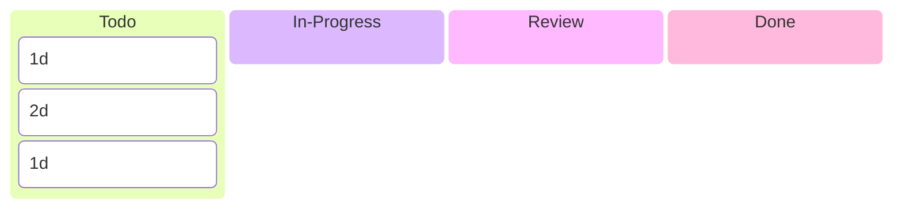
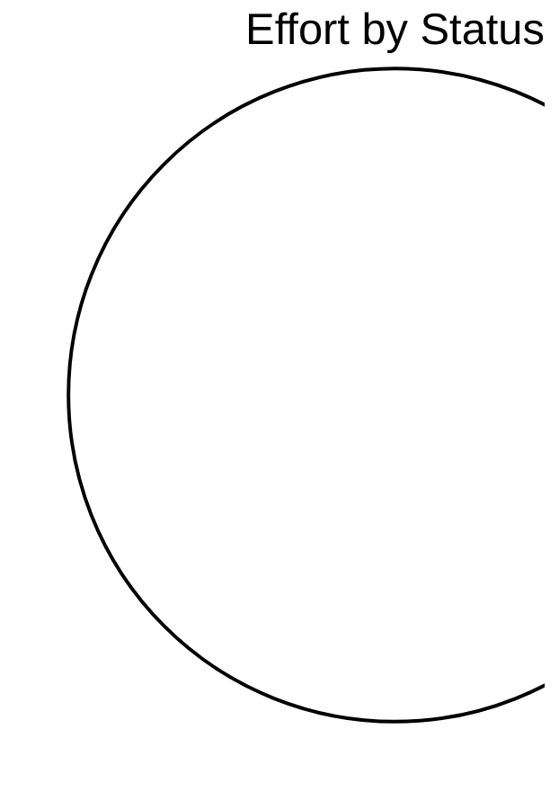

# R3GROUP

> R3GROUP Katty Fashion pilot – digital tools for co-creation, digital twins and technician capacity planning

## Status

| Metric | Value |
| :--- | :--- |
| Status | Active |
| Type | EU Project |
| PO | - |
| Lead | - |
| Current Sprint | S2 |
| Sprint Period | 2026-03-16 to 2026-04-03 |
| Tags | r3group, digital-twin, capacity-planner, manufacturing |
| Dependencies | [ai-rise]({{ '/projects/ai-rise/' | relative_url }}) |

## Current Sprint Kanban &nbsp; [Edit Kanban](https://github.com/katty-fashion/R3GROUP/edit/main/kanban.md)

<div class="status-legend"><span class="status-pill status-pill--todo">Todo</span>
<span class="status-pill status-pill--in-progress">In Progress</span>
<span class="status-pill status-pill--review">Review</span>
<span class="status-pill status-pill--done">Done</span></div>



## Task Summary

| Task | Assignee | Effort | Status |
| :--- | :--- | :--- | :--- |
| Pillar | Component | Status | |--- |
| --- | | WP1 — Digital Infrastructure | AAS platform integration | 90% |
| T2.1 — Co-creation platform | Nuoform platform | ✅ Completed | | T3.2 — Product Digital Twin |
| ✅ Completed | | T3.2 — Process Digital Twin | Tecnomatix simulation | ✅ Implemented & validated |
| T2.4 — Capacity Planner | LMS Scheduler Backend | ✅ Completed | | T2.4 — Capacity Planner |
| 🔄 Near completion | | T2.4 — Capacity Planner | KF ↔ LMS Integration | 🔄 In progress |
| T3.3 — IoT Monitoring | Sensors deployment | 🧪 Testing | | T2.3 — Supply Chain Digital Twin |
| KPI | Target | |--- | --- |
| Scrap reduction | −20% | | Reconfiguration time reduction | −35% |
| Production lead time reduction | −50% | | Pre-production waste reduction | −95% |
| Status | |--- | --- | --- |
| --- | --- | | Review LMS API endpoints and AAS structure | @tech-lead |
| 2026-03-16 | 2026-03-16 | Todo | | Technical architecture alignment for Planner integration |
| 1d | 2026-03-17 | 2026-03-17 | Todo |
| Define integration pipeline (KF UI → LMS Scheduler → KF UI) | @tech-lead | 1d | 2026-03-18 |
| Todo | | Implement automatic AAS JSON export from KF platform | @backend | 2d |
| 2026-03-18 | Todo | | Implement scheduling request endpoint (KF → LMS) | @backend |
| 2026-03-19 | 2026-03-21 | Todo | | Implement scheduler response parser |
| 2d | 2026-03-22 | 2026-03-24 | Todo |
| Integrate scheduling results with planner UI | @frontend | 3d | 2026-03-19 |
| Todo | | Implement planner visualization improvements (capacity / gaps) | @frontend | 2d |
| 2026-03-27 | Todo | | Validate suitability constraints and scheduling logic | @backend |
| 2026-03-26 | 2026-03-28 | Todo | | Run first scheduling tests with real production data |
| 1d | 2026-03-28 | 2026-03-28 | Todo |
| Debug integration issues with LMS team | @tech-lead | 1d | 2026-03-31 |
| Todo | | Integration validation review | @tech-lead | 0.5d |
| Priority | Action | Responsible | |--- |
| --- | | 🔴 High | Complete KF ↔ LMS scheduling integration | Backend + Frontend |
| 🔴 High | Validate scheduling algorithm with real production data | Tech Lead | | 🟡 Medium |
| Backend | | 🟡 Medium | Extend Process Digital Twin data exchange | Tech Lead |
| Milestone | Date | |--- | --- |
| Integration testing start | March 2026 | | Capacity planner integration | June 2026 (M42) |
| Pilot validation | Autumn 2026 | | Project completion | End 2026 |

## LOE Summary

| Metric | Value |
| :--- | :--- |
| Total Effort | 5.0d |
| In Progress | 0d |
| Completed | 0d |
| Remaining | 5.0d |

## Sprint Timeline

```mermaid
gantt
    title S2 — R3GROUP
    dateFormat YYYY-MM-DD
    excludes weekends

    1d :2026-03-16, 1d
    2d :2026-03-17, 1d
    1d :2026-03-18, 1d
    Pillar :2026-03-19, 1d
    --- :2026-03-20, 1d
    T2.1 — Co-creation platform :2026-03-21, 1d
    ✅ Completed :2026-03-22, 1d
    T2.4 — Capacity Planner :2026-03-23, 1d
    🔄 Near completion :2026-03-24, 1d
    T3.3 — IoT Monitoring :2026-03-25, 1d
    KPI :2026-03-26, 1d
    Scrap reduction :2026-03-27, 1d
    Production lead time reduction :2026-03-28, 1d
    Status :2026-03-29, 1d
    --- :2026-03-30, 1d
    2026-03-16 :2026-03-31, 1d
    Define integration pipeline (KF UI → LMS Scheduler → KF UI) :2026-04-01, 1d
    Todo :2026-04-02, 1d
    2026-03-18 :2026-04-03, 1d
    2026-03-19 :2026-04-04, 1d
    Integrate scheduling results with planner UI :2026-04-05, 3d
    Todo :2026-04-08, 1d
    2026-03-27 :2026-04-09, 1d
    2026-03-26 :2026-04-10, 1d
    Debug integration issues with LMS team :2026-04-11, 1d
    Todo :2026-04-12, 1d
    Priority :2026-04-13, 1d
    --- :2026-04-14, 1d
    🔴 High :2026-04-15, 1d
    Backend :2026-04-16, 1d
    Milestone :2026-04-17, 1d
    Integration testing start :2026-04-18, 1d
    Pilot validation :2026-04-19, 1d
```

## Effort Distribution



## Links

- [Edit Kanban](https://github.com/katty-fashion/R3GROUP/edit/main/kanban.md)
- [Repository](https://github.com/katty-fashion/R3GROUP)
- [Kanban Board](https://github.com/katty-fashion/R3GROUP/blob/main/kanban.md)

---

*Auto-generated by KF Aggregator*