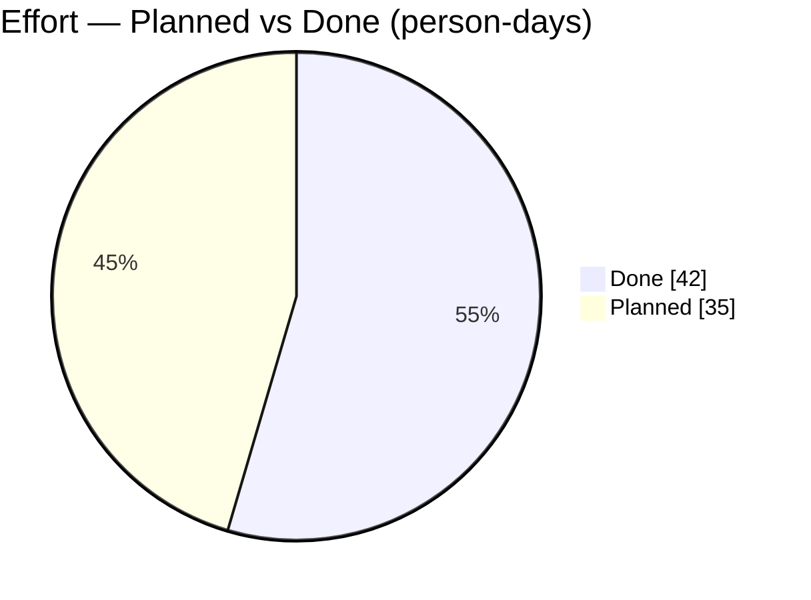
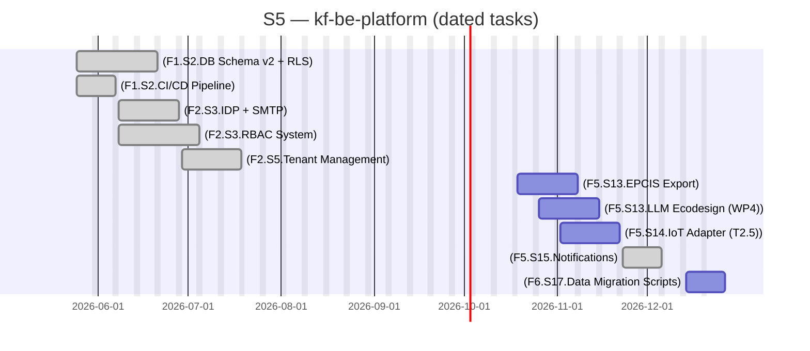

# kf-be-platform

> SaaS Product

## Status

| Metric | Value |
| :--- | :--- |
| Status | Active |
| Type | SaaS Product |
| PO | @ma.tech |
| Lead | @el.tech |
| Current Sprint | S5 |
| Sprint Period | 2026-06-29 to 2026-07-10 |
| Tags | circular-textiles, digital-platform, microfactory, dpp, manufacturing |
| Dependencies | [R3-AAS]({{ '/projects/r3-aas/' | relative_url }}) |

## Current Sprint Kanban &nbsp; [Edit Kanban]({{ '/kanban-builder/' | relative_url }}?project=kf-be-platform) ·&nbsp;[raw](https://github.com/katty-fashion/kf-be-platform/edit/main/kanban.md)

  

    
Todo 4

    
[F5.S13.EPCIS Export]

    
[F5.S13.LLM Ecodesign (WP4)]

    
[F5.S14.IoT Adapter (T2.5)]

    
[F6.S17.Data Migration Scripts]

  

  

    
In Progress 0

  

  

    
Review 0

  

  

    
Done 2

    
[F2.S3.RBAC System]

    
[F2.S5.Tenant Management]

  

## Task Summary

| Task | Assignee | Effort | Start | End | Status |
| :--- | :--- | :--- | :--- | :--- | :--- |
| [F1.S2.DB Schema v2 + RLS] | @ma.tech | 10d | 2026-05-25 | 2026-06-21 | Done |
| [F1.S2.CI/CD Pipeline] | @ma.tech | 2d | 2026-05-25 | 2026-06-07 | Done |
| [F2.S3.IDP + SMTP] | @ma.tech | 5d | 2026-06-08 | 2026-06-28 | Done |
| [F2.S3.RBAC System] | @ma.tech | 10d | 2026-06-08 | 2026-07-05 | Done |
| [F2.S5.Tenant Management] | @ma.tech | 10d | 2026-06-29 | 2026-07-19 | Done |
| [F5.S13.EPCIS Export] | @ma.tech | 10d | 2026-10-19 | 2026-11-08 | Todo |
| [F5.S13.LLM Ecodesign (WP4)] | @ma.tech | 10d | 2026-10-26 | 2026-11-15 | Todo |
| [F5.S14.IoT Adapter (T2.5)] | @ma.tech | 10d | 2026-11-02 | 2026-11-22 | Todo |
| [F5.S15.Notifications] | @ma.tech | 5d | 2026-11-23 | 2026-12-06 | Done |
| [F6.S17.Data Migration Scripts] | @ma.tech | 5d | 2026-12-14 | 2026-12-27 | Todo |

## LOE Summary

| Metric | Value |
| :--- | :--- |
| Total Effort | 77.0d |
| In Progress | 0d |
| Completed | 42.0d |
| Remaining | 35.0d |

## Effort — Planned vs Done

## Sprint Timeline

PlannedIn workLate / At riskDone

## Links

- [Edit Kanban]({{ '/kanban-builder/' | relative_url }}?project=kf-be-platform) ·&nbsp;[raw](https://github.com/katty-fashion/kf-be-platform/edit/main/kanban.md)
- [Repository](https://github.com/katty-fashion/kf-be-platform)
- [Kanban Board](https://github.com/katty-fashion/kf-be-platform/blob/main/kanban.md)

---

*Auto-generated by KF Aggregator*