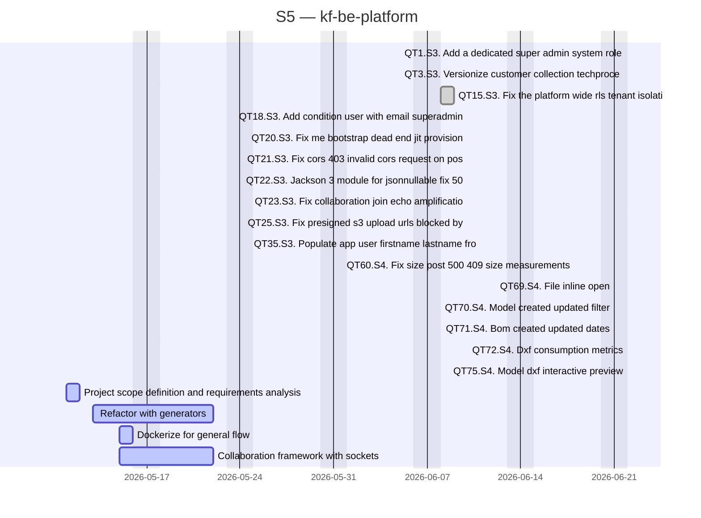

# kf-be-platform

> EU Project

## Status

| Metric | Value |
| :--- | :--- |
| Status | Active |
| Type | EU Project |
| PO | @ma.tech |
| Lead | @el.tech |
| Current Sprint | S5 |
| Sprint Period | 2026-06-29 to 2026-07-10 |
| Tags | eu-project, circular-textiles, digital-platform, microfactory, dpp, manufacturing |
| Dependencies | [nuoform]({{ '/projects/nuoform/' | relative_url }}) |

## Current Sprint Kanban &nbsp; [Edit Kanban]({{ '/kanban-builder/' | relative_url }}?project=kf-be-platform) ·&nbsp;[raw](https://github.com/katty-fashion/kf-be-platform/edit/main/kanban.md)

  

    
Todo 0

  

  

    
In Progress 4

    
Project scope definition and requirements analysis

    
Refactor with generators

    
Dockerize for general flow

    
Collaboration framework with sockets

  

  

    
Review 0

  

  

    
Done 16

    
QT1.S3. Add a dedicated super admin system role

    
QT3.S3. Versionize customer collection techproce

    
QT15.S3. Fix the platform wide rls tenant isolati

    
QT18.S3. Add condition user with email superadmin

    
QT20.S3. Fix me bootstrap dead end jit provision

    
QT21.S3. Fix cors 403 invalid cors request on pos

    
QT22.S3. Jackson 3 module for jsonnullable fix 50

    
QT23.S3. Fix collaboration join echo amplificatio

    
QT25.S3. Fix presigned s3 upload urls blocked by

    
QT35.S3. Populate app user firstname lastname fro

    
QT60.S4. Fix size post 500 409 size measurements

    
QT69.S4. File inline open

    
QT70.S4. Model created updated filter

    
QT71.S4. Bom created updated dates

    
QT72.S4. Dxf consumption metrics

    
QT75.S4. Model dxf interactive preview

  

## Task Summary

| Task | Assignee | Effort | Start | End | Status |
| :--- | :--- | :--- | :--- | :--- | :--- |
| Project scope definition and requirements analysis | @ma.tech | 2d | 2026-05-11 | 2026-05-12 | In Progress |
| Refactor with generators | @ma.tech | 8d | 2026-05-13 | 2026-05-22 | In Progress |
| Dockerize for general flow | @ma.tech | 1d | 2026-05-15 | 2026-05-16 | In Progress |
| Collaboration framework with sockets | @ma.tech | 5d | 2026-05-15 | 2026-05-22 | In Progress |
| QT1.S3. Add a dedicated super admin system role | @ma.tech | 1d | 2026-06-05 | 2026-06-05 | Done |
| QT3.S3. Versionize customer collection techproce | @ma.tech | 1d | 2026-06-05 | 2026-06-05 | Done |
| QT15.S3. Fix the platform wide rls tenant isolati | @ma.tech | 2d | 2026-06-08 | 2026-06-09 | Done |
| QT18.S3. Add condition user with email superadmin | @ma.tech | 1d | 2026-06-10 | 2026-06-10 | Done |
| QT20.S3. Fix me bootstrap dead end jit provision | @ma.tech | 1d | 2026-06-10 | 2026-06-10 | Done |
| QT21.S3. Fix cors 403 invalid cors request on pos | @ma.tech | 1d | 2026-06-10 | 2026-06-10 | Done |
| QT22.S3. Jackson 3 module for jsonnullable fix 50 | @ma.tech | 1d | 2026-06-10 | 2026-06-10 | Done |
| QT23.S3. Fix collaboration join echo amplificatio | @ma.tech | 1d | 2026-06-10 | 2026-06-10 | Done |
| QT25.S3. Fix presigned s3 upload urls blocked by | @ma.tech | 1d | 2026-06-10 | 2026-06-10 | Done |
| QT35.S3. Populate app user firstname lastname fro | @ma.tech | 1d | 2026-06-11 | 2026-06-11 | Done |
| QT60.S4. Fix size post 500 409 size measurements | @ma.tech | 1d | 2026-06-18 | 2026-06-18 | Done |
| QT69.S4. File inline open | @ma.tech | 1d | 2026-06-21 | 2026-06-21 | Done |
| QT70.S4. Model created updated filter | @ma.tech | 1d | 2026-06-21 | 2026-06-21 | Done |
| QT71.S4. Bom created updated dates | @ma.tech | 1d | 2026-06-21 | 2026-06-21 | Done |
| QT72.S4. Dxf consumption metrics | @ma.tech | 1d | 2026-06-22 | 2026-06-22 | Done |
| QT75.S4. Model dxf interactive preview | @ma.tech | 1d | 2026-06-22 | 2026-06-22 | Done |

## LOE Summary

| Metric | Value |
| :--- | :--- |
| Total Effort | 33.0d |
| In Progress | 16.0d |
| Completed | 17.0d |
| Remaining | 16.0d |

## Sprint Timeline

## Links

- [Edit Kanban]({{ '/kanban-builder/' | relative_url }}?project=kf-be-platform) ·&nbsp;[raw](https://github.com/katty-fashion/kf-be-platform/edit/main/kanban.md)
- [Repository](https://github.com/katty-fashion/kf-be-platform)
- [Kanban Board](https://github.com/katty-fashion/kf-be-platform/blob/main/kanban.md)

---

*Auto-generated by KF Aggregator*