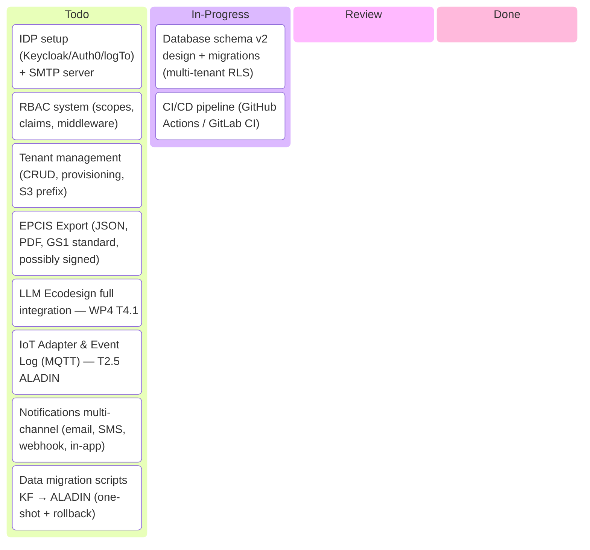
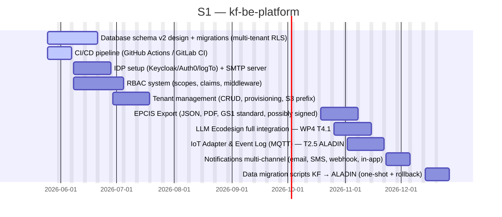
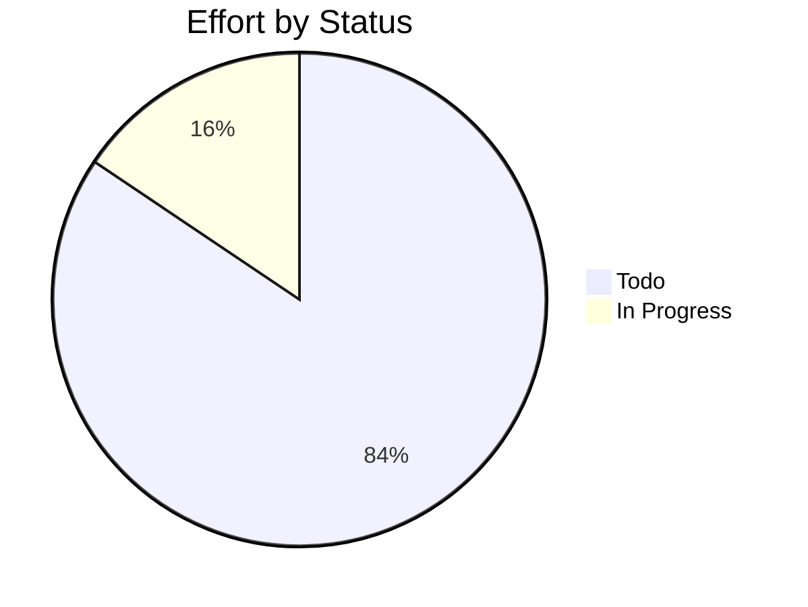

# kf-be-platform

> EU Project

## Status

| Metric | Value |
| :--- | :--- |
| Status | Active |
| Type | EU Project |
| PO | @ma.tech |
| Lead | @el.tech |
| Current Sprint | S1 |
| Sprint Period | 2026-05-11 to 2026-05-22 |
| Tags | eu-project, circular-textiles, digital-platform, microfactory, dpp, manufacturing |
| Dependencies | [nuoform]({{ '/projects/nuoform/' | relative_url }}) |

## Current Sprint Kanban &nbsp; [Edit Kanban](https://github.com/katty-fashion/kf-be-platform/edit/main/kanban.md)

Todo
In Progress
Review
Done

## Task Summary

| Task | Assignee | Effort | Start | End | Status |
| :--- | :--- | :--- | :--- | :--- | :--- |
| Database schema v2 design + migrations (multi-tenant RLS) | @ma.tech | 10d | 2026-05-25 | 2026-06-21 | In Progress |
| CI/CD pipeline (GitHub Actions / GitLab CI) | @ma.tech | 2d | 2026-05-25 | 2026-06-07 | In Progress |
| IDP setup (Keycloak/Auth0/logTo) + SMTP server | @ma.tech | 5d | 2026-06-08 | 2026-06-28 | Todo |
| RBAC system (scopes, claims, middleware) | @ma.tech | 10d | 2026-06-08 | 2026-07-05 | Todo |
| Tenant management (CRUD, provisioning, S3 prefix) | @ma.tech | 10d | 2026-06-29 | 2026-07-19 | Todo |
| EPCIS Export (JSON, PDF, GS1 standard, possibly signed) | @ma.tech | 10d | 2026-10-19 | 2026-11-08 | Todo |
| LLM Ecodesign full integration — WP4 T4.1 | @ma.tech | 10d | 2026-10-26 | 2026-11-15 | Todo |
| IoT Adapter & Event Log (MQTT) — T2.5 ALADIN | @ma.tech | 10d | 2026-11-02 | 2026-11-22 | Todo |
| Notifications multi-channel (email, SMS, webhook, in-app) | @ma.tech | 5d | 2026-11-23 | 2026-12-06 | Todo |
| Data migration scripts KF → ALADIN (one-shot + rollback) | @ma.tech | 5d | 2026-12-14 | 2026-12-27 | Todo |

## LOE Summary

| Metric | Value |
| :--- | :--- |
| Total Effort | 77.0d |
| In Progress | 12.0d |
| Completed | 0d |
| Remaining | 77.0d |

## Sprint Timeline

## Effort Distribution

## Links

- [Edit Kanban](https://github.com/katty-fashion/kf-be-platform/edit/main/kanban.md)
- [Repository](https://github.com/katty-fashion/kf-be-platform)
- [Kanban Board](https://github.com/katty-fashion/kf-be-platform/blob/main/kanban.md)

---

*Auto-generated by KF Aggregator*