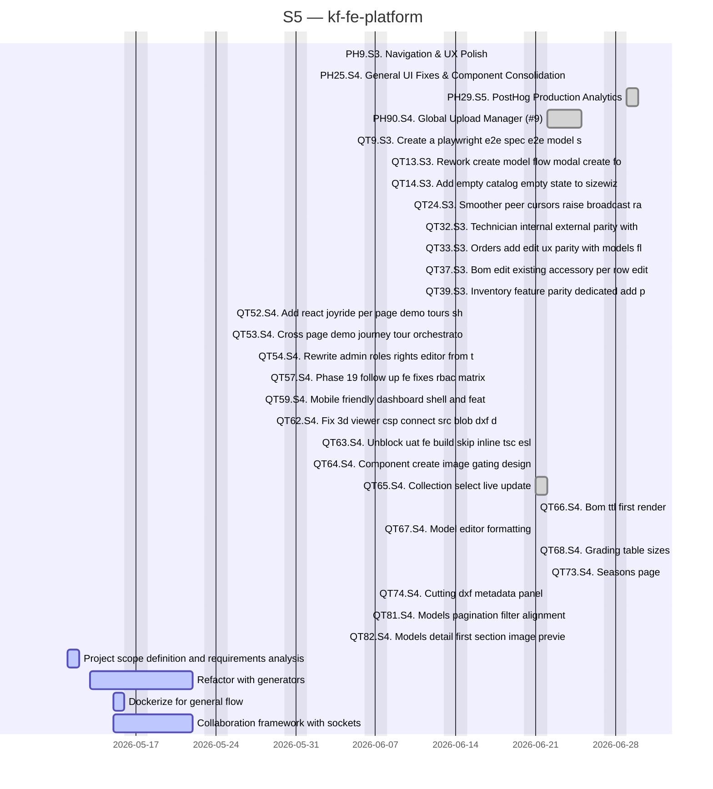

# kf-fe-platform

> EU Project

## Status

| Metric | Value |
| :--- | :--- |
| Status | Active |
| Type | EU Project |
| PO | @ma.tech |
| Lead | @el.tech |
| Current Sprint | S5 |
| Sprint Period | 2026-06-29 to 2026-07-10 |
| Tags | eu-project, circular-textiles, digital-platform, microfactory, dpp, manufacturing |
| Dependencies | [nuoform]({{ '/projects/nuoform/' | relative_url }}) |

## Current Sprint Kanban &nbsp; [Edit Kanban]({{ '/kanban-builder/' | relative_url }}?project=kf-fe-platform) ·&nbsp;[raw](https://github.com/katty-fashion/kf-fe-platform/edit/main/kanban.md)

  

    
Todo 0

  

  

    
In Progress 4

    
Project scope definition and requirements analysis

    
Refactor with generators

    
Dockerize for general flow

    
Collaboration framework with sockets

  

  

    
Review 0

  

  

    
Done 28

    
PH9.S3. Navigation &amp; UX Polish

    
PH25.S4. General UI Fixes &amp; Component Consolidation

    
PH29.S5. PostHog Production Analytics

    
PH90.S4. Global Upload Manager (#9)

    
QT9.S3. Create a playwright e2e spec e2e model s

    
QT13.S3. Rework create model flow modal create fo

    
QT14.S3. Add empty catalog empty state to sizewiz

    
QT24.S3. Smoother peer cursors raise broadcast ra

    
QT32.S3. Technician internal external parity with

    
QT33.S3. Orders add edit ux parity with models fl

    
QT37.S3. Bom edit existing accessory per row edit

    
QT39.S3. Inventory feature parity dedicated add p

    
QT52.S4. Add react joyride per page demo tours sh

    
QT53.S4. Cross page demo journey tour orchestrato

    
QT54.S4. Rewrite admin roles rights editor from t

    
QT57.S4. Phase 19 follow up fe fixes rbac matrix

    
QT59.S4. Mobile friendly dashboard shell and feat

    
QT62.S4. Fix 3d viewer csp connect src blob dxf d

    
QT63.S4. Unblock uat fe build skip inline tsc esl

    
QT64.S4. Component create image gating design

    
QT65.S4. Collection select live update

    
QT66.S4. Bom ttl first render

    
QT67.S4. Model editor formatting

    
QT68.S4. Grading table sizes

    
QT73.S4. Seasons page

    
QT74.S4. Cutting dxf metadata panel

    
QT81.S4. Models pagination filter alignment

    
QT82.S4. Models detail first section image previe

  

## Task Summary

| Task | Assignee | Effort | Start | End | Status |
| :--- | :--- | :--- | :--- | :--- | :--- |
| Project scope definition and requirements analysis | @ma.tech | 2d | 2026-05-11 | 2026-05-12 | In Progress |
| Refactor with generators | @ma.tech, @alexandru.bejenari | 8d | 2026-05-13 | 2026-05-22 | In Progress |
| Dockerize for general flow | @ma.tech | 1d | 2026-05-15 | 2026-05-16 | In Progress |
| Collaboration framework with sockets | @ma.tech, @alexandru.bejenari | 5d | 2026-05-15 | 2026-05-22 | In Progress |
| PH9.S3. Navigation &amp; UX Polish | @alexandru.bejenari | 1d | 2026-06-04 | 2026-06-04 | Done |
| PH25.S4. General UI Fixes &amp; Component Consolidation | @alexandru.bejenari | 1d | 2026-06-24 | 2026-06-24 | Done |
| PH29.S5. PostHog Production Analytics | @alexandru.bejenari | 2d | 2026-06-29 | 2026-06-30 | Done |
| PH90.S4. Global Upload Manager (#9) | @alexandru.bejenari | 4d | 2026-06-22 | 2026-06-25 | Done |
| QT9.S3. Create a playwright e2e spec e2e model s | @alexandru.bejenari | 1d | 2026-06-05 | 2026-06-05 | Done |
| QT13.S3. Rework create model flow modal create fo | @alexandru.bejenari | 1d | 2026-06-08 | 2026-06-08 | Done |
| QT14.S3. Add empty catalog empty state to sizewiz | @alexandru.bejenari | 1d | 2026-06-08 | 2026-06-08 | Done |
| QT24.S3. Smoother peer cursors raise broadcast ra | @alexandru.bejenari | 1d | 2026-06-10 | 2026-06-10 | Done |
| QT32.S3. Technician internal external parity with | @alexandru.bejenari | 1d | 2026-06-11 | 2026-06-11 | Done |
| QT33.S3. Orders add edit ux parity with models fl | @alexandru.bejenari | 1d | 2026-06-11 | 2026-06-11 | Done |
| QT37.S3. Bom edit existing accessory per row edit | @alexandru.bejenari | 1d | 2026-06-11 | 2026-06-11 | Done |
| QT39.S3. Inventory feature parity dedicated add p | @alexandru.bejenari | 1d | 2026-06-11 | 2026-06-11 | Done |
| QT52.S4. Add react joyride per page demo tours sh | @alexandru.bejenari | 1d | 2026-06-15 | 2026-06-15 | Done |
| QT53.S4. Cross page demo journey tour orchestrato | @alexandru.bejenari | 1d | 2026-06-15 | 2026-06-15 | Done |
| QT54.S4. Rewrite admin roles rights editor from t | @alexandru.bejenari | 1d | 2026-06-16 | 2026-06-16 | Done |
| QT57.S4. Phase 19 follow up fe fixes rbac matrix | @alexandru.bejenari | 1d | 2026-06-17 | 2026-06-17 | Done |
| QT59.S4. Mobile friendly dashboard shell and feat | @alexandru.bejenari | 1d | 2026-06-17 | 2026-06-17 | Done |
| QT62.S4. Fix 3d viewer csp connect src blob dxf d | @alexandru.bejenari | 1d | 2026-06-18 | 2026-06-18 | Done |
| QT63.S4. Unblock uat fe build skip inline tsc esl | @alexandru.bejenari | 1d | 2026-06-21 | 2026-06-21 | Done |
| QT64.S4. Component create image gating design | @alexandru.bejenari | 1d | 2026-06-21 | 2026-06-21 | Done |
| QT65.S4. Collection select live update | @alexandru.bejenari | 1d | 2026-06-21 | 2026-06-22 | Done |
| QT66.S4. Bom ttl first render | @alexandru.bejenari | 1d | 2026-06-21 | 2026-06-21 | Done |
| QT67.S4. Model editor formatting | @alexandru.bejenari | 1d | 2026-06-21 | 2026-06-21 | Done |
| QT68.S4. Grading table sizes | @alexandru.bejenari | 1d | 2026-06-21 | 2026-06-21 | Done |
| QT73.S4. Seasons page | @alexandru.bejenari | 1d | 2026-06-22 | 2026-06-22 | Done |
| QT74.S4. Cutting dxf metadata panel | @alexandru.bejenari | 1d | 2026-06-22 | 2026-06-22 | Done |
| QT81.S4. Models pagination filter alignment | @alexandru.bejenari | 1d | 2026-06-24 | 2026-06-24 | Done |
| QT82.S4. Models detail first section image previe | @alexandru.bejenari | 1d | 2026-06-24 | 2026-06-24 | Done |

## LOE Summary

| Metric | Value |
| :--- | :--- |
| Total Effort | 48.0d |
| In Progress | 16.0d |
| Completed | 32.0d |
| Remaining | 16.0d |

## Sprint Timeline

## Links

- [Edit Kanban]({{ '/kanban-builder/' | relative_url }}?project=kf-fe-platform) ·&nbsp;[raw](https://github.com/katty-fashion/kf-fe-platform/edit/main/kanban.md)
- [Repository](https://github.com/katty-fashion/kf-fe-platform)
- [Kanban Board](https://github.com/katty-fashion/kf-fe-platform/blob/main/kanban.md)

---

*Auto-generated by KF Aggregator*