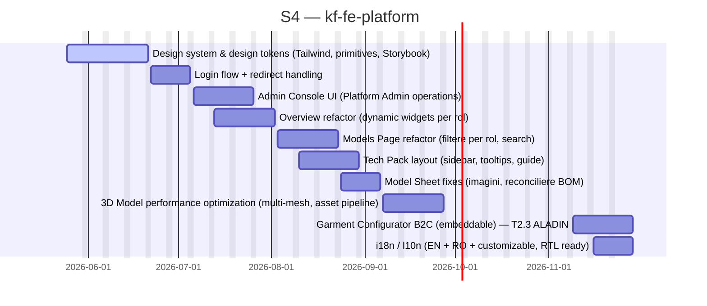

# kf-fe-platform

> EU Project

## Status

| Metric | Value |
| :--- | :--- |
| Status | Active |
| Type | EU Project |
| PO | @ma.tech |
| Lead | @el.tech |
| Current Sprint | S4 |
| Sprint Period | 2026-06-15 to 2026-06-26 |
| Tags | eu-project, circular-textiles, digital-platform, microfactory, dpp, manufacturing |
| Dependencies | [kf-platform]({{ '/projects/kf-platform/' | relative_url }}) |

## Current Sprint Kanban &nbsp; [Edit Kanban]({{ '/kanban-builder/' | relative_url }}?project=kf-fe-platform) ·&nbsp;[raw](https://github.com/katty-fashion/kf-fe-platform/edit/main/kanban.md)

  

    
Todo 9

    
Login flow + redirect handling

    
Admin Console UI (Platform Admin operations)

    
Overview refactor (dynamic widgets per rol)

    
Models Page refactor (filtere per rol, search)

    
Tech Pack layout (sidebar, tooltips, guide)

    
Model Sheet fixes (imagini, reconciliere BOM)

    
3D Model performance optimization (multi-mesh, asset pipeline)

    
Garment Configurator B2C (embeddable) — T2.3 ALADIN

    
i18n / l10n (EN + RO + customizable, RTL ready)

  

  

    
In Progress 1

    
Design system &amp; design tokens (Tailwind, primitives, Storybook)

  

  

    
Review 0

  

  

    
Done 0

  

## Task Summary

| Task | Assignee | Effort | Start | End | Status |
| :--- | :--- | :--- | :--- | :--- | :--- |
| Design system &amp; design tokens (Tailwind, primitives, Storybook) | @alexandru.bejenari | 10d | 2026-05-25 | 2026-06-21 | In Progress |
| Login flow + redirect handling | @alexandru.bejenari | 5d | 2026-06-22 | 2026-07-05 | Todo |
| Admin Console UI (Platform Admin operations) | @alexandru.bejenari | 10d | 2026-07-06 | 2026-07-26 | Todo |
| Overview refactor (dynamic widgets per rol) | @alexandru.bejenari | 5d | 2026-07-13 | 2026-08-02 | Todo |
| Models Page refactor (filtere per rol, search) | @alexandru.bejenari | 5d | 2026-08-03 | 2026-08-23 | Todo |
| Tech Pack layout (sidebar, tooltips, guide) | @alexandru.bejenari | 5d | 2026-08-10 | 2026-08-30 | Todo |
| Model Sheet fixes (imagini, reconciliere BOM) | @alexandru.bejenari | 2d | 2026-08-24 | 2026-09-06 | Todo |
| 3D Model performance optimization (multi-mesh, asset pipeline) | @alexandru.bejenari | 5d | 2026-09-07 | 2026-09-27 | Todo |
| Garment Configurator B2C (embeddable) — T2.3 ALADIN | @alexandru.bejenari | 10d | 2026-11-09 | 2026-11-29 | Todo |
| i18n / l10n (EN + RO + customizable, RTL ready) | @alexandru.bejenari | 5d | 2026-11-16 | 2026-11-29 | Todo |

## LOE Summary

| Metric | Value |
| :--- | :--- |
| Total Effort | 62.0d |
| In Progress | 10.0d |
| Completed | 0d |
| Remaining | 62.0d |

## Sprint Timeline

## Links

- [Edit Kanban]({{ '/kanban-builder/' | relative_url }}?project=kf-fe-platform) ·&nbsp;[raw](https://github.com/katty-fashion/kf-fe-platform/edit/main/kanban.md)
- [Repository](https://github.com/katty-fashion/kf-fe-platform)
- [Kanban Board](https://github.com/katty-fashion/kf-fe-platform/blob/main/kanban.md)

---

*Auto-generated by KF Aggregator*