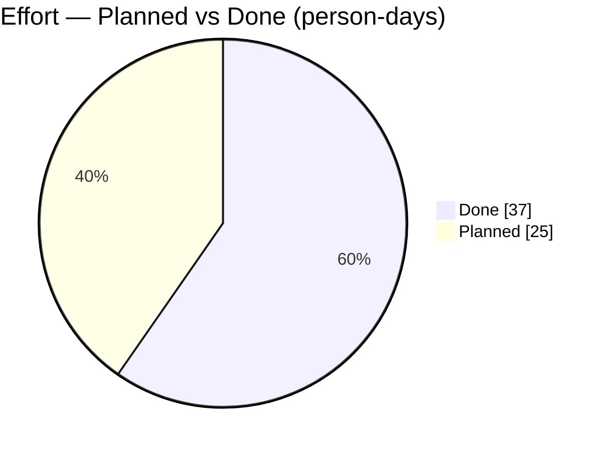
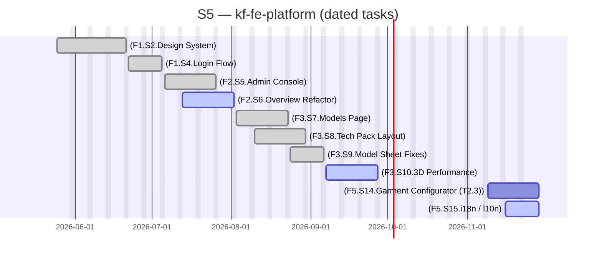

# kf-fe-platform

> EU Project

## Status

| Metric | Value |
| :--- | :--- |
| Status | Active |
| Type | EU Project |
| PO | @ma.tech |
| Lead | @el.tech |
| Current Sprint | S5 |
| Sprint Period | 2026-06-29 to 2026-07-10 |
| Tags | eu-project, circular-textiles, digital-platform, microfactory, dpp, manufacturing |
| Dependencies | [nuoform]({{ '/projects/nuoform/' | relative_url }}) |

## Current Sprint Kanban &nbsp; [Edit Kanban]({{ '/kanban-builder/' | relative_url }}?project=kf-fe-platform) ·&nbsp;[raw](https://github.com/katty-fashion/kf-fe-platform/edit/main/kanban.md)

  

    
Todo 1

    
[F5.S14.Garment Configurator (T2.3)]

  

  

    
In Progress 3

    
[F2.S6.Overview Refactor]

    
[F3.S10.3D Performance]

    
[F5.S15.i18n / l10n]

  

  

    
Review 0

  

  

    
Done 6

    
[F1.S2.Design System]

    
[F1.S4.Login Flow]

    
[F2.S5.Admin Console]

    
[F3.S7.Models Page]

    
[F3.S8.Tech Pack Layout]

    
[F3.S9.Model Sheet Fixes]

  

## Task Summary

| Task | Assignee | Effort | Start | End | Status |
| :--- | :--- | :--- | :--- | :--- | :--- |
| [F1.S2.Design System] | @alexandru.bejenari | 10d | 2026-05-25 | 2026-06-21 | Done |
| [F1.S4.Login Flow] | @alexandru.bejenari | 5d | 2026-06-22 | 2026-07-05 | Done |
| [F2.S5.Admin Console] | @alexandru.bejenari | 10d | 2026-07-06 | 2026-07-26 | Done |
| [F2.S6.Overview Refactor] | @alexandru.bejenari | 5d | 2026-07-13 | 2026-08-02 | In Progress |
| [F3.S7.Models Page] | @alexandru.bejenari | 5d | 2026-08-03 | 2026-08-23 | Done |
| [F3.S8.Tech Pack Layout] | @alexandru.bejenari | 5d | 2026-08-10 | 2026-08-30 | Done |
| [F3.S9.Model Sheet Fixes] | @alexandru.bejenari | 2d | 2026-08-24 | 2026-09-06 | Done |
| [F3.S10.3D Performance] | @alexandru.bejenari | 5d | 2026-09-07 | 2026-09-27 | In Progress |
| [F5.S14.Garment Configurator (T2.3)] | @alexandru.bejenari | 10d | 2026-11-09 | 2026-11-29 | Todo |
| [F5.S15.i18n / l10n] | @alexandru.bejenari | 5d | 2026-11-16 | 2026-11-29 | In Progress |

## LOE Summary

| Metric | Value |
| :--- | :--- |
| Total Effort | 62.0d |
| In Progress | 15.0d |
| Completed | 37.0d |
| Remaining | 25.0d |

## Effort — Planned vs Done

## Sprint Timeline

PlannedIn workLate / At riskDone

## Links

- [Edit Kanban]({{ '/kanban-builder/' | relative_url }}?project=kf-fe-platform) ·&nbsp;[raw](https://github.com/katty-fashion/kf-fe-platform/edit/main/kanban.md)
- [Repository](https://github.com/katty-fashion/kf-fe-platform)
- [Kanban Board](https://github.com/katty-fashion/kf-fe-platform/blob/main/kanban.md)

---

*Auto-generated by KF Aggregator*