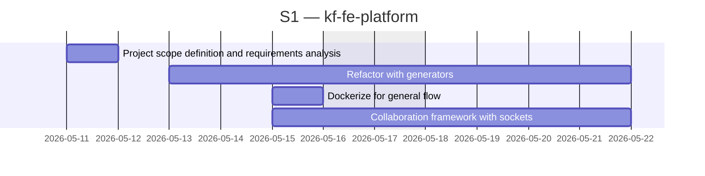
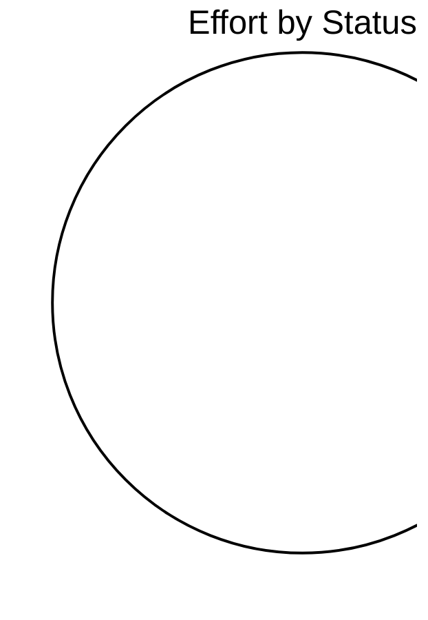

# kf-fe-platform

> EU Project

## Status

| Metric | Value |
| :--- | :--- |
| Status | Active |
| Type | EU Project |
| PO | @ma.tech |
| Lead | @el.tech |
| Current Sprint | S1 |
| Sprint Period | 2026-05-11 to 2026-05-22 |
| Tags | eu-project, circular-textiles, digital-platform, microfactory, dpp, manufacturing |
| Dependencies | [nuoform]({{ '/projects/nuoform/' | relative_url }}) |

## Current Sprint Kanban &nbsp; [Edit Kanban](https://github.com/katty-fashion/kf-fe-platform/edit/main/kanban.md)

Todo
In Progress
Review
Done

## Task Summary

| Task | Assignee | Effort | Start | End | Status |
| :--- | :--- | :--- | :--- | :--- | :--- |
| Project scope definition and requirements analysis | @ma.tech | 2d | 2026-05-11 | 2026-05-12 | In progress |
| Refactor with generators | @ma.tech, @alexandru.bejenari | 8d | 2026-05-13 | 2026-05-22 | In progress |
| Dockerize for general flow | @ma.tech | 1d | 2026-05-15 | 2026-05-16 | In progress |
| Collaboration framework with sockets | @ma.tech, @alexandru.bejenari | 5d | 2026-05-15 | 2026-05-22 | In progress |

## LOE Summary

| Metric | Value |
| :--- | :--- |
| Total Effort | 16.0d |
| In Progress | 0d |
| Completed | 0d |
| Remaining | 16.0d |

## Sprint Timeline

## Effort Distribution

## Links

- [Edit Kanban](https://github.com/katty-fashion/kf-fe-platform/edit/main/kanban.md)
- [Repository](https://github.com/katty-fashion/kf-fe-platform)
- [Kanban Board](https://github.com/katty-fashion/kf-fe-platform/blob/main/kanban.md)

---

*Auto-generated by KF Aggregator*