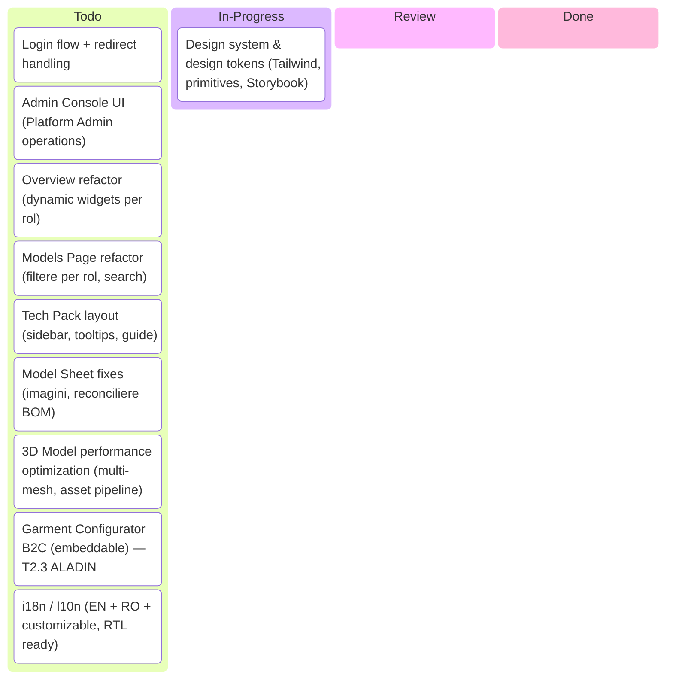
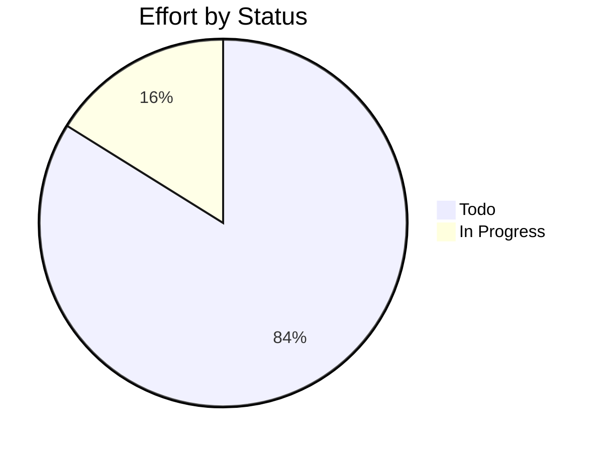

# kf-fe-platform

> EU Project

## Status

| Metric | Value |
| :--- | :--- |
| Status | Active |
| Type | EU Project |
| PO | @ma.tech |
| Lead | @el.tech |
| Current Sprint | S1 |
| Sprint Period | 2026-05-11 to 2026-05-22 |
| Tags | eu-project, circular-textiles, digital-platform, microfactory, dpp, manufacturing |
| Dependencies | [nuoform]({{ '/projects/nuoform/' | relative_url }}) |

## Current Sprint Kanban &nbsp; [Edit Kanban](https://github.com/katty-fashion/kf-fe-platform/edit/main/kanban.md)

Todo
In Progress
Review
Done

## Task Summary

| Task | Assignee | Effort | Start | End | Status |
| :--- | :--- | :--- | :--- | :--- | :--- |
| Design system & design tokens (Tailwind, primitives, Storybook) | @alexandru.bejenari | 10d | 2026-05-25 | 2026-06-21 | In Progress |
| Login flow + redirect handling | @alexandru.bejenari | 5d | 2026-06-22 | 2026-07-05 | Todo |
| Admin Console UI (Platform Admin operations) | @alexandru.bejenari | 10d | 2026-07-06 | 2026-07-26 | Todo |
| Overview refactor (dynamic widgets per rol) | @alexandru.bejenari | 5d | 2026-07-13 | 2026-08-02 | Todo |
| Models Page refactor (filtere per rol, search) | @alexandru.bejenari | 5d | 2026-08-03 | 2026-08-23 | Todo |
| Tech Pack layout (sidebar, tooltips, guide) | @alexandru.bejenari | 5d | 2026-08-10 | 2026-08-30 | Todo |
| Model Sheet fixes (imagini, reconciliere BOM) | @alexandru.bejenari | 2d | 2026-08-24 | 2026-09-06 | Todo |
| 3D Model performance optimization (multi-mesh, asset pipeline) | @alexandru.bejenari | 5d | 2026-09-07 | 2026-09-27 | Todo |
| Garment Configurator B2C (embeddable) — T2.3 ALADIN | @alexandru.bejenari | 10d | 2026-11-09 | 2026-11-29 | Todo |
| i18n / l10n (EN + RO + customizable, RTL ready) | @alexandru.bejenari | 5d | 2026-11-16 | 2026-11-29 | Todo |

## LOE Summary

| Metric | Value |
| :--- | :--- |
| Total Effort | 62.0d |
| In Progress | 10.0d |
| Completed | 0d |
| Remaining | 62.0d |

## Sprint Timeline

## Effort Distribution

## Links

- [Edit Kanban](https://github.com/katty-fashion/kf-fe-platform/edit/main/kanban.md)
- [Repository](https://github.com/katty-fashion/kf-fe-platform)
- [Kanban Board](https://github.com/katty-fashion/kf-fe-platform/blob/main/kanban.md)

---

*Auto-generated by KF Aggregator*