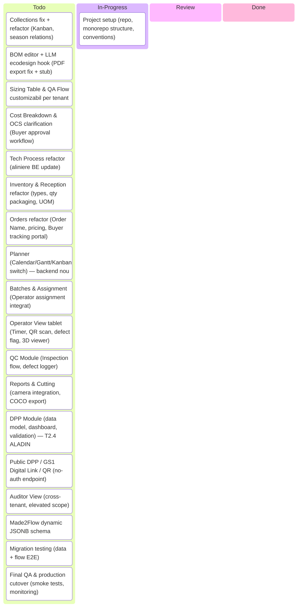
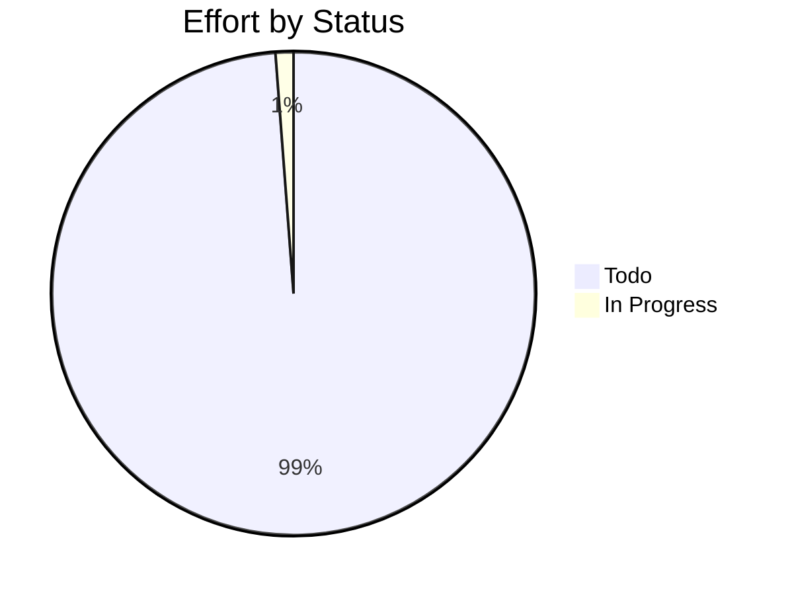

# kf-platform

> Infra platform for kf web based services

## Status

| Metric | Value |
| :--- | :--- |
| Status | Active |
| Type | EU Project |
| PO | @ps.tech |
| Lead | @el.tech |
| Current Sprint | S3 |
| Sprint Period | 2026-06-01 to 2026-06-12 |
| Tags | eu-project, circular-textiles, digital-platform, microfactory, dpp, manufacturing |
| Dependencies | [nuoform]({{ '/projects/nuoform/' | relative_url }}) |

## Current Sprint Kanban &nbsp; [Edit Kanban]({{ '/kanban-builder/' | relative_url }}?project=kf-platform) ·&nbsp;[raw](https://github.com/katty-fashion/kf-platform/edit/master/kanban.md)

Todo
In Progress
Review
Done

## Task Summary

| Task | Assignee | Effort | Start | End | Status |
| :--- | :--- | :--- | :--- | :--- | :--- |
| Project setup (repo, monorepo structure, conventions) | @alexandru.bejenari + @ma.tech | 2d | 2026-05-25 | 2026-06-07 | In Progress |
| Collections fix + refactor (Kanban, season relations) | @alexandru.bejenari + @ma.tech | 10d | 2026-07-20 | 2026-08-16 | Todo |
| BOM editor + LLM ecodesign hook (PDF export fix + stub) | @alexandru.bejenari + @ma.tech | 10d | 2026-08-17 | 2026-09-13 | Todo |
| Sizing Table & QA Flow customizabil per tenant | @alexandru.bejenari + @ma.tech | 5d | 2026-08-31 | 2026-09-20 | Todo |
| Cost Breakdown & OCS clarification (Buyer approval workflow) | @alexandru.bejenari + @ma.tech | 5d | 2026-09-14 | 2026-10-04 | Todo |
| Tech Process refactor (aliniere BE update) | @alexandru.bejenari + @ma.tech | 5d | 2026-09-21 | 2026-10-11 | Todo |
| Inventory & Reception refactor (types, qty packaging, UOM) | @alexandru.bejenari + @ma.tech | 5d | 2026-09-28 | 2026-10-18 | Todo |
| Orders refactor (Order Name, pricing, Buyer tracking portal) | @alexandru.bejenari + @ma.tech | 10d | 2026-08-24 | 2026-09-20 | Todo |
| Planner (Calendar/Gantt/Kanban switch) — backend nou | @alexandru.bejenari + @ma.tech | 20d | 2026-09-07 | 2026-10-11 | Todo |
| Batches & Assignment (Operator assignment integrat) | @alexandru.bejenari + @ma.tech | 10d | 2026-09-21 | 2026-10-18 | Todo |
| Operator View tablet (Timer, QR scan, defect flag, 3D viewer) | @alexandru.bejenari + @ma.tech | 20d | 2026-09-28 | 2026-10-25 | Todo |
| QC Module (Inspection flow, defect logger) | @alexandru.bejenari + @ma.tech | 10d | 2026-10-05 | 2026-10-25 | Todo |
| Reports & Cutting (camera integration, COCO export) | @alexandru.bejenari + @ma.tech | 5d | 2026-10-12 | 2026-10-25 | Todo |
| DPP Module (data model, dashboard, validation) — T2.4 ALADIN | @alexandru.bejenari + @ma.tech | 20d | 2026-09-21 | 2026-10-25 | Todo |
| Public DPP / GS1 Digital Link / QR (no-auth endpoint) | @alexandru.bejenari + @ma.tech | 10d | 2026-10-12 | 2026-11-01 | Todo |
| Auditor View (cross-tenant, elevated scope) | @alexandru.bejenari + @ma.tech | 5d | 2026-11-16 | 2026-11-29 | Todo |
| Made2Flow dynamic JSONB schema | @alexandru.bejenari + @ma.tech | 5d | 2026-11-30 | 2026-12-13 | Todo |
| Migration testing (data + flow E2E) | @alexandru.bejenari + @ma.tech | 5d | 2026-12-07 | 2026-12-20 | Todo |
| Final QA & production cutover (smoke tests, monitoring) | @alexandru.bejenari + @ma.tech | 5d | 2026-12-21 | 2027-01-03 | Todo |

## LOE Summary

| Metric | Value |
| :--- | :--- |
| Total Effort | 167.0d |
| In Progress | 2.0d |
| Completed | 0d |
| Remaining | 167.0d |

## Sprint Timeline

## Effort Distribution

## Links

- [Edit Kanban]({{ '/kanban-builder/' | relative_url }}?project=kf-platform) ·&nbsp;[raw](https://github.com/katty-fashion/kf-platform/edit/master/kanban.md)
- [Repository](https://github.com/katty-fashion/kf-platform)
- [Kanban Board](https://github.com/katty-fashion/kf-platform/blob/master/kanban.md)

---

*Auto-generated by KF Aggregator*