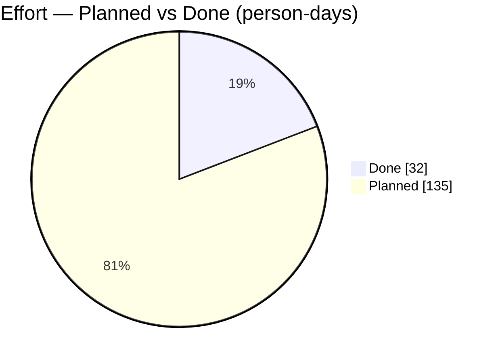
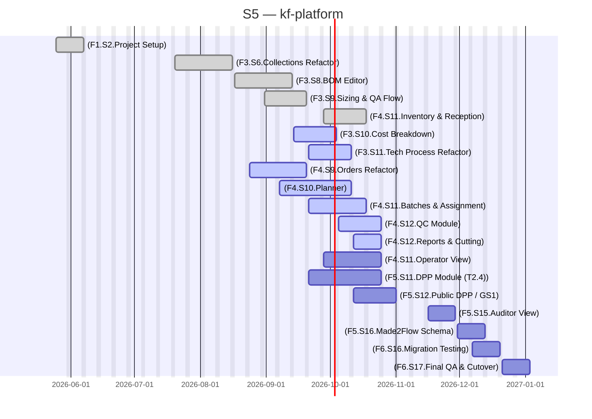

# kf-platform

> Infra platform for kf web based services

## Status

| Metric | Value |
| :--- | :--- |
| Status | Active |
| Type | EU Project |
| PO | @ps.tech |
| Lead | @el.tech |
| Current Sprint | S5 |
| Sprint Period | 2026-06-29 to 2026-07-10 |
| Tags | eu-project, circular-textiles, digital-platform, microfactory, dpp, manufacturing |
| Dependencies | [nuoform]({{ '/projects/nuoform/' | relative_url }}) |

## Current Sprint Kanban &nbsp; [Edit Kanban]({{ '/kanban-builder/' | relative_url }}?project=kf-platform) ·&nbsp;[raw](https://github.com/katty-fashion/kf-platform/edit/master/kanban.md)

  

    
Todo 7

    
[F4.S11.Operator View]

    
[F5.S11.DPP Module (T2.4)]

    
[F5.S12.Public DPP / GS1]

    
[F5.S15.Auditor View]

    
[F5.S16.Made2Flow Schema]

    
[F6.S16.Migration Testing]

    
[F6.S17.Final QA &amp; Cutover]

  

  

    
In Progress 7

    
[F3.S10.Cost Breakdown]

    
[F3.S11.Tech Process Refactor]

    
[F4.S9.Orders Refactor]

    
[F4.S10.Planner]

    
[F4.S11.Batches &amp; Assignment]

    
[F4.S12.QC Module]

    
[F4.S12.Reports &amp; Cutting]

  

  

    
Review 0

  

  

    
Done 5

    
[F1.S2.Project Setup]

    
[F3.S6.Collections Refactor]

    
[F3.S8.BOM Editor]

    
[F3.S9.Sizing &amp; QA Flow]

    
[F4.S11.Inventory &amp; Reception]

  

## Task Summary

| Task | Assignee | Effort | Start | End | Status |
| :--- | :--- | :--- | :--- | :--- | :--- |
| [F1.S2.Project Setup] | @alexandru.bejenari + @ma.tech | 2d | 2026-05-25 | 2026-06-07 | Done |
| [F3.S6.Collections Refactor] | @alexandru.bejenari + @ma.tech | 10d | 2026-07-20 | 2026-08-16 | Done |
| [F3.S8.BOM Editor] | @alexandru.bejenari + @ma.tech | 10d | 2026-08-17 | 2026-09-13 | Done |
| [F3.S9.Sizing &amp; QA Flow] | @alexandru.bejenari + @ma.tech | 5d | 2026-08-31 | 2026-09-20 | Done |
| [F3.S10.Cost Breakdown] | @alexandru.bejenari + @ma.tech | 5d | 2026-09-14 | 2026-10-04 | In Progress |
| [F3.S11.Tech Process Refactor] | @alexandru.bejenari + @ma.tech | 5d | 2026-09-21 | 2026-10-11 | In Progress |
| [F4.S11.Inventory &amp; Reception] | @alexandru.bejenari + @ma.tech | 5d | 2026-09-28 | 2026-10-18 | Done |
| [F4.S9.Orders Refactor] | @alexandru.bejenari + @ma.tech | 10d | 2026-08-24 | 2026-09-20 | In Progress |
| [F4.S10.Planner] | @alexandru.bejenari + @ma.tech | 20d | 2026-09-07 | 2026-10-11 | In Progress |
| [F4.S11.Batches &amp; Assignment] | @alexandru.bejenari + @ma.tech | 10d | 2026-09-21 | 2026-10-18 | In Progress |
| [F4.S11.Operator View] | @alexandru.bejenari + @ma.tech | 20d | 2026-09-28 | 2026-10-25 | Todo |
| [F4.S12.QC Module] | @alexandru.bejenari + @ma.tech | 10d | 2026-10-05 | 2026-10-25 | In Progress |
| [F4.S12.Reports &amp; Cutting] | @alexandru.bejenari + @ma.tech | 5d | 2026-10-12 | 2026-10-25 | In Progress |
| [F5.S11.DPP Module (T2.4)] | @alexandru.bejenari + @ma.tech | 20d | 2026-09-21 | 2026-10-25 | Todo |
| [F5.S12.Public DPP / GS1] | @alexandru.bejenari + @ma.tech | 10d | 2026-10-12 | 2026-11-01 | Todo |
| [F5.S15.Auditor View] | @alexandru.bejenari + @ma.tech | 5d | 2026-11-16 | 2026-11-29 | Todo |
| [F5.S16.Made2Flow Schema] | @alexandru.bejenari + @ma.tech | 5d | 2026-11-30 | 2026-12-13 | Todo |
| [F6.S16.Migration Testing] | @alexandru.bejenari + @ma.tech | 5d | 2026-12-07 | 2026-12-20 | Todo |
| [F6.S17.Final QA &amp; Cutover] | @alexandru.bejenari + @ma.tech | 5d | 2026-12-21 | 2027-01-03 | Todo |

## LOE Summary

| Metric | Value |
| :--- | :--- |
| Total Effort | 167.0d |
| In Progress | 65.0d |
| Completed | 32.0d |
| Remaining | 135.0d |

## Effort — Planned vs Done

## Sprint Timeline

## Links

- [Edit Kanban]({{ '/kanban-builder/' | relative_url }}?project=kf-platform) ·&nbsp;[raw](https://github.com/katty-fashion/kf-platform/edit/master/kanban.md)
- [Repository](https://github.com/katty-fashion/kf-platform)
- [Kanban Board](https://github.com/katty-fashion/kf-platform/blob/master/kanban.md)

---

*Auto-generated by KF Aggregator*