# kf-platform

> Infra platform for kf web based services

## Status

| Metric | Value |
| :--- | :--- |
| Status | Active |
| Type | EU Project |
| PO | @ps.tech |
| Lead | @el.tech |
| Current Sprint | S5 |
| Sprint Period | 2026-06-29 to 2026-07-10 |
| Tags | eu-project, circular-textiles, digital-platform, microfactory, dpp, manufacturing |
| Dependencies | [nuoform]({{ '/projects/nuoform/' | relative_url }}) |

## Current Sprint Kanban &nbsp; [Edit Kanban]({{ '/kanban-builder/' | relative_url }}?project=kf-platform) ·&nbsp;[raw](https://github.com/katty-fashion/kf-platform/edit/master/kanban.md)

  

    
Todo 22

    
M.Collections fix + refactor (Kanban, season relations)

    
M.BOM editor + LLM ecodesign hook (PDF export fix + stub)

    
M.Sizing Table &amp; QA Flow customizabil per tenant

    
M.Cost Breakdown &amp; OCS clarification (Buyer approval workflow)

    
M.Tech Process refactor (aliniere BE update)

    
M.Inventory &amp; Reception refactor (types, qty packaging, UOM)

    
M.Orders refactor (Order Name, pricing, Buyer tracking portal)

    
M.Planner (Calendar/Gantt/Kanban switch) — backend nou

    
M.Batches &amp; Assignment (Operator assignment integrat)

    
M.Operator View tablet (Timer, QR scan, defect flag, 3D viewer)

    
M.QC Module (Inspection flow, defect logger)

    
M.Reports &amp; Cutting (camera integration, COCO export)

    
M.DPP Module (data model, dashboard, validation) — T2.4 ALADIN

    
M.Public DPP / GS1 Digital Link / QR (no-auth endpoint)

    
M.Auditor View (cross-tenant, elevated scope)

    
M.Made2Flow dynamic JSONB schema

    
M.Migration testing (data + flow E2E)

    
M.Final QA &amp; production cutover (smoke tests, monitoring)

    
QT38.S3. Grant inventory rights migration

    
QT78.S4. Order flow surface model attachments des

    
QT85.S3. Costing persistence DEFERRED

    
QT95.S5. Fix uat1 reservation updated at not null

  

  

    
In Progress 1

    
M.Project setup (repo, monorepo structure, conventions)

  

  

    
Review 0

  

  

    
Done 78

    
PH0.S3. Platform Hardening + DXF Spike

    
PH1.S3. Model &amp; Version Core

    
PH2.S3. BOM

    
PH3.S3. Sizing &amp; Grading

    
PH4.S3. Costing + 3D + Documents

    
PH5.S3. DXF / Consumption Norm Build

    
PH6.S3. Waste &amp; Impact Assessment

    
PH7.S3. Cutting Core

    
PH8.S3. Cutting Advanced

    
PH10.S3. Collaborative Tech-Pack Surface

    
PH11.S3. Order Waste UX

    
PH12.S3. Order Layplan DXF Viewer

    
PH13.S3. Order AAS Export

    
PH14.S3. Order Documents &amp; Search

    
PH15.S4. QA Defect-Reports &amp; Fabric Inspection Parity

    
PH16.S3. Model Flow Fixes

    
PH17.S3. Multi-tenant RLS scoping

    
PH18.S3. Customer &amp; Order Flow Fixes

    
PH19.S4. Tenant and Roles/Rights Management

    
PH20.S4. Sizes Restructure &amp; Clothing-Type Dictionary

    
PH21.S5. Preferred Unit of Measure

    
PH22.S4. Order Editing Core

    
PH23.S4. Order Satellites

    
PH24.S4. Customer Flag &amp; Filtering

    
PH26.S4. Auth, Rights &amp; Read-Route Filtering Hardening

    
PH27.S4. Collaborative Scaffolding

    
PH28.S5. Platform Management Hub

    
PH30.S5. Email Notification Core

    
PH31.S5. In-App Channel &amp; Extended Triggers

    
PH32.S5. FE Translations &amp; DB Dictionary

    
PH91.S4. Feedback Triage &amp; GitHub Sync

    
QT2.S3. Fix model creation 422 no single tenant

    
QT4.S3. Tenant aware role display in header card

    
QT5.S3. Header role badges orange general app us

    
QT6.S3. Clientgate rights based ui gating primit

    
QT7.S3. Migrate admin gating to rights rightguar

    
QT8.S3. Fix model edit collaboration fe ws url e

    
QT10.S3. Role rights admin per tenant user role e

    
QT11.S3. Fix 3 phase 10 issues orval numbered hoo

    
QT12.S3. Fix fe backend http errors proxy 502 js

    
QT16.S3. Generate architectural mermaid diagrams

    
QT17.S3. R3 r2 r4 be test suite tooling fixes

    
QT19.S3. Rights sync should bypass auth add to de

    
QT26.S3. Unblock 3d viewer csp wasm unsafe eval r

    
QT27.S3. Local hdri render fix

    
QT28.S3. Parity color upload fix e2e on bom add f

    
QT29.S3. Order parity bundle 1 status transitions

    
QT30.S3. Order parity bundle 2 entry picker per s

    
QT31.S3. Order parity bundle 3 task cards subtask

    
QT34.S3. Unguard file download route rights check

    
QT36.S3. Uat feedback widget env toggled overlay

    
QT40.S3. Front back parity doc

    
QT41.S3. Component form sheet to dialog

    
QT42.S3. Component form fields and units

    
QT43.S3. Generic presigned upload

    
QT44.S3. Pattern preview img

    
QT45.S3. Csp img src and lightbox

    
QT46.S3. Render component list

    
QT47.S3. Component per type fields

    
QT48.S3. Fix component edit toasts

    
QT49.S3. Component update applies all fields

    
QT50.S3. Component delete in use 409

    
QT51.S3. Components server pagination

    
QT55.S4. Fix outbox relay set tenantcontext from

    
QT56.S4. Bom components ajust ri la formularul de

    
QT58.S4. Order flow parity derive order costing f

    
QT61.S4. Re key dxf consumption norms and waste s

    
QT76.S4. Fix webgl renderer not available error i

    
QT77.S4. Add maximize fullscreen minimize toggle

    
QT79.S4. Dxf preview rotate fullscreen

    
QT80.S4. Fix dxf preview rotation rotate around d

    
QT83.S4. Sizes admin page server side pagination

    
QT84.S4. Fix phase 90 d 10 orderdetailpage tabs d

    
QT86.S4. Adauga campul length pe componenta mater

    
QT89.S4. Reception picker re enable add with quan

    
QT93.S4. Enable minstack s3 persistence s3 persis

    
QT94.S4. Ttl manual override reset affordance hov

    
QT96.S5. Fix tenant header race in tenantselector

  

## Task Summary

| Task | Assignee | Effort | Start | End | Status |
| :--- | :--- | :--- | :--- | :--- | :--- |
| M.Project setup (repo, monorepo structure, conventions) | @alexandru.bejenari + @ma.tech | 2d | 2026-05-25 | 2026-06-07 | In Progress |
| M.Collections fix + refactor (Kanban, season relations) | @alexandru.bejenari + @ma.tech | 10d | 2026-07-20 | 2026-08-16 | Todo |
| M.BOM editor + LLM ecodesign hook (PDF export fix + stub) | @alexandru.bejenari + @ma.tech | 10d | 2026-08-17 | 2026-09-13 | Todo |
| M.Sizing Table &amp; QA Flow customizabil per tenant | @alexandru.bejenari + @ma.tech | 5d | 2026-08-31 | 2026-09-20 | Todo |
| M.Cost Breakdown &amp; OCS clarification (Buyer approval workflow) | @alexandru.bejenari + @ma.tech | 5d | 2026-09-14 | 2026-10-04 | Todo |
| M.Tech Process refactor (aliniere BE update) | @alexandru.bejenari + @ma.tech | 5d | 2026-09-21 | 2026-10-11 | Todo |
| M.Inventory &amp; Reception refactor (types, qty packaging, UOM) | @alexandru.bejenari + @ma.tech | 5d | 2026-09-28 | 2026-10-18 | Todo |
| M.Orders refactor (Order Name, pricing, Buyer tracking portal) | @alexandru.bejenari + @ma.tech | 10d | 2026-08-24 | 2026-09-20 | Todo |
| M.Planner (Calendar/Gantt/Kanban switch) — backend nou | @alexandru.bejenari + @ma.tech | 20d | 2026-09-07 | 2026-10-11 | Todo |
| M.Batches &amp; Assignment (Operator assignment integrat) | @alexandru.bejenari + @ma.tech | 10d | 2026-09-21 | 2026-10-18 | Todo |
| M.Operator View tablet (Timer, QR scan, defect flag, 3D viewer) | @alexandru.bejenari + @ma.tech | 20d | 2026-09-28 | 2026-10-25 | Todo |
| M.QC Module (Inspection flow, defect logger) | @alexandru.bejenari + @ma.tech | 10d | 2026-10-05 | 2026-10-25 | Todo |
| M.Reports &amp; Cutting (camera integration, COCO export) | @alexandru.bejenari + @ma.tech | 5d | 2026-10-12 | 2026-10-25 | Todo |
| M.DPP Module (data model, dashboard, validation) — T2.4 ALADIN | @alexandru.bejenari + @ma.tech | 20d | 2026-09-21 | 2026-10-25 | Todo |
| M.Public DPP / GS1 Digital Link / QR (no-auth endpoint) | @alexandru.bejenari + @ma.tech | 10d | 2026-10-12 | 2026-11-01 | Todo |
| M.Auditor View (cross-tenant, elevated scope) | @alexandru.bejenari + @ma.tech | 5d | 2026-11-16 | 2026-11-29 | Todo |
| M.Made2Flow dynamic JSONB schema | @alexandru.bejenari + @ma.tech | 5d | 2026-11-30 | 2026-12-13 | Todo |
| M.Migration testing (data + flow E2E) | @alexandru.bejenari + @ma.tech | 5d | 2026-12-07 | 2026-12-20 | Todo |
| M.Final QA &amp; production cutover (smoke tests, monitoring) | @alexandru.bejenari + @ma.tech | 5d | 2026-12-21 | 2027-01-03 | Todo |
| PH0.S3. Platform Hardening + DXF Spike | @alexandru.bejenari + @ma.tech | 1d | 2026-06-02 | 2026-06-03 | Done |
| PH1.S3. Model &amp; Version Core | @alexandru.bejenari + @ma.tech | 2d | 2026-06-02 | 2026-06-03 | Done |
| PH2.S3. BOM | @alexandru.bejenari + @ma.tech | 1d | 2026-06-03 | 2026-06-04 | Done |
| PH3.S3. Sizing &amp; Grading | @alexandru.bejenari + @ma.tech | 1d | 2026-06-03 | 2026-06-04 | Done |
| PH4.S3. Costing + 3D + Documents | @alexandru.bejenari + @ma.tech | 2d | 2026-06-03 | 2026-06-04 | Done |
| PH5.S3. DXF / Consumption Norm Build | @alexandru.bejenari + @ma.tech | 1d | 2026-06-04 | 2026-06-05 | Done |
| PH6.S3. Waste &amp; Impact Assessment | @alexandru.bejenari + @ma.tech | 2d | 2026-06-04 | 2026-06-05 | Done |
| PH7.S3. Cutting Core | @alexandru.bejenari + @ma.tech | 1d | 2026-06-04 | 2026-06-05 | Done |
| PH8.S3. Cutting Advanced | @alexandru.bejenari + @ma.tech | 1d | 2026-06-04 | 2026-06-05 | Done |
| PH10.S3. Collaborative Tech-Pack Surface | @alexandru.bejenari + @ma.tech | 1d | 2026-06-05 | 2026-06-06 | Done |
| PH11.S3. Order Waste UX | @alexandru.bejenari + @ma.tech | 1d | 2026-06-08 | 2026-06-09 | Done |
| PH12.S3. Order Layplan DXF Viewer | @alexandru.bejenari + @ma.tech | 1d | 2026-06-08 | 2026-06-09 | Done |
| PH13.S3. Order AAS Export | @alexandru.bejenari + @ma.tech | 1d | 2026-06-08 | 2026-06-09 | Done |
| PH14.S3. Order Documents &amp; Search | @alexandru.bejenari + @ma.tech | 2d | 2026-06-08 | 2026-06-09 | Done |
| PH15.S4. QA Defect-Reports &amp; Fabric Inspection Parity | @alexandru.bejenari + @ma.tech | 2d | 2026-06-24 | 2026-06-25 | Done |
| PH16.S3. Model Flow Fixes | @alexandru.bejenari + @ma.tech | 1d | 2026-06-08 | 2026-06-09 | Done |
| PH17.S3. Multi-tenant RLS scoping | @alexandru.bejenari + @ma.tech | 1d | 2026-06-09 | 2026-06-10 | Done |
| PH18.S3. Customer &amp; Order Flow Fixes | @alexandru.bejenari + @ma.tech | 1d | 2026-06-09 | 2026-06-10 | Done |
| PH19.S4. Tenant and Roles/Rights Management | @alexandru.bejenari + @ma.tech | 1d | 2026-06-16 | 2026-06-17 | Done |
| PH20.S4. Sizes Restructure &amp; Clothing-Type Dictionary | @alexandru.bejenari + @ma.tech | 1d | 2026-06-17 | 2026-06-18 | Done |
| PH21.S5. Preferred Unit of Measure | @alexandru.bejenari + @ma.tech | 4d | 2026-06-29 | 2026-07-10 | Done |
| PH22.S4. Order Editing Core | @alexandru.bejenari + @ma.tech | 1d | 2026-06-22 | 2026-06-23 | Done |
| PH23.S4. Order Satellites | @alexandru.bejenari + @ma.tech | 1d | 2026-06-22 | 2026-06-23 | Done |
| PH24.S4. Customer Flag &amp; Filtering | @alexandru.bejenari + @ma.tech | 3d | 2026-06-22 | 2026-06-24 | Done |
| PH26.S4. Auth, Rights &amp; Read-Route Filtering Hardening | @alexandru.bejenari + @ma.tech | 2d | 2026-06-25 | 2026-06-26 | Done |
| PH27.S4. Collaborative Scaffolding | @alexandru.bejenari + @ma.tech | 1d | 2026-06-26 | 2026-06-28 | Done |
| PH28.S5. Platform Management Hub | @alexandru.bejenari + @ma.tech | 1d | 2026-06-29 | 2026-06-30 | Done |
| PH30.S5. Email Notification Core | @alexandru.bejenari + @ma.tech | 2d | 2026-06-29 | 2026-06-30 | Done |
| PH31.S5. In-App Channel &amp; Extended Triggers | @alexandru.bejenari + @ma.tech | 2d | 2026-06-30 | 2026-07-01 | Done |
| PH32.S5. FE Translations &amp; DB Dictionary | @alexandru.bejenari + @ma.tech | 1d | 2026-06-29 | 2026-06-30 | Done |
| PH91.S4. Feedback Triage &amp; GitHub Sync | @alexandru.bejenari + @ma.tech | 1d | 2026-06-24 | 2026-06-25 | Done |
| QT2.S3. Fix model creation 422 no single tenant | @alexandru.bejenari + @ma.tech | 1d | 2026-06-05 | 2026-06-06 | Done |
| QT4.S3. Tenant aware role display in header card | @alexandru.bejenari + @ma.tech | 1d | 2026-06-05 | 2026-06-06 | Done |
| QT5.S3. Header role badges orange general app us | @alexandru.bejenari + @ma.tech | 1d | 2026-06-05 | 2026-06-06 | Done |
| QT6.S3. Clientgate rights based ui gating primit | @alexandru.bejenari + @ma.tech | 1d | 2026-06-05 | 2026-06-06 | Done |
| QT7.S3. Migrate admin gating to rights rightguar | @alexandru.bejenari + @ma.tech | 1d | 2026-06-05 | 2026-06-06 | Done |
| QT8.S3. Fix model edit collaboration fe ws url e | @alexandru.bejenari + @ma.tech | 1d | 2026-06-05 | 2026-06-06 | Done |
| QT10.S3. Role rights admin per tenant user role e | @alexandru.bejenari + @ma.tech | 1d | 2026-06-05 | 2026-06-06 | Done |
| QT11.S3. Fix 3 phase 10 issues orval numbered hoo | @alexandru.bejenari + @ma.tech | 1d | 2026-06-05 | 2026-06-06 | Done |
| QT12.S3. Fix fe backend http errors proxy 502 js | @alexandru.bejenari + @ma.tech | 1d | 2026-06-06 | 2026-06-07 | Done |
| QT16.S3. Generate architectural mermaid diagrams | @alexandru.bejenari + @ma.tech | 1d | 2026-06-10 | 2026-06-11 | Done |
| QT17.S3. R3 r2 r4 be test suite tooling fixes | @alexandru.bejenari + @ma.tech | 1d | 2026-06-10 | 2026-06-11 | Done |
| QT19.S3. Rights sync should bypass auth add to de | @alexandru.bejenari + @ma.tech | 1d | 2026-06-10 | 2026-06-11 | Done |
| QT26.S3. Unblock 3d viewer csp wasm unsafe eval r | @alexandru.bejenari + @ma.tech | 1d | 2026-06-10 | 2026-06-11 | Done |
| QT27.S3. Local hdri render fix | @alexandru.bejenari + @ma.tech | 1d | 2026-06-10 | 2026-06-11 | Done |
| QT28.S3. Parity color upload fix e2e on bom add f | @alexandru.bejenari + @ma.tech | 1d | 2026-06-10 | 2026-06-11 | Done |
| QT29.S3. Order parity bundle 1 status transitions | @alexandru.bejenari + @ma.tech | 1d | 2026-06-11 | 2026-06-12 | Done |
| QT30.S3. Order parity bundle 2 entry picker per s | @alexandru.bejenari + @ma.tech | 1d | 2026-06-11 | 2026-06-12 | Done |
| QT31.S3. Order parity bundle 3 task cards subtask | @alexandru.bejenari + @ma.tech | 1d | 2026-06-11 | 2026-06-12 | Done |
| QT34.S3. Unguard file download route rights check | @alexandru.bejenari + @ma.tech | 1d | 2026-06-11 | 2026-06-12 | Done |
| QT36.S3. Uat feedback widget env toggled overlay | @alexandru.bejenari + @ma.tech | 1d | 2026-06-11 | 2026-06-12 | Done |
| QT38.S3. Grant inventory rights migration | @alexandru.bejenari + @ma.tech | 1d | 2026-06-11 | 2026-06-12 | Todo |
| QT40.S3. Front back parity doc | @alexandru.bejenari + @ma.tech | 1d | 2026-06-12 | 2026-06-13 | Done |
| QT41.S3. Component form sheet to dialog | @alexandru.bejenari + @ma.tech | 1d | 2026-06-12 | 2026-06-13 | Done |
| QT42.S3. Component form fields and units | @alexandru.bejenari + @ma.tech | 1d | 2026-06-12 | 2026-06-13 | Done |
| QT43.S3. Generic presigned upload | @alexandru.bejenari + @ma.tech | 1d | 2026-06-12 | 2026-06-13 | Done |
| QT44.S3. Pattern preview img | @alexandru.bejenari + @ma.tech | 1d | 2026-06-12 | 2026-06-13 | Done |
| QT45.S3. Csp img src and lightbox | @alexandru.bejenari + @ma.tech | 1d | 2026-06-12 | 2026-06-13 | Done |
| QT46.S3. Render component list | @alexandru.bejenari + @ma.tech | 1d | 2026-06-12 | 2026-06-13 | Done |
| QT47.S3. Component per type fields | @alexandru.bejenari + @ma.tech | 1d | 2026-06-12 | 2026-06-13 | Done |
| QT48.S3. Fix component edit toasts | @alexandru.bejenari + @ma.tech | 1d | 2026-06-12 | 2026-06-13 | Done |
| QT49.S3. Component update applies all fields | @alexandru.bejenari + @ma.tech | 1d | 2026-06-12 | 2026-06-13 | Done |
| QT50.S3. Component delete in use 409 | @alexandru.bejenari + @ma.tech | 1d | 2026-06-12 | 2026-06-13 | Done |
| QT51.S3. Components server pagination | @alexandru.bejenari + @ma.tech | 1d | 2026-06-12 | 2026-06-13 | Done |
| QT55.S4. Fix outbox relay set tenantcontext from | @alexandru.bejenari + @ma.tech | 1d | 2026-06-17 | 2026-06-18 | Done |
| QT56.S4. Bom components ajust ri la formularul de | @alexandru.bejenari + @ma.tech | 1d | 2026-06-17 | 2026-06-18 | Done |
| QT58.S4. Order flow parity derive order costing f | @alexandru.bejenari + @ma.tech | 1d | 2026-06-17 | 2026-06-18 | Done |
| QT61.S4. Re key dxf consumption norms and waste s | @alexandru.bejenari + @ma.tech | 1d | 2026-06-18 | 2026-06-19 | Done |
| QT76.S4. Fix webgl renderer not available error i | @alexandru.bejenari + @ma.tech | 1d | 2026-06-22 | 2026-06-23 | Done |
| QT77.S4. Add maximize fullscreen minimize toggle | @alexandru.bejenari + @ma.tech | 1d | 2026-06-22 | 2026-06-23 | Done |
| QT78.S4. Order flow surface model attachments des | @alexandru.bejenari + @ma.tech | 1d | 2026-06-22 | 2026-06-23 | Todo |
| QT79.S4. Dxf preview rotate fullscreen | @alexandru.bejenari + @ma.tech | 2d | 2026-06-22 | 2026-06-23 | Done |
| QT80.S4. Fix dxf preview rotation rotate around d | @alexandru.bejenari + @ma.tech | 1d | 2026-06-23 | 2026-06-24 | Done |
| QT83.S4. Sizes admin page server side pagination | @alexandru.bejenari + @ma.tech | 1d | 2026-06-24 | 2026-06-25 | Done |
| QT84.S4. Fix phase 90 d 10 orderdetailpage tabs d | @alexandru.bejenari + @ma.tech | 1d | 2026-06-25 | 2026-06-26 | Done |
| QT85.S3. Costing persistence DEFERRED | @alexandru.bejenari + @ma.tech | 1d | 2026-06-11 | 2026-06-12 | Todo |
| QT86.S4. Adauga campul length pe componenta mater | @alexandru.bejenari + @ma.tech | 1d | 2026-06-15 | 2026-06-16 | Done |
| QT89.S4. Reception picker re enable add with quan | @alexandru.bejenari + @ma.tech | 1d | 2026-06-15 | 2026-06-16 | Done |
| QT93.S4. Enable minstack s3 persistence s3 persis | @alexandru.bejenari + @ma.tech | 1d | 2026-06-16 | 2026-06-17 | Done |
| QT94.S4. Ttl manual override reset affordance hov | @alexandru.bejenari + @ma.tech | 1d | 2026-06-16 | 2026-06-17 | Done |
| QT95.S5. Fix uat1 reservation updated at not null | @alexandru.bejenari + @ma.tech | 1d | 2026-06-30 | 2026-07-01 | Todo |
| QT96.S5. Fix tenant header race in tenantselector | @alexandru.bejenari + @ma.tech | 1d | 2026-07-01 | 2026-07-02 | Done |

## LOE Summary

| Metric | Value |
| :--- | :--- |
| Total Effort | 263.0d |
| In Progress | 2.0d |
| Completed | 92.0d |
| Remaining | 171.0d |

## Sprint Timeline

```mermaid
gantt
    title S5 — kf-platform
    dateFormat YYYY-MM-DD
    excludes weekends

    PH0.S3. Platform Hardening + DXF Spike :done, 2026-06-02, 2026-06-03
    PH1.S3. Model & Version Core :done, 2026-06-02, 2026-06-03
    PH2.S3. BOM :done, 2026-06-03, 2026-06-04
    PH3.S3. Sizing & Grading :done, 2026-06-03, 2026-06-04
    PH4.S3. Costing + 3D + Documents :done, 2026-06-03, 2026-06-04
    PH5.S3. DXF / Consumption Norm Build :done, 2026-06-04, 2026-06-05
    PH6.S3. Waste & Impact Assessment :done, 2026-06-04, 2026-06-05
    PH7.S3. Cutting Core :done, 2026-06-04, 2026-06-05
    PH8.S3. Cutting Advanced :done, 2026-06-04, 2026-06-05
    PH10.S3. Collaborative Tech-Pack Surface :done, 2026-06-05, 2026-06-06
    PH11.S3. Order Waste UX :done, 2026-06-08, 2026-06-09
    PH12.S3. Order Layplan DXF Viewer :done, 2026-06-08, 2026-06-09
    PH13.S3. Order AAS Export :done, 2026-06-08, 2026-06-09
    PH14.S3. Order Documents & Search :done, 2026-06-08, 2026-06-09
    PH15.S4. QA Defect-Reports & Fabric Inspection Parity :done, 2026-06-24, 2026-06-25
    PH16.S3. Model Flow Fixes :done, 2026-06-08, 2026-06-09
    PH17.S3. Multi-tenant RLS scoping :done, 2026-06-09, 2026-06-10
    PH18.S3. Customer & Order Flow Fixes :done, 2026-06-09, 2026-06-10
    PH19.S4. Tenant and Roles/Rights Management :done, 2026-06-16, 2026-06-17
    PH20.S4. Sizes Restructure & Clothing-Type Dictionary :done, 2026-06-17, 2026-06-18
    PH21.S5. Preferred Unit of Measure :done, 2026-06-29, 2026-07-10
    PH22.S4. Order Editing Core :done, 2026-06-22, 2026-06-23
    PH23.S4. Order Satellites :done, 2026-06-22, 2026-06-23
    PH24.S4. Customer Flag & Filtering :done, 2026-06-22, 2026-06-24
    PH26.S4. Auth, Rights & Read-Route Filtering Hardening :done, 2026-06-25, 2026-06-26
    PH27.S4. Collaborative Scaffolding :done, 2026-06-26, 2026-06-28
    PH28.S5. Platform Management Hub :done, 2026-06-29, 2026-06-30
    PH30.S5. Email Notification Core :done, 2026-06-29, 2026-06-30
    PH31.S5. In-App Channel & Extended Triggers :done, 2026-06-30, 2026-07-01
    PH32.S5. FE Translations & DB Dictionary :done, 2026-06-29, 2026-06-30
    PH91.S4. Feedback Triage & GitHub Sync :done, 2026-06-24, 2026-06-25
    QT2.S3. Fix model creation 422 no single tenant :done, 2026-06-05, 2026-06-06
    QT4.S3. Tenant aware role display in header card :done, 2026-06-05, 2026-06-06
    QT5.S3. Header role badges orange general app us :done, 2026-06-05, 2026-06-06
    QT6.S3. Clientgate rights based ui gating primit :done, 2026-06-05, 2026-06-06
    QT7.S3. Migrate admin gating to rights rightguar :done, 2026-06-05, 2026-06-06
    QT8.S3. Fix model edit collaboration fe ws url e :done, 2026-06-05, 2026-06-06
    QT10.S3. Role rights admin per tenant user role e :done, 2026-06-05, 2026-06-06
    QT11.S3. Fix 3 phase 10 issues orval numbered hoo :done, 2026-06-05, 2026-06-06
    QT12.S3. Fix fe backend http errors proxy 502 js :done, 2026-06-06, 2026-06-07
    QT16.S3. Generate architectural mermaid diagrams :done, 2026-06-10, 2026-06-11
    QT17.S3. R3 r2 r4 be test suite tooling fixes :done, 2026-06-10, 2026-06-11
    QT19.S3. Rights sync should bypass auth add to de :done, 2026-06-10, 2026-06-11
    QT26.S3. Unblock 3d viewer csp wasm unsafe eval r :done, 2026-06-10, 2026-06-11
    QT27.S3. Local hdri render fix :done, 2026-06-10, 2026-06-11
    QT28.S3. Parity color upload fix e2e on bom add f :done, 2026-06-10, 2026-06-11
    QT29.S3. Order parity bundle 1 status transitions :done, 2026-06-11, 2026-06-12
    QT30.S3. Order parity bundle 2 entry picker per s :done, 2026-06-11, 2026-06-12
    QT31.S3. Order parity bundle 3 task cards subtask :done, 2026-06-11, 2026-06-12
    QT34.S3. Unguard file download route rights check :done, 2026-06-11, 2026-06-12
    QT36.S3. Uat feedback widget env toggled overlay :done, 2026-06-11, 2026-06-12
    QT40.S3. Front back parity doc :done, 2026-06-12, 2026-06-13
    QT41.S3. Component form sheet to dialog :done, 2026-06-12, 2026-06-13
    QT42.S3. Component form fields and units :done, 2026-06-12, 2026-06-13
    QT43.S3. Generic presigned upload :done, 2026-06-12, 2026-06-13
    QT44.S3. Pattern preview img :done, 2026-06-12, 2026-06-13
    QT45.S3. Csp img src and lightbox :done, 2026-06-12, 2026-06-13
    QT46.S3. Render component list :done, 2026-06-12, 2026-06-13
    QT47.S3. Component per type fields :done, 2026-06-12, 2026-06-13
    QT48.S3. Fix component edit toasts :done, 2026-06-12, 2026-06-13
    QT49.S3. Component update applies all fields :done, 2026-06-12, 2026-06-13
    QT50.S3. Component delete in use 409 :done, 2026-06-12, 2026-06-13
    QT51.S3. Components server pagination :done, 2026-06-12, 2026-06-13
    QT55.S4. Fix outbox relay set tenantcontext from :done, 2026-06-17, 2026-06-18
    QT56.S4. Bom components ajust ri la formularul de :done, 2026-06-17, 2026-06-18
    QT58.S4. Order flow parity derive order costing f :done, 2026-06-17, 2026-06-18
    QT61.S4. Re key dxf consumption norms and waste s :done, 2026-06-18, 2026-06-19
    QT76.S4. Fix webgl renderer not available error i :done, 2026-06-22, 2026-06-23
    QT77.S4. Add maximize fullscreen minimize toggle :done, 2026-06-22, 2026-06-23
    QT79.S4. Dxf preview rotate fullscreen :done, 2026-06-22, 2026-06-23
    QT80.S4. Fix dxf preview rotation rotate around d :done, 2026-06-23, 2026-06-24
    QT83.S4. Sizes admin page server side pagination :done, 2026-06-24, 2026-06-25
    QT84.S4. Fix phase 90 d 10 orderdetailpage tabs d :done, 2026-06-25, 2026-06-26
    QT86.S4. Adauga campul length pe componenta mater :done, 2026-06-15, 2026-06-16
    QT89.S4. Reception picker re enable add with quan :done, 2026-06-15, 2026-06-16
    QT93.S4. Enable minstack s3 persistence s3 persis :done, 2026-06-16, 2026-06-17
    QT94.S4. Ttl manual override reset affordance hov :done, 2026-06-16, 2026-06-17
    QT96.S5. Fix tenant header race in tenantselector :done, 2026-07-01, 2026-07-02
    M.Project setup (repo, monorepo structure, conventions) :active, 2026-05-25, 2026-06-07
    M.Collections fix + refactor (Kanban, season relations) :2026-07-20, 2026-08-16
    M.BOM editor + LLM ecodesign hook (PDF export fix + stub) :2026-08-17, 2026-09-13
    M.Sizing Table & QA Flow customizabil per tenant :2026-08-31, 2026-09-20
    M.Cost Breakdown & OCS clarification (Buyer approval workflow) :2026-09-14, 2026-10-04
    M.Tech Process refactor (aliniere BE update) :2026-09-21, 2026-10-11
    M.Inventory & Reception refactor (types, qty packaging, UOM) :2026-09-28, 2026-10-18
    M.Orders refactor (Order Name, pricing, Buyer tracking portal) :2026-08-24, 2026-09-20
    M.Planner (Calendar/Gantt/Kanban switch) — backend nou :2026-09-07, 2026-10-11
    M.Batches & Assignment (Operator assignment integrat) :2026-09-21, 2026-10-18
    M.Operator View tablet (Timer, QR scan, defect flag, 3D viewer) :2026-09-28, 2026-10-25
    M.QC Module (Inspection flow, defect logger) :2026-10-05, 2026-10-25
    M.Reports & Cutting (camera integration, COCO export) :2026-10-12, 2026-10-25
    M.DPP Module (data model, dashboard, validation) — T2.4 ALADIN :2026-09-21, 2026-10-25
    M.Public DPP / GS1 Digital Link / QR (no-auth endpoint) :2026-10-12, 2026-11-01
    M.Auditor View (cross-tenant, elevated scope) :2026-11-16, 2026-11-29
    M.Made2Flow dynamic JSONB schema :2026-11-30, 2026-12-13
    M.Migration testing (data + flow E2E) :2026-12-07, 2026-12-20
    M.Final QA & production cutover (smoke tests, monitoring) :2026-12-21, 2027-01-03
    QT38.S3. Grant inventory rights migration :2026-06-11, 2026-06-12
    QT78.S4. Order flow surface model attachments des :2026-06-22, 2026-06-23
    QT85.S3. Costing persistence DEFERRED :2026-06-11, 2026-06-12
    QT95.S5. Fix uat1 reservation updated at not null :2026-06-30, 2026-07-01
```

## Links

- [Edit Kanban]({{ '/kanban-builder/' | relative_url }}?project=kf-platform) ·&nbsp;[raw](https://github.com/katty-fashion/kf-platform/edit/master/kanban.md)
- [Repository](https://github.com/katty-fashion/kf-platform)
- [Kanban Board](https://github.com/katty-fashion/kf-platform/blob/master/kanban.md)

---

*Auto-generated by KF Aggregator*