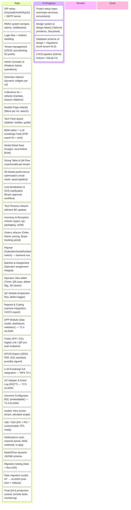
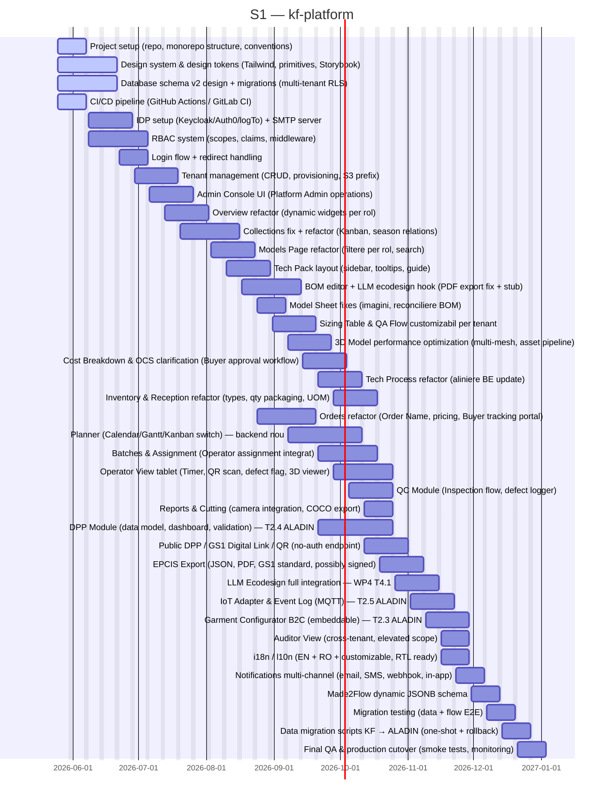
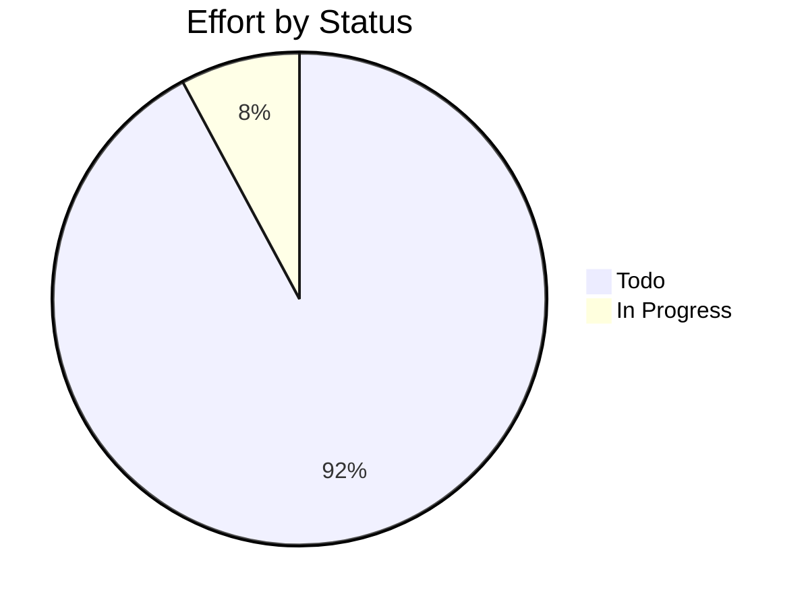

# kf-platform

> Infra platform for kf web based services

## Status

| Metric | Value |
| :--- | :--- |
| Status | Active |
| Type | EU Project |
| PO | @ps.tech |
| Lead | @el.tech |
| Current Sprint | S1 |
| Sprint Period | 2026-05-25 to 2026-06-07 |
| Tags | eu-project, circular-textiles, digital-platform, microfactory, dpp, manufacturing |
| Dependencies | [nuoform]({{ '/projects/nuoform/' | relative_url }}) |

## Current Sprint Kanban &nbsp; [Edit Kanban](https://github.com/katty-fashion/kf-platform/edit/master/kanban.md)

Todo
In Progress
Review
Done

## Task Summary

| Task | Assignee | Effort | Start | End | Status |
| :--- | :--- | :--- | :--- | :--- | :--- |
| Project setup (repo, monorepo structure, conventions) | @alexandru.bejenari + @ma.tech | 2d | 2026-05-25 | 2026-06-07 | In Progress |
| Design system & design tokens (Tailwind, primitives, Storybook) | @alexandru.bejenari | 10d | 2026-05-25 | 2026-06-21 | In Progress |
| Database schema v2 design + migrations (multi-tenant RLS) | @ma.tech | 10d | 2026-05-25 | 2026-06-21 | In Progress |
| CI/CD pipeline (GitHub Actions / GitLab CI) | @ma.tech | 2d | 2026-05-25 | 2026-06-07 | In Progress |
| IDP setup (Keycloak/Auth0/logTo) + SMTP server | @ma.tech | 5d | 2026-06-08 | 2026-06-28 | Todo |
| RBAC system (scopes, claims, middleware) | @ma.tech | 10d | 2026-06-08 | 2026-07-05 | Todo |
| Login flow + redirect handling | @alexandru.bejenari | 5d | 2026-06-22 | 2026-07-05 | Todo |
| Tenant management (CRUD, provisioning, S3 prefix) | @ma.tech | 10d | 2026-06-29 | 2026-07-19 | Todo |
| Admin Console UI (Platform Admin operations) | @alexandru.bejenari | 10d | 2026-07-06 | 2026-07-26 | Todo |
| Overview refactor (dynamic widgets per rol) | @alexandru.bejenari | 5d | 2026-07-13 | 2026-08-02 | Todo |
| Collections fix + refactor (Kanban, season relations) | @alexandru.bejenari + @ma.tech | 10d | 2026-07-20 | 2026-08-16 | Todo |
| Models Page refactor (filtere per rol, search) | @alexandru.bejenari | 5d | 2026-08-03 | 2026-08-23 | Todo |
| Tech Pack layout (sidebar, tooltips, guide) | @alexandru.bejenari | 5d | 2026-08-10 | 2026-08-30 | Todo |
| BOM editor + LLM ecodesign hook (PDF export fix + stub) | @alexandru.bejenari + @ma.tech | 10d | 2026-08-17 | 2026-09-13 | Todo |
| Model Sheet fixes (imagini, reconciliere BOM) | @alexandru.bejenari | 2d | 2026-08-24 | 2026-09-06 | Todo |
| Sizing Table & QA Flow customizabil per tenant | @alexandru.bejenari + @ma.tech | 5d | 2026-08-31 | 2026-09-20 | Todo |
| 3D Model performance optimization (multi-mesh, asset pipeline) | @alexandru.bejenari | 5d | 2026-09-07 | 2026-09-27 | Todo |
| Cost Breakdown & OCS clarification (Buyer approval workflow) | @alexandru.bejenari + @ma.tech | 5d | 2026-09-14 | 2026-10-04 | Todo |
| Tech Process refactor (aliniere BE update) | @alexandru.bejenari + @ma.tech | 5d | 2026-09-21 | 2026-10-11 | Todo |
| Inventory & Reception refactor (types, qty packaging, UOM) | @alexandru.bejenari + @ma.tech | 5d | 2026-09-28 | 2026-10-18 | Todo |
| Orders refactor (Order Name, pricing, Buyer tracking portal) | @alexandru.bejenari + @ma.tech | 10d | 2026-08-24 | 2026-09-20 | Todo |
| Planner (Calendar/Gantt/Kanban switch) — backend nou | @alexandru.bejenari + @ma.tech | 20d | 2026-09-07 | 2026-10-11 | Todo |
| Batches & Assignment (Operator assignment integrat) | @alexandru.bejenari + @ma.tech | 10d | 2026-09-21 | 2026-10-18 | Todo |
| Operator View tablet (Timer, QR scan, defect flag, 3D viewer) | @alexandru.bejenari + @ma.tech | 20d | 2026-09-28 | 2026-10-25 | Todo |
| QC Module (Inspection flow, defect logger) | @alexandru.bejenari + @ma.tech | 10d | 2026-10-05 | 2026-10-25 | Todo |
| Reports & Cutting (camera integration, COCO export) | @alexandru.bejenari + @ma.tech | 5d | 2026-10-12 | 2026-10-25 | Todo |
| DPP Module (data model, dashboard, validation) — T2.4 ALADIN | @alexandru.bejenari + @ma.tech | 20d | 2026-09-21 | 2026-10-25 | Todo |
| Public DPP / GS1 Digital Link / QR (no-auth endpoint) | @alexandru.bejenari + @ma.tech | 10d | 2026-10-12 | 2026-11-01 | Todo |
| EPCIS Export (JSON, PDF, GS1 standard, possibly signed) | @ma.tech | 10d | 2026-10-19 | 2026-11-08 | Todo |
| LLM Ecodesign full integration — WP4 T4.1 | @ma.tech | 10d | 2026-10-26 | 2026-11-15 | Todo |
| IoT Adapter & Event Log (MQTT) — T2.5 ALADIN | @ma.tech | 10d | 2026-11-02 | 2026-11-22 | Todo |
| Garment Configurator B2C (embeddable) — T2.3 ALADIN | @alexandru.bejenari | 10d | 2026-11-09 | 2026-11-29 | Todo |
| Auditor View (cross-tenant, elevated scope) | @alexandru.bejenari + @ma.tech | 5d | 2026-11-16 | 2026-11-29 | Todo |
| i18n / l10n (EN + RO + customizable, RTL ready) | @alexandru.bejenari | 5d | 2026-11-16 | 2026-11-29 | Todo |
| Notifications multi-channel (email, SMS, webhook, in-app) | @ma.tech | 5d | 2026-11-23 | 2026-12-06 | Todo |
| Made2Flow dynamic JSONB schema | @alexandru.bejenari + @ma.tech | 5d | 2026-11-30 | 2026-12-13 | Todo |
| Migration testing (data + flow E2E) | @alexandru.bejenari + @ma.tech | 5d | 2026-12-07 | 2026-12-20 | Todo |
| Data migration scripts KF → ALADIN (one-shot + rollback) | @ma.tech | 5d | 2026-12-14 | 2026-12-27 | Todo |
| Final QA & production cutover (smoke tests, monitoring) | @alexandru.bejenari + @ma.tech | 5d | 2026-12-21 | 2027-01-03 | Todo |

## LOE Summary

| Metric | Value |
| :--- | :--- |
| Total Effort | 306.0d |
| In Progress | 24.0d |
| Completed | 0d |
| Remaining | 306.0d |

## Sprint Timeline

## Effort Distribution

## Links

- [Edit Kanban](https://github.com/katty-fashion/kf-platform/edit/master/kanban.md)
- [Repository](https://github.com/katty-fashion/kf-platform)
- [Kanban Board](https://github.com/katty-fashion/kf-platform/blob/master/kanban.md)

---

*Auto-generated by KF Aggregator*