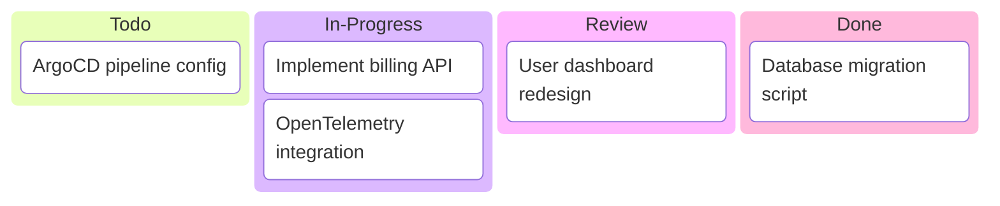

# nuoform

> Internal

## Status

| Metric | Value |
| :--- | :--- |
| Status | Active |
| Type | Internal |
| PO | product@katty-fashion.dev |
| Lead | tech@katty-fashion.dev |
| Current Sprint | S3 |
| Sprint Period | 2026-03-03 to 2026-03-14 |
| Tags | - |
| Dependencies | None |

## Current Sprint Kanban

## Task Summary

| Task | Assignee | Effort | Status |
| :--- | :--- | :--- | :--- |
| Implement billing API | @backend | 5d | In Progress |
| ArgoCD pipeline config | @devops | 2d | Todo |
| OpenTelemetry integration | @devops | 3d | In Progress |
| User dashboard redesign | @frontend | 4d | Review |
| Database migration script | @backend | 1d | Done |

## LOE Summary

| Metric | Value |
| :--- | :--- |
| Total Effort | 15.0d |
| In Progress | 8.0d |
| Completed | 1.0d |
| Remaining | 14.0d |

## Links

- [Repository](https://github.com/katty-fashion/nuoform)
- [Kanban Board](https://github.com/katty-fashion/nuoform/blob/main/kanban.md)

---

*Auto-generated by KF Aggregator*