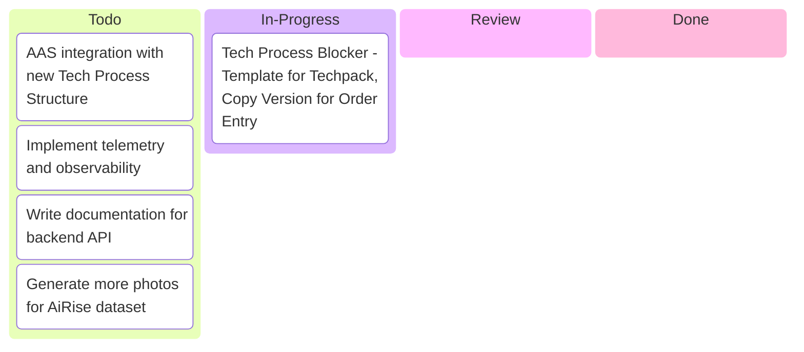
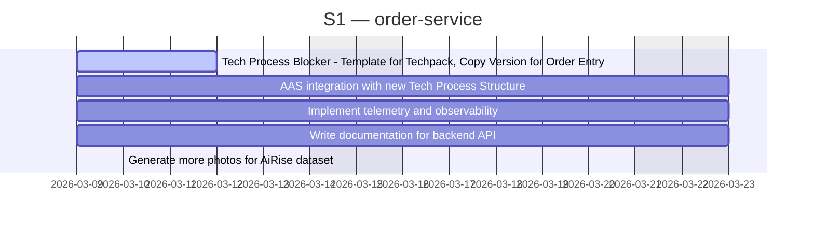
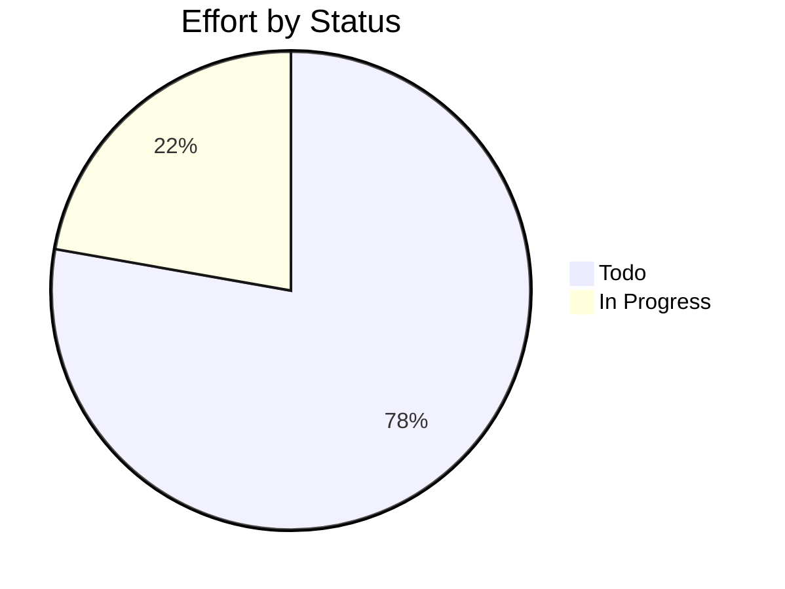

# order-service

> NuoForm API

## Status

| Metric | Value |
| :--- | :--- |
| Status | Active |
| Type | Internal |
| PO | - |
| Lead | @tech-lead |
| Current Sprint | S1 |
| Sprint Period | 2026-03-09 to 2026-03-23 |
| Tags | R3G, Nuo, AiR, RGT |
| Dependencies | [R3GROUP]({{ '/projects/R3GROUP/' | relative_url }}), [AiRise]({{ '/projects/AiRise/' | relative_url }}), [RGT]({{ '/projects/RGT/' | relative_url }}) |

## Current Sprint Kanban &nbsp; [Edit Kanban](https://github.com/katty-fashion/order-service/edit/master/kanban.md)

Todo
In Progress
Review
Done

## Task Summary

| Task | Assignee | Effort | Start | End | Status |
| :--- | :--- | :--- | :--- | :--- | :--- |
| Tech Process Blocker - Template for Techpack, Copy Version for Order Entry | @backend | 3d | 2026-03-09 | 2026-03-12 | In Progress |
| AAS integration with new Tech Process Structure | @backend | 1.5d | 2026-03-09 | 2026-03-23 | Todo |
| Implement telemetry and observability | @backend | 4d | 2026-03-09 | 2026-03-23 | Todo |
| Write documentation for backend API | @backend | 3d | 2026-03-09 | 2026-03-23 | Todo |
| Generate more photos for AiRise dataset | @backend | 2d | 2026-03-10 | 2026-03-10 | Todo |

## LOE Summary

| Metric | Value |
| :--- | :--- |
| Total Effort | 13.5d |
| In Progress | 3.0d |
| Completed | 0d |
| Remaining | 13.5d |

## Sprint Timeline

## Effort Distribution

## Links

- [Edit Kanban](https://github.com/katty-fashion/order-service/edit/master/kanban.md)
- [Repository](https://github.com/katty-fashion/order-service)
- [Kanban Board](https://github.com/katty-fashion/order-service/blob/master/kanban.md)

---

*Auto-generated by KF Aggregator*