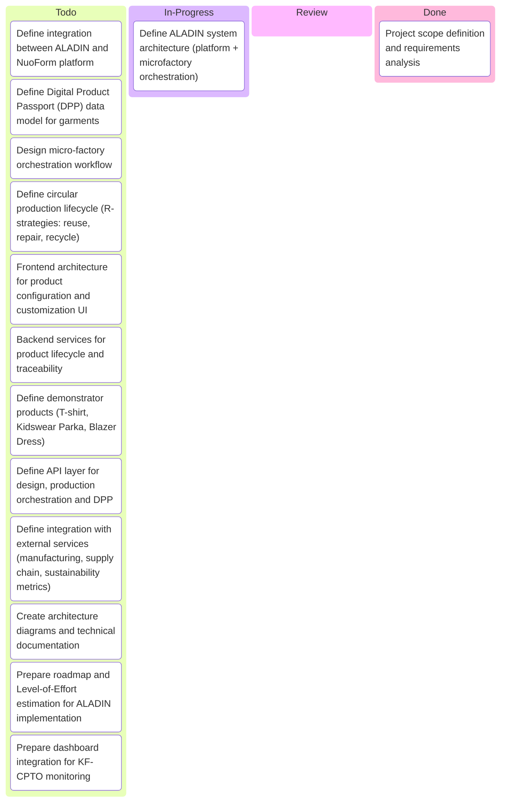
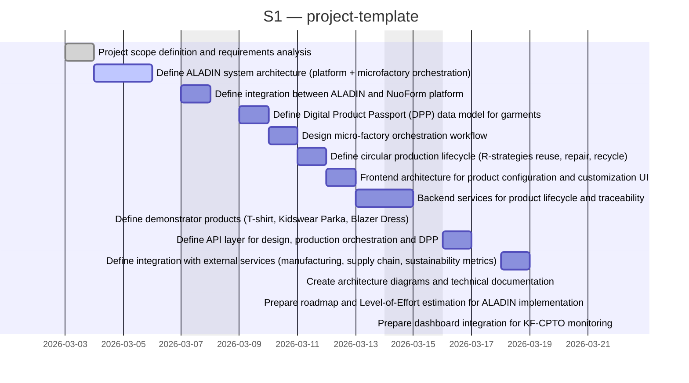
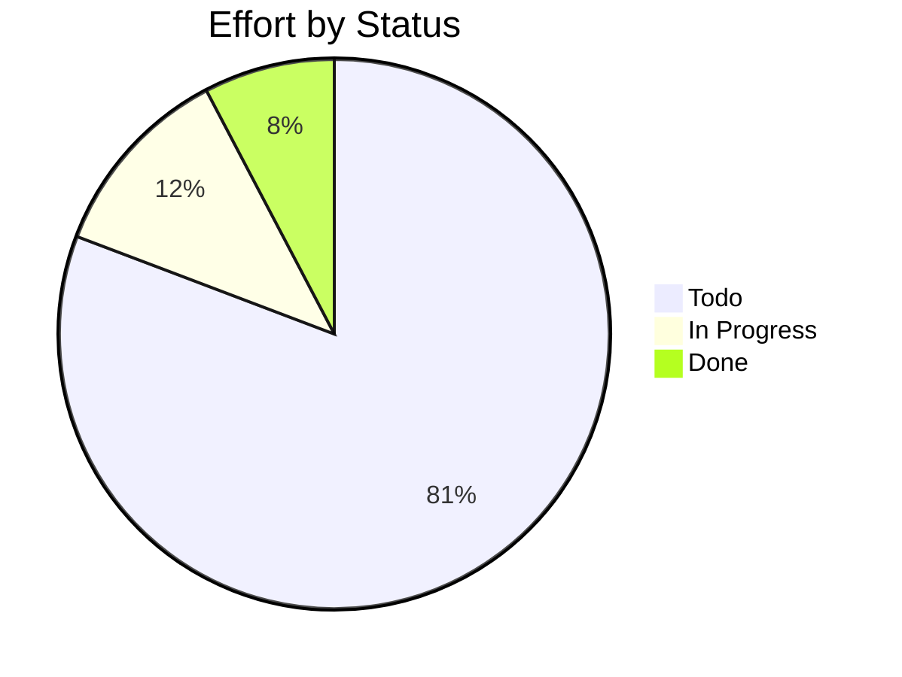

# project-template

> ALADIN – Advanced LocAl and Digital Innovation Network for circular garments. Platform for local-for-local textile production using digital design, micro-factories and circular value chains.

## Status

| Metric | Value |
| :--- | :--- |
| Status | Active |
| Type | EU Project |
| PO | @ps.tech |
| Lead | @el.tech |
| Current Sprint | S1 |
| Sprint Period | 2026-03-03 to 2026-03-14 |
| Tags | eu-project, circular-textiles, digital-platform, microfactory, dpp, manufacturing |
| Dependencies | [nuoform]({{ '/projects/nuoform/' | relative_url }}) |

## Current Sprint Kanban &nbsp; [Edit Kanban](https://github.com/katty-fashion/project-template/edit/main/kanban.md)

Todo
In Progress
Review
Done

## Task Summary

| Task | Assignee | Effort | Start | End | Status |
| :--- | :--- | :--- | :--- | :--- | :--- |
| Project scope definition and requirements analysis | @ps.tech | 2d | 2026-03-03 | 2026-03-04 | Done |
| Define ALADIN system architecture (platform + microfactory orchestration) | @el.tech | 3d | 2026-03-04 | 2026-03-06 | In Progress |
| Define integration between ALADIN and NuoForm platform | @razvan.boita | 2d | 2026-03-07 | 2026-03-08 | Todo |
| Define Digital Product Passport (DPP) data model for garments | @razvan.boita | 2d | 2026-03-09 | 2026-03-10 | Todo |
| Design micro-factory orchestration workflow | @el.tech | 2d | 2026-03-10 | 2026-03-11 | Todo |
| Define circular production lifecycle (R-strategies: reuse, repair, recycle) | @ps.tech | 2d | 2026-03-11 | 2026-03-12 | Todo |
| Frontend architecture for product configuration and customization UI | @alexandru.bejenari | 2d | 2026-03-12 | 2026-03-13 | Todo |
| Backend services for product lifecycle and traceability | @razvan.boita | 3d | 2026-03-13 | 2026-03-15 | Todo |
| Define demonstrator products (T-shirt, Kidswear Parka, Blazer Dress) | @ps.tech | 1d | 2026-03-15 | 2026-03-15 | Todo |
| Define API layer for design, production orchestration and DPP | @razvan.boita | 2d | 2026-03-16 | 2026-03-17 | Todo |
| Define integration with external services (manufacturing, supply chain, sustainability metrics) | @el.tech | 2d | 2026-03-18 | 2026-03-19 | Todo |
| Create architecture diagrams and technical documentation | @alexandru.bejenari | 1d | 2026-03-20 | 2026-03-20 | Todo |
| Prepare roadmap and Level-of-Effort estimation for ALADIN implementation | @ps.tech | 1d | 2026-03-21 | 2026-03-21 | Todo |
| Prepare dashboard integration for KF-CPTO monitoring | @alexandru.bejenari | 1d | 2026-03-22 | 2026-03-22 | Todo |

## LOE Summary

| Metric | Value |
| :--- | :--- |
| Total Effort | 26.0d |
| In Progress | 3.0d |
| Completed | 2.0d |
| Remaining | 24.0d |

## Sprint Timeline

## Effort Distribution

## Links

- [Edit Kanban](https://github.com/katty-fashion/project-template/edit/main/kanban.md)
- [Repository](https://github.com/katty-fashion/project-template)
- [Kanban Board](https://github.com/katty-fashion/project-template/blob/main/kanban.md)

---

*Auto-generated by KF Aggregator*