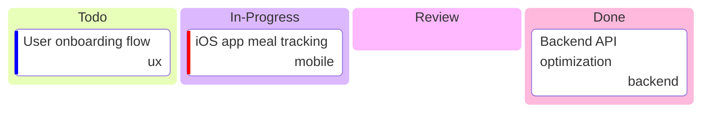

# waist-mgmt

> Internal

## Status

| Metric | Value |
| :--- | :--- |
| Status | Active |
| Type | Internal |
| PO | health@kf-team.dev |
| Lead | mobile@kf-team.dev |
| Current Sprint | S3 |
| Sprint Period | 2026-03-03 to 2026-03-14 |
| Tags | - |
| Dependencies | None |

## Current Sprint Kanban

Todo
In Progress
Review
Done

## Task Summary

| Task | Assignee | Effort | Status |
| :--- | :--- | :--- | :--- |
| iOS app meal tracking | @mobile | 3d | In Progress |
| Backend API optimization | @backend | 2d | Done |
| User onboarding flow | @ux | 2d | Todo |

## LOE Summary

| Metric | Value |
| :--- | :--- |
| Total Effort | 7.0d |
| In Progress | 3.0d |
| Completed | 2.0d |
| Remaining | 5.0d |

## Links

- [Repository](https://github.com/katty-fashion/waist-mgmt)
- [Kanban Board](https://github.com/katty-fashion/waist-mgmt/blob/main/kanban.md)

---

*Auto-generated by KF Aggregator*