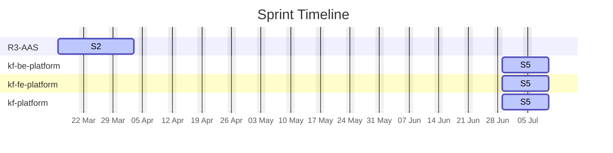

# KF Team — Agile Sprints

## Sprint Timeline

## Sprint Summary

| Project | Sprint | Window | Total Effort | % Done |
| :--- | :--- | :--- | :---: | :---: |
| R3-AAS | S2 | 2026-03-16 → 2026-04-03 | 18.5d | 27.0% |
| kf-be-platform | S5 | 2026-06-29 → 2026-07-10 | 77.0d | 45.5% |
| kf-fe-platform | S5 | 2026-06-29 → 2026-07-10 | 62.0d | 59.7% |
| kf-platform | S5 | 2026-06-29 → 2026-07-10 | 167.0d | 19.2% |
| **TOTAL** | | | **324.5d** | **33.6%** |