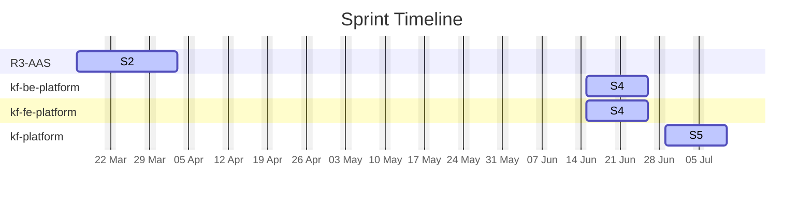

# KF Team — Agile Sprints

## Sprint Timeline

## Sprint Summary

| Project | Sprint | Window | Total Effort | % Done |
| :--- | :--- | :--- | :---: | :---: |
| R3-AAS | S2 | 2026-03-16 → 2026-04-03 | 18.5d | 27.0% |
| kf-be-platform | S4 | 2026-06-15 → 2026-06-26 | 77.0d | 0.0% |
| kf-fe-platform | S4 | 2026-06-15 → 2026-06-26 | 62.0d | 0.0% |
| kf-platform | S5 | 2026-06-29 → 2026-07-10 | 257.0d | 33.9% |
| **TOTAL** | | | **414.5d** | **22.2%** |