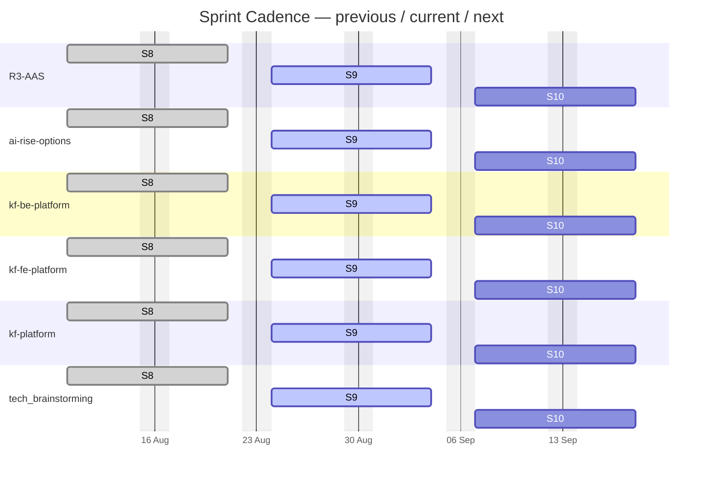
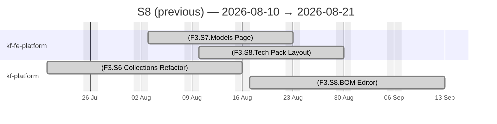
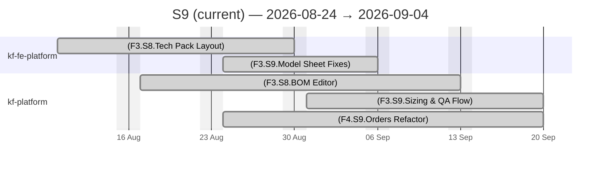
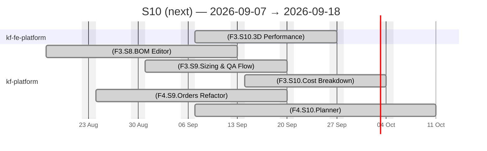

# KF Team — Agile Sprints

## Sprint Timeline

> Previous · current · next sprint per project (from each repo's declared sprint)

PlannedIn workLate / At riskDone

## Sprint Views — previous / current / next

### Sprint S8 (previous) — 2026-08-10 → 2026-08-21

PlannedIn workLate / At riskDone

### Sprint S9 (current) — 2026-08-24 → 2026-09-04

PlannedIn workLate / At riskDone

### Sprint S10 (next) — 2026-09-07 → 2026-09-18

PlannedIn workLate / At riskDone

## Sprint Summary

| Project | Sprint | Window | Total Effort | % Done |
| :--- | :--- | :--- | :---: | :---: |
| R3-AAS | S9 | 2026-08-24 → 2026-09-04 | 52.5d | 41.9% |
| ai-rise-options | S9 | 2026-08-24 → 2026-09-04 | 0d | 0% |
| kf-be-platform | S9 | 2026-08-24 → 2026-09-04 | 77.0d | 54.5% |
| kf-fe-platform | S9 | 2026-08-24 → 2026-09-04 | 62.0d | 83.9% |
| kf-platform | S9 | 2026-08-24 → 2026-09-04 | 167.0d | 58.1% |
| tech_brainstorming | S9 | 2026-08-24 → 2026-09-04 | 0d | 0% |
| **TOTAL** | | | **358.5d** | **59.4%** |