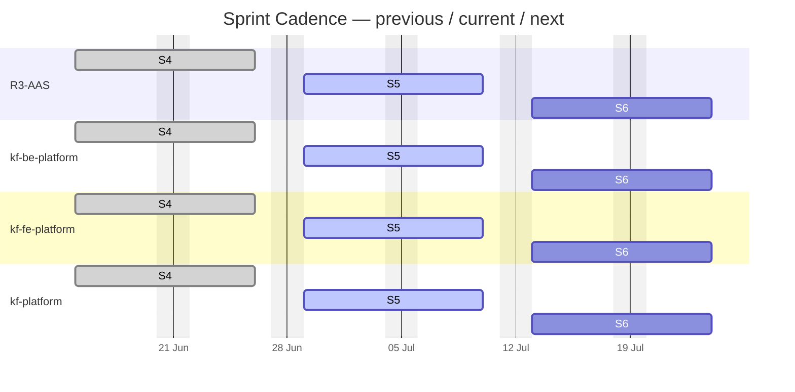
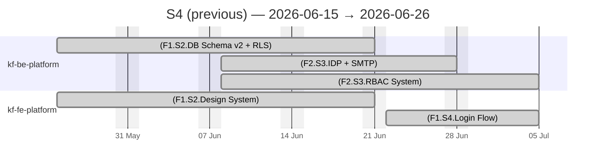
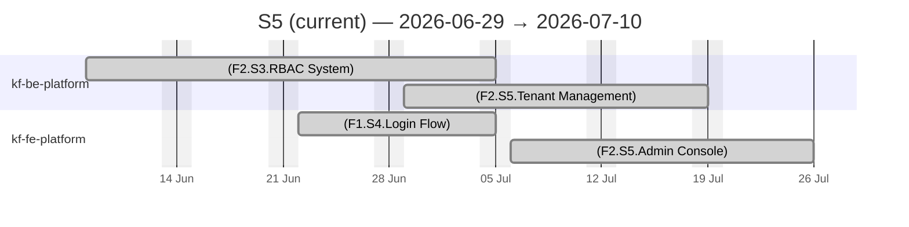
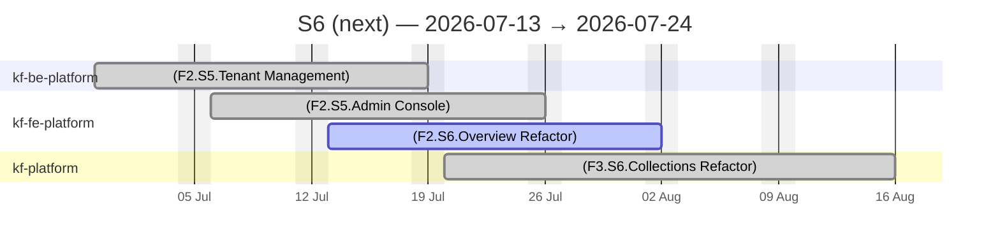

# KF Team — Agile Sprints

## Sprint Timeline

> Previous · current · next sprint per project (from each repo's declared sprint)

PlannedIn workLate / At riskDone

## Sprint Views — previous / current / next

### Sprint S4 (previous) — 2026-06-15 → 2026-06-26

PlannedIn workLate / At riskDone

### Sprint S5 (current) — 2026-06-29 → 2026-07-10

PlannedIn workLate / At riskDone

### Sprint S6 (next) — 2026-07-13 → 2026-07-24

PlannedIn workLate / At riskDone

## Sprint Summary

| Project | Sprint | Window | Total Effort | % Done |
| :--- | :--- | :--- | :---: | :---: |
| R3-AAS | S5 | 2026-06-29 → 2026-07-10 | 18.5d | 27.0% |
| kf-be-platform | S5 | 2026-06-29 → 2026-07-10 | 77.0d | 45.5% |
| kf-fe-platform | S5 | 2026-06-29 → 2026-07-10 | 62.0d | 59.7% |
| kf-platform | S5 | 2026-06-29 → 2026-07-10 | 167.0d | 19.2% |
| **TOTAL** | | | **324.5d** | **33.6%** |