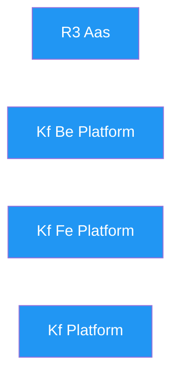

# KF Team — Dependency Graph

> Inter-project dependencies (auto-generated from kanban.md frontmatter)

*No inter-project dependencies declared yet. Add `depends_on` to your kanban.md frontmatter.*

## Legend

| Color | Type |
| :--- | :--- |
| Green | SaaS Product |
| Blue | EU Project |
| Orange | Internal |