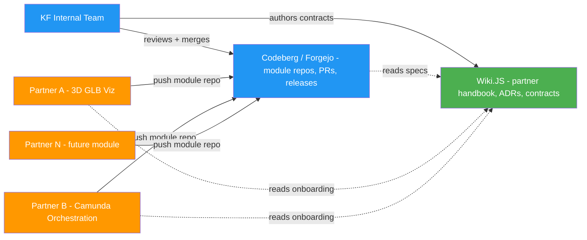
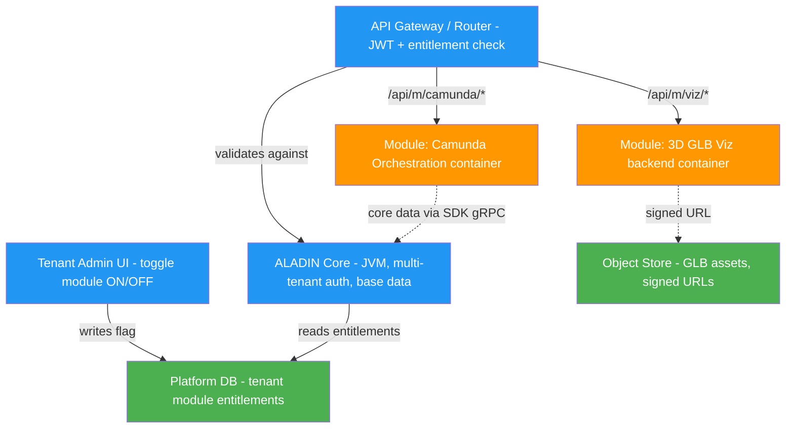
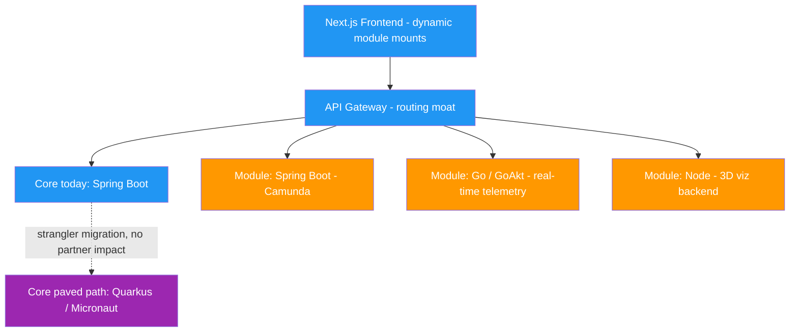

# ALADIN Governance

> **Scope:** How we build ALADIN collaboratively, how third-party partners ship modules that plug into the platform safely, and how we migrate off Spring Boot without boiling the ocean.
> **Status:** Governance contract (documentation) — implementation phases follow this page; nothing here is wired yet.

This page uses **text pills** (`[LABEL]`) instead of icons. Every pill is defined in the [Glossary](#7-glossary).

---

## 1. Purpose

ALADIN is the platform-wide migration target (KF → ALADIN, see [Migration Gantt](migration-gantt.html)). Two governance pillars keep that migration safe and scalable:

1. **Collaboration model** — `[NEW]` Codeberg for source + Wiki.JS for the knowledge base, so we can work with external partners on neutral, EU-hosted ground, decoupled from the internal GitHub org.
2. **Module registry + safe migration** — partner modules (3D visualization, Camunda orchestration, future modules) plug in at the **network and UI level**, never by loading code into the core JVM. This single decision is what lets us retain Spring Boot today and pave a safe path to Quarkus / Micronaut (or Go) tomorrow.

The guiding principle throughout is **isolate at the boundary, not in the memory space** — a bad partner module can crash its own box, never the platform.

---

## 2. Collaboration Model — Codeberg + Wiki.JS

| Tool | Role | Why this one |
|---|---|---|
| **Codeberg** (Forgejo) | Source / repo hosting, issues, PRs, releases for partner-facing module repos | EU-hosted, sovereign, open-source forge; neutral ground for external partners without granting access to the internal GitHub org |
| **Wiki.JS** | Knowledge base — partner handbook, contracts, ADRs, onboarding | Versioned, structured docs; readable by non-engineers (POs, partners); decoupled from any single repo |

### 2.1 Topology

### 2.2 Repo management for third-party partner modules `[RULE]`

- **One repo per module.** Naming: `aladin-mod-{module}` (e.g. `aladin-mod-glb-viewer`, `aladin-mod-camunda`). Each repo is self-contained: backend, frontend bundle, migrations, its own `docker-compose`.
- **Partner owns the repo, KF owns the contracts.** Partners get write access to *their* repo only. The platform SDK, OpenAPI contracts, and the Partner Kit live in a KF-owned `aladin-platform-sdk` repo that partners consume read-only.
- **Branch & release convention:** trunk-based — `main` is always releasable; partners cut tagged releases (`vMAJOR.MINOR.PATCH`); the platform pins a **specific tag** of a module in the registry, never a moving branch.
- **Docs live in Wiki.JS, not in the repo.** Each module gets a Wiki.JS space: integration notes, runbook, support contacts. The repo `README` points to the Wiki.JS page.
- **`[MOAT]` No partner ever touches a KF core repo or the core database.** Integration happens only through the contracts in §3.

---

## 3. Module Registry — Scalable Plug-and-Play

### 3.1 Core decision `[MOAT]`

We do **not** dynamically load partner JARs into the core process. Modern JVM frameworks (Quarkus, Micronaut) move dependency injection to compile time and forbid runtime reflection — runtime class-loading breaks GraalVM native images, leaks memory, and lets a bad plugin crash the whole platform.

Instead, the registry **virtualises the "Install" button**: clicking it flips a routing + UI flag, and the partner module runs as its own isolated service. This is the **Strangler Fig** approach.

> **Why this scales:** modules are decoupled by HTTP/gRPC. The core can be Quarkus, the Camunda module can be Spring Boot, the 3D telemetry feed can be Go — and they all integrate at the browser and the gateway. `[WARN]` Trying to force a monolithic JAR-loading plugin model is an uphill battle against the entire modern Java ecosystem; we deliberately reject it.

### 3.2 Architecture

### 3.3 The three contracts

A partner module is "compatible" when it honours three contracts. These are what we hand over; partners build freely behind them.

#### `[UI]` UI Contract — Next.js dynamic import / Web Components

- Partner ships a **standalone production JS bundle** (React/Vue/Angular compiled to a Web Component, or an npm/CDN package).
- The platform mounts it **on demand by tenant config** using `next/dynamic`. If the tenant has the module enabled, the platform lazy-loads the bundle and passes context props (`tenantId`, `authToken`, `theme`, asset URLs) downward.
- **Blast-radius isolation:** if the partner UI crashes, only that viewport box breaks — the platform layout stays responsive.

#### `[API]` API Contract — OpenAPI + gateway reverse proxy

- Partner submits an **OpenAPI (Swagger)** spec for the module backend.
- Every partner endpoint **must** accept an `X-Tenant-ID` header and an `Authorization` bearer token issued by the platform.
- The gateway intercepts `/api/m/{module}/*`, **validates the JWT, confirms the tenant owns the module**, then reverse-proxies to the partner container. No entitlement → `403`.

#### `[DATA]` Data Contract — isolated Postgres schema + SDK

- Partner migrations (Flyway/Liquibase) target a **dedicated schema** `schema_partner_{module}`; the partner gets a DB user scoped to that schema only — never the core `public` schema.
- To read core platform data (user profiles, tenant details), partners call the **Platform SDK** (secure REST/gRPC back to the core), never the DB directly.
- Large binary assets (GLB 3D models) stream from an **object store via signed URLs**; the core only stores metadata (path, version, tenant association) in Postgres.

### 3.4 The Partner Kit `[NEW]`

To make a partner productive on day one, the KF-owned `aladin-platform-sdk` repo ships:

| Item | What it is |
|---|---|
| **Component stub** | A dummy Web Component / React component showing exactly which props (`tenantId`, `authToken`, `theme`) the platform hands down |
| **Auth helper library** | A tiny Java + Node library that validates platform OAuth2/OIDC tokens, so partners do not reimplement security |
| **Local harness** | A `docker-compose` with a **core API stub**, letting partners boot their module locally and prove it integrates before submission |
| **OpenAPI template** | A skeleton spec with the required `X-Tenant-ID` / bearer conventions pre-wired |

---

## 4. Framework Migration — Safe, Moated Path from Spring Boot

### 4.1 Verdict `[OK]`

> **Keep the core on the JVM. Retain Spring Boot now — migrate it on a Strangler Fig schedule toward Quarkus or Micronaut. Isolate every module at the network and UI level. Reach for Go / GoAkt only for niche, high-concurrency modules — never for the core.**

Because modules are physically separated by HTTP/gRPC (§3), the core's framework choice is **decoupled from every module's**. That is precisely what makes the migration safe: we can swap the core framework underneath without partners noticing, and partners can use whatever stack they like.

### 4.2 Contenders

| Framework | Best fit | Key advantage | Major trade-off |
|---|---|---|---|
| **Spring Boot** | Large enterprise systems; current KF core | Massive ecosystem, easiest hiring, native Camunda starters | Higher baseline memory; "magic" runtime reflection |
| **Quarkus** | Kubernetes, containerized modules | Live coding, great dev UX, build-time augmentation, stable GraalVM native | Steep build-time config; topology frozen at build time |
| **Micronaut** | Serverless (FaaS), IoT, memory-constrained | Minimal runtime memory, compile-time safety, seamless GraalVM native | Smaller third-party plugin market |
| **Helidon** | Standards-pure microservices | Oracle / Java SE alignment, MicroProfile | Smaller community footprint |
| **GoAkt** (Go) | High-concurrency event streams, real-time telemetry, distributed actors | Millions of lightweight actors, native context propagation, tiny memory | Language + paradigm shift; steep curve from Spring; off-JVM |

> **Dropwizard / Vert.x note:** Dropwizard suits teams that dislike framework "magic" (Jetty + Jersey, no surprises); Vert.x suits bare-metal, event-driven, maximum-throughput reactive systems. Both are valid *module* stacks, not core-migration targets for this team.

### 4.3 Why network isolation *enables* the migration

- **Total framework freedom** — core could be Quarkus while the Camunda module stays Spring Boot and a telemetry feed is Go. No shared stack required.
- **Blast-radius isolation** — a memory leak in the 3D module never touches the multi-tenant core.
- **GraalVM native path preserved** — because we never load partner JARs into the core, the core stays eligible for native compilation (near-zero startup, sub-64MB memory) whenever we want it.
- **No fragile class-loader code** — we skip months of `URLClassLoader` engineering and its security holes entirely.

### 4.4 Strangler Fig target

`[WARN]` Do **not** migrate the core to Go/GoAkt now: the team is fluent in Java, the data layer is Postgres, and Camunda is JVM-first. Forcing a language change adds friction with no payoff to the plug-and-play mission.

---

## 5. Partner Rules Checklist `[RULE]`

Hand this to a partner before they write a line of code:

- `[RULE]` **Multi-tenancy** — every backend request carries `X-Tenant-ID`. Your logic and DB must isolate strictly by that ID.
- `[RULE]` **Authentication** — validate the incoming bearer token against the platform OAuth2/OIDC endpoint. Use the provided auth helper library.
- `[RULE]` **Independent lifecycle** — your module runs standalone in a Docker container. You own your DB migrations (into `schema_partner_*`) and third-party dependencies (e.g. the Camunda engine).
- `[RULE]` **UI as a Web Component** — ship a single production JS bundle; the platform mounts it. No code hosted inside KF repos.
- `[RULE]` **Core data via SDK only** — never connect to the core DB. Request data through the Platform SDK over REST/gRPC.
- `[RULE]` **Pin a tagged release** — the registry references a specific version tag, not a branch.

---

## 6. Non-goals

- This page is **documentation only** — it does not implement the gateway, registry, or any migration code.
- ALADIN remains a phase/initiative label, not a tracked repo; this governance lives platform-wide under **Views**, not under a single project page.
- No runtime JAR-loading, no dynamic container spawning (yet) — modules are always-on, fixed deployments; "Install" is a routing/UI switch.

---

## 7. Glossary

| Pill / Term | Meaning |
|---|---|
| `[NEW]` | New capability with no current KF equivalent |
| `[RULE]` | A hard requirement partners must satisfy |
| `[MOAT]` | A security/isolation boundary the core enforces |
| `[UI]` | Concerns the UI contract (frontend) |
| `[API]` | Concerns the API contract (gateway/backend) |
| `[DATA]` | Concerns the data contract (DB/SDK) |
| `[WARN]` | Caution — an explicitly rejected option or a risk to monitor |
| `[OK]` | Recommended / in-parameters position |
| **Strangler Fig** | Incremental migration: new system grows around the old one until the old one can be retired, with no big-bang cutover |
| **SPI** | Service Provider Interface — a contract interface modules implement (here: the API/UI/Data contracts, not in-process Java SPI) |
| **AOT** | Ahead-of-Time compilation — work done at build time instead of runtime (how Quarkus/Micronaut gain speed) |
| **GraalVM native image** | Compiling a JVM app to a native binary for near-zero startup and tiny memory; requires no runtime reflection |
| **Module Federation** | Webpack technique to load independently-built JS bundles at runtime (one way to ship partner UIs) |
| **Sidecar** | A module deployed as its own process/container alongside the core rather than inside it |
| **Reverse proxy** | The gateway forwarding `/api/m/{module}/*` traffic to the right partner container after auth checks |
| **gRPC** | High-speed binary RPC over HTTP/2 — the SDK transport for module-to-core calls |
| **Multi-tenancy** | One platform instance serving many isolated tenants, keyed by `X-Tenant-ID` |
| **GLB** | GL Transmission Format Binary — self-contained 3D model files rendered client-side (Three.js / model-viewer) |

---

> Governance contract for the ALADIN platform. Edit this page via PR; it is hand-authored and not regenerated by the aggregator.
