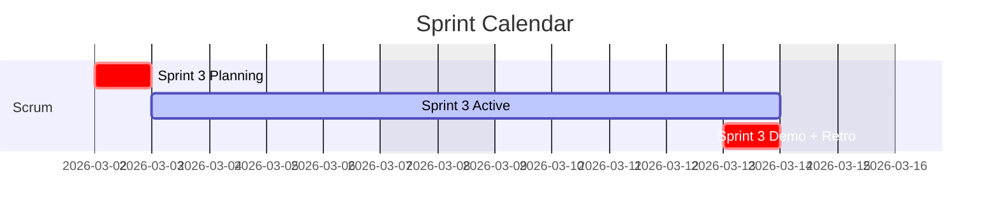
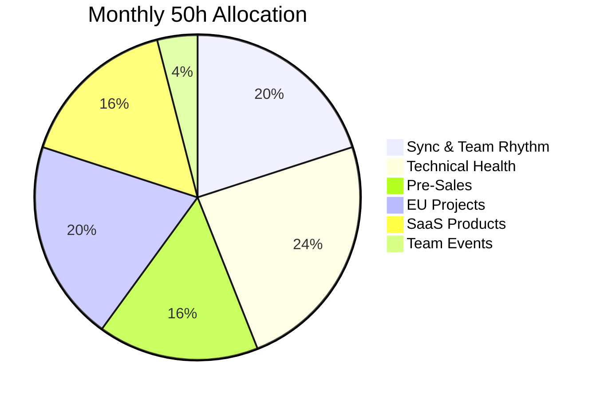

# KF Team — Project Dashboard

> **Single Pane of Glass** · GitHub Native · Google Workspace Integration

---

## Quick Links






---

## Projects



<a href="{{ proj.edit_url }}">Edit Kanban</a>




*No projects found yet. Add a `kanban.md` to any repo in the katty-fashion org to get started.*


---

## Current Sprint Overview

---

## CPTO Time Allocation

---

*KF Team · Git-Native Project Management · [GitHub](https://github.com/katty-fashion/kf-cpto)*
