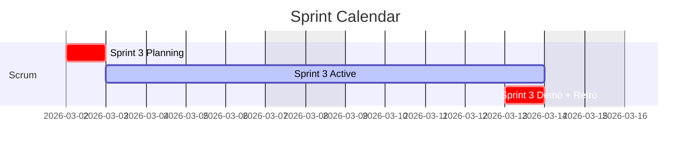
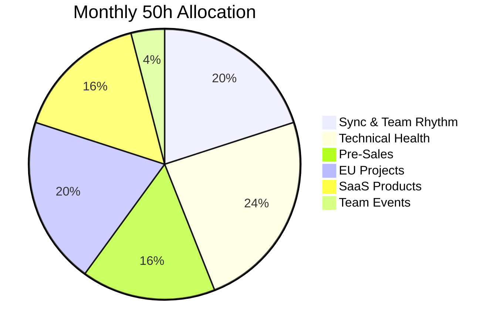

# KF Team — Project Dashboard

> **Single Pane of Glass** · GitHub Native · Google Workspace Integration

---

## Quick Links





---

## Projects






---

## Current Sprint Overview

---

## CPTO Time Allocation

---

*KF Team · Git-Native Project Management · [GitHub](https://github.com/kf-team/kf-cpto)*
