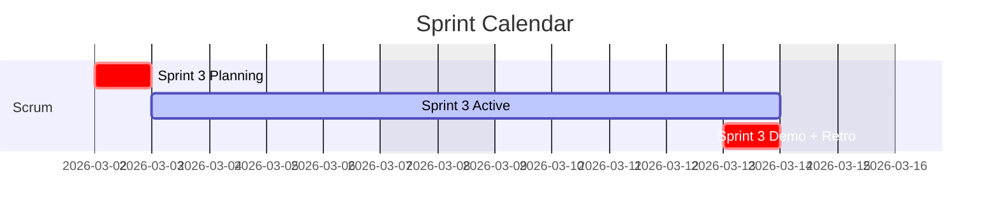
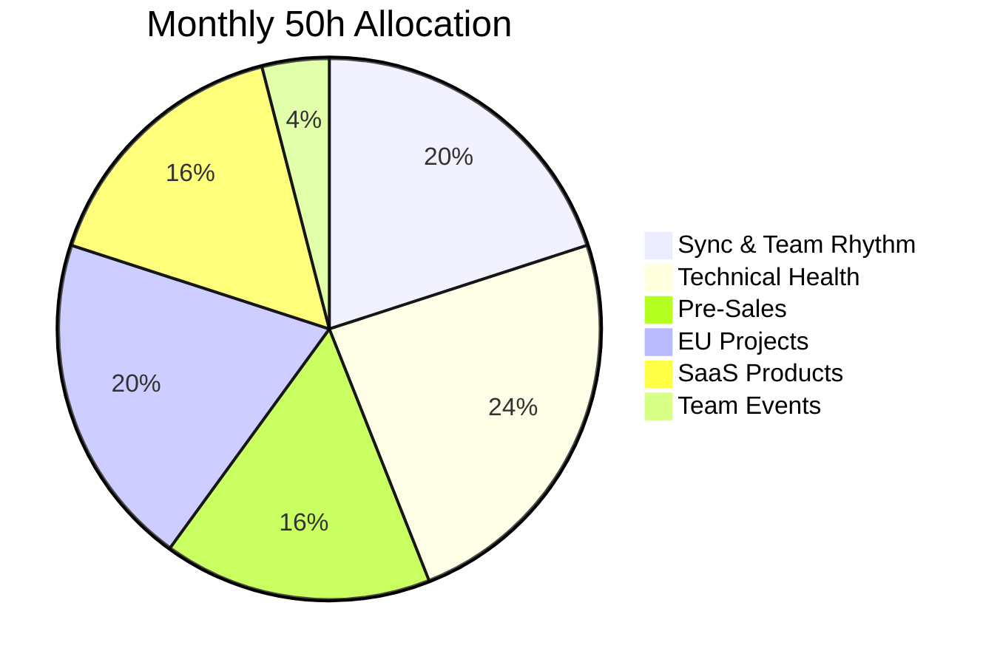

# KF Team — Project Dashboard

> **Single Pane of Glass** · GitHub Native · Google Workspace Integration

---

## Quick Links

- [Unified Kanban](unified-kanban.md) — All projects in one view
- [Unified Calendar](unified-calendar.md) — CPTO 50h allocation
- [LOE Report](loe-report.md) — Level of Effort tracking

---

## Projects

| Project | Description | Status |
| :--- | :--- | :---: |
| [AI-RISE](projects/ai-rise.md) | EU AI Project | Active |
| [AIREGIO](projects/airegio.md) | EU Regional AI | Active |
| [NuoForm](projects/nuoform.md) | SaaS Platform | Active |
| [Waist Management](projects/waist-mgmt.md) | Health SaaS | Active |

---

## Current Sprint Overview

---

## CPTO Time Allocation

---

*KF Team · Git-Native Project Management · [GitHub](https://github.com/kf-team/kf-cpto)*
