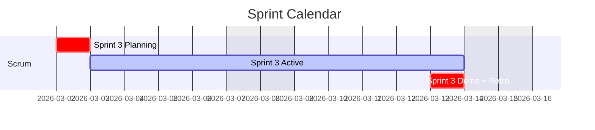

# KF Team — Project Dashboard

> **Single Pane of Glass** · GitHub Native · Google Workspace Integration



  <strong>Heads up:</strong> the downstream Google Sheet export failed at
  {{ site.data.sync_status.sheets_export.last_run_at }}.
  <em>The dashboard you're looking at is the canonical view and is current.</em>
  The `LOE` tab in Google Sheets still shows the last successful export — it was
  <strong>not</strong> blanked.
  
    See <a href="{{ site.data.sync_status.sheets_export.last_error_issue }}">the sync-failure issue</a> for details.
  



---

## Quick Links






---

## Projects



<a href="{{ proj.edit_url }}">Edit Kanban</a>




*No projects found yet. Add a `kanban.md` to any repo in the katty-fashion org to get started.*


---

## Current Sprint Overview

```mermaid
gantt
    title Sprint Calendar
    dateFormat YYYY-MM-DD
    excludes weekends

    section Scrum
    Sprint 3 Planning        :crit, 2026-03-02, 1d
    Sprint 3 Active          :active, 2026-03-03, 9d
    Sprint 3 Demo + Retro    :crit, 2026-03-13, 1d
```

---

## Portfolio Effort — Planned vs Done



```mermaid
pie showData title Portfolio Effort — Planned vs Done (person-days)
    "Done" : {{ done }}
    "Planned" : {{ planned }}
```

---

*KF Team · Git-Native Project Management · [GitHub](https://github.com/katty-fashion/kf-cpto)*
