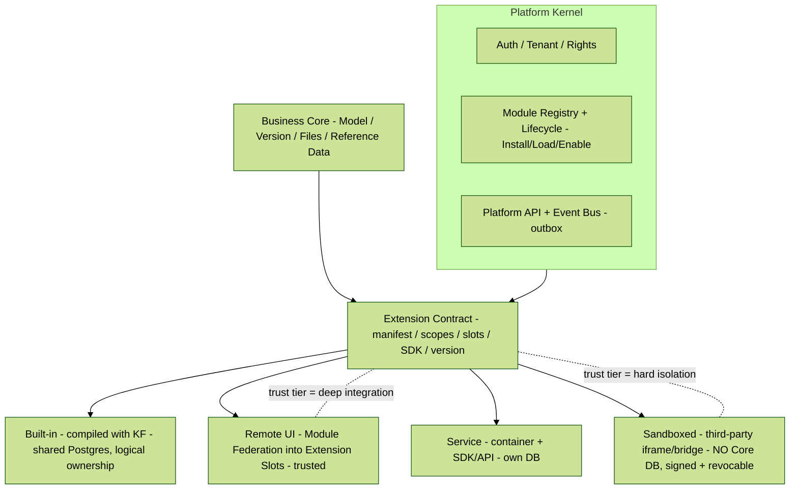

# KF Platform Modularization — Compare Notes

**Version:** v1 · **Status:** internal working note (not published to the dashboard) · **Source inputs:** `docs/ALADIN_Governance.md` §3 (Module Registry — Scalable Plug-and-Play) vs. `internal/kf-platform-modularizare.pptx` (lead-dev deck, Romanian, "KF Hybrid Module Platform", July 2026). Companion deck: `internal/kf-platform-modularizare.v1.pptx` (forest-themed). Both decks live under `internal/` — outside the Jekyll source tree — so they are never served on the public dashboard.

> **Why this note exists —** Our lead dev produced a modularization proposal using other models. This reconciles it against our own ALADIN governance §3 so we can see, conceptually, where the two agree, where they deviate, and what the **best, safe, most scalable** way forward is. Pills are text `[LABEL]` tags defined in the [Glossary](#glossary).

---

## 1. TL;DR

- **No fundamental conflict.** Both documents assert the same core thesis: **isolate modules at the protocol boundary (HTTP / OpenAPI / events), never in-process; a module is defined by its contract (manifest), not by the technology it runs in.**
- The deck is a **superset**; governance §3 is a **specialization**. Governance describes the *external-partner* case (module ≈ always-on isolated service + Web-Component UI). The deck generalizes to **one contract, four runtimes** covering internal *and* external modules.
- The single genuine **safety decision** to lock: do **not** let a shared-runtime UI mechanism (Module Federation) be the third-party mechanism. Trusted tiers get deep integration; untrusted third-party stays sandboxed. Both docs already lean this way — we just make the axis explicit: **trust tier decides the mechanism.**
- **Recommended direction:** adopt the deck's *one-contract / N-runtime* frame and 3-state lifecycle, keep governance's stricter isolation defaults as the safe floor, and merge governance's superior *API-composition / one-catalog* story with the deck's *event-bus / outbox* story. Result below in [§5](#5-recommended-way-forward).

---

## 2. Where we already agree `[OK]`

Conceptual convergence is high. Both docs independently land on:

| Principle | Governance §3 | Lead-dev deck |
|---|---|---|
| No in-process plugin loading | `[MOAT]` "do not load partner JARs into our core" (§3.1) | "avoid in-process plugins; safe limit is HTTP/OpenAPI + events + service identity" (slide 7) |
| Isolate at the protocol boundary | Decouple over HTTP/gRPC (§3.1) | Boundary on protocol; SDK + containerized services (slide 7) |
| Contract, not technology, defines a module | "we isolate at the boundary, not in our memory space" | "modul e definit prin manifest + contract, nu prin tehnologia în care rulează" (slide 3) |
| Next.js shell lazy-mounts remote UI | `next/dynamic` mounts partner bundle by tenant config (§3.3 UI) | App1 shell mounts App2 remote surface into a slot; no static import (slides 5–6) |
| Registry + manifest + entitlement | Module registry; toggle flips routing/UI flag (§3.2) | Module Registry · manifest · slots · versions (slides 3, 5) |
| SDK for module→core, never direct DB | Platform SDK (REST/gRPC); never our DB (§3.3 DATA) | SDK generated (TS/Java/Python/.NET); API/events into Core (slides 7, 9) |
| Tenant-scoped everything | `X-Tenant-ID` on every request (§3.3 API) | tenant context + rights in Core API (slide 7) |
| Versioned / pinned releases | pin a specific tag, never a moving branch (§2.2) | versioning + signatures/checksums/SBOM/revocation (slide 9) |
| Incremental, no big-bang | Strangler Fig; "nothing wired yet" | "incremental, fără big bang rewrite" (slide 11) |

**Takeaway:** the disagreement surface is small. What follows is where the deck adds altitude our governance §3 doesn't yet carry.

---

## 3. Where they deviate `[DEV]`

Ordered by how much the decision matters.

### D1 — Runtime taxonomy: one runtime vs. four `[DEV]` (biggest)

- **Governance §3** implicitly assumes a **single** runtime: a module is an external, always-on, containerized service with a Web-Component UI. §5 states it plainly: *"our modules are always-on, fixed deployments; Install is just a routing/UI switch."*
- **Deck** defines **four runtimes under one contract**: **Built-in** (compiled/released with KF), **Remote UI** (live surface, no rebuild), **Service** (container + SDK/API), **Sandboxed** (third-party iframe/bridge).
- **Why it matters:** we genuinely have internal modules (3D Studio, AAS) that are *not* external partners. Governance's "module = external service" has no first-class slot for **built-in** modules or for a distinct **sandbox** tier. The deck's taxonomy is the more honest and more scalable frame.

### D2 — UI mechanism: Web Components vs. Module Federation `[DEV]` `[WARN]` (the safety fork)

- **Governance:** framework-agnostic **Web Component** / `next/dynamic`, a standalone production JS bundle. Maximum isolation, shallower integration.
- **Deck:** **Module Federation** (`mf manifest`) with an explicit `mount/update/unmount` surface lifecycle contributing `route | tab | action | widget | settings` into named **Extension Slots** (e.g. `model.detail.tabs`). Deeper integration, richer host-guest sharing.
- **Why it matters `[WARN]`:** Module Federation **shares a runtime and dependency graph** with the host (e.g. a single React instance, shared libs). That is excellent for code **we** build and review — and a real **security/blast-radius liability** for untrusted third-party code, exactly the risk governance's Web-Component/iframe isolation exists to prevent. This is not "pick one" — it is "pick by trust." See [§4](#4-the-one-safety-call).

### D3 — Lifecycle: on/off flag vs. Install → Load → Enable `[DEV]`

- **Governance:** binary — "Install" is a routing/UI flag flip (§5). Enable == entitlement on/off.
- **Deck:** three separated states — **Installed** (artifact accepted + resources provisioned), **Loaded** (runtime exists + health/compat passed), **Enabled** (exposed by tenant/user policy), behind a Develop→Build→Package→Upload→Validate→Approve pipeline (slide 8).
- **Why it matters:** governance's flag is exactly the deck's **Enabled** transition — a *subset*. Adopting the full three states costs little and buys health/compat gating and safe staged rollout (a module can be installed & healthy but not yet exposed).

### D4 — Data ownership: one rule vs. tiered by trust `[DEV]`

- **Governance:** one uniform rule — partner migrations → `schema_partner_{module}`; core data only via SDK (§3.3 DATA).
- **Deck:** tiered — **Built-in/Business Core** may share Postgres (logical ownership); **Service** modules own DB preferred; **Third-party** = NO direct Core DB + scoped service identity (slide 9). Plus supply-chain: signatures, checksums, SBOM, revocation.
- **Why it matters:** the deck applies *stricter-where-it-matters, looser-where-safe*. Governance's single rule is the correct **third-party** rule — promote it to the third-party tier and let built-in share the core DB under logical ownership.

### D5 — Trust & supply chain `[DEV]`

- **Governance:** pin tagged release; partner owns repo, we own contracts. No explicit signing/SBOM/revocation.
- **Deck:** a dedicated **Trust & Marketplace** phase — signing, approval, rollback, SBOM, revocation (slides 9, 11).
- **Why it matters:** these are table stakes for admitting third-party code. The deck fills a real gap in §3. Adopt wholesale. `[OK]`

### D6 — API composition vs. event-driven emphasis `[DEV]` (complementary, not conflicting)

- **Governance §3.4** has the stronger **synchronous** story: gateway as composition layer, **one composed catalog** of aggregated OpenAPI specs, BFF aggregation, one front door.
- **Deck** has the stronger **asynchronous** story: versioned events, **outbox bridge**, event bus (slides 3, 7).
- **Why it matters:** these are two halves of one integration surface, not competitors. Keep both — gateway composition outward (sync) + event bus/outbox inward (async).

### D7 — Scope & framing (the root cause of D1–D5)

- **Governance (ALADIN)** is written **partner-outward**: how *external* partners plug in without touching our core.
- **Deck (KF Platform)** is written **codebase-inward**: how to evolve *our existing* modular monolith (DDD/hexagonal, outbox, RLS, rights, navigation registry) into an extensible platform — covering internal modules as first-class.
- Most deviations dissolve once we see they are the same architecture viewed from opposite ends of the same trust spectrum.

---

## 4. The one safety call `[WARN]`

**Do not let Module Federation's shared runtime be the third-party mechanism.**

The deck's "one contract, differentiated runtimes" is correct — but it must not be read as "third-party also gets a Remote-UI / Module-Federation seat." Module Federation trades isolation for integration by **sharing the host runtime**; a malicious or buggy third-party bundle in that seat can reach shared singletons and widen the blast radius. Governance's Web-Component / iframe isolation is the **safe floor** for untrusted code — and the deck already lists **Sandboxed (iframe/bridge)** as its fourth runtime, so the two agree once we make the rule explicit:

> **The UI mechanism is chosen by trust tier, not globally.**
> Trusted (built-in, first-party remote UI) → Module Federation into Extension Slots (deep integration).
> Untrusted (third-party) → Sandboxed iframe/bridge or isolated Web Component (blast-radius isolation).

This single rule reconciles D2 safely and keeps D4/D5 coherent (untrusted tier = no shared runtime, no direct DB, signed + revocable).

---

## 5. Recommended way forward

Adopt the deck's frame; keep governance's isolation defaults as the safe floor; merge the two integration stories. Concretely:

| # | Decision | Adopt from | Rationale |
|---|---|---|---|
| R1 | **One manifest/contract, four runtimes** (Built-in / Remote UI / Service / Sandboxed) | Deck (D1) | Honest about internal + external; most scalable frame. Governance already says "contract, not tech." |
| R2 | **UI mechanism chosen by trust tier** — MF for trusted, sandbox/Web-Component for third-party | Both (D2 + §4) | Deep integration where we own the code; hard isolation where we don't. |
| R3 | **Three-state lifecycle** Install → Load → Enable | Deck (D3) | Governance's flag == the Enable state; the other two add health/compat gating cheaply. |
| R4 | **Tiered data rules** — built-in shares Postgres (logical ownership); service owns DB; third-party never touches Core DB (`schema_partner_*` + scoped identity) | Both (D4) | Stricter where it matters, looser where safe. Governance's rule becomes the third-party rule. |
| R5 | **Trust & Marketplace controls** — signing, checksums, SBOM, approval, revocation, rollback | Deck (D5) | Fills a real §3 gap; table stakes for third-party. |
| R6 | **Keep both integration surfaces** — gateway composition + one OpenAPI catalog (sync) **and** event bus + outbox (async) | Both (D6) | Complementary halves of one surface. |
| R7 | **Incremental roadmap, no big-bang** (Phase 0 contract → 1 core refactor → 2 FE runtime → 3 BE runtime → 4 trust) | Deck (D7) + Strangler Fig | Matches governance's "nothing wired yet" and the live kf-platform GSD milestone (v3.0, ~75%). |

### 5.1 Reconciled model (forest-themed)

### 5.2 Two validation experiments (keep the deck's plan)

The deck's two experiments are well chosen because they exercise both halves of the hybrid:

- **Experiment 1 — 3D Studio:** validates **Remote UI** — live surface in `model.detail.tabs`, standardized `ModelContext`, lazy-loaded artifact, assets/workers with no Core imports. (Trusted → Module Federation.)
- **Experiment 2 — AAS Integration:** validates **Service** — separate container backend, service identity + scopes, Platform API + events, optional remote/sandbox UI.

Recommendation: run both, but **add a thin third-party sandbox spike** (even a stub) so the untrusted tier (R2/R4/R5) is proven, not just designed — that tier carries the real risk.

---

## 6. Open decisions to close (from deck slide 12)

These are the right questions; here is our recommended default for each, to be confirmed in the architecture session:

| # | Question | Recommended default |
|---|---|---|
| 1 | What goes in Business Core? | Model, Model Version, Files, Reference Data, Document/Component context — the stable center. Modules **extend** the model, never duplicate it. |
| 2 | Which runtime profiles are accepted? | All four (R1), but **third-party only via Sandboxed + Service** — never Built-in or shared-runtime Remote UI. |
| 3 | Frontend contract v1? | `mount(element, context)` / `update(context)` / `unmount()` into named Extension Slots; MF for trusted, iframe/bridge for untrusted (R2). |
| 4 | Data ownership rules? | Tiered per R4; third-party gets `schema_partner_*` + scoped service identity, never Core `public`. |
| 5 | Trust level for third-party? | Signed artifact + checksum + SBOM + approval gate + revocation; sandboxed runtime; scoped M2M identity (R5). |

---

## Glossary

| Pill / Term | Meaning |
|---|---|
| `[OK]` | Our recommended position / point of agreement |
| `[DEV]` | A conceptual deviation between the two documents |
| `[WARN]` | A risk or an option we reject / watch |
| `[MOAT]` | A security / isolation boundary we enforce |
| **Module Federation (MF)** | Webpack technique loading independently-built JS bundles at runtime; **shares** host runtime/deps — deep integration, larger trust surface |
| **Web Component** | Framework-agnostic standalone UI bundle; strong isolation, shallower integration |
| **Extension Slot** | A named mount point in the shell (e.g. `model.detail.tabs`) a module contributes a surface into |
| **Outbox** | Transactional outbox pattern bridging DB writes to the event bus for reliable async integration |
| **SBOM** | Software Bill of Materials — dependency inventory used for trust / vulnerability / revocation |
| **BFF** | Backend-for-Frontend — server-side aggregation composing core + module data into one response |
| **Strangler Fig** | Incremental migration: the new grows around the old until the old is retired; no big-bang cutover |
| **Runtime profile** | One of the four ways a module executes: Built-in, Remote UI, Service, Sandboxed |

---

> Internal working note. Compares our ALADIN governance §3 against the lead-dev modularization deck. Hand-authored; the aggregator never regenerates it. Bump the version suffix (`.v2`, …) for material revisions.
