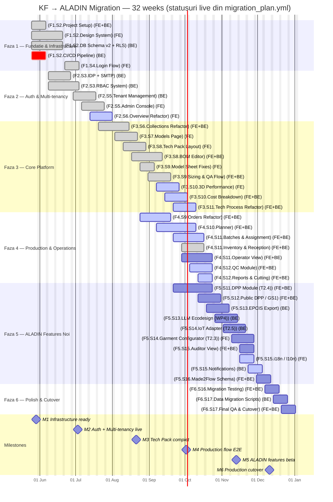

# Migration Gantt — KF → ALADIN Platform

<!-- AUTO:meta-header -->

> **Project span (auto):** **2026-05-04** (CW19) → **2026-12-11** (CW50) · **32** weeks · **16** sprints of 2 weeks

<!-- /AUTO:meta-header -->

> **Versiune:** mai 2026
> **Echipa:** 2 persoane (1 Frontend + 1 Backend) — full-time, 40h/săptămână
> **Total estimat:** ~32 săptămâni (~8 luni)
> **Bază de calcul:** documentul `user-journey-master-RO.md` / `user-journey-master-EN.md`

> Tabelul de calendar și antetul de proiect de mai sus sunt regenerate automat
> din `docs/_data/calendar.yml`. Pentru a schimba data de start sau lungimea
> proiectului, editează acel fișier și fă PR — următorul aggregator run
> rescrie blocurile `AUTO:*`. Restul paginii este proză editată manual.

---

## 1. Asumpții & metodologie

### 1.1 Asumpții de bază

- **2 persoane** care lucrează în paralel: 1 Frontend dev + 1 Backend dev
- **40h/săptămână** per persoană
- **Sprint length:** 2 săptămâni (Luni → Vineri ×2)
- **Săptămâna proiect (PW)** începe **Luni** și se închide **Vineri**
- **Indexare săptămâni:** PW1 = CW19 (calendar 2026); vezi tabelul de calendar de mai jos
- **Buffer:** 20% per task (deja inclus în estimări)
- **Code review:** între cei 2 dev → 1h/zi inclus în timpii task-urilor
- **Daily sync:** 15 min/zi inclus

### 1.2 Glossary — pills & abrevieri

Documentul folosește **text pills** (`[LABEL]`) în loc de iconițe. Toate categoriile de mai jos apar ca etichete în tabelele de task-uri și în Gantt.

#### Work-type pills (coloana `Tip`)

| Pill | Înțeles | Definiție |
|---|---|---|
| `[REFACTOR]`    | Refactor    | Componenta există în KF, dar necesită rescris/restructurare |
| `[NEW]`         | New         | Componentă complet nouă (ALADIN feature), fără echivalent în KF |
| `[BUGFIX]`      | Bugfix      | Reparare bug existent fără rescriere arhitecturală |
| `[INTEGRATION]` | Integration | Integrare cu serviciu/sistem extern (IDP, SMTP, Made2Flow, MQTT broker, etc.) |
| `[SETUP]`       | Setup       | Infrastructure, tooling, CI/CD, configurare |
| `[REFACTOR+NEW]`| Hybrid      | Refactor pe o parte existentă + adăugare componentă nouă în același task |

#### Size pills (coloana `Size`)

| Pill | Înțeles | Effort estimat |
|---|---|---|
| `S`  | Small       | 1-3 zile |
| `M`  | Medium      | 3-7 zile |
| `L`  | Large       | 1-2 săptămâni |
| `XL` | Extra Large | 2-4 săptămâni |

#### Owner pills (coloana `Owner`)

| Pill | Înțeles |
|---|---|
| `FE`    | Frontend dev exclusiv |
| `BE`    | Backend dev exclusiv |
| `FE+BE` | Cross-stack — apare în ambele swimlanes ale sprintului |

#### Status/severity pills (folosite în secțiunile de risc & capacitate)

| Pill | Înțeles | Acțiune |
|---|---|---|
| `[WARN]`     | Atenție — depășire ușoară (5-15%) sau condiție de monitorizat | Tracking săptămânal, nu blochează |
| `[BLOCKER]`  | Blocant — dependență externă neîndeplinită sau depășire >15% | Necesită decizie escaladată |
| `[OK]`       | În parametri normali | Niciuna |

#### Abrevieri de timp

| Abrev | Înțeles |
|---|---|
| `PW` | Project Week — săptămâna proiectului, indexată 1-32 |
| `CW` | Calendar Week — săptămâna calendaristică ISO 2026 (CW19 = PW1) |
| `S1..S16` | Sprint number — sprint de 2 săptămâni (S1 = PW1-2 = CW19-20) |
| `Mon` | Luni — start de săptămână / start task |
| `Fri` | Vineri — sfârșit de săptămână / end task |

---

## 2. Calendar — Project Week ↔ Calendar Week ↔ Sprint

> Tabelul este **regenerat automat** din `docs/_data/calendar.yml`. Pentru a schimba data de start, lungimea proiectului sau granițele de fază, editează acel fișier — nu acest tabel.

<!-- AUTO:calendar -->

| PW | CW | Mon (start) | Fri (end) | Sprint | Faza |
|---:|---:|---|---|:-:|---|
|  1 | 19 | 2026-05-04 | 2026-05-08 |  S1 | 1 |
|  2 | 20 | 2026-05-11 | 2026-05-15 |  S1 | 1 |
|  3 | 21 | 2026-05-18 | 2026-05-22 |  S2 | 1 / 2 |
|  4 | 22 | 2026-05-25 | 2026-05-29 |  S2 | 1 / 2 |
|  5 | 23 | 2026-06-01 | 2026-06-05 |  S3 | 2 |
|  6 | 24 | 2026-06-08 | 2026-06-12 |  S3 | 2 |
|  7 | 25 | 2026-06-15 | 2026-06-19 |  S4 | 2 |
|  8 | 26 | 2026-06-22 | 2026-06-26 |  S4 | 2 / 3 |
|  9 | 27 | 2026-06-29 | 2026-07-03 |  S5 | 2 / 3 |
| 10 | 28 | 2026-07-06 | 2026-07-10 |  S5 | 3 |
| 11 | 29 | 2026-07-13 | 2026-07-17 |  S6 | 3 |
| 12 | 30 | 2026-07-20 | 2026-07-24 |  S6 | 3 |
| 13 | 31 | 2026-07-27 | 2026-07-31 |  S7 | 3 |
| 14 | 32 | 2026-08-03 | 2026-08-07 |  S7 | 3 / 4 |
| 15 | 33 | 2026-08-10 | 2026-08-14 |  S8 | 3 / 4 |
| 16 | 34 | 2026-08-17 | 2026-08-21 |  S8 | 3 / 4 |
| 17 | 35 | 2026-08-24 | 2026-08-28 |  S9 | 3 / 4 |
| 18 | 36 | 2026-08-31 | 2026-09-04 |  S9 | 3 / 4 / 5 |
| 19 | 37 | 2026-09-07 | 2026-09-11 | S10 | 3 / 4 / 5 |
| 20 | 38 | 2026-09-14 | 2026-09-18 | S10 | 3 / 4 / 5 |
| 21 | 39 | 2026-09-21 | 2026-09-25 | S11 | 3 / 4 / 5 |
| 22 | 40 | 2026-09-28 | 2026-10-02 | S11 | 4 / 5 |
| 23 | 41 | 2026-10-05 | 2026-10-09 | S12 | 5 |
| 24 | 42 | 2026-10-12 | 2026-10-16 | S12 | 5 |
| 25 | 43 | 2026-10-19 | 2026-10-23 | S13 | 5 |
| 26 | 44 | 2026-10-26 | 2026-10-30 | S13 | 5 / 6 |
| 27 | 45 | 2026-11-02 | 2026-11-06 | S14 | 5 / 6 |
| 28 | 46 | 2026-11-09 | 2026-11-13 | S14 | 6 |
| 29 | 47 | 2026-11-16 | 2026-11-20 | S15 | 6 |
| 30 | 48 | 2026-11-23 | 2026-11-27 | S15 | 6 |
| 31 | 49 | 2026-11-30 | 2026-12-04 | S16 | 6 |
| 32 | 50 | 2026-12-07 | 2026-12-11 | S16 | 6 |

<!-- /AUTO:calendar -->

---

## 3. Faze de migrare

Migrarea e organizată în **6 faze** prioritizate, conform deciziei din template:

```
FAZA 1 — Fundație & Infrastructure   (PW 1-4   / CW 19-22)
FAZA 2 — Auth & Multi-tenancy        (PW 3-9   / CW 21-27)
FAZA 3 — Core Platform               (PW 8-21  / CW 26-39)
FAZA 4 — Production & Operations     (PW 14-22 / CW 32-40)
FAZA 5 — ALADIN Features Noi         (PW 18-27 / CW 36-45)
FAZA 6 — Polish & Migration Cutover  (PW 26-32 / CW 44-50)
```

Fazele se suprapun pentru a paraleliza munca FE/BE.

---

## 4. Mermaid Gantt

> Gantt-ul de mai jos este regenerat automat din `docs/_data/migration_plan.yml`
> (plan-of-record: nume task-uri `[F.S.Name]`, date, statusuri) și
> `docs/_data/calendar.yml` (milestones). Barele sunt colorate RAG după status.
> Pentru schimbări, editează acele fișiere — nu blocul de mai jos.

<!-- AUTO:migration-gantt -->



<!-- /AUTO:migration-gantt -->

<p class="gantt-legend"><span class="pill pill--planned">Planned</span><span class="pill pill--active">In work</span><span class="pill pill--late">Late / At risk</span><span class="pill pill--done">Done</span></p>

---

## 5. Faze detaliate (cu date Mon/Fri)

### FAZA 1 — Fundație & Infrastructure (PW 1-4 / CW 19-22)

| Task | Owner | Size | PW | Mon start | Fri end | Tip | Note |
|---|---|---|---|---|---|---|---|
| Project setup (repo, monorepo, conventions) | BE+FE | S | 1-2  | 2026-05-04 | 2026-05-15 | [SETUP] | Lerna/Nx, ESLint, Prettier, Husky |
| Design system & design tokens | FE   | L | 1-4  | 2026-05-04 | 2026-05-29 | [SETUP] | Tailwind config, primitives, Storybook |
| Database schema v2 design + migrations | BE   | L | 1-4  | 2026-05-04 | 2026-05-29 | [SETUP] | Multi-tenant row-level |
| CI/CD pipeline | BE   | S | 1-2  | 2026-05-04 | 2026-05-15 | [SETUP] | GitHub Actions / GitLab CI |

**Outcome:** infrastructure pregătită pentru dezvoltare paralelă FE/BE.

---

### FAZA 2 — Auth & Multi-tenancy (PW 3-9 / CW 21-27)

| Task | Owner | Size | PW | Mon start | Fri end | Tip | Note |
|---|---|---|---|---|---|---|---|
| IDP setup (Keycloak/Auth0/logTo) + SMTP | BE | M | 3-5 | 2026-05-18 | 2026-06-05 | [INTEGRATION] | Fix refresh token, forgot pw, invite |
| RBAC system (scopes, claims, middleware) | BE | L | 3-6 | 2026-05-18 | 2026-06-12 | [NEW] | OAuth2 scopes design + enforcement |
| Login flow + redirect handling | FE | M | 5-6 | 2026-06-01 | 2026-06-12 | [REFACTOR] | Reactiv UI, error handling |
| Tenant management (CRUD, provisioning) | BE | L | 6-8 | 2026-06-08 | 2026-06-26 | [NEW] | Row-level isolation, S3 prefix |
| Admin Console UI | FE | L | 7-9 | 2026-06-15 | 2026-07-03 | [NEW] | Platform Admin operations |

**Outcome:** orice user se poate autentifica și e izolat per tenant. Platform Admin poate provisiona tenants.

---

### FAZA 3 — Core Platform (PW 8-21 / CW 26-39)

| Task | Owner | Size | PW | Mon start | Fri end | Tip | Note |
|---|---|---|---|---|---|---|---|
| Overview refactor (dynamic widgets per rol) | FE   | M | 8-10  | 2026-06-22 | 2026-07-10 | [REFACTOR] | + backend Deadline & Recent Activity |
| Collections fix + refactor | FE+BE | L | 9-12  | 2026-06-29 | 2026-07-24 | [REFACTOR] | Fix Kanban, season relations |
| Models Page refactor (filtere per rol) | FE   | M | 11-13 | 2026-07-13 | 2026-07-31 | [REFACTOR] | + search robust |
| Tech Pack layout (sidebar, tooltips, guide) | FE   | M | 12-14 | 2026-07-20 | 2026-08-07 | [REFACTOR] | |
| BOM editor + LLM ecodesign hook | FE+BE | L | 13-16 | 2026-07-27 | 2026-08-21 | [REFACTOR+NEW] | Fix PDF export, integrare LLM stub |
| Model Sheet fixes (imagini, reconciliere BOM) | FE   | S | 14-15 | 2026-08-03 | 2026-08-14 | [BUGFIX] | |
| Sizing Table & QA Flow customizabil | FE+BE | M | 15-17 | 2026-08-10 | 2026-08-28 | [REFACTOR] | Customizabil per tenant |
| 3D Model performance optimization | FE   | M | 16-18 | 2026-08-17 | 2026-09-04 | [BUGFIX] | Multi-mesh, asset pipeline |
| Cost Breakdown & OCS clarification | FE+BE | M | 17-19 | 2026-08-24 | 2026-09-11 | [REFACTOR] | Approval workflow Buyer |
| Tech Process refactor (alinare BE update) | FE+BE | M | 18-20 | 2026-08-31 | 2026-09-18 | [REFACTOR] | |
| Inventory & Reception (refactor types) | FE+BE | M | 19-21 | 2026-09-07 | 2026-09-25 | [REFACTOR] | Fix qty Packaging bug, UOM |

**Outcome:** întreaga zonă de configurare produs migrată și funcțională.

---

### FAZA 4 — Production & Operations (PW 14-22 / CW 32-40)

| Task | Owner | Size | PW | Mon start | Fri end | Tip | Note |
|---|---|---|---|---|---|---|---|
| Orders refactor (Order Name, pricing, tracking) | FE+BE | L  | 14-17 | 2026-08-03 | 2026-08-28 | [REFACTOR] | + Buyer tracking portal |
| Planner (Calendar/Gantt/Kanban switch) | FE+BE | XL | 16-20 | 2026-08-17 | 2026-09-18 | [NEW] | Backend complet nou |
| Batches & Assignment | FE+BE | L  | 18-21 | 2026-08-31 | 2026-09-25 | [REFACTOR] | Operator assignment integrat |
| Operator View tablet (full implementation) | FE+BE | XL | 19-22 | 2026-09-07 | 2026-10-02 | [NEW] | Timer, QR scan, defect flag, 3D viewer |
| QC Module | FE+BE | L  | 20-22 | 2026-09-14 | 2026-10-02 | [NEW] | Inspection flow, defect logger |
| Reports & Cutting (camera integration) | FE+BE | M  | 21-22 | 2026-09-21 | 2026-10-02 | [REFACTOR] | COCO export |

**Outcome:** flow complet de producție de la planning la execuție pe podea, plus QC.

---

### FAZA 5 — ALADIN Features Noi (PW 18-27 / CW 36-45)

| Task | Owner | Size | PW | Mon start | Fri end | Tip | Note |
|---|---|---|---|---|---|---|---|
| DPP Module (data model, dashboard, validation) | FE+BE | XL | 18-22 | 2026-08-31 | 2026-10-02 | [NEW] | T2.4 ALADIN |
| Public DPP / GS1 Digital Link / QR | FE+BE | L  | 21-23 | 2026-09-21 | 2026-10-09 | [NEW] | Public endpoint, no auth |
| EPCIS Export (JSON, PDF) | BE    | L  | 22-24 | 2026-09-28 | 2026-10-16 | [NEW] | GS1 standard, possibly signed |
| LLM Ecodesign full integration | BE    | L  | 23-25 | 2026-10-05 | 2026-10-23 | [NEW] | WP4 T4.1 data |
| IoT Adapter & Event Log (MQTT) | BE    | L  | 24-26 | 2026-10-12 | 2026-10-30 | [NEW] | T2.5 ALADIN |
| Garment Configurator B2C | FE    | L  | 25-27 | 2026-10-19 | 2026-11-06 | [NEW] | T2.3 ALADIN, embeddable |
| Auditor View (cross-tenant) | FE+BE | M  | 26-27 | 2026-10-26 | 2026-11-06 | [NEW] | Elevated scope |

**Outcome:** features ALADIN complete, gata pentru parteneri EU.

---

### FAZA 6 — Polish & Migration Cutover (PW 26-32 / CW 44-50)

| Task | Owner | Size | PW | Mon start | Fri end | Tip | Note |
|---|---|---|---|---|---|---|---|
| i18n / l10n (EN + RO + customizable) | FE    | M | 26-27 | 2026-10-26 | 2026-11-06 | [NEW] | Toate stringurile, RTL ready |
| Notifications multi-channel (email, SMS, webhook, in-app) | BE    | M | 27-28 | 2026-11-02 | 2026-11-13 | [NEW] | Templates per tip |
| Made2Flow dynamic JSONB schema | FE+BE | M | 28-29 | 2026-11-09 | 2026-11-20 | [REFACTOR] | |
| Migration testing (data + flow) | FE+BE | M | 29-30 | 2026-11-16 | 2026-11-27 | [SETUP] | E2E tests |
| Data migration scripts KF → ALADIN | BE    | M | 30-31 | 2026-11-23 | 2026-12-04 | [SETUP] | One-shot + rollback |
| Final QA & production cutover | FE+BE | M | 31-32 | 2026-11-30 | 2026-12-11 | [SETUP] | Smoke tests, monitoring |

**Outcome:** platforma în producție, KF migrat complet pe ALADIN.

---

## 6. Sprint Plan — 16 sprinturi (2 săptămâni, FE + BE swimlanes)

Fiecare sprint = 2 PW (10 zile lucrătoare). FE / BE listează task-urile **active** în fereastra sprintului (chiar dacă acel task se întinde peste mai multe sprinturi).

| Sprint | PW | CW | Mon → Fri | FE swimlane | BE swimlane |
|:-:|:-:|:-:|---|---|---|
| **S1**  | 1-2   | 19-20 | 2026-05-04 → 2026-05-15 | Project setup • Design system • CI/CD (assist) | Project setup • DB schema v2 • CI/CD |
| **S2**  | 3-4   | 21-22 | 2026-05-18 → 2026-05-29 | Design system (cont) | DB schema v2 (cont) • IDP setup (start) • RBAC (start) |
| **S3**  | 5-6   | 23-24 | 2026-06-01 → 2026-06-12 | Login flow | IDP setup (finish PW5) • RBAC (cont) • Tenant mgmt (start PW6) |
| **S4**  | 7-8   | 25-26 | 2026-06-15 → 2026-06-26 | Admin Console (start) | Tenant mgmt (cont) |
| **S5**  | 9-10  | 27-28 | 2026-06-29 → 2026-07-10 | Admin Console (finish PW9) • Overview refactor • Collections (start) | Collections (start PW9) |
| **S6**  | 11-12 | 29-30 | 2026-07-13 → 2026-07-24 | Models Page • Collections (cont) • Tech Pack layout (start PW12) | Collections (cont/finish PW12) |
| **S7**  | 13-14 | 31-32 | 2026-07-27 → 2026-08-07 | Models Page (finish PW13) • Tech Pack layout • BOM editor (start) • Model Sheet (start PW14) | BOM editor (start) • Orders refactor (start PW14) |
| **S8**  | 15-16 | 33-34 | 2026-08-10 → 2026-08-21 | BOM editor (cont) • Model Sheet (finish PW15) • Sizing & QA • 3D performance (start PW16) | BOM editor (finish PW16) • Sizing & QA • Orders refactor • Planner (start PW16) |
| **S9**  | 17-18 | 35-36 | 2026-08-24 → 2026-09-04 | Sizing & QA (finish PW17) • 3D performance • Cost Breakdown & OCS • Tech Process (start PW18) • Orders • Planner • DPP (start PW18) | Cost Breakdown & OCS • Tech Process • Orders (finish PW17) • Planner • Batches (start PW18) • DPP (start PW18) |
| **S10** | 19-20 | 37-38 | 2026-09-07 → 2026-09-18 | Cost Breakdown (finish PW19) • Tech Process • Inventory & Reception • Planner (finish PW20) • Operator View (start PW19) • DPP | Tech Process • Inventory & Reception • Planner (finish PW20) • Batches • Operator View (start PW19) • DPP |
| **S11** | 21-22 | 39-40 | 2026-09-21 → 2026-10-02 | Inventory & Reception (finish PW21) • Batches (finish PW21) • Operator View • QC • Reports & Cutting • DPP (finish PW22) • Public DPP | Batches (finish PW21) • Operator View • QC • Reports & Cutting • DPP (finish PW22) • Public DPP • EPCIS (start PW22) |
| **S12** | 23-24 | 41-42 | 2026-10-05 → 2026-10-16 | Public DPP (finish PW23) | EPCIS (finish PW24) • LLM Ecodesign (start PW23) • IoT Adapter (start PW24) |
| **S13** | 25-26 | 43-44 | 2026-10-19 → 2026-10-30 | Garment Configurator • Auditor View (start PW26) • i18n (start PW26) | LLM Ecodesign (finish PW25) • IoT Adapter (finish PW26) • Auditor View (start PW26) |
| **S14** | 27-28 | 45-46 | 2026-11-02 → 2026-11-13 | Garment Configurator (finish PW27) • Auditor View (finish PW27) • i18n (finish PW27) | Auditor View (finish PW27) • Notifications multi-channel |
| **S15** | 29-30 | 47-48 | 2026-11-16 → 2026-11-27 | Made2Flow schema • Migration testing | Made2Flow schema • Migration testing • Data migration scripts (start PW30) |
| **S16** | 31-32 | 49-50 | 2026-11-30 → 2026-12-11 | Final QA & cutover | Data migration scripts (finish PW31) • Final QA & cutover |

> Notă: task-urile cu owner `FE+BE` apar în ambele swimlanes — coordonare cross-stack obligatorie în standup-ul de sprint.

### 7.1 Ceremonii per sprint (recomandare)

| Ceremonie | Când | Durata |
|---|---|---|
| Sprint Planning | Luni PW impar (start sprint) — Sxx.D1 | 1h |
| Daily Sync | Zilnic Luni-Vineri | 15 min |
| Mid-sprint Review | Vineri PW impar (end W1) | 30 min |
| Sprint Review + Demo | Vineri PW par (end sprint) | 1h |
| Sprint Retro | Vineri PW par (after Review) | 30 min |

---

## 7. Sumar timeline & resurse

### 8.1 Total ore estimate

| Faza | Frontend (h) | Backend (h) | Total (h) | Săptămâni |
|---|---:|---:|---:|---:|
| Faza 1 — Fundație | 120 | 160 | 280 | 4 |
| Faza 2 — Auth & Multi-tenancy | 120 | 200 | 320 | 5 |
| Faza 3 — Core Platform | 320 | 280 | 600 | 11 |
| Faza 4 — Production & Operations | 240 | 280 | 520 | 9 |
| Faza 5 — ALADIN Features | 240 | 320 | 560 | 11 |
| Faza 6 — Polish & Cutover | 80 | 120 | 200 | 7 |
| **TOTAL** | **1,120** | **1,360** | **2,480** | **~32** |

> Notă: ore calculate pe 5 zile/săptămână × 8h/zi. Cu 20% buffer inclus.

### 8.2 Capacitate vs cerere

| Persoană | Capacitate (32 săpt × 40h) | Estimare | Utilizare |
|---|---:|---:|---:|
| Frontend Dev | 1,280h | 1,120h | 87% |
| Backend Dev | 1,280h | 1,360h | **106%** `[WARN]` |

**`[WARN]` Backend dev e suprasolicitat cu ~80h.** Recomandare:

- Opțiunea A: prelungire cu **2 săptămâni** (32 → 34 săptămâni; cutover slip to ~2026-12-25 / CW52)
- Opțiunea B: adăugare **0.5 FTE backend** în Fazele 4-5 (perioada cea mai intensă: S9-S13)
- Opțiunea C: descope unele features noi (LLM Ecodesign sau IoT) pentru post-cutover

---

## 8. Milestones cheie

| Milestone | PW / CW | Data (Fri) | Sprint | Livrabil |
|---|:-:|:-:|:-:|---|
| **M1** — Infrastructure ready | PW4 / CW22 | 2026-05-29 | S2 | Repo, CI/CD, design system, DB schema |
| **M2** — Auth + Multi-tenancy live | PW9 / CW27 | 2026-07-03 | S5 | Login funcțional, Platform Admin poate crea tenants |
| **M3** — Tech Pack complet | PW16 / CW34 | 2026-08-21 | S8 | Toate secțiunile Tech Pack migrate + funcționale |
| **M4** — Production flow E2E | PW22 / CW40 | 2026-10-02 | S11 | Order → Planner → Batch → Operator → QC funcțional |
| **M5** — ALADIN features beta | PW28 / CW46 | 2026-11-13 | S14 | DPP + Configurator + IoT testabile |
| **M6** — Production cutover | PW32 / CW50 | 2026-12-11 | S16 | KF migrat complet, platforma live |

---

## 9. Riscuri & mitigare

| Risc | Probabilitate | Impact | Mitigare |
|---|:-:|:-:|---|
| Backend supraîncărcat | High | Medium | Opțiunile A/B/C de mai sus |
| 3D performance imprevizibilă | Medium | Medium | Investigare devreme în Faza 3 (POC) |
| Made2Flow API instabil | Medium | Low | Schema dinamică izolează schimbările |
| LLM ecodesign cost API | Medium | Medium | Caching, fallback la rule-based |
| Multi-tenancy data leakage | Low | High | Code review obligatoriu + automated tests |
| Adopție Operator tablet | Medium | High | User testing devreme cu operatori reali |
| EPCIS standard schimbat | Low | Medium | Versionare strict + update strategy |

---

## 10. Dependențe externe

| Dependență | Necesar până în | Data (Fri) | Owner |
|---|:-:|:-:|---|
| Decizie finală IDP (Keycloak/Auth0/logTo) | PW3 / CW21 | 2026-05-22 | CTO |
| Hardware tabletă fabrică | PW19 / CW37 | 2026-09-11 | KF Operations |
| Camera fabrică pentru Cutting | PW21 / CW39 | 2026-09-25 | KF Operations |
| Spec EPCIS finalizat (GS1) | PW22 / CW40 | 2026-10-02 | ALADIN partners |
| WP4 T4.1 material data | PW23 / CW41 | 2026-10-09 | DITF / Mitwill |
| Acces API Made2Flow | PW28 / CW46 | 2026-11-13 | Partner |
| Acces cluster Kubernetes producție | PW30 / CW48 | 2026-11-27 | DevOps |

---

## 11. Gantt Chart — vizualizare timeline (ASCII)

```
PW:  1  2  3  4  5  6  7  8  9 10 11 12 13 14 15 16 17 18 19 20 21 22 23 24 25 26 27 28 29 30 31 32
CW: 19 20 21 22 23 24 25 26 27 28 29 30 31 32 33 34 35 36 37 38 39 40 41 42 43 44 45 46 47 48 49 50
═════════════════════════════════════════════════════════════════════════════════════════════════════
FAZA 1 — Fundație
  Project setup (BE+FE)       ██ ██
  Design system & tokens (FE) ██ ██ ██ ██
  Database schema v2 (BE)     ██ ██ ██ ██
  CI/CD pipeline (BE)         ██ ██

FAZA 2 — Auth & Multi-tenancy
  IDP setup & SMTP (BE)             ██ ██ ██
  RBAC system (BE)                  ██ ██ ██ ██
  Login flow (FE)                         ██ ██
  Tenant management (BE)                     ██ ██ ██
  Admin Console (FE)                            ██ ██ ██

FAZA 3 — Core Platform
  Overview refactor (FE)                        ██ ██ ██
  Collections fix+refactor (FE+BE)                 ██ ██ ██ ██
  Models Page refactor (FE)                              ██ ██ ██
  Tech Pack layout (FE)                                     ██ ██ ██
  BOM editor + LLM hook (FE+BE)                                ██ ██ ██ ██
  Model Sheet fixes (FE)                                          ██ ██
  Sizing & QA Flow (FE+BE)                                           ██ ██ ██
  3D Model performance (FE)                                             ██ ██ ██
  Cost Breakdown & OCS (FE+BE)                                             ██ ██ ██
  Tech Process refactor (FE+BE)                                               ██ ██ ██
  Inventory & Reception (FE+BE)                                                  ██ ██ ██

FAZA 4 — Production & Operations
  Orders refactor (FE+BE)                                       ██ ██ ██ ██
  Planner (Calendar/Gantt/Kanban) (FE+BE)                             ██ ██ ██ ██ ██
  Batches & Assignment (FE+BE)                                              ██ ██ ██ ██
  Operator View (tablet) (FE+BE)                                               ██ ██ ██ ██
  QC Module (FE+BE)                                                               ██ ██ ██
  Reports & Cutting (FE+BE)                                                          ██ ██

FAZA 5 — ALADIN Features Noi
  DPP Module (FE+BE)                                                  ██ ██ ██ ██ ██
  Public DPP / GS1 QR (FE+BE)                                                  ██ ██ ██
  EPCIS Export (BE)                                                               ██ ██ ██
  LLM Ecodesign full (BE)                                                            ██ ██ ██
  IoT Adapter & Events (BE)                                                             ██ ██ ██
  Garment Configurator B2C (FE)                                                            ██ ██ ██
  Auditor View (FE+BE)                                                                        ██ ██

FAZA 6 — Polish & Cutover
  i18n / l10n (FE)                                                                            ██ ██
  Notifications multi-channel (BE)                                                                ██ ██
  Made2Flow dynamic schema (FE+BE)                                                                    ██ ██
  Migration testing (FE+BE)                                                                              ██ ██
  Data migration scripts (BE)                                                                                ██ ██
  Final QA & cutover (FE+BE)                                                                                    ██ ██

LEGEND: ██ = activ
```
