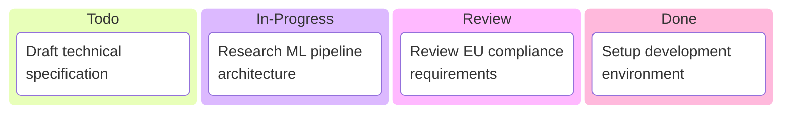

# ai-rise

> Internal

## Status

| Metric | Value |
| :--- | :--- |
| Status | Active |
| Type | Internal |
| PO | po@kf-team.dev |
| Lead | lead@kf-team.dev |
| Current Sprint | S3 |
| Sprint Period | 2026-03-03 to 2026-03-14 |
| Tags | - |
| Dependencies | None |

## Current Sprint Kanban

## Task Summary

| Task | Assignee | Effort | Status |
| :--- | :--- | :--- | :--- |
| Research ML pipeline architecture | @alex | 3d | In Progress |
| Draft technical specification | @maria | 2d | Todo |
| Setup development environment | @alex | 1d | Done |
| Review EU compliance requirements | @lead | 2d | Review |

## LOE Summary

| Metric | Value |
| :--- | :--- |
| Total Effort | 8.0d |
| In Progress | 3.0d |
| Completed | 1.0d |
| Remaining | 7.0d |

## Links

- [Repository](https://github.com/kf-team/ai-rise)
- [Kanban Board](https://github.com/kf-team/ai-rise/blob/main/kanban.md)

---

*Auto-generated by KF Aggregator*