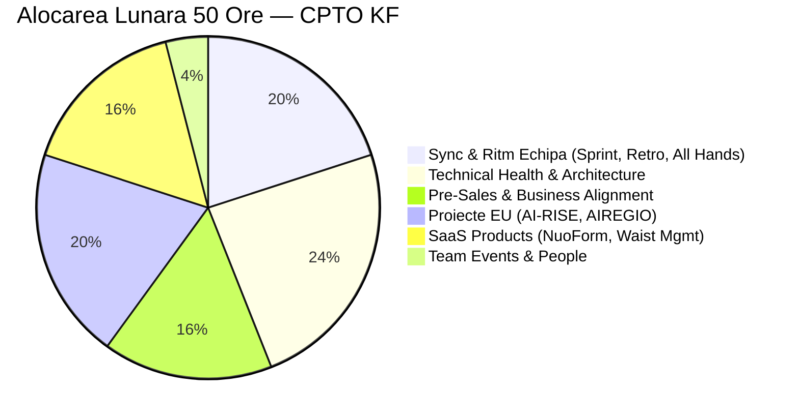
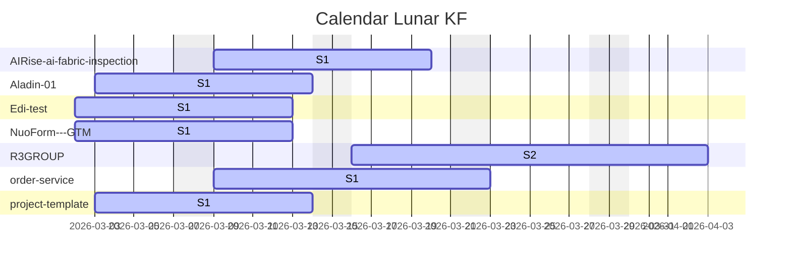

# KF Team — Unified Calendar

> CPTO 50h Monthly Allocation

```mermaid
pie title Alocarea Lunara 50 Ore — CPTO KF
    "Sync & Ritm Echipa (Sprint, Retro, All Hands)" : 10
    "Technical Health & Architecture" : 12
    "Pre-Sales & Business Alignment" : 8
    "Proiecte EU (AI-RISE, AIREGIO)" : 10
    "SaaS Products (NuoForm, Waist Mgmt)" : 8
    "Team Events & People" : 2
```

## Sprint Calendar

```mermaid
gantt
    title Calendar Lunar KF
    dateFormat YYYY-MM-DD
    excludes weekends

    section AIRise-ai-fabric-inspection
    S1 :active, 2026-03-09, 2026-03-20
    section Aladin-01
    S1 :active, 2026-03-03, 2026-03-14
    section Edi-test
    S1 :active, 2026-03-02, 2026-03-13
    section NuoForm---GTM
    S1 :active, 2026-03-02, 2026-03-13
    section R3GROUP
    S2 :active, 2026-03-16, 2026-04-03
    section order-service
    S1 :active, 2026-03-09, 2026-03-23
    section project-template
    S1 :active, 2026-03-03, 2026-03-14
```