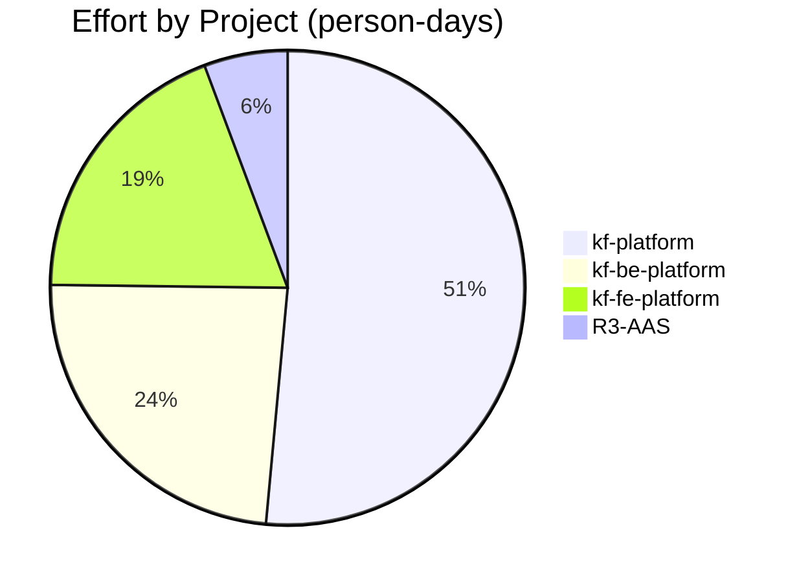
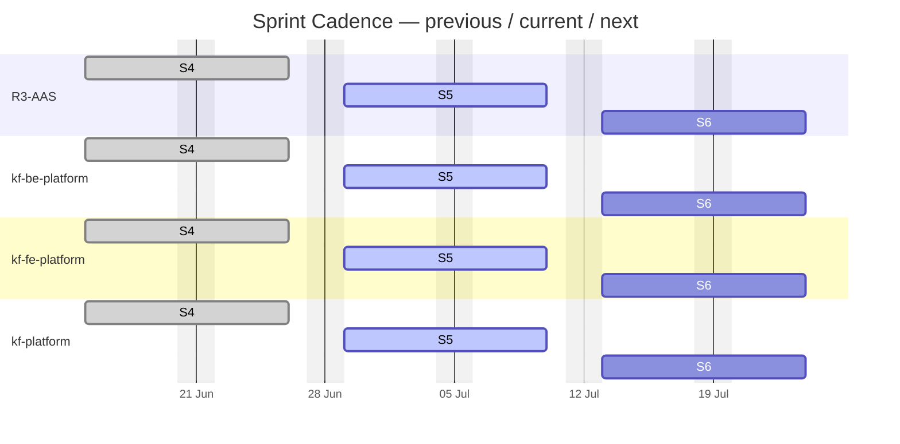
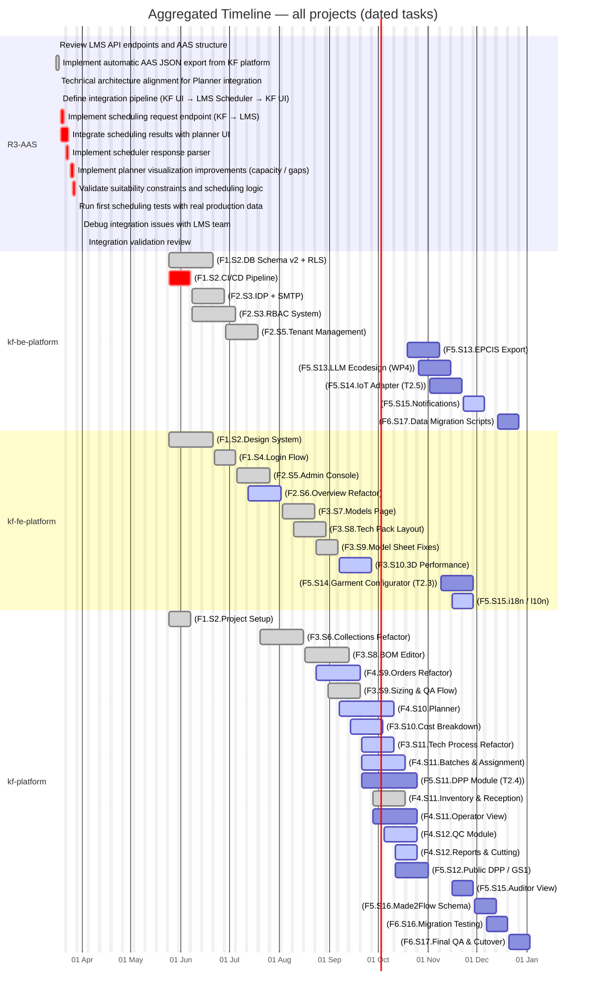
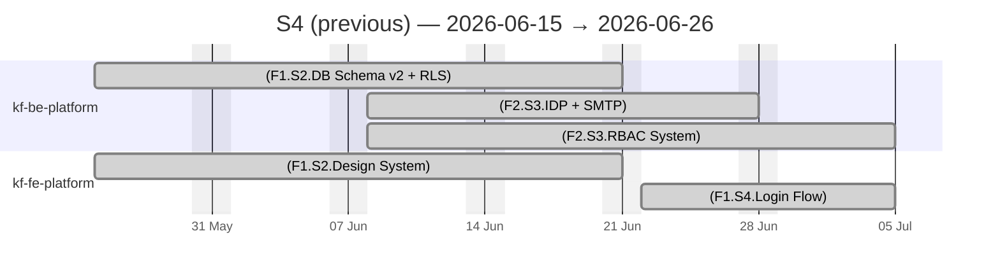
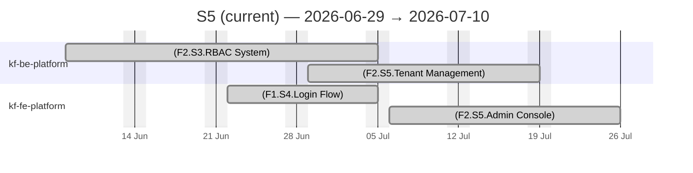
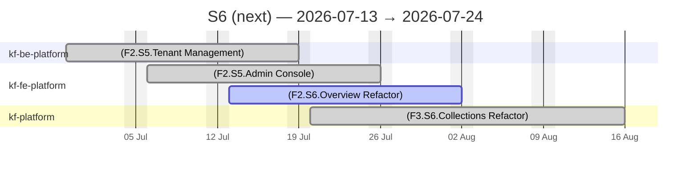

# KF Team — Unified Calendar

> Effort by Project (person-days)

## Sprint Timeline

> Previous · current · next sprint per project (from each repo's declared sprint)

PlannedIn workLate / At riskDone

## Full Timeline — All Projects

> Every dated task across all tracked repos, coloured by status

PlannedIn workLate / At riskDone

## Sprint Views — previous / current / next

### Sprint S4 (previous) — 2026-06-15 → 2026-06-26

PlannedIn workLate / At riskDone

### Sprint S5 (current) — 2026-06-29 → 2026-07-10

PlannedIn workLate / At riskDone

### Sprint S6 (next) — 2026-07-13 → 2026-07-24

PlannedIn workLate / At riskDone

