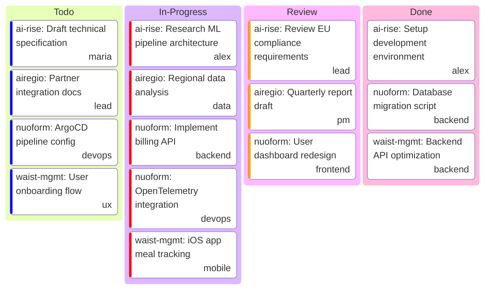

# KF Team — Unified Kanban

> Auto-generated from all project kanbans

Todo
In Progress
Review
Done

## Summary by Project

| Project | Todo | In Progress | Review | Done | Total |
| :--- | :---: | :---: | :---: | :---: | :---: |
| ai-rise | 1 | 1 | 1 | 1 | 4 |
| airegio | 1 | 1 | 1 | 0 | 3 |
| nuoform | 1 | 2 | 1 | 1 | 5 |
| waist-mgmt | 1 | 1 | 0 | 1 | 3 |