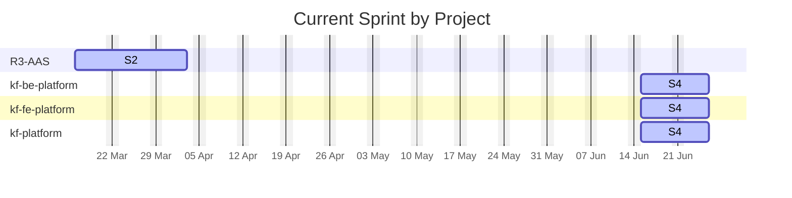

# KF Team — Unified Kanban

> Auto-generated from all project kanbans

Todo
In Progress
Review
Done

```mermaid
kanban
  Todo
    task4["R3-AAS: Feature set pentru lansare (MVP)"]
    task5["R3-AAS: Ce este „Done” vs „Ready” pentru release"]
    task8["R3-AAS: Sesiune demo produse (intern)"]
    task9["R3-AAS: Pregătire feature flags (ascundere features incomplete)"]
    task10["R3-AAS: Clarificare value proposition (perspectivă tehnică)"]
    task14["R3-AAS: Flow sistem (UI → AAS → backend)"]
    task18["R3-AAS: Layout simplificat pilot (stații + flux + senzori)"]
    task23["R3-AAS: Backend alignment (după modificări Răzvan)"]
    task24["R3-AAS: Bug-uri identificate în sistem"]
    task28["R3-AAS: Instalare senzor 3 (poziție cutie/flux materiale) — T3.3"]
    task30["R3-AAS: Task-uri ↔ Work Packages (WP mapping)"]
    task31["R3-AAS: Naming convention pentru task-uri (namespace per proiect)"]
    task32["R3-AAS: Evitarea dublării task-urilor între tools"]
    task33["R3-AAS: Reprezentare Gantt (timeline / corelare temporală)"]
    task37["R3-AAS: Feature flags"]
    task38["R3-AAS: Telemetrie (monitorizare)"]
    task39["R3-AAS: Code quality / stability înainte de release"]
    task40["R3-AAS: Suport tehnic post-launch"]
    task43["R3-AAS: Conectivitate sisteme externe"]
    task44["R3-AAS: Testare demo produse (clienți + testeri interni)"]
    task45["R3-AAS: Interviuri tehnice full-stack"]
    task46["R3-AAS: Evaluare competențe React + Node"]
    task47["R3-AAS: Evaluare team fit (non-toxic, colaborativ)"]
    task48["R3-AAS: Selectare profil echilibrat (nu doar tech heavy)"]
    task49["R3-AAS: Sprint plan (tranziție către GTM)"]
    task50["R3-AAS: Corelare Sprint tasks ↔ Work Packages"]
    task51["R3-AAS: Task-uri cu timeline (start/end)"]
    task52["R3-AAS: Rapoarte săptămânale (nu daily)"]
    task53["R3-AAS: Gantt / timeline pentru progres"]
    task54["R3-AAS: Landing page (claritate produs)"]
    task55["R3-AAS: Demo / prezentare produs"]
    task56["R3-AAS: Definire tehnică monetizare (SaaS readiness)"]
    task57["R3-AAS: Input pentru CRM / pipeline (structură tehnică)"]
    task63["R3-AAS: Implement scheduler response parser"]
    task66["R3-AAS: Validate suitability constraints and scheduling logic"]
    task67["R3-AAS: Run first scheduling tests with real production data"]
    task68["R3-AAS: Debug integration issues with LMS team"]
    task69["R3-AAS: Integration validation review"]
    task72["kf-be-platform: IDP setup (Keycloak/Auth0/logTo) + SMTP server"]
    task73["kf-be-platform: RBAC system (scopes, claims, middleware)"]
    task74["kf-be-platform: Tenant management (CRUD, provisioning, S3 prefix)"]
    task75["kf-be-platform: EPCIS Export (JSON, PDF, GS1 standard, possibly signed)"]
    task76["kf-be-platform: LLM Ecodesign full integration — WP4 T4.1"]
    task77["kf-be-platform: IoT Adapter & Event Log (MQTT) — T2.5 ALADIN"]
    task78["kf-be-platform: Notifications multi-channel (email, SMS, webhook, in-app)"]
    task79["kf-be-platform: Data migration scripts KF → ALADIN (one-shot + rollback)"]
    task81["kf-fe-platform: Login flow + redirect handling"]
    task82["kf-fe-platform: Admin Console UI (Platform Admin operations)"]
    task83["kf-fe-platform: Overview refactor (dynamic widgets per rol)"]
    task84["kf-fe-platform: Models Page refactor (filtere per rol, search)"]
    task85["kf-fe-platform: Tech Pack layout (sidebar, tooltips, guide)"]
    task86["kf-fe-platform: Model Sheet fixes (imagini, reconciliere BOM)"]
    task87["kf-fe-platform: 3D Model performance optimization (multi-mesh, asset pipeline)"]
    task88["kf-fe-platform: Garment Configurator B2C (embeddable) — T2.3 ALADIN"]
    task89["kf-fe-platform: i18n / l10n (EN + RO + customizable, RTL ready)"]
    task91["kf-platform: Collections fix + refactor (Kanban, season relations)"]
    task92["kf-platform: BOM editor + LLM ecodesign hook (PDF export fix + stub)"]
    task93["kf-platform: Sizing Table & QA Flow customizabil per tenant"]
    task94["kf-platform: Cost Breakdown & OCS clarification (Buyer approval workflow)"]
    task95["kf-platform: Tech Process refactor (aliniere BE update)"]
    task96["kf-platform: Inventory & Reception refactor (types, qty packaging, UOM)"]
    task97["kf-platform: Orders refactor (Order Name, pricing, Buyer tracking portal)"]
    task98["kf-platform: Planner (Calendar/Gantt/Kanban switch) — backend nou"]
    task99["kf-platform: Batches & Assignment (Operator assignment integrat)"]
    task100["kf-platform: Operator View tablet (Timer, QR scan, defect flag, 3D viewer)"]
    task101["kf-platform: QC Module (Inspection flow, defect logger)"]
    task102["kf-platform: Reports & Cutting (camera integration, COCO export)"]
    task103["kf-platform: DPP Module (data model, dashboard, validation) — T2.4 ALADIN"]
    task104["kf-platform: Public DPP / GS1 Digital Link / QR (no-auth endpoint)"]
    task105["kf-platform: Auditor View (cross-tenant, elevated scope)"]
    task106["kf-platform: Made2Flow dynamic JSONB schema"]
    task107["kf-platform: Migration testing (data + flow E2E)"]
    task108["kf-platform: Final QA & production cutover (smoke tests, monitoring)"]
  In-Progress
    task1["R3-AAS: Deploy AAS în Cloud (hosting)"]
    task2["R3-AAS: Clarificare acces server R3 (Vangelis)"]
    task3["R3-AAS: Clarificare format date platforma R3"]
    task6["R3-AAS: Review arhitectură"]
    task7["R3-AAS: Identificare gaps / incomplete features"]
    task15["R3-AAS: Clarificare acces server R3 (Vangelis)"]
    task16["R3-AAS: Integrare între sisteme (Katty / LMS)"]
    task17["R3-AAS: Multiple tipuri AAS → standardizare"]
    task19["R3-AAS: Integrare LMS (AAS extern)"]
    task22["R3-AAS: UI flow (parțial complet)"]
    task26["R3-AAS: Deploy AAS în Cloud (hosting)"]
    task27["R3-AAS: Clarificare format date pentru platforma R3"]
    task29["R3-AAS: Board central Kanban – single source of truth"]
    task42["R3-AAS: Acces corect la organizații (login flow issues)"]
    task62["R3-AAS: Implement scheduling request endpoint (KF → LMS)"]
    task64["R3-AAS: Integrate scheduling results with planner UI"]
    task65["R3-AAS: Implement planner visualization improvements (capacity / gaps)"]
    task70["kf-be-platform: Database schema v2 design + migrations (multi-tenant RLS)"]
    task71["kf-be-platform: CI/CD pipeline (GitHub Actions / GitLab CI)"]
    task80["kf-fe-platform: Design system & design tokens (Tailwind, primitives, Storybook)"]
    task90["kf-platform: Project setup (repo, monorepo structure, conventions)"]
  Review
    task21["R3-AAS: LMS specs + credentials"]
    task25["R3-AAS: Vizualizare date / UI"]
    task34["R3-AAS: GitHub Actions pentru sync task-uri"]
    task35["R3-AAS: Generare automată status / reports"]
    task36["R3-AAS: Pipeline CI/CD (necesar pentru GTM)"]
  Done
    task11["R3-AAS: Validare integrare end-to-end (expunere API Nuoform)"]
    task12["R3-AAS: Arhitectură multi-tenant (in place)"]
    task13["R3-AAS: Separare date per client (in place)"]
    task20["R3-AAS: Sketch → JSON → sistem"]
    task41["R3-AAS: Acces VPN + onboarding corect"]
    task58["R3-AAS: Review LMS API endpoints and AAS structure"]
    task59["R3-AAS: Technical architecture alignment for Planner integration"]
    task60["R3-AAS: Define integration pipeline (KF UI → LMS Scheduler → KF UI)"]
    task61["R3-AAS: Implement automatic AAS JSON export from KF platform"]
```

## Summary by Project

| Project | Todo | In Progress | Review | Done | Total |
| :--- | :---: | :---: | :---: | :---: | :---: |
| R3-AAS | 38 | 17 | 5 | 9 | 69 |
| kf-be-platform | 8 | 2 | 0 | 0 | 10 |
| kf-fe-platform | 9 | 1 | 0 | 0 | 10 |
| kf-platform | 18 | 1 | 0 | 0 | 19 |

## Sprint Timeline

```mermaid
gantt
    title Current Sprint by Project
    dateFormat YYYY-MM-DD
    axisFormat %d %b
    excludes weekends

    section R3-AAS
    S2 :active, 2026-03-16, 2026-04-03
    section kf-be-platform
    S4 :active, 2026-06-15, 2026-06-26
    section kf-fe-platform
    S4 :active, 2026-06-15, 2026-06-26
    section kf-platform
    S4 :active, 2026-06-15, 2026-06-26
```