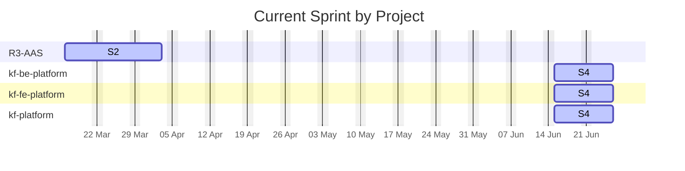

# KF Team — Unified Kanban

> Auto-generated from all project kanbans

  

    
Todo 73

    <a class="kanban-card" href="{{ '/projects/r3-aas/' | relative_url }}">R3-AAS: Feature set pentru lansare (MVP)</a>
    <a class="kanban-card" href="{{ '/projects/r3-aas/' | relative_url }}">R3-AAS: Ce este „Done&quot; vs „Ready&quot; pentru release</a>
    <a class="kanban-card" href="{{ '/projects/r3-aas/' | relative_url }}">R3-AAS: Sesiune demo produse (intern)</a>
    <a class="kanban-card" href="{{ '/projects/r3-aas/' | relative_url }}">R3-AAS: Pregătire feature flags (ascundere features incomplete)</a>
    <a class="kanban-card" href="{{ '/projects/r3-aas/' | relative_url }}">R3-AAS: Clarificare value proposition (perspectivă tehnică)</a>
    <a class="kanban-card" href="{{ '/projects/r3-aas/' | relative_url }}">R3-AAS: Flow sistem (UI → AAS → backend)</a>
    <a class="kanban-card" href="{{ '/projects/r3-aas/' | relative_url }}">R3-AAS: Layout simplificat pilot (stații + flux + senzori)</a>
    <a class="kanban-card" href="{{ '/projects/r3-aas/' | relative_url }}">R3-AAS: Backend alignment (după modificări Răzvan)</a>
    <a class="kanban-card" href="{{ '/projects/r3-aas/' | relative_url }}">R3-AAS: Bug-uri identificate în sistem</a>
    <a class="kanban-card" href="{{ '/projects/r3-aas/' | relative_url }}">R3-AAS: Instalare senzor 3 (poziție cutie/flux materiale) — T3.3</a>
    <a class="kanban-card" href="{{ '/projects/r3-aas/' | relative_url }}">R3-AAS: Task-uri ↔ Work Packages (WP mapping)</a>
    <a class="kanban-card" href="{{ '/projects/r3-aas/' | relative_url }}">R3-AAS: Naming convention pentru task-uri (namespace per proiect)</a>
    <a class="kanban-card" href="{{ '/projects/r3-aas/' | relative_url }}">R3-AAS: Evitarea dublării task-urilor între tools</a>
    <a class="kanban-card" href="{{ '/projects/r3-aas/' | relative_url }}">R3-AAS: Reprezentare Gantt (timeline / corelare temporală)</a>
    <a class="kanban-card" href="{{ '/projects/r3-aas/' | relative_url }}">R3-AAS: Feature flags</a>
    <a class="kanban-card" href="{{ '/projects/r3-aas/' | relative_url }}">R3-AAS: Telemetrie (monitorizare)</a>
    <a class="kanban-card" href="{{ '/projects/r3-aas/' | relative_url }}">R3-AAS: Code quality / stability înainte de release</a>
    <a class="kanban-card" href="{{ '/projects/r3-aas/' | relative_url }}">R3-AAS: Suport tehnic post-launch</a>
    <a class="kanban-card" href="{{ '/projects/r3-aas/' | relative_url }}">R3-AAS: Conectivitate sisteme externe</a>
    <a class="kanban-card" href="{{ '/projects/r3-aas/' | relative_url }}">R3-AAS: Testare demo produse (clienți + testeri interni)</a>
    <a class="kanban-card" href="{{ '/projects/r3-aas/' | relative_url }}">R3-AAS: Interviuri tehnice full-stack</a>
    <a class="kanban-card" href="{{ '/projects/r3-aas/' | relative_url }}">R3-AAS: Evaluare competențe React + Node</a>
    <a class="kanban-card" href="{{ '/projects/r3-aas/' | relative_url }}">R3-AAS: Evaluare team fit (non-toxic, colaborativ)</a>
    <a class="kanban-card" href="{{ '/projects/r3-aas/' | relative_url }}">R3-AAS: Selectare profil echilibrat (nu doar tech heavy)</a>
    <a class="kanban-card" href="{{ '/projects/r3-aas/' | relative_url }}">R3-AAS: Sprint plan (tranziție către GTM)</a>
    <a class="kanban-card" href="{{ '/projects/r3-aas/' | relative_url }}">R3-AAS: Corelare Sprint tasks ↔ Work Packages</a>
    <a class="kanban-card" href="{{ '/projects/r3-aas/' | relative_url }}">R3-AAS: Task-uri cu timeline (start/end)</a>
    <a class="kanban-card" href="{{ '/projects/r3-aas/' | relative_url }}">R3-AAS: Rapoarte săptămânale (nu daily)</a>
    <a class="kanban-card" href="{{ '/projects/r3-aas/' | relative_url }}">R3-AAS: Gantt / timeline pentru progres</a>
    <a class="kanban-card" href="{{ '/projects/r3-aas/' | relative_url }}">R3-AAS: Landing page (claritate produs)</a>
    <a class="kanban-card" href="{{ '/projects/r3-aas/' | relative_url }}">R3-AAS: Demo / prezentare produs</a>
    <a class="kanban-card" href="{{ '/projects/r3-aas/' | relative_url }}">R3-AAS: Definire tehnică monetizare (SaaS readiness)</a>
    <a class="kanban-card" href="{{ '/projects/r3-aas/' | relative_url }}">R3-AAS: Input pentru CRM / pipeline (structură tehnică)</a>
    <a class="kanban-card" href="{{ '/projects/r3-aas/' | relative_url }}">R3-AAS: Implement scheduler response parser</a>
    <a class="kanban-card" href="{{ '/projects/r3-aas/' | relative_url }}">R3-AAS: Validate suitability constraints and scheduling logic</a>
    <a class="kanban-card" href="{{ '/projects/r3-aas/' | relative_url }}">R3-AAS: Run first scheduling tests with real production data</a>
    <a class="kanban-card" href="{{ '/projects/r3-aas/' | relative_url }}">R3-AAS: Debug integration issues with LMS team</a>
    <a class="kanban-card" href="{{ '/projects/r3-aas/' | relative_url }}">R3-AAS: Integration validation review</a>
    <a class="kanban-card" href="{{ '/projects/kf-be-platform/' | relative_url }}">kf-be-platform: IDP setup (Keycloak/Auth0/logTo) + SMTP server</a>
    <a class="kanban-card" href="{{ '/projects/kf-be-platform/' | relative_url }}">kf-be-platform: RBAC system (scopes, claims, middleware)</a>
    <a class="kanban-card" href="{{ '/projects/kf-be-platform/' | relative_url }}">kf-be-platform: Tenant management (CRUD, provisioning, S3 prefix)</a>
    <a class="kanban-card" href="{{ '/projects/kf-be-platform/' | relative_url }}">kf-be-platform: EPCIS Export (JSON, PDF, GS1 standard, possibly signed)</a>
    <a class="kanban-card" href="{{ '/projects/kf-be-platform/' | relative_url }}">kf-be-platform: LLM Ecodesign full integration — WP4 T4.1</a>
    <a class="kanban-card" href="{{ '/projects/kf-be-platform/' | relative_url }}">kf-be-platform: IoT Adapter &amp; Event Log (MQTT) — T2.5 ALADIN</a>
    <a class="kanban-card" href="{{ '/projects/kf-be-platform/' | relative_url }}">kf-be-platform: Notifications multi-channel (email, SMS, webhook, in-app)</a>
    <a class="kanban-card" href="{{ '/projects/kf-be-platform/' | relative_url }}">kf-be-platform: Data migration scripts KF → ALADIN (one-shot + rollback)</a>
    <a class="kanban-card" href="{{ '/projects/kf-fe-platform/' | relative_url }}">kf-fe-platform: Login flow + redirect handling</a>
    <a class="kanban-card" href="{{ '/projects/kf-fe-platform/' | relative_url }}">kf-fe-platform: Admin Console UI (Platform Admin operations)</a>
    <a class="kanban-card" href="{{ '/projects/kf-fe-platform/' | relative_url }}">kf-fe-platform: Overview refactor (dynamic widgets per rol)</a>
    <a class="kanban-card" href="{{ '/projects/kf-fe-platform/' | relative_url }}">kf-fe-platform: Models Page refactor (filtere per rol, search)</a>
    <a class="kanban-card" href="{{ '/projects/kf-fe-platform/' | relative_url }}">kf-fe-platform: Tech Pack layout (sidebar, tooltips, guide)</a>
    <a class="kanban-card" href="{{ '/projects/kf-fe-platform/' | relative_url }}">kf-fe-platform: Model Sheet fixes (imagini, reconciliere BOM)</a>
    <a class="kanban-card" href="{{ '/projects/kf-fe-platform/' | relative_url }}">kf-fe-platform: 3D Model performance optimization (multi-mesh, asset pipeline)</a>
    <a class="kanban-card" href="{{ '/projects/kf-fe-platform/' | relative_url }}">kf-fe-platform: Garment Configurator B2C (embeddable) — T2.3 ALADIN</a>
    <a class="kanban-card" href="{{ '/projects/kf-fe-platform/' | relative_url }}">kf-fe-platform: i18n / l10n (EN + RO + customizable, RTL ready)</a>
    <a class="kanban-card" href="{{ '/projects/kf-platform/' | relative_url }}">kf-platform: Collections fix + refactor (Kanban, season relations)</a>
    <a class="kanban-card" href="{{ '/projects/kf-platform/' | relative_url }}">kf-platform: BOM editor + LLM ecodesign hook (PDF export fix + stub)</a>
    <a class="kanban-card" href="{{ '/projects/kf-platform/' | relative_url }}">kf-platform: Sizing Table &amp; QA Flow customizabil per tenant</a>
    <a class="kanban-card" href="{{ '/projects/kf-platform/' | relative_url }}">kf-platform: Cost Breakdown &amp; OCS clarification (Buyer approval workflow)</a>
    <a class="kanban-card" href="{{ '/projects/kf-platform/' | relative_url }}">kf-platform: Tech Process refactor (aliniere BE update)</a>
    <a class="kanban-card" href="{{ '/projects/kf-platform/' | relative_url }}">kf-platform: Inventory &amp; Reception refactor (types, qty packaging, UOM)</a>
    <a class="kanban-card" href="{{ '/projects/kf-platform/' | relative_url }}">kf-platform: Orders refactor (Order Name, pricing, Buyer tracking portal)</a>
    <a class="kanban-card" href="{{ '/projects/kf-platform/' | relative_url }}">kf-platform: Planner (Calendar/Gantt/Kanban switch) — backend nou</a>
    <a class="kanban-card" href="{{ '/projects/kf-platform/' | relative_url }}">kf-platform: Batches &amp; Assignment (Operator assignment integrat)</a>
    <a class="kanban-card" href="{{ '/projects/kf-platform/' | relative_url }}">kf-platform: Operator View tablet (Timer, QR scan, defect flag, 3D viewer)</a>
    <a class="kanban-card" href="{{ '/projects/kf-platform/' | relative_url }}">kf-platform: QC Module (Inspection flow, defect logger)</a>
    <a class="kanban-card" href="{{ '/projects/kf-platform/' | relative_url }}">kf-platform: Reports &amp; Cutting (camera integration, COCO export)</a>
    <a class="kanban-card" href="{{ '/projects/kf-platform/' | relative_url }}">kf-platform: DPP Module (data model, dashboard, validation) — T2.4 ALADIN</a>
    <a class="kanban-card" href="{{ '/projects/kf-platform/' | relative_url }}">kf-platform: Public DPP / GS1 Digital Link / QR (no-auth endpoint)</a>
    <a class="kanban-card" href="{{ '/projects/kf-platform/' | relative_url }}">kf-platform: Auditor View (cross-tenant, elevated scope)</a>
    <a class="kanban-card" href="{{ '/projects/kf-platform/' | relative_url }}">kf-platform: Made2Flow dynamic JSONB schema</a>
    <a class="kanban-card" href="{{ '/projects/kf-platform/' | relative_url }}">kf-platform: Migration testing (data + flow E2E)</a>
    <a class="kanban-card" href="{{ '/projects/kf-platform/' | relative_url }}">kf-platform: Final QA &amp; production cutover (smoke tests, monitoring)</a>
  

  

    
In Progress 21

    <a class="kanban-card" href="{{ '/projects/r3-aas/' | relative_url }}">R3-AAS: Deploy AAS în Cloud (hosting)</a>
    <a class="kanban-card" href="{{ '/projects/r3-aas/' | relative_url }}">R3-AAS: Clarificare acces server R3 (Vangelis)</a>
    <a class="kanban-card" href="{{ '/projects/r3-aas/' | relative_url }}">R3-AAS: Clarificare format date platforma R3</a>
    <a class="kanban-card" href="{{ '/projects/r3-aas/' | relative_url }}">R3-AAS: Review arhitectură</a>
    <a class="kanban-card" href="{{ '/projects/r3-aas/' | relative_url }}">R3-AAS: Identificare gaps / incomplete features</a>
    <a class="kanban-card" href="{{ '/projects/r3-aas/' | relative_url }}">R3-AAS: Clarificare acces server R3 (Vangelis)</a>
    <a class="kanban-card" href="{{ '/projects/r3-aas/' | relative_url }}">R3-AAS: Integrare între sisteme (Katty / LMS)</a>
    <a class="kanban-card" href="{{ '/projects/r3-aas/' | relative_url }}">R3-AAS: Multiple tipuri AAS → standardizare</a>
    <a class="kanban-card" href="{{ '/projects/r3-aas/' | relative_url }}">R3-AAS: Integrare LMS (AAS extern)</a>
    <a class="kanban-card" href="{{ '/projects/r3-aas/' | relative_url }}">R3-AAS: UI flow (parțial complet)</a>
    <a class="kanban-card" href="{{ '/projects/r3-aas/' | relative_url }}">R3-AAS: Deploy AAS în Cloud (hosting)</a>
    <a class="kanban-card" href="{{ '/projects/r3-aas/' | relative_url }}">R3-AAS: Clarificare format date pentru platforma R3</a>
    <a class="kanban-card" href="{{ '/projects/r3-aas/' | relative_url }}">R3-AAS: Board central Kanban – single source of truth</a>
    <a class="kanban-card" href="{{ '/projects/r3-aas/' | relative_url }}">R3-AAS: Acces corect la organizații (login flow issues)</a>
    <a class="kanban-card" href="{{ '/projects/r3-aas/' | relative_url }}">R3-AAS: Implement scheduling request endpoint (KF → LMS)</a>
    <a class="kanban-card" href="{{ '/projects/r3-aas/' | relative_url }}">R3-AAS: Integrate scheduling results with planner UI</a>
    <a class="kanban-card" href="{{ '/projects/r3-aas/' | relative_url }}">R3-AAS: Implement planner visualization improvements (capacity / gaps)</a>
    <a class="kanban-card" href="{{ '/projects/kf-be-platform/' | relative_url }}">kf-be-platform: Database schema v2 design + migrations (multi-tenant RLS)</a>
    <a class="kanban-card" href="{{ '/projects/kf-be-platform/' | relative_url }}">kf-be-platform: CI/CD pipeline (GitHub Actions / GitLab CI)</a>
    <a class="kanban-card" href="{{ '/projects/kf-fe-platform/' | relative_url }}">kf-fe-platform: Design system &amp; design tokens (Tailwind, primitives, Storybook)</a>
    <a class="kanban-card" href="{{ '/projects/kf-platform/' | relative_url }}">kf-platform: Project setup (repo, monorepo structure, conventions)</a>
  

  

    
Review 5

    <a class="kanban-card" href="{{ '/projects/r3-aas/' | relative_url }}">R3-AAS: LMS specs + credentials</a>
    <a class="kanban-card" href="{{ '/projects/r3-aas/' | relative_url }}">R3-AAS: Vizualizare date / UI</a>
    <a class="kanban-card" href="{{ '/projects/r3-aas/' | relative_url }}">R3-AAS: GitHub Actions pentru sync task-uri</a>
    <a class="kanban-card" href="{{ '/projects/r3-aas/' | relative_url }}">R3-AAS: Generare automată status / reports</a>
    <a class="kanban-card" href="{{ '/projects/r3-aas/' | relative_url }}">R3-AAS: Pipeline CI/CD (necesar pentru GTM)</a>
  

  

    
Done 9

    <a class="kanban-card" href="{{ '/projects/r3-aas/' | relative_url }}">R3-AAS: Validare integrare end-to-end (expunere API Nuoform)</a>
    <a class="kanban-card" href="{{ '/projects/r3-aas/' | relative_url }}">R3-AAS: Arhitectură multi-tenant (in place)</a>
    <a class="kanban-card" href="{{ '/projects/r3-aas/' | relative_url }}">R3-AAS: Separare date per client (in place)</a>
    <a class="kanban-card" href="{{ '/projects/r3-aas/' | relative_url }}">R3-AAS: Sketch → JSON → sistem</a>
    <a class="kanban-card" href="{{ '/projects/r3-aas/' | relative_url }}">R3-AAS: Acces VPN + onboarding corect</a>
    <a class="kanban-card" href="{{ '/projects/r3-aas/' | relative_url }}">R3-AAS: Review LMS API endpoints and AAS structure</a>
    <a class="kanban-card" href="{{ '/projects/r3-aas/' | relative_url }}">R3-AAS: Technical architecture alignment for Planner integration</a>
    <a class="kanban-card" href="{{ '/projects/r3-aas/' | relative_url }}">R3-AAS: Define integration pipeline (KF UI → LMS Scheduler → KF UI)</a>
    <a class="kanban-card" href="{{ '/projects/r3-aas/' | relative_url }}">R3-AAS: Implement automatic AAS JSON export from KF platform</a>
  

## Summary by Project

| Project | Todo | In Progress | Review | Done | Total |
| :--- | :---: | :---: | :---: | :---: | :---: |
| R3-AAS | 38 | 17 | 5 | 9 | 69 |
| kf-be-platform | 8 | 2 | 0 | 0 | 10 |
| kf-fe-platform | 9 | 1 | 0 | 0 | 10 |
| kf-platform | 18 | 1 | 0 | 0 | 19 |

## Sprint Timeline

```mermaid
gantt
    title Current Sprint by Project
    dateFormat YYYY-MM-DD
    axisFormat %d %b
    excludes weekends

    section R3-AAS
    S2 :active, 2026-03-16, 2026-04-03
    section kf-be-platform
    S4 :active, 2026-06-15, 2026-06-26
    section kf-fe-platform
    S4 :active, 2026-06-15, 2026-06-26
    section kf-platform
    S4 :active, 2026-06-15, 2026-06-26
```