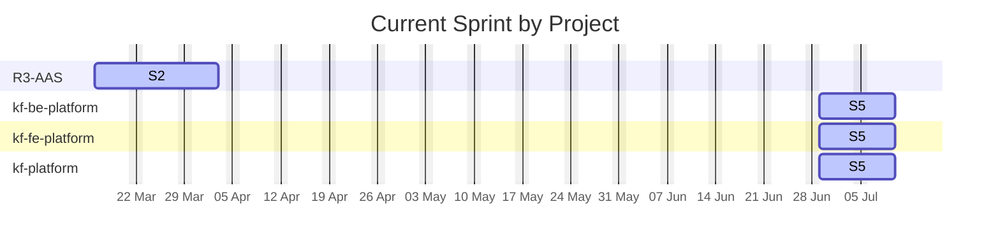

# KF Team — Unified Kanban

> Auto-generated from all project kanbans

  

    
Todo 59

    <a class="kanban-card" href="{{ '/projects/r3-aas/' | relative_url }}">R3-AAS: Feature set pentru lansare (MVP)</a>
    <a class="kanban-card" href="{{ '/projects/r3-aas/' | relative_url }}">R3-AAS: Ce este „Done&quot; vs „Ready&quot; pentru release</a>
    <a class="kanban-card" href="{{ '/projects/r3-aas/' | relative_url }}">R3-AAS: Sesiune demo produse (intern)</a>
    <a class="kanban-card" href="{{ '/projects/r3-aas/' | relative_url }}">R3-AAS: Pregătire feature flags (ascundere features incomplete)</a>
    <a class="kanban-card" href="{{ '/projects/r3-aas/' | relative_url }}">R3-AAS: Clarificare value proposition (perspectivă tehnică)</a>
    <a class="kanban-card" href="{{ '/projects/r3-aas/' | relative_url }}">R3-AAS: Flow sistem (UI → AAS → backend)</a>
    <a class="kanban-card" href="{{ '/projects/r3-aas/' | relative_url }}">R3-AAS: Layout simplificat pilot (stații + flux + senzori)</a>
    <a class="kanban-card" href="{{ '/projects/r3-aas/' | relative_url }}">R3-AAS: Backend alignment (după modificări Răzvan)</a>
    <a class="kanban-card" href="{{ '/projects/r3-aas/' | relative_url }}">R3-AAS: Bug-uri identificate în sistem</a>
    <a class="kanban-card" href="{{ '/projects/r3-aas/' | relative_url }}">R3-AAS: Instalare senzor 3 (poziție cutie/flux materiale) — T3.3</a>
    <a class="kanban-card" href="{{ '/projects/r3-aas/' | relative_url }}">R3-AAS: Task-uri ↔ Work Packages (WP mapping)</a>
    <a class="kanban-card" href="{{ '/projects/r3-aas/' | relative_url }}">R3-AAS: Naming convention pentru task-uri (namespace per proiect)</a>
    <a class="kanban-card" href="{{ '/projects/r3-aas/' | relative_url }}">R3-AAS: Evitarea dublării task-urilor între tools</a>
    <a class="kanban-card" href="{{ '/projects/r3-aas/' | relative_url }}">R3-AAS: Reprezentare Gantt (timeline / corelare temporală)</a>
    <a class="kanban-card" href="{{ '/projects/r3-aas/' | relative_url }}">R3-AAS: Feature flags</a>
    <a class="kanban-card" href="{{ '/projects/r3-aas/' | relative_url }}">R3-AAS: Telemetrie (monitorizare)</a>
    <a class="kanban-card" href="{{ '/projects/r3-aas/' | relative_url }}">R3-AAS: Code quality / stability înainte de release</a>
    <a class="kanban-card" href="{{ '/projects/r3-aas/' | relative_url }}">R3-AAS: Suport tehnic post-launch</a>
    <a class="kanban-card" href="{{ '/projects/r3-aas/' | relative_url }}">R3-AAS: Conectivitate sisteme externe</a>
    <a class="kanban-card" href="{{ '/projects/r3-aas/' | relative_url }}">R3-AAS: Testare demo produse (clienți + testeri interni)</a>
    <a class="kanban-card" href="{{ '/projects/r3-aas/' | relative_url }}">R3-AAS: Interviuri tehnice full-stack</a>
    <a class="kanban-card" href="{{ '/projects/r3-aas/' | relative_url }}">R3-AAS: Evaluare competențe React + Node</a>
    <a class="kanban-card" href="{{ '/projects/r3-aas/' | relative_url }}">R3-AAS: Evaluare team fit (non-toxic, colaborativ)</a>
    <a class="kanban-card" href="{{ '/projects/r3-aas/' | relative_url }}">R3-AAS: Selectare profil echilibrat (nu doar tech heavy)</a>
    <a class="kanban-card" href="{{ '/projects/r3-aas/' | relative_url }}">R3-AAS: Sprint plan (tranziție către GTM)</a>
    <a class="kanban-card" href="{{ '/projects/r3-aas/' | relative_url }}">R3-AAS: Corelare Sprint tasks ↔ Work Packages</a>
    <a class="kanban-card" href="{{ '/projects/r3-aas/' | relative_url }}">R3-AAS: Task-uri cu timeline (start/end)</a>
    <a class="kanban-card" href="{{ '/projects/r3-aas/' | relative_url }}">R3-AAS: Rapoarte săptămânale (nu daily)</a>
    <a class="kanban-card" href="{{ '/projects/r3-aas/' | relative_url }}">R3-AAS: Gantt / timeline pentru progres</a>
    <a class="kanban-card" href="{{ '/projects/r3-aas/' | relative_url }}">R3-AAS: Landing page (claritate produs)</a>
    <a class="kanban-card" href="{{ '/projects/r3-aas/' | relative_url }}">R3-AAS: Demo / prezentare produs</a>
    <a class="kanban-card" href="{{ '/projects/r3-aas/' | relative_url }}">R3-AAS: Definire tehnică monetizare (SaaS readiness)</a>
    <a class="kanban-card" href="{{ '/projects/r3-aas/' | relative_url }}">R3-AAS: Input pentru CRM / pipeline (structură tehnică)</a>
    <a class="kanban-card" href="{{ '/projects/r3-aas/' | relative_url }}">R3-AAS: Implement scheduler response parser</a>
    <a class="kanban-card" href="{{ '/projects/r3-aas/' | relative_url }}">R3-AAS: Validate suitability constraints and scheduling logic</a>
    <a class="kanban-card" href="{{ '/projects/r3-aas/' | relative_url }}">R3-AAS: Run first scheduling tests with real production data</a>
    <a class="kanban-card" href="{{ '/projects/r3-aas/' | relative_url }}">R3-AAS: Debug integration issues with LMS team</a>
    <a class="kanban-card" href="{{ '/projects/r3-aas/' | relative_url }}">R3-AAS: Integration validation review</a>
    <a class="kanban-card" href="{{ '/projects/kf-platform/' | relative_url }}">kf-platform: M.Collections fix + refactor (Kanban, season relations)</a>
    <a class="kanban-card" href="{{ '/projects/kf-platform/' | relative_url }}">kf-platform: M.BOM editor + LLM ecodesign hook (PDF export fix + stub)</a>
    <a class="kanban-card" href="{{ '/projects/kf-platform/' | relative_url }}">kf-platform: M.Sizing Table &amp; QA Flow customizabil per tenant</a>
    <a class="kanban-card" href="{{ '/projects/kf-platform/' | relative_url }}">kf-platform: M.Cost Breakdown &amp; OCS clarification (Buyer approval workflow)</a>
    <a class="kanban-card" href="{{ '/projects/kf-platform/' | relative_url }}">kf-platform: M.Tech Process refactor (aliniere BE update)</a>
    <a class="kanban-card" href="{{ '/projects/kf-platform/' | relative_url }}">kf-platform: M.Inventory &amp; Reception refactor (types, qty packaging, UOM)</a>
    <a class="kanban-card" href="{{ '/projects/kf-platform/' | relative_url }}">kf-platform: M.Orders refactor (Order Name, pricing, Buyer tracking portal)</a>
    <a class="kanban-card" href="{{ '/projects/kf-platform/' | relative_url }}">kf-platform: M.Planner (Calendar/Gantt/Kanban switch) — backend nou</a>
    <a class="kanban-card" href="{{ '/projects/kf-platform/' | relative_url }}">kf-platform: M.Batches &amp; Assignment (Operator assignment integrat)</a>
    <a class="kanban-card" href="{{ '/projects/kf-platform/' | relative_url }}">kf-platform: M.Operator View tablet (Timer, QR scan, defect flag, 3D viewer)</a>
    <a class="kanban-card" href="{{ '/projects/kf-platform/' | relative_url }}">kf-platform: M.QC Module (Inspection flow, defect logger)</a>
    <a class="kanban-card" href="{{ '/projects/kf-platform/' | relative_url }}">kf-platform: M.Reports &amp; Cutting (camera integration, COCO export)</a>
    <a class="kanban-card" href="{{ '/projects/kf-platform/' | relative_url }}">kf-platform: M.DPP Module (data model, dashboard, validation) — T2.4 ALADIN</a>
    <a class="kanban-card" href="{{ '/projects/kf-platform/' | relative_url }}">kf-platform: M.Public DPP / GS1 Digital Link / QR (no-auth endpoint)</a>
    <a class="kanban-card" href="{{ '/projects/kf-platform/' | relative_url }}">kf-platform: M.Auditor View (cross-tenant, elevated scope)</a>
    <a class="kanban-card" href="{{ '/projects/kf-platform/' | relative_url }}">kf-platform: M.Made2Flow dynamic JSONB schema</a>
    <a class="kanban-card" href="{{ '/projects/kf-platform/' | relative_url }}">kf-platform: M.Migration testing (data + flow E2E)</a>
    <a class="kanban-card" href="{{ '/projects/kf-platform/' | relative_url }}">kf-platform: M.Final QA &amp; production cutover (smoke tests, monitoring)</a>
    <a class="kanban-card" href="{{ '/projects/kf-platform/' | relative_url }}">kf-platform: QT38.S3. Grant inventory rights migration</a>
    <a class="kanban-card" href="{{ '/projects/kf-platform/' | relative_url }}">kf-platform: QT78.S4. Order flow surface model attachments des</a>
    <a class="kanban-card" href="{{ '/projects/kf-platform/' | relative_url }}">kf-platform: QT85.S3. Costing persistence DEFERRED</a>
  

  

    
In Progress 26

    <a class="kanban-card" href="{{ '/projects/r3-aas/' | relative_url }}">R3-AAS: Deploy AAS în Cloud (hosting)</a>
    <a class="kanban-card" href="{{ '/projects/r3-aas/' | relative_url }}">R3-AAS: Clarificare acces server R3 (Vangelis)</a>
    <a class="kanban-card" href="{{ '/projects/r3-aas/' | relative_url }}">R3-AAS: Clarificare format date platforma R3</a>
    <a class="kanban-card" href="{{ '/projects/r3-aas/' | relative_url }}">R3-AAS: Review arhitectură</a>
    <a class="kanban-card" href="{{ '/projects/r3-aas/' | relative_url }}">R3-AAS: Identificare gaps / incomplete features</a>
    <a class="kanban-card" href="{{ '/projects/r3-aas/' | relative_url }}">R3-AAS: Clarificare acces server R3 (Vangelis)</a>
    <a class="kanban-card" href="{{ '/projects/r3-aas/' | relative_url }}">R3-AAS: Integrare între sisteme (Katty / LMS)</a>
    <a class="kanban-card" href="{{ '/projects/r3-aas/' | relative_url }}">R3-AAS: Multiple tipuri AAS → standardizare</a>
    <a class="kanban-card" href="{{ '/projects/r3-aas/' | relative_url }}">R3-AAS: Integrare LMS (AAS extern)</a>
    <a class="kanban-card" href="{{ '/projects/r3-aas/' | relative_url }}">R3-AAS: UI flow (parțial complet)</a>
    <a class="kanban-card" href="{{ '/projects/r3-aas/' | relative_url }}">R3-AAS: Deploy AAS în Cloud (hosting)</a>
    <a class="kanban-card" href="{{ '/projects/r3-aas/' | relative_url }}">R3-AAS: Clarificare format date pentru platforma R3</a>
    <a class="kanban-card" href="{{ '/projects/r3-aas/' | relative_url }}">R3-AAS: Board central Kanban – single source of truth</a>
    <a class="kanban-card" href="{{ '/projects/r3-aas/' | relative_url }}">R3-AAS: Acces corect la organizații (login flow issues)</a>
    <a class="kanban-card" href="{{ '/projects/r3-aas/' | relative_url }}">R3-AAS: Implement scheduling request endpoint (KF → LMS)</a>
    <a class="kanban-card" href="{{ '/projects/r3-aas/' | relative_url }}">R3-AAS: Integrate scheduling results with planner UI</a>
    <a class="kanban-card" href="{{ '/projects/r3-aas/' | relative_url }}">R3-AAS: Implement planner visualization improvements (capacity / gaps)</a>
    <a class="kanban-card" href="{{ '/projects/kf-be-platform/' | relative_url }}">kf-be-platform: Project scope definition and requirements analysis</a>
    <a class="kanban-card" href="{{ '/projects/kf-be-platform/' | relative_url }}">kf-be-platform: Refactor with generators</a>
    <a class="kanban-card" href="{{ '/projects/kf-be-platform/' | relative_url }}">kf-be-platform: Dockerize for general flow</a>
    <a class="kanban-card" href="{{ '/projects/kf-be-platform/' | relative_url }}">kf-be-platform: Collaboration framework with sockets</a>
    <a class="kanban-card" href="{{ '/projects/kf-fe-platform/' | relative_url }}">kf-fe-platform: Project scope definition and requirements analysis</a>
    <a class="kanban-card" href="{{ '/projects/kf-fe-platform/' | relative_url }}">kf-fe-platform: Refactor with generators</a>
    <a class="kanban-card" href="{{ '/projects/kf-fe-platform/' | relative_url }}">kf-fe-platform: Dockerize for general flow</a>
    <a class="kanban-card" href="{{ '/projects/kf-fe-platform/' | relative_url }}">kf-fe-platform: Collaboration framework with sockets</a>
    <a class="kanban-card" href="{{ '/projects/kf-platform/' | relative_url }}">kf-platform: M.Project setup (repo, monorepo structure, conventions)</a>
  

  

    
Review 5

    <a class="kanban-card" href="{{ '/projects/r3-aas/' | relative_url }}">R3-AAS: LMS specs + credentials</a>
    <a class="kanban-card" href="{{ '/projects/r3-aas/' | relative_url }}">R3-AAS: Vizualizare date / UI</a>
    <a class="kanban-card" href="{{ '/projects/r3-aas/' | relative_url }}">R3-AAS: GitHub Actions pentru sync task-uri</a>
    <a class="kanban-card" href="{{ '/projects/r3-aas/' | relative_url }}">R3-AAS: Generare automată status / reports</a>
    <a class="kanban-card" href="{{ '/projects/r3-aas/' | relative_url }}">R3-AAS: Pipeline CI/CD (necesar pentru GTM)</a>
  

  

    
Done 126

    <a class="kanban-card" href="{{ '/projects/r3-aas/' | relative_url }}">R3-AAS: Validare integrare end-to-end (expunere API Nuoform)</a>
    <a class="kanban-card" href="{{ '/projects/r3-aas/' | relative_url }}">R3-AAS: Arhitectură multi-tenant (in place)</a>
    <a class="kanban-card" href="{{ '/projects/r3-aas/' | relative_url }}">R3-AAS: Separare date per client (in place)</a>
    <a class="kanban-card" href="{{ '/projects/r3-aas/' | relative_url }}">R3-AAS: Sketch → JSON → sistem</a>
    <a class="kanban-card" href="{{ '/projects/r3-aas/' | relative_url }}">R3-AAS: Acces VPN + onboarding corect</a>
    <a class="kanban-card" href="{{ '/projects/r3-aas/' | relative_url }}">R3-AAS: Review LMS API endpoints and AAS structure</a>
    <a class="kanban-card" href="{{ '/projects/r3-aas/' | relative_url }}">R3-AAS: Technical architecture alignment for Planner integration</a>
    <a class="kanban-card" href="{{ '/projects/r3-aas/' | relative_url }}">R3-AAS: Define integration pipeline (KF UI → LMS Scheduler → KF UI)</a>
    <a class="kanban-card" href="{{ '/projects/r3-aas/' | relative_url }}">R3-AAS: Implement automatic AAS JSON export from KF platform</a>
    <a class="kanban-card" href="{{ '/projects/kf-be-platform/' | relative_url }}">kf-be-platform: QT1.S3. Add a dedicated super admin system role</a>
    <a class="kanban-card" href="{{ '/projects/kf-be-platform/' | relative_url }}">kf-be-platform: QT3.S3. Versionize customer collection techproce</a>
    <a class="kanban-card" href="{{ '/projects/kf-be-platform/' | relative_url }}">kf-be-platform: QT15.S3. Fix the platform wide rls tenant isolati</a>
    <a class="kanban-card" href="{{ '/projects/kf-be-platform/' | relative_url }}">kf-be-platform: QT18.S3. Add condition user with email superadmin</a>
    <a class="kanban-card" href="{{ '/projects/kf-be-platform/' | relative_url }}">kf-be-platform: QT20.S3. Fix me bootstrap dead end jit provision</a>
    <a class="kanban-card" href="{{ '/projects/kf-be-platform/' | relative_url }}">kf-be-platform: QT21.S3. Fix cors 403 invalid cors request on pos</a>
    <a class="kanban-card" href="{{ '/projects/kf-be-platform/' | relative_url }}">kf-be-platform: QT22.S3. Jackson 3 module for jsonnullable fix 50</a>
    <a class="kanban-card" href="{{ '/projects/kf-be-platform/' | relative_url }}">kf-be-platform: QT23.S3. Fix collaboration join echo amplificatio</a>
    <a class="kanban-card" href="{{ '/projects/kf-be-platform/' | relative_url }}">kf-be-platform: QT25.S3. Fix presigned s3 upload urls blocked by</a>
    <a class="kanban-card" href="{{ '/projects/kf-be-platform/' | relative_url }}">kf-be-platform: QT35.S3. Populate app user firstname lastname fro</a>
    <a class="kanban-card" href="{{ '/projects/kf-be-platform/' | relative_url }}">kf-be-platform: QT60.S4. Fix size post 500 409 size measurements</a>
    <a class="kanban-card" href="{{ '/projects/kf-be-platform/' | relative_url }}">kf-be-platform: QT69.S4. File inline open</a>
    <a class="kanban-card" href="{{ '/projects/kf-be-platform/' | relative_url }}">kf-be-platform: QT70.S4. Model created updated filter</a>
    <a class="kanban-card" href="{{ '/projects/kf-be-platform/' | relative_url }}">kf-be-platform: QT71.S4. Bom created updated dates</a>
    <a class="kanban-card" href="{{ '/projects/kf-be-platform/' | relative_url }}">kf-be-platform: QT72.S4. Dxf consumption metrics</a>
    <a class="kanban-card" href="{{ '/projects/kf-be-platform/' | relative_url }}">kf-be-platform: QT75.S4. Model dxf interactive preview</a>
    <a class="kanban-card" href="{{ '/projects/kf-fe-platform/' | relative_url }}">kf-fe-platform: PH9.S3. Navigation &amp; UX Polish</a>
    <a class="kanban-card" href="{{ '/projects/kf-fe-platform/' | relative_url }}">kf-fe-platform: PH25.S4. General UI Fixes &amp; Component Consolidation</a>
    <a class="kanban-card" href="{{ '/projects/kf-fe-platform/' | relative_url }}">kf-fe-platform: PH29.S5. PostHog Production Analytics</a>
    <a class="kanban-card" href="{{ '/projects/kf-fe-platform/' | relative_url }}">kf-fe-platform: PH90.S4. Global Upload Manager (#9)</a>
    <a class="kanban-card" href="{{ '/projects/kf-fe-platform/' | relative_url }}">kf-fe-platform: QT9.S3. Create a playwright e2e spec e2e model s</a>
    <a class="kanban-card" href="{{ '/projects/kf-fe-platform/' | relative_url }}">kf-fe-platform: QT13.S3. Rework create model flow modal create fo</a>
    <a class="kanban-card" href="{{ '/projects/kf-fe-platform/' | relative_url }}">kf-fe-platform: QT14.S3. Add empty catalog empty state to sizewiz</a>
    <a class="kanban-card" href="{{ '/projects/kf-fe-platform/' | relative_url }}">kf-fe-platform: QT24.S3. Smoother peer cursors raise broadcast ra</a>
    <a class="kanban-card" href="{{ '/projects/kf-fe-platform/' | relative_url }}">kf-fe-platform: QT32.S3. Technician internal external parity with</a>
    <a class="kanban-card" href="{{ '/projects/kf-fe-platform/' | relative_url }}">kf-fe-platform: QT33.S3. Orders add edit ux parity with models fl</a>
    <a class="kanban-card" href="{{ '/projects/kf-fe-platform/' | relative_url }}">kf-fe-platform: QT37.S3. Bom edit existing accessory per row edit</a>
    <a class="kanban-card" href="{{ '/projects/kf-fe-platform/' | relative_url }}">kf-fe-platform: QT39.S3. Inventory feature parity dedicated add p</a>
    <a class="kanban-card" href="{{ '/projects/kf-fe-platform/' | relative_url }}">kf-fe-platform: QT52.S4. Add react joyride per page demo tours sh</a>
    <a class="kanban-card" href="{{ '/projects/kf-fe-platform/' | relative_url }}">kf-fe-platform: QT53.S4. Cross page demo journey tour orchestrato</a>
    <a class="kanban-card" href="{{ '/projects/kf-fe-platform/' | relative_url }}">kf-fe-platform: QT54.S4. Rewrite admin roles rights editor from t</a>
    <a class="kanban-card" href="{{ '/projects/kf-fe-platform/' | relative_url }}">kf-fe-platform: QT57.S4. Phase 19 follow up fe fixes rbac matrix</a>
    <a class="kanban-card" href="{{ '/projects/kf-fe-platform/' | relative_url }}">kf-fe-platform: QT59.S4. Mobile friendly dashboard shell and feat</a>
    <a class="kanban-card" href="{{ '/projects/kf-fe-platform/' | relative_url }}">kf-fe-platform: QT62.S4. Fix 3d viewer csp connect src blob dxf d</a>
    <a class="kanban-card" href="{{ '/projects/kf-fe-platform/' | relative_url }}">kf-fe-platform: QT63.S4. Unblock uat fe build skip inline tsc esl</a>
    <a class="kanban-card" href="{{ '/projects/kf-fe-platform/' | relative_url }}">kf-fe-platform: QT64.S4. Component create image gating design</a>
    <a class="kanban-card" href="{{ '/projects/kf-fe-platform/' | relative_url }}">kf-fe-platform: QT65.S4. Collection select live update</a>
    <a class="kanban-card" href="{{ '/projects/kf-fe-platform/' | relative_url }}">kf-fe-platform: QT66.S4. Bom ttl first render</a>
    <a class="kanban-card" href="{{ '/projects/kf-fe-platform/' | relative_url }}">kf-fe-platform: QT67.S4. Model editor formatting</a>
    <a class="kanban-card" href="{{ '/projects/kf-fe-platform/' | relative_url }}">kf-fe-platform: QT68.S4. Grading table sizes</a>
    <a class="kanban-card" href="{{ '/projects/kf-fe-platform/' | relative_url }}">kf-fe-platform: QT73.S4. Seasons page</a>
    <a class="kanban-card" href="{{ '/projects/kf-fe-platform/' | relative_url }}">kf-fe-platform: QT74.S4. Cutting dxf metadata panel</a>
    <a class="kanban-card" href="{{ '/projects/kf-fe-platform/' | relative_url }}">kf-fe-platform: QT81.S4. Models pagination filter alignment</a>
    <a class="kanban-card" href="{{ '/projects/kf-fe-platform/' | relative_url }}">kf-fe-platform: QT82.S4. Models detail first section image previe</a>
    <a class="kanban-card" href="{{ '/projects/kf-platform/' | relative_url }}">kf-platform: PH0.S3. Platform Hardening + DXF Spike</a>
    <a class="kanban-card" href="{{ '/projects/kf-platform/' | relative_url }}">kf-platform: PH1.S3. Model &amp; Version Core</a>
    <a class="kanban-card" href="{{ '/projects/kf-platform/' | relative_url }}">kf-platform: PH2.S3. BOM</a>
    <a class="kanban-card" href="{{ '/projects/kf-platform/' | relative_url }}">kf-platform: PH3.S3. Sizing &amp; Grading</a>
    <a class="kanban-card" href="{{ '/projects/kf-platform/' | relative_url }}">kf-platform: PH4.S3. Costing + 3D + Documents</a>
    <a class="kanban-card" href="{{ '/projects/kf-platform/' | relative_url }}">kf-platform: PH5.S3. DXF / Consumption Norm Build</a>
    <a class="kanban-card" href="{{ '/projects/kf-platform/' | relative_url }}">kf-platform: PH6.S3. Waste &amp; Impact Assessment</a>
    <a class="kanban-card" href="{{ '/projects/kf-platform/' | relative_url }}">kf-platform: PH7.S3. Cutting Core</a>
    <a class="kanban-card" href="{{ '/projects/kf-platform/' | relative_url }}">kf-platform: PH8.S3. Cutting Advanced</a>
    <a class="kanban-card" href="{{ '/projects/kf-platform/' | relative_url }}">kf-platform: PH10.S3. Collaborative Tech-Pack Surface</a>
    <a class="kanban-card" href="{{ '/projects/kf-platform/' | relative_url }}">kf-platform: PH11.S3. Order Waste UX</a>
    <a class="kanban-card" href="{{ '/projects/kf-platform/' | relative_url }}">kf-platform: PH12.S3. Order Layplan DXF Viewer</a>
    <a class="kanban-card" href="{{ '/projects/kf-platform/' | relative_url }}">kf-platform: PH13.S3. Order AAS Export</a>
    <a class="kanban-card" href="{{ '/projects/kf-platform/' | relative_url }}">kf-platform: PH14.S3. Order Documents &amp; Search</a>
    <a class="kanban-card" href="{{ '/projects/kf-platform/' | relative_url }}">kf-platform: PH15.S4. QA Defect-Reports &amp; Fabric Inspection Parity</a>
    <a class="kanban-card" href="{{ '/projects/kf-platform/' | relative_url }}">kf-platform: PH16.S3. Model Flow Fixes</a>
    <a class="kanban-card" href="{{ '/projects/kf-platform/' | relative_url }}">kf-platform: PH17.S3. Multi-tenant RLS scoping</a>
    <a class="kanban-card" href="{{ '/projects/kf-platform/' | relative_url }}">kf-platform: PH18.S3. Customer &amp; Order Flow Fixes</a>
    <a class="kanban-card" href="{{ '/projects/kf-platform/' | relative_url }}">kf-platform: PH19.S4. Tenant and Roles/Rights Management</a>
    <a class="kanban-card" href="{{ '/projects/kf-platform/' | relative_url }}">kf-platform: PH20.S4. Sizes Restructure &amp; Clothing-Type Dictionary</a>
    <a class="kanban-card" href="{{ '/projects/kf-platform/' | relative_url }}">kf-platform: PH21.S5. Preferred Unit of Measure</a>
    <a class="kanban-card" href="{{ '/projects/kf-platform/' | relative_url }}">kf-platform: PH22.S4. Order Editing Core</a>
    <a class="kanban-card" href="{{ '/projects/kf-platform/' | relative_url }}">kf-platform: PH23.S4. Order Satellites</a>
    <a class="kanban-card" href="{{ '/projects/kf-platform/' | relative_url }}">kf-platform: PH24.S4. Customer Flag &amp; Filtering</a>
    <a class="kanban-card" href="{{ '/projects/kf-platform/' | relative_url }}">kf-platform: PH26.S4. Auth, Rights &amp; Read-Route Filtering Hardening</a>
    <a class="kanban-card" href="{{ '/projects/kf-platform/' | relative_url }}">kf-platform: PH27.S4. Collaborative Scaffolding</a>
    <a class="kanban-card" href="{{ '/projects/kf-platform/' | relative_url }}">kf-platform: PH28.S5. Platform Management Hub</a>
    <a class="kanban-card" href="{{ '/projects/kf-platform/' | relative_url }}">kf-platform: PH30.S5. Email Notification Core</a>
    <a class="kanban-card" href="{{ '/projects/kf-platform/' | relative_url }}">kf-platform: PH31.S5. In-App Channel &amp; Extended Triggers</a>
    <a class="kanban-card" href="{{ '/projects/kf-platform/' | relative_url }}">kf-platform: PH32.S5. FE Translations &amp; DB Dictionary</a>
    <a class="kanban-card" href="{{ '/projects/kf-platform/' | relative_url }}">kf-platform: PH91.S4. Feedback Triage &amp; GitHub Sync</a>
    <a class="kanban-card" href="{{ '/projects/kf-platform/' | relative_url }}">kf-platform: QT2.S3. Fix model creation 422 no single tenant</a>
    <a class="kanban-card" href="{{ '/projects/kf-platform/' | relative_url }}">kf-platform: QT4.S3. Tenant aware role display in header card</a>
    <a class="kanban-card" href="{{ '/projects/kf-platform/' | relative_url }}">kf-platform: QT5.S3. Header role badges orange general app us</a>
    <a class="kanban-card" href="{{ '/projects/kf-platform/' | relative_url }}">kf-platform: QT6.S3. Clientgate rights based ui gating primit</a>
    <a class="kanban-card" href="{{ '/projects/kf-platform/' | relative_url }}">kf-platform: QT7.S3. Migrate admin gating to rights rightguar</a>
    <a class="kanban-card" href="{{ '/projects/kf-platform/' | relative_url }}">kf-platform: QT8.S3. Fix model edit collaboration fe ws url e</a>
    <a class="kanban-card" href="{{ '/projects/kf-platform/' | relative_url }}">kf-platform: QT10.S3. Role rights admin per tenant user role e</a>
    <a class="kanban-card" href="{{ '/projects/kf-platform/' | relative_url }}">kf-platform: QT11.S3. Fix 3 phase 10 issues orval numbered hoo</a>
    <a class="kanban-card" href="{{ '/projects/kf-platform/' | relative_url }}">kf-platform: QT12.S3. Fix fe backend http errors proxy 502 js</a>
    <a class="kanban-card" href="{{ '/projects/kf-platform/' | relative_url }}">kf-platform: QT16.S3. Generate architectural mermaid diagrams</a>
    <a class="kanban-card" href="{{ '/projects/kf-platform/' | relative_url }}">kf-platform: QT17.S3. R3 r2 r4 be test suite tooling fixes</a>
    <a class="kanban-card" href="{{ '/projects/kf-platform/' | relative_url }}">kf-platform: QT19.S3. Rights sync should bypass auth add to de</a>
    <a class="kanban-card" href="{{ '/projects/kf-platform/' | relative_url }}">kf-platform: QT26.S3. Unblock 3d viewer csp wasm unsafe eval r</a>
    <a class="kanban-card" href="{{ '/projects/kf-platform/' | relative_url }}">kf-platform: QT27.S3. Local hdri render fix</a>
    <a class="kanban-card" href="{{ '/projects/kf-platform/' | relative_url }}">kf-platform: QT28.S3. Parity color upload fix e2e on bom add f</a>
    <a class="kanban-card" href="{{ '/projects/kf-platform/' | relative_url }}">kf-platform: QT29.S3. Order parity bundle 1 status transitions</a>
    <a class="kanban-card" href="{{ '/projects/kf-platform/' | relative_url }}">kf-platform: QT30.S3. Order parity bundle 2 entry picker per s</a>
    <a class="kanban-card" href="{{ '/projects/kf-platform/' | relative_url }}">kf-platform: QT31.S3. Order parity bundle 3 task cards subtask</a>
    <a class="kanban-card" href="{{ '/projects/kf-platform/' | relative_url }}">kf-platform: QT34.S3. Unguard file download route rights check</a>
    <a class="kanban-card" href="{{ '/projects/kf-platform/' | relative_url }}">kf-platform: QT36.S3. Uat feedback widget env toggled overlay</a>
    <a class="kanban-card" href="{{ '/projects/kf-platform/' | relative_url }}">kf-platform: QT40.S3. Front back parity doc</a>
    <a class="kanban-card" href="{{ '/projects/kf-platform/' | relative_url }}">kf-platform: QT41.S3. Component form sheet to dialog</a>
    <a class="kanban-card" href="{{ '/projects/kf-platform/' | relative_url }}">kf-platform: QT42.S3. Component form fields and units</a>
    <a class="kanban-card" href="{{ '/projects/kf-platform/' | relative_url }}">kf-platform: QT43.S3. Generic presigned upload</a>
    <a class="kanban-card" href="{{ '/projects/kf-platform/' | relative_url }}">kf-platform: QT44.S3. Pattern preview img</a>
    <a class="kanban-card" href="{{ '/projects/kf-platform/' | relative_url }}">kf-platform: QT45.S3. Csp img src and lightbox</a>
    <a class="kanban-card" href="{{ '/projects/kf-platform/' | relative_url }}">kf-platform: QT46.S3. Render component list</a>
    <a class="kanban-card" href="{{ '/projects/kf-platform/' | relative_url }}">kf-platform: QT47.S3. Component per type fields</a>
    <a class="kanban-card" href="{{ '/projects/kf-platform/' | relative_url }}">kf-platform: QT48.S3. Fix component edit toasts</a>
    <a class="kanban-card" href="{{ '/projects/kf-platform/' | relative_url }}">kf-platform: QT49.S3. Component update applies all fields</a>
    <a class="kanban-card" href="{{ '/projects/kf-platform/' | relative_url }}">kf-platform: QT50.S3. Component delete in use 409</a>
    <a class="kanban-card" href="{{ '/projects/kf-platform/' | relative_url }}">kf-platform: QT51.S3. Components server pagination</a>
    <a class="kanban-card" href="{{ '/projects/kf-platform/' | relative_url }}">kf-platform: QT55.S4. Fix outbox relay set tenantcontext from</a>
    <a class="kanban-card" href="{{ '/projects/kf-platform/' | relative_url }}">kf-platform: QT56.S4. Bom components ajust ri la formularul de</a>
    <a class="kanban-card" href="{{ '/projects/kf-platform/' | relative_url }}">kf-platform: QT58.S4. Order flow parity derive order costing f</a>
    <a class="kanban-card" href="{{ '/projects/kf-platform/' | relative_url }}">kf-platform: QT61.S4. Re key dxf consumption norms and waste s</a>
    <a class="kanban-card" href="{{ '/projects/kf-platform/' | relative_url }}">kf-platform: QT76.S4. Fix webgl renderer not available error i</a>
    <a class="kanban-card" href="{{ '/projects/kf-platform/' | relative_url }}">kf-platform: QT77.S4. Add maximize fullscreen minimize toggle</a>
    <a class="kanban-card" href="{{ '/projects/kf-platform/' | relative_url }}">kf-platform: QT79.S4. Dxf preview rotate fullscreen</a>
    <a class="kanban-card" href="{{ '/projects/kf-platform/' | relative_url }}">kf-platform: QT80.S4. Fix dxf preview rotation rotate around d</a>
    <a class="kanban-card" href="{{ '/projects/kf-platform/' | relative_url }}">kf-platform: QT83.S4. Sizes admin page server side pagination</a>
    <a class="kanban-card" href="{{ '/projects/kf-platform/' | relative_url }}">kf-platform: QT84.S4. Fix phase 90 d 10 orderdetailpage tabs d</a>
  

## Summary by Project

| Project | Todo | In Progress | Review | Done | Total |
| :--- | :---: | :---: | :---: | :---: | :---: |
| R3-AAS | 38 | 17 | 5 | 9 | 69 |
| kf-be-platform | 0 | 4 | 0 | 16 | 20 |
| kf-fe-platform | 0 | 4 | 0 | 28 | 32 |
| kf-platform | 21 | 1 | 0 | 73 | 95 |

## Sprint Timeline

```mermaid
gantt
    title Current Sprint by Project
    dateFormat YYYY-MM-DD
    axisFormat %d %b
    excludes weekends

    section R3-AAS
    S2 :active, 2026-03-16, 2026-04-03
    section kf-be-platform
    S5 :active, 2026-06-29, 2026-07-10
    section kf-fe-platform
    S5 :active, 2026-06-29, 2026-07-10
    section kf-platform
    S5 :active, 2026-06-29, 2026-07-10
```