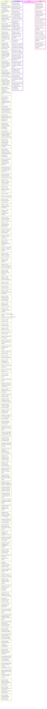

# KF Team — Unified Kanban

> Auto-generated from all project kanbans

Todo
In Progress
Review
Done

```mermaid
kanban
  Todo
    task6["AIRise-ai-fabric-inspection: ⚠️ [BLOCKER] Strategie generare date sintetice — prioritizare GAN/augmentare pentru suplimentare dataset"]
    task7["AIRise-ai-fabric-inspection: Design data ingestion pipeline: Apache NiFi + MinIO on-premise"]
    task8["AIRise-ai-fabric-inspection: Design data preprocessing pipeline: Apache Spark + augmentation strategy"]
    task9["AIRise-ai-fabric-inspection: Define defect taxonomy and annotation schema (Damage, Hole, Knot, Line, Oil Stain, Stain, Wrinkle)"]
    task10["AIRise-ai-fabric-inspection: Define CNN/YOLO model architecture for fabric defect detection"]
    task11["AIRise-ai-fabric-inspection: Integrate model explainability: Grad-CAM + SHAP pentru vizualizare decizii AI"]
    task12["AIRise-ai-fabric-inspection: Backend: FastAPI playback API (Plan B) — endpoints for defect results + annotations"]
    task13["AIRise-ai-fabric-inspection: Backend: PostgreSQL/Supabase schema for defect events and annotations"]
    task14["AIRise-ai-fabric-inspection: Frontend: PlaybackAnnotator UI — defect review and validation interface"]
    task15["AIRise-ai-fabric-inspection: Frontend: TextileViewer component — live WebRTC defect stream view"]
    task16["AIRise-ai-fabric-inspection: Jetson setup: YOLO multiprocess detector (4x parallel, 100+ FPS target)"]
    task17["AIRise-ai-fabric-inspection: Define S3 storage strategy: MinIO on-premise (active) + Cloudflare R2 (archive)"]
    task18["AIRise-ai-fabric-inspection: Define ELK stack monitoring: model prediction logs + feedback loop"]
    task19["AIRise-ai-fabric-inspection: Create architecture diagrams and technical documentation"]
    task20["AIRise-ai-fabric-inspection: Prepare KPI tracking dashboard (F1 ≥70-80%, inferență ≤1000ms, deșeuri -20%)"]
    task21["AIRise-ai-fabric-inspection: Define model retraining pipeline (target: retraining within 48h of new data)"]
    task22["AIRise-ai-fabric-inspection: Prepare dissemination content: LinkedIn technical deep-dive post (mid-implementation)"]
    task25["Aladin-01: Architecture documentation & DevOps playbook (Kubernetes, CI/CD, OAuth 2.0)"]
    task26["Aladin-01: B2B layer — core database schema & NuoForm instance setup (T2.2)"]
    task27["Aladin-01: B2B layer — Tech Pack & BOM backend services (T2.2)"]
    task28["Aladin-01: B2C frontend — OAuth 2.0 multi-tenant login & registration (T2.3)"]
    task29["Aladin-01: B2C frontend — Client Garment Configurator MVP (T2.3)"]
    task30["Aladin-01: | Todo"]
    task33["Edi-test: Documentation"]
    task38["NuoForm---GTM: Define MVP scope + success metrics"]
    task39["NuoForm---GTM: Market segmentation + ICP definition"]
    task40["NuoForm---GTM: Sustainability + compliance claims validation"]
    task41["NuoForm---GTM: Product requirements baseline (PRD-lite)"]
    task42["NuoForm---GTM: Define optimisation KPIs (efficiency %, waste %, cost)"]
    task43["NuoForm---GTM: Data model for materials, BOM, suppliers"]
    task44["NuoForm---GTM: UX architecture + MVP screen flows"]
    task45["NuoForm---GTM: Define layplan optimisation algorithm approach"]
    task46["NuoForm---GTM: BOM ingestion + validation workflow"]
    task47["NuoForm---GTM: Pattern file ingestion (DXF or equivalent)"]
    task48["NuoForm---GTM: Pattern geometry extraction"]
    task49["NuoForm---GTM: Layplan nesting engine (baseline optimisation)"]
    task50["NuoForm---GTM: Waste calculation engine (area, length, efficiency)"]
    task51["NuoForm---GTM: Waste cost model (direct + indirect costs)"]
    task52["NuoForm---GTM: Waste analytics API"]
    task53["NuoForm---GTM: Waste dashboard UI"]
    task54["NuoForm---GTM: Exportable waste report (PDF/HTML)"]
    task55["NuoForm---GTM: Circular initiatives catalogue (recycle, return, donation)"]
    task56["NuoForm---GTM: Waste reduction simulation scenarios"]
    task57["NuoForm---GTM: Traceability document generator"]
    task58["NuoForm---GTM: Role-based access (designer/factory/customer/admin)"]
    task59["NuoForm---GTM: Activity audit log"]
    task60["NuoForm---GTM: Internal QA testing"]
    task61["NuoForm---GTM: Performance tuning"]
    task62["NuoForm---GTM: Pilot partner shortlist"]
    task63["NuoForm---GTM: Pilot onboarding kit"]
    task64["NuoForm---GTM: Pilot garment baseline waste analysis"]
    task65["NuoForm---GTM: Pilot optimisation run + results"]
    task66["NuoForm---GTM: Case study generation"]
    task67["NuoForm---GTM: Pricing model definition"]
    task68["NuoForm---GTM: Landing page + positioning narrative"]
    task69["NuoForm---GTM: Sales demo script"]
    task70["NuoForm---GTM: CRM pipeline setup"]
    task71["NuoForm---GTM: Launch readiness review"]
    task72["NuoForm---GTM: MVP launch"]
    task77["kf-platform: IDP setup (Keycloak/Auth0/logTo) + SMTP server"]
    task78["kf-platform: RBAC system (scopes, claims, middleware)"]
    task79["kf-platform: Login flow + redirect handling"]
    task80["kf-platform: Tenant management (CRUD, provisioning, S3 prefix)"]
    task81["kf-platform: Admin Console UI (Platform Admin operations)"]
    task82["kf-platform: Overview refactor (dynamic widgets per rol)"]
    task83["kf-platform: Collections fix + refactor (Kanban, season relations)"]
    task84["kf-platform: Models Page refactor (filtere per rol, search)"]
    task85["kf-platform: Tech Pack layout (sidebar, tooltips, guide)"]
    task86["kf-platform: BOM editor + LLM ecodesign hook (PDF export fix + stub)"]
    task87["kf-platform: Model Sheet fixes (imagini, reconciliere BOM)"]
    task88["kf-platform: Sizing Table & QA Flow customizabil per tenant"]
    task89["kf-platform: 3D Model performance optimization (multi-mesh, asset pipeline)"]
    task90["kf-platform: Cost Breakdown & OCS clarification (Buyer approval workflow)"]
    task91["kf-platform: Tech Process refactor (aliniere BE update)"]
    task92["kf-platform: Inventory & Reception refactor (types, qty packaging, UOM)"]
    task93["kf-platform: Orders refactor (Order Name, pricing, Buyer tracking portal)"]
    task94["kf-platform: Planner (Calendar/Gantt/Kanban switch) — backend nou"]
    task95["kf-platform: Batches & Assignment (Operator assignment integrat)"]
    task96["kf-platform: Operator View tablet (Timer, QR scan, defect flag, 3D viewer)"]
    task97["kf-platform: QC Module (Inspection flow, defect logger)"]
    task98["kf-platform: Reports & Cutting (camera integration, COCO export)"]
    task99["kf-platform: DPP Module (data model, dashboard, validation) — T2.4 ALADIN"]
    task100["kf-platform: Public DPP / GS1 Digital Link / QR (no-auth endpoint)"]
    task101["kf-platform: EPCIS Export (JSON, PDF, GS1 standard, possibly signed)"]
    task102["kf-platform: LLM Ecodesign full integration — WP4 T4.1"]
    task103["kf-platform: IoT Adapter & Event Log (MQTT) — T2.5 ALADIN"]
    task104["kf-platform: Garment Configurator B2C (embeddable) — T2.3 ALADIN"]
    task105["kf-platform: Auditor View (cross-tenant, elevated scope)"]
    task106["kf-platform: i18n / l10n (EN + RO + customizable, RTL ready)"]
    task107["kf-platform: Notifications multi-channel (email, SMS, webhook, in-app)"]
    task108["kf-platform: Made2Flow dynamic JSONB schema"]
    task109["kf-platform: Migration testing (data + flow E2E)"]
    task110["kf-platform: Data migration scripts KF → ALADIN (one-shot + rollback)"]
    task111["kf-platform: Final QA & production cutover (smoke tests, monitoring)"]
    task113["order-service: AAS integration with new Tech Process Structure"]
    task114["order-service: Implement telemetry and observability"]
    task115["order-service: Write documentation for backend API"]
    task116["order-service: Generate more photos for AiRise dataset"]
    task119["project-template: Define integration between ALADIN and NuoForm platform"]
    task120["project-template: Define Digital Product Passport (DPP) data model for garments"]
    task121["project-template: Design micro-factory orchestration workflow"]
    task122["project-template: Define circular production lifecycle (R-strategies: reuse, repair, recycle)"]
    task123["project-template: Frontend architecture for product configuration and customization UI"]
    task124["project-template: Backend services for product lifecycle and traceability"]
    task125["project-template: Define demonstrator products (T-shirt, Kidswear Parka, Blazer Dress)"]
    task126["project-template: Define API layer for design, production orchestration and DPP"]
    task127["project-template: Define integration with external services (manufacturing, supply chain, sustainability metrics)"]
    task128["project-template: Create architecture diagrams and technical documentation"]
    task129["project-template: Prepare roadmap and Level-of-Effort estimation for ALADIN implementation"]
    task130["project-template: Prepare dashboard integration for KF-CPTO monitoring"]
  In-Progress
    task3["AIRise-ai-fabric-inspection: Define system architecture: edge (Jetson) + cloud (MinIO/NiFi/Spark)"]
    task4["AIRise-ai-fabric-inspection: Define streaming architecture — Plan B (Async Playback) selectat ca variantă recomandată"]
    task5["AIRise-ai-fabric-inspection: ⚠️ [BLOCKER] Audit dataset existent — evaluare volum și calitate imagini defecte reale disponibile"]
    task24["Aladin-01: Initial platform architecture (WP2 / T2.1) — user personas & journey mapping"]
    task32["Edi-test: Initial architecture"]
    task36["NuoForm---GTM: Initial architecture (services, storage, auth, telemetry)"]
    task73["kf-platform: Project setup (repo, monorepo structure, conventions)"]
    task74["kf-platform: Design system & design tokens (Tailwind, primitives, Storybook)"]
    task75["kf-platform: Database schema v2 design + migrations (multi-tenant RLS)"]
    task76["kf-platform: CI/CD pipeline (GitHub Actions / GitLab CI)"]
    task112["order-service: Tech Process Blocker - Template for Techpack, Copy Version for Order Entry"]
    task118["project-template: Define ALADIN system architecture (platform + microfactory orchestration)"]
  Review
  Done
    task1["AIRise-ai-fabric-inspection: Project scope definition & AIRISE initialisation report review"]
    task2["AIRise-ai-fabric-inspection: Setup repository structure and KF-CPTO kanban integration"]
    task23["Aladin-01: Project setup & repo bootstrap"]
    task31["Edi-test: Project setup"]
    task34["NuoForm---GTM: Project kickoff + team alignment"]
    task35["NuoForm---GTM: Project setup (repo, CI/CD, environments)"]
    task37["NuoForm---GTM: Vision statement + problem definition"]
    task117["project-template: Project scope definition and requirements analysis"]
```

## Summary by Project

| Project | Todo | In Progress | Review | Done | Total |
| :--- | :---: | :---: | :---: | :---: | :---: |
| AIRise-ai-fabric-inspection | 17 | 3 | 0 | 2 | 22 |
| Aladin-01 | 6 | 1 | 0 | 1 | 8 |
| Edi-test | 1 | 1 | 0 | 1 | 3 |
| NuoForm---GTM | 35 | 1 | 0 | 3 | 39 |
| R3-AAS | 0 | 0 | 0 | 0 | 0 |
| kf-be-platform | 0 | 0 | 0 | 0 | 0 |
| kf-fe-platform | 0 | 0 | 0 | 0 | 0 |
| kf-platform | 35 | 4 | 0 | 0 | 39 |
| order-service | 4 | 1 | 0 | 0 | 5 |
| project-template | 12 | 1 | 0 | 1 | 14 |